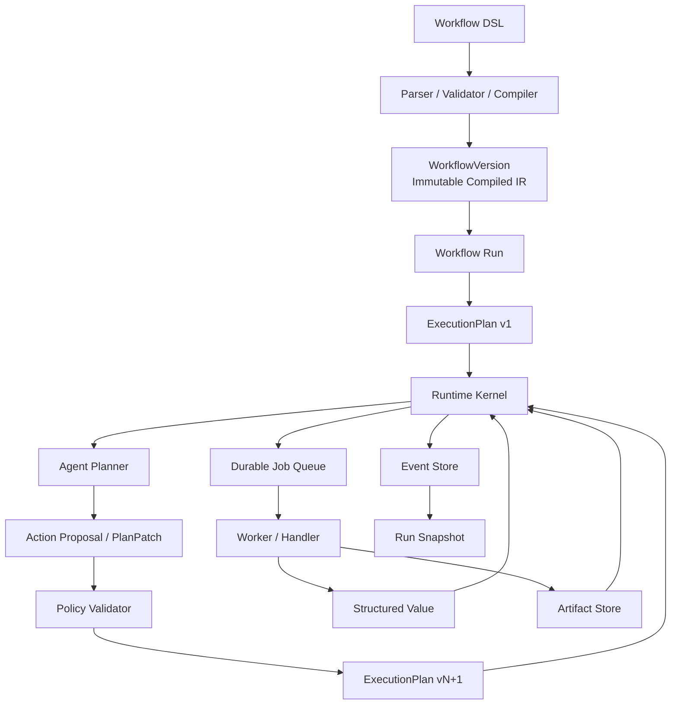

# Agentic Workflow 实现规划

| 文档属性 | 值 |
| --- | --- |
| 文档版本 | 1.0 |
| 状态 | Baseline / Frozen |
| 生效日期 | 2026-07-17 |
| 适用分支 | Build-vs-Buy ADR 选择自研本地单机 Durable Kernel |

版本 1.0 是实现规划的正式基线。后续任何改变阶段边界、Frozen/Stable 契约、状态机、持久化语义或验收标准的修改，都必须提升文档版本并记录变更原因；不得静默覆盖 1.0 的语义。

## 1. 文档目标

本文给出 `Workflow DSL + Workflow IR + Agent Planner + ExecutionPlan + Artifact Model + Runtime Kernel` 的全新实现规划。

本规划不考虑历史 Workflow 配置、数据库结构、API 或 UI 的兼容性，也不设计迁移层。实现目标是建立一个边界清晰、可持久化恢复、允许 Agent 动态规划，同时由确定性 Runtime Kernel 控制执行的通用工作流系统。

完整实现拆分为 **12 个步骤**：

| 步骤 | 名称 | 核心结果 |
| --- | --- | --- |
| 1 | 确定核心契约与模型脊柱 | 冻结确定性内核契约，Planner 扩展契约保持 Draft |
| 2 | DSL、IR 与 Compiler | Workflow 可以解析、校验、编译和发布 |
| 3 | 持久化与 Event Store | Definition、Run、Event 等核心数据可事务化保存 |
| 4 | Runtime Kernel | 确定性状态机可以驱动最小线性 Workflow |
| 5 | Durable Job、Timer 与 Worker | 节点和定时事件可以租约式调度、执行和恢复 |
| 6 | Handler SDK | Agent、Tool、Transform 等执行器接入统一协议 |
| 7 | Port、Mapping 与 Artifact | 节点间结构化数据和大型产物可以安全传递 |
| 8 | 静态 Graph 控制流 | 条件、并行、Join、Retry 和 Rework 可执行 |
| 9 | Agent Planner 协议与 Eval | Planner 输出可记录、评估，且 Replay 不重新调用模型 |
| 10 | Policy、ExecutionPlan 与最小 HumanTask | 动态计划可验证、版本化，并能请求最小人工审批或输入 |
| 11 | 完整 Human、Foreach、Subflow 与动态并行 | 补齐长期等待、集合处理、流程复用和动态 DAG |
| 12 | 恢复、安全、性能、可观测性与产品接口 | 达到可长期运行和产品化接入标准 |

步骤 1 至 7 构成确定性执行内核；步骤 8 构成完整静态 Workflow；步骤 9 至 10 构成串行 Agentic Workflow MVP；步骤 11 补齐动态并行和通用控制结构；步骤 12 完成产品化。

### 1.1 分步任务文档索引

| 步骤 | 任务文档 | 当前状态 |
| --- | --- | --- |
| 1 | `agentic-workflow-step-1-tasks.md` | Completed |
| 2 | `agentic-workflow-step-2-tasks.md` | Completed |
| 3 | `agentic-workflow-step-3-tasks.md` | Completed |
| 4 | `agentic-workflow-step-4-tasks.md` | Completed |
| 5 | `agentic-workflow-step-5-tasks.md` | Completed |
| 6 | `agentic-workflow-step-6-tasks.md` | Completed |
| 7 | `agentic-workflow-step-7-tasks.md` | Completed |
| 8 | `agentic-workflow-step-8-tasks.md` | Completed |
| 9 | `agentic-workflow-step-9-tasks.md` | Completed |
| 10 | `agentic-workflow-step-10-tasks.md` | In progress |
| 11 | `agentic-workflow-step-11-tasks.md` | In progress |
| 12 | `agentic-workflow-step-12-tasks.md` | In progress |

Step 9–12 的 1.0 任务文档固定了各自 Gate、任务编号、Migration 边界、执行批次、验收、完成定义、风险和下一阶段移交；实施时以对应分步文档为工作清单，以本文为跨阶段语义基线。

## 2. 开工前决策：Build vs Buy

在进入步骤 1 前，必须完成一份正式 ADR，决定 Durable Execution Kernel 是自研，还是建立在 Temporal、Restate、DBOS 等现成执行引擎之上。该决策不计入 12 个实现步骤，但属于开工门槛。

ADR 至少比较：

- 是否必须支持本地单机、离线和零额外服务部署。
- 动态 ExecutionPlan 和运行中受限改图能力。
- 长时间 Human Wait 和 Durable Timer。
- Job Lease、幂等、重试和崩溃恢复能力。
- Event、Snapshot 和状态查询的控制程度。
- Worker 语言、部署和升级方式。
- 故障注入、调试和运维成本。
- License、分发和资源占用。
- Artifact、Planner、Policy 与现成引擎的集成复杂度。

如果目标是本地单机、单项目和低部署成本，可以选择基于 SQLite 的自研 Kernel，但必须明确不实现跨区域一致性、高吞吐分布式队列等能力。如果目标是多节点生产服务，应优先验证现成 Durable Execution 引擎能否承载动态 Plan，再决定是否自研。

ADR 必须输出：选择结果、决策原因、放弃方案、风险、验证原型和重新评估条件。**ADR 是步骤 1 的前置门槛，未通过前不开始任何实现步骤。**

本文后续代码结构、步骤 3 至 5 以及第 9.1 节估算描述的是“自研本地单机 Durable Kernel”分支。若 ADR 选择现成执行引擎，必须先产出一份替代实现规划，重新划分以下内容后才能进入步骤 1：

- 哪些状态机、Event 和幂等语义由外部引擎提供。
- 哪些 Workflow、ExecutionPlan、Planner 和 Artifact 语义仍由本系统维护。
- 如何映射外部引擎的 Workflow、Activity、Timer、Signal 和 Recovery 概念。
- 自定义数据库、Worker、运维、测试和估算中哪些内容被删除或替换。

## 3. 目标架构



### 3.1 模型脊柱

```text
Workflow DSL
  -> Canonical Workflow IR
  -> immutable WorkflowVersion
  -> WorkflowRun
  -> ExecutionPlan v1
  -> accepted PlanPatch
  -> ExecutionPlan v2 ... vN
  -> NodeRun / Attempt
```

- `WorkflowIR` 是 Compiler 的规范化输出。
- `WorkflowVersion` 持久化不可变 IR，定义静态图、能力、Schema、Policy 和 Agentic Region 边界。
- `WorkflowRun` 永久绑定一个 WorkflowVersion。
- Run 启动时从 WorkflowVersion 实例化 `ExecutionPlan v1`。
- `ExecutionPlan` 是 Kernel 唯一执行的计划；不再使用未定义的 `RuntimePlan` 概念。
- Planner 只能为 Agentic Region 中尚未进入执行状态的部分提交 PlanPatch。
- 接受 PlanPatch 会生成新的 ExecutionPlanVersion；历史版本不可修改。
- 已经创建的 NodeRun 固定记录来源 PlanVersion，不随新 Plan 改变。
- WorkflowVersion 决定本次运行允许做什么，ExecutionPlan 决定本次运行具体做什么。

### 3.2 核心边界

- DSL 面向用户和编辑器，不由 Runtime 直接解释。
- IR 被持久化为不可变 WorkflowVersion。
- ExecutionPlan 是某次 Run 的动态执行计划，可以版本化演进。
- Planner 只提交 Proposal，不能修改数据库或直接创建 Job。
- Policy Validator 决定 Proposal 是否可接受。
- Runtime Kernel 是唯一允许推进状态机和创建下游工作的组件。
- Handler 只执行 NodeRun，并返回结构化结果。
- Event Store 保存事实，Snapshot 保存可重建的派生状态。
- Artifact 内容不可原地修改，更新产生新 Artifact。

## 4. 建议的代码结构

以下目录结构只适用于 ADR 选择自研 Durable Kernel 的分支；选择现成引擎时，应以替代规划中的 Adapter、Workflow Definition 和 Worker 组织方式为准。

```text
src/orbit/workflow/
├── domain/
│   ├── definitions.py
│   ├── runs.py
│   ├── events.py
│   ├── plans.py
│   ├── artifacts.py
│   ├── policies.py
│   └── errors.py
├── dsl/
│   ├── parser.py
│   ├── schema.py
│   ├── validator.py
│   └── compiler.py
├── runtime/
│   ├── kernel.py
│   ├── reducer.py
│   ├── scheduler.py
│   ├── timers.py
│   ├── routing.py
│   ├── recovery.py
│   └── completion.py
├── planner/
│   ├── context.py
│   ├── protocol.py
│   ├── validator.py
│   ├── service.py
│   └── evals.py
├── handlers/
│   ├── base.py
│   ├── registry.py
│   ├── agent.py
│   ├── tool.py
│   ├── transform.py
│   ├── human.py
│   ├── foreach.py
│   └── subflow.py
├── data/
│   ├── ports.py
│   ├── mapping.py
│   ├── schemas.py
│   ├── artifacts.py
│   └── lineage.py
├── persistence/
│   ├── database.py
│   ├── repositories.py
│   ├── event_store.py
│   ├── upcasters.py
│   ├── jobs.py
│   ├── timers.py
│   └── migrations.py
└── api/
    ├── workflows.py
    ├── runs.py
    ├── human_tasks.py
    └── artifacts.py
```

Domain 层不得依赖 HTTP、UI、具体 Agent CLI 或数据库驱动。Runtime 依赖抽象 Repository、JobQueue、ArtifactStore 和 HandlerRegistry，具体实现通过组合注入。

## 5. 分步实现计划

## 步骤 1：确定核心契约与模型脊柱

### 目标

在编码前冻结确定性 Kernel 依赖的基础语义，同时明确 WorkflowVersion、ExecutionPlan 和 NodeRun 的关系。尚未经过真实 Agent 场景验证的 Planner 扩展契约保持 Draft，不在此阶段过早冻结。

### 工作内容

1. 建立统一术语表和模型脊柱：
   - WorkflowDefinition
   - WorkflowVersion
   - WorkflowIR
   - WorkflowRun
   - ExecutionPlan
   - PlanPatch
   - NodeRun
   - Attempt
   - BranchToken
   - Value
   - Artifact
   - RunEvent
   - UsageSnapshot
   - BudgetAccount
   - BudgetReservation
2. 明确 Run 从 WorkflowVersion 实例化 ExecutionPlan v1，Kernel 永远执行已提交 ExecutionPlanVersion。
3. 定义 ID 格式和作用域。
4. 定义时间、版本号和 Definition Hash 规则。
5. 定义 WorkflowRun、NodeRun、Attempt、Job、Timer 和 HumanTask 的核心状态机；WorkflowRun 预留 `budget_exhausted` / `waiting_for_budget` 路径。HumanTask 只冻结 waiting/completed/cancelled 等核心生命周期，Assignee、Form、Escalation 等扩展保持 Draft。
6. 定义统一错误分类：
   - validation_error
   - policy_rejected
   - transient_error
   - permanent_error
   - timeout
   - cancelled
   - lost
   - unknown_external_result
7. 定义命令与事件命名规则。
8. 定义 Event Envelope、`event_version`、Aggregate Sequence 和全局 Event ID。
9. 定义 JSON 序列化规则和 `schema_version`。
10. 定义契约稳定性等级：
    - `Frozen`：状态机、Event Envelope、错误分类、ID、幂等和事务规则。
    - `Stable`：DSL Core、IR Core、HandlerResult、Port、UsageSnapshot、BudgetAccount 的预留/结算/幂等不变量；PlannerAction/ActionProposal 已在 Step 9 冻结为 Stable；PlanPatch、Agentic Region、PolicyDecision、HumanTask、Budget Ledger/Exhaustion、Foreach Scope、Subflow Link 和 Dynamic DAG Limits 已依据 ADR-002 完成受控升级。
    - `Draft`：成本估算算法。
11. 定义 Event Replay 纯函数原则：Replay 不调用 Planner、Handler、Tool、HTTP 或任何外部系统。
12. 为 Frozen 和 Stable 领域对象建立不可变类型和 Schema；Draft 对象必须显式携带 Draft Version。

### 交付物

- Architecture Decision Records。
- 领域模型类型。
- 状态机定义。
- Error Code 清单。
- JSON Schema 命名和版本规范。
- 契约稳定性矩阵。
- WorkflowVersion、ExecutionPlan 和 NodeRun 关系图。
- Event Replay 纯函数约束。

### 验收标准

- 每一种状态都有明确的允许进入和离开路径。
- Retry、Rework、Iteration 和 Foreach 的定义没有重叠。
- 所有跨模块对象都能稳定序列化和反序列化。
- 非法状态转换能够在领域层被拒绝。
- Kernel 的唯一执行输入明确为已提交的 ExecutionPlanVersion。
- Planner 扩展契约标记为 Draft，可以在步骤 9 前进行一次受控修订。
- Event Replay 的测试替身能够证明不会产生任何外部调用。

### 依赖

Build-vs-Buy ADR 已完成，并选择本文描述的自研 Durable Kernel 分支。

## 步骤 2：实现 Workflow DSL、IR 与 Compiler

### 目标

让 YAML、JSON 或 UI 产生的 DSL 可以被解析成唯一 Canonical IR，并发布为不可变 WorkflowVersion。

### 工作内容

1. 定义 DSL JSON Schema：
   - Workflow Metadata
   - Inputs / Outputs
   - Nodes
   - Ports
   - Edges
   - Policies
   - 版本化 Extension Point
2. 实现 YAML 和 JSON Parser。
3. 实现结构校验和错误定位。
4. 实现语义校验：
   - ID 唯一性
   - 节点和端口引用
   - Schema 兼容性
   - Entry 和 Terminal
   - 不可达节点
   - 无结束路径
   - 非法循环
   - Handler 是否存在
5. 实现 Compiler：
   - 展开默认值
   - 固定 Handler Version
   - 编译条件表达式
   - 规范化 Mapping
   - 生成 Runtime 索引
   - 生成 Definition Hash
6. 保存不可变 WorkflowVersion。
7. 提供 `validate` 和 `compile` 命令/API。
8. Agentic Region 在本阶段只保留带 Draft Version 的扩展边界，不冻结 PlannerAction 或 PlanPatch 语义。
9. 通过本阶段 Migration 创建 `workflow_definitions` 和 `workflow_versions`，不提前创建运行期或 Planner 相关表。

### 交付物

- DSL Schema。
- Parser、Validator 和 Compiler。
- Canonical WorkflowIR 类型。
- WorkflowVersion Store。
- 编译诊断格式。

### 验收标准

- 同一语义的 YAML 和 JSON 生成完全一致的 IR 和 Hash。
- IR 中没有依赖 Runtime 再解释的隐式默认值。
- 所有引用和 Handler Version 在编译期解析完成。
- 错误包含字段路径、错误码和可读说明。
- 发布后的 WorkflowVersion 不允许修改。
- DSL Core 可以独立运行，不依赖尚未定型的 Planner 协议。

### 依赖

步骤 1。

## 步骤 3：实现持久化模型与 Event Store

### 目标

建立 Runtime 的持久化事实来源和事务边界。

### 工作内容

1. 只建立确定性运行内核当前需要的数据表：
   - workflow_runs
   - execution_plans
   - node_runs
   - node_attempts
   - run_events
   - run_snapshots
   - branch_tokens
   - command_receipts
2. Planner、Human、Foreach、Job、Timer 和 Artifact 等模型由各自实现步骤通过增量 Migration 创建，不在本阶段冻结 Draft Schema。
3. 实现 Repository 接口。
4. 实现只追加的 RunEvent Store。
5. 为 Event 类型实现独立 `event_version` 和纯函数 Upcaster Registry。
6. 为每个 Aggregate 增加 `version` 乐观锁。
7. 定义事件顺序号和全局唯一 Event ID。
8. 实现事务内：
   - 状态更新
   - Event 追加
   - Token 更新
   - Command Receipt 写入
9. 实现 Snapshot 保存和回放，并记录 `snapshot_schema_version`、`reducer_version`、Run-scoped `last_global_position` 和诊断用 `last_run_event_sequence`；跨 Aggregate Tail Replay 以 Global Position 为准。
10. 定义 Snapshot 策略：每 N 个 Event、进入长期 waiting 状态或 Run 终结时生成。
11. Snapshot 不兼容时允许丢弃并从 Event 重建；Event 默认长期保留。
12. 建立 Golden Event Stream，供新 Reducer 和 Upcaster 在 CI 中回放。
13. 提供数据库一致性检查工具。

`node_attempts` 有意不冗余 `run_id`，其 Run 归属通过不可变外键链 `node_attempts.node_run_id -> node_runs.run_id` 获得；Run 级查询与删除必须 Join。不得通过修改 Migration v2 追加该列，未来若容量测量证明需要冗余，只能用新的受评审 Migration 和一致性约束实现。

数据库 Schema 按领域契约所属步骤增量演进：

| 步骤 | 创建或扩展的主要表 |
| --- | --- |
| 2 | workflow_definitions、workflow_versions |
| 3 | workflow_runs、execution_plans、node_runs、node_attempts、run_events、run_snapshots、branch_tokens、command_receipts |
| 5 | jobs、job_leases、durable_timers |
| 7 | artifacts、artifact_links |
| 9 | planner_attempts、planner_proposals |
| 10 | plan_patches、human_tasks、budget_accounts、budget_reservations |
| 11 | foreach_groups、foreach_items、Subflow 关联字段，并扩展 human_tasks |

任何 Draft 契约都不能通过提前建表变相冻结；其 Migration 只能在所属步骤完成契约评审后加入。

### 交付物

- 数据库 Schema 和 Migration。
- Repository 实现。
- Event Store。
- Command Receipt Store。
- Snapshot Store。
- Event Upcaster Registry。
- Golden Replay Test Corpus。
- Unit of Work / Transaction 接口。

### 验收标准

- Event 不可覆盖或删除。
- 相同 Expected Version 的并发更新只有一个可以成功。
- 从 Event 可以重建与 Snapshot 一致的 Run 状态。
- 状态更新成功但 Event 或 Token 缺失的中间状态不能被提交。
- Command Receipt 与状态、Event、Token 同事务；重复 Command 跨重启仍返回原 Event IDs。
- 数据库进程重启后所有记录保持一致。
- 新 Reducer 可以消费历史 Event Version，或明确拒绝不支持的版本。
- 删除所有 Snapshot 后仍可只依赖 Event 重建 Run。

### 依赖

步骤 1；可以与步骤 2 的后半段并行开发。

## 步骤 4：实现确定性 Runtime Kernel

详细任务、事务语义和完成定义见 `agentic-workflow-step-4-tasks.md` 1.0。

### 目标

实现唯一有权推进 Workflow 状态的核心组件，并跑通最小线性 Workflow。

### 输入约束

`SnapshotPolicy.should_snapshot` 是 level-triggered 建议：当 Run 保持 waiting 或终态时会持续返回 `True`。Kernel 必须依据最新 Snapshot Cursor 和状态转换自行去重；同一未变化状态的重复调度、重放或恢复扫描不得重复生成 Snapshot。

### 工作内容

1. 实现 Command 模型：
   - StartRun
   - ScheduleNode
   - StartAttempt
   - CompleteAttempt
   - FailAttempt
   - CancelRun
2. 实现 Event Reducer。
3. 实现 WorkflowRun、NodeRun 和 Attempt 状态转换。
4. 从 WorkflowVersion 实例化不可变 `ExecutionPlan v1`，并永久记录 Run 与 WorkflowVersion 的绑定。
5. Kernel 只加载并执行已提交的 ExecutionPlanVersion。
6. 实现线性路由。
7. 实现输入准备和输出提交的最小流程。
8. 实现 Run Completion 判断。
9. 实现 Expected Version 与 Command Idempotency Key。
10. 确保 Handler、Worker 和 API 都只能向 Kernel 提交 Command。

### 交付物

- Runtime Kernel。
- Run State Reducer。
- 线性 Scheduler。
- Completion Evaluator。
- 内存 Handler 测试实现。

### 验收标准

- 三节点线性 Workflow 可以从 created 运行至 succeeded。
- 同一个 CompleteAttempt Command 重复提交不会生成重复下游节点。
- 非法状态转换被拒绝并留下诊断记录。
- Runtime 状态可以完全通过 Event Replay 重建。
- Run 永远绑定启动时的 WorkflowVersion，Kernel 只执行由它实例化并已提交的 ExecutionPlanVersion。

### 依赖

步骤 2、3。

## 步骤 5：实现 Durable Job、Timer、Lease 与 Worker

详细任务、Lease/Fencing、Timer、恢复和完成定义见 `agentic-workflow-step-5-tasks.md` 1.0。

### 目标

把节点执行和时间触发从 Kernel 事务中分离，使长时间任务、Backoff、Deadline 和 Reminder 可以安全调度、重试、取消和恢复。

### 工作内容

1. 实现 Durable Job Queue。
2. 实现 Job Claim 和 Lease Token。
3. 实现 Lease 续租和过期回收。
4. 实现 Worker 主循环。
5. 实现 Attempt 与 Job 的关联。
6. 实现取消请求传播。
7. 实现 Retry Wait 和 Backoff 调度。
8. 实现 Worker 崩溃检测和 `lost` 状态。
9. 为外部调用生成 Idempotency Key：

   ```text
   workflow_run_id + node_run_id + attempt_number
   ```

10. 实现 Queue Depth、Lease Age 和 Worker Heartbeat 指标。
11. 实现统一 DurableTimer：
    - schedule
    - cancel
    - claim / lease
    - fire
    - deduplicate
    - recover
12. Timer 至少支持 Retry Backoff、Node Timeout、Join Deadline、Planner Timeout、Human Reminder、Human Escalation 和 Run Deadline。
13. 定义迟到 Timer、重复触发和 Clock Skew 的处理规则。
14. 通过本阶段 Migration 创建 `jobs`、`job_leases` 和 `durable_timers`。
15. 扩展 Unit of Work，使状态、Event、Job 和 Timer 可以在需要时原子提交。

### 交付物

- DurableJobQueue。
- Worker Runtime。
- Lease Manager。
- Retry Scheduler。
- DurableTimer Store 和 Timer Dispatcher。
- Cancel Protocol。

### 验收标准

- 多个 Worker 不会同时执行同一个有效 Lease。
- Worker 在执行中崩溃后 Job 可以被其他 Worker 回收。
- 过期 Worker 的迟到结果不能覆盖新 Attempt 的结果。
- Retry 遵守最大次数和 Backoff。
- Cancelled Run 不再创建新的普通 Job。
- 服务重启后 Timer 不丢失，重复 Fire 不会重复推进 Run。

### 依赖

步骤 3、4。

## 步骤 6：实现 Handler SDK 与基础 Handler

详细任务、Manifest/Registry、Usage、Lease Supervisor、Unknown 和基础 Handler 完成定义见 `agentic-workflow-step-6-tasks.md` 1.0。

**状态**：Completed / Stable 1.0（Durable Command/Event 兼容增量 1.1，Snapshot/Reducer 3.0）。

### 目标

建立统一 Executor 接入协议，先支持足以验证系统的确定性和 Agent 执行能力。

### 工作内容

1. 定义 NodeHandler 接口：
   - validate
   - prepare
   - execute
   - cancel
   - recover
   - normalize_result
2. 实现 Handler Registry 和版本解析。
3. 实现 Handler Context：
   - Run、NodeRun 和 Attempt 标识
   - 输入 Manifest
   - Secret Resolver
   - Artifact Writer
   - Cancellation Token
   - Runtime 提供的 UsageReporter
   - Logger / Tracer
4. 实现基础 Handler：
   - TransformHandler
   - ToolHandler
   - AgentHandler
   - Test/FakeHandler
5. 实现标准 HandlerResult。
6. 区分 transient、permanent 和 policy failure。
7. 禁止 Handler 直接访问 Runtime Repository。
8. 定义 Stable 的 `UsageSnapshot`，至少包含 Attempt ID、单调递增 Sequence、累计 Input/Output Token、Tool Call、Provider Request ID 和观测时间。
9. UsageReporter 使用带 Sequence 的累计快照而不是不可去重的裸 Delta；步骤 6 提供 No-op 和 In-memory 实现，步骤 10 再接入持久化 Budget Ledger。
10. Handler Registry 要求计费 Handler 声明静态 Resource Profile，包括最大输入/输出 Token、Tool Call、Duration 和 Cost Class。
11. HandlerResult 必须携带最终 UsageSnapshot；流式 UsageReporter 不可用或存在缺口时，Runtime 使用最终快照或已预留上限进行保守结算，不能让上报失败绕过预算。
12. Complete、Fail 和主动 Unknown 在结果事务内记录 Final Usage/Provider Request ID Event；不在步骤 6 提前创建 Budget Ledger。
13. Handler 在 Lease 有效时发现外部结果未知，必须通过结构化 `ReportUnknownJobResult` 立即进入 Unknown，不能伪装为 Fail 或等待 Lease 过期。

### 交付物

- Handler SDK。
- Handler Registry。
- Transform、Tool、Agent Handler。
- Fake Handler 测试工具。
- UsageReporter、UsageSnapshot 和 Resource Profile Contract。

### 验收标准

- Handler 可以独立进行契约测试。
- 相同 Handler Version 的输入输出行为可重复验证。
- Handler 无法直接推进 Run 状态。
- Handler 超时和取消可以转化为标准 Attempt 结果。
- Agent 非结构化输出无法绕过 Result Schema。
- Handler 可以流式上报累计 Usage，但无法直接修改 Budget 或 Runtime Repository；重复或乱序 Snapshot 可以按 Attempt ID 和 Sequence 去重。

### 依赖

步骤 1、4、5。

## 步骤 7：实现 Port、Mapping、Value 与 Artifact Model

详细任务、Data Contract 1.1、Migration v4、CAS Blob、原子 Data Commit、Visibility、Lineage 与 GC 完成定义见 `agentic-workflow-step-7-tasks.md` 1.0。

**状态**：Completed（详细完成记录与移交约束见步骤 7 任务文档）。

### 目标

建立节点之间可验证、可追踪的数据传递模型。

### 工作内容

1. 实现 InputPort 和 OutputPort。
2. 接入 JSON Schema Registry。
3. 实现 Mapping 表达式和受限字段选择器。
4. 实现小型结构化 Value Store。
5. 实现 Artifact Metadata Store。
6. 实现本地 Blob/File Artifact Backend。
7. 实现临时写入加原子 Commit。
8. 实现 Artifact Checksum、Content Type 和大小限制。
9. 实现 Artifact Link：
   - producer
   - consumer
   - derived_from
10. 实现 Artifact Visibility：
    - node
    - run
    - subflow
    - workflow
11. 实现输入 Manifest，默认只向 Planner 和 Handler暴露摘要与引用。
12. 实现 Secret Reference，确保 Secret 不进入普通 Value、Event 或日志。
13. 通过本阶段 Migration version 4 创建 `values`、`value_links`、`artifacts` 和 `artifact_links`；Data/Artifact Schema 不在步骤 3 提前冻结。
14. 文件系统与 SQLite 采用 CAS Blob 先发布、staged metadata、StartRun/CompleteJob 数据库事务提交和 orphan GC 协议，不声称跨资源 ACID。
15. 将 Step 4 的内联 Mapping 实现替换为不访问 UoW 的纯 Mapping Evaluator；Step 8 再抽取 Scheduler/Completion。

### 交付物

- Port 和 Schema Registry。
- Mapping Engine。
- Value Store。
- Artifact Store 和本地 Backend。
- Lineage Index。
- Input Manifest Builder。

### 验收标准

- 不兼容的 Port Mapping 在编译期或执行前失败。
- Artifact 写入失败不会产生成功的 NodeRun 输出。
- Artifact 内容提交后不可原地修改。
- 任意 Artifact 可以追溯 Producer 和 Consumer。
- 未授权 NodeRun 无法读取越界 Artifact。
- Secret 不出现在 Event、Snapshot 和普通日志中。

### 依赖

步骤 2、3、4、6。

## 步骤 8：实现静态 Graph 控制流

详细任务、ExecutionPlan 1.2、BranchToken/Join/Retry/Rework 语义、Migration v5 与完成定义见 `agentic-workflow-step-8-tasks.md` 1.0。

**状态**：Completed（S8-G0、S8-T01–T15 已完成，2026-07-17）。

### 目标

在引入 Agent Planner 前，先让确定性 Runtime 完整支持静态图执行。

### 工作内容

1. 先将 Step 4 内联于 Runtime Kernel 的 Scheduler、Completion 和 Input Mapper 抽成不访问 UoW 的纯 Decision 层，并建立独立属性测试。
2. 实现 Step 2 已编译的版本化 Condition AST Evaluator；人类手写 DSL 可以使用 Python 表达式白名单子集，UI 必须直接生成结构化 AST，不生成或执行 Python 文本。
3. 实现 Decision 节点和 exclusive route；default Edge 是条件均不命中时的 fallback，必须在稳定排序中位于全部条件 Edge 之后，Compiler/Semantic 在发布前拒绝违反该约束的图。
4. 实现多边命中产生并行分支。
5. 实现 BranchToken：
   - active
   - completed
   - failed
   - cancelled
   - not_selected
6. 实现显式 Join：
   - all
   - any
   - n_of_m
   - all_successful
   - deadline
7. 实现 Retry：同一 NodeRun 的多个 Attempt。
8. 实现 Rework：新建目标 NodeRun 并记录轮次。
9. 实现 Error、Timeout 和 Cancel Edge。
10. 实现未选中分支的 Token 终结。
11. 实现 Loop 和 Rework 上限。
12. 实现静态 Completion Policy。

### 交付物

- Condition Evaluator。
- Branch Token Runtime。
- Decision 和 Join Handler/Controller。
- Retry、Rework 和异常路由。
- Graph Completion Evaluator。

### 验收标准

- 并行完成顺序不改变最终结果。
- 未选中条件分支不会导致 Join 永久等待。
- Retry 不生成新的业务 NodeRun。
- Rework 会生成新的 NodeRun，并保留上一轮输出。
- 超过循环或 Rework 上限时按 Policy 失败或走显式静态 error route；转人工由步骤 10 的 HumanTask 实现。
- Run 没有活动 Token、Job、Timer 或明确等待原因时不会无原因停留在 running。

### 依赖

步骤 4、5、7。

## 步骤 9：实现 Agent Planner 协议、Replay 语义与 Eval

详细任务、Planner Protocol、Migration v6、Eval Gate 和完成定义见 `agentic-workflow-step-9-tasks.md` 1.0。

**状态**：Completed（S9-G0、S9-T01–T13 已完成，2026-07-17）。

### 目标

允许 Agent 基于当前运行事实提出下一步，但尚不允许任意修改完整图；同时把非确定性 Planner 调用转换为可持久化、可回放但不会重新调用模型的事实。

### 工作内容

1. 实现 PlanningContext Builder，仅暴露：
   - Goal
   - 当前 Plan Version
   - 已完成、活动和失败节点摘要
   - Available Data Manifest
   - Available Capabilities
   - Remaining Limits
   - 最近相关 Event
2. 定义 PlannerAction 联合类型：
   - dispatch
   - rework
   - request_input
   - request_approval
   - cancel_branch
   - finish
   - fail
3. 定义 ActionProposal Schema。
4. 实现 Planner Service 和模型适配器。
5. 实现 Planner Structured Output 校验。
6. 实现 Proposal ID 和去重。
7. 实现 Planner 决策次数、Token、费用和超时统计。
8. 实现 Planner 失败后的 Retry；重试耗尽时记录 `PlannerEscalationRequested`，由步骤 10 的 HumanTask 闭环处理。
9. 保存原始 Planner 响应、标准 Proposal 和验证结果。
10. 定义 Planner 事件序列：
    - PlannerDecisionRequested
    - PlannerAttemptStarted
    - PlannerResponseReceived
    - PlannerProposalParsed
    - PlannerProposalAccepted / Rejected
11. Planner 原始响应必须先持久化，再解析 Proposal；保存 Model、Planner Handler、Prompt Template、Planning Context 和 Capability Manifest 的版本或 Hash。
12. Replay 只消费已记录的 Planner Event，绝不重新调用模型；只有未完成的 Planner Durable Job 可以由调度器恢复。
13. 对结果未知的 Planner Attempt 使用以下明确语义：
    - 原 Attempt 标记为 `unknown`，其任何迟到响应只能进入审计记录，不能提交 Proposal。
    - 记录已经确定的 Token/费用；无法确定时按预留值或保守上限计入预算。
    - 根据 Retry Policy 创建带新 Attempt ID 的调用，并接受可能发生的重复计费。
    - Idempotency Key 只用于本地去重；除非 Provider 明确支持结果反查，否则不得假设可以按客户端幂等键取回模型响应。
    - Reducer 和 Event Replay 绝不重新调用模型。
14. 建立 Planner Eval Harness 和固定开放式任务集，统计：
    - 任务成功率
    - 无效 Proposal 比例
    - Policy Rejection 比例
    - 重复或无效节点比例
    - 决策次数
    - Token、费用和耗时
    - 人工介入率
    - 提前结束和无限规划比例
15. 通过本阶段 Migration 创建 `planner_attempts` 和 `planner_proposals`，Schema 以本阶段通过 Eval 修订后的 Stable 契约为准。

### 交付物

- PlanningContext。
- ActionProposal Schema。
- Planner Service。
- Planner Adapter。
- Proposal Repository。
- Planner Event Protocol。
- Planner Eval Harness 和基线数据集。

### 验收标准

- Planner 不能直接修改 Run、Plan、Job 或 Artifact。
- 自由文本响应不能被当作合法动作执行。
- 相同 Proposal 重复提交只执行一次。
- Context 不包含未授权 Artifact 内容或 Secret。
- Planner 可以在允许的固定能力中选择下一步并完成一个开放式任务。
- 任意次数 Event Replay 都不会增加 Planner 调用次数或产生新 Proposal。
- Planner 模型、Prompt、Context Builder 或 Policy 变化可以通过固定 Eval 集进行回归比较。
- Unknown Planner Attempt 可以通过新 Attempt 恢复，迟到响应不会覆盖新结果，且可能发生的重复计费被计入预算和指标。

### 依赖

步骤 6、7、8。

## 步骤 10：实现 Policy Validator、动态 ExecutionPlan 与最小 HumanTask

**状态**：In progress（2026-07-18）。已交付映射和未完成项见步骤 10 任务文档第 12 节；不得以 Migration 或骨架存在替代 T01–T15 验收。

详细任务、S10-G0 Kernel 拆分、Migration v7、Human/Budget 契约和完成定义见 `agentic-workflow-step-10-tasks.md` 1.0。

### 目标

让 Planner 可以在受约束区域动态增加或调整未执行计划，同时保持版本化、可恢复和可审计；使用 HumanTask 模型的最小子集为 `request_input`、`request_approval`、预算补充和外部副作用提供闭环。

### 开工门槛（S10-G0）：拆分 Runtime Kernel 事务编排

Step 8 完成后 `runtime/kernel.py` 已约 1286 行。虽然 Condition、Routing、Join、Input Assembly、Scheduler 和 Completion 算法已是独立纯模块，但事实装载、Event 生成和 projection 写入仍集中在单文件。开始实现 PlanPatch、HumanTask 或 Budget Ledger 前必须先完成以下结构调整：

1. 保留 `RuntimeKernel.handle` 为唯一 Command 入口、统一 UoW/Receipt/Expected Version 边界和命令分派器。
2. 按 Command Family 拆分事务编排：Run/Node 生命周期、Graph Route/Join、Durable Job/Timer、PlanPatch、HumanTask、Budget；每个模块只能通过显式 Kernel Context 使用同一个 UoW。
3. Event 构造与 projection 更新按聚合收敛为内部服务，禁止 Command Handler 绕过 Event 直接改 projection；Lease Renewal 等既有明确例外保持显式登记。
4. 拆分前后运行现有 Kernel parity、fault matrix、Replay、双分支完成顺序和 Token 守恒测试，要求 Event ID、Receipt、终态和回滚语义不变。
5. 增加依赖边界测试，禁止拆出的 Command Family 相互循环导入或自行开启嵌套事务。

S10-G0 未完成前不得向 `runtime/kernel.py` 追加 PlanPatch、HumanTask 或 Budget Ledger 分支。

### 工作内容

1. 定义 ExecutionPlan 和 PlanVersion。
2. 定义 PlanPatch：
   - add_nodes
   - add_edges
   - replace_pending_nodes
   - cancel_pending_branch
   - bind_inputs
   - propose_completion
3. 每个 PlanPatch 必须包含：
   - proposal_id
   - run_id
   - base_plan_version
   - reason
   - requested_changes
4. 实现 Policy Validator：
   - Handler Allowlist
   - Capability Allowlist
   - Input/Output Schema
   - Artifact Permission
   - Secret Permission
   - Max Nodes
   - Max Depth
   - Max Iterations
   - Token / Cost / Time Budget
   - External Side Effect Approval
   - Completion Requirements
5. 实现 PlanPatch 语义校验：
   - ID 和引用
   - 图闭合
   - 可达性
   - 循环限制
   - Pending-only Modification
6. 使用 `base_plan_version` 进行乐观并发控制。
7. 接受的 Patch 创建新 ExecutionPlanVersion。
8. Runtime 只执行已经 Commit 的 PlanVersion。
9. 实现 Agentic Region 边界。
10. 实现 Completion Proposal + Deterministic Validator。
11. 实现最小 HumanTask，不建立第二套 InteractionRequest 模型：
    - `kind` 为 approval 或 input
    - 持久化 HumanTask
    - approve / reject / provide_input
    - 一次性提交 Token
    - Expected Version
    - Actor Identity 和基础权限
    - 跨重启恢复
12. Planner 的 `request_input` 和 `request_approval` 必须映射为 HumanTask，不能只停留在 Proposal 状态。
13. 外部写操作在 Approval Event 提交前不能创建有副作用的 Job。
14. 实现 Kernel 层 Runtime Budget Ledger：
    - total、reserved、consumed、remaining 和 version
    - Planner、Agent、Tool 和其他计费 Handler 使用同一个 Run Budget
    - NodeRun 或 Planner Attempt 启动前原子预留估算成本
    - 执行中支持流式记账；结束后按实际用量结算并释放剩余预留
    - Unknown Attempt 按预留值或保守上限结算
    - MVP 的预留估算来自 Handler Registry 声明的静态 Resource Profile 上限
    - Node Policy 和 Run Policy 只能进一步收紧 Handler 上限，不能放宽
    - 有效预留上限取 Handler Upper Bound、Node Policy Limit 和 Remaining Run Budget 的最小值
    - 无法声明可计算上限的 Handler 默认拒绝执行；只有显式 Policy 才能允许其预留全部剩余预算
    - 基于历史 Attempt 和输入规模的动态估算推迟到 M6
15. 定义预算耗尽策略：
    - 停止创建新的普通 Job
    - 根据 Policy 对活动 Attempt 执行 best-effort cancel 或允许当前 Attempt 收尾
    - Run 进入 `budget_exhausted`，再转为 failed 或 `waiting_for_budget`
    - 人工可以通过 HumanTask 追加预算、拒绝追加或终止 Run
16. 通过本阶段 Migration 创建 `plan_patches`、`human_tasks`、`budget_accounts` 和 `budget_reservations`。M5 只扩展 `human_tasks`，不创建另一套等待人工的表。

### 交付物

- ExecutionPlan Domain Model。
- PlanPatch Schema。
- Policy Engine。
- Plan Compiler/Validator。
- Agentic Region Runtime。
- Completion Validator。
- Minimal HumanTask 和提交 API。
- Runtime Budget Ledger。
- 持久化 UsageReporter Adapter 和静态 Reservation Estimator。

### 验收标准

- Planner 无法创建越过 Allowlist 的节点。
- 超预算、越权或 Schema 不合法的 Patch 被拒绝且不改变 Plan。
- 并发 Patch 中只有基于当前 PlanVersion 的一个能够提交。
- 服务重启后不依赖 Planner 对话即可恢复完整动态计划。
- Planner 不能修改 running、succeeded 或 failed 的历史节点。
- Planner 提议 finish 时，缺少必填输出或验证失败不能结束 Run。
- Planner 请求输入或审批后，Run 可以通过 HumanTask 持久化进入 waiting，并由人工操作恢复。
- 外部副作用在最小审批闭环不可用时默认拒绝，而不是无限等待。
- Patch 提交时预算充足但执行中耗尽时，Kernel 会停止新调度，并严格按照 Policy 取消、收尾、失败或等待人工追加预算。
- Planner、Agent 和 Tool 的实际及 Unknown 消耗都进入统一账本，预算控制不依赖 Agent 自觉遵守。
- 所有计费 Handler 都有明确的静态预留来源；不存在隐式拍脑袋常数或无上限执行。

### 依赖

步骤 3、8、9。

## 步骤 11：实现完整 Human、Foreach、Subflow 与动态并行计划

**状态**：In progress（2026-07-18）。已交付映射和未完成项见步骤 11 任务文档第 12 节；Foreach、Subflow、完整 Human 和动态 DAG 尚未完成发布级闭环。

详细任务、Migration v8、Scope/传播语义、Dynamic DAG 上限和完成定义见 `agentic-workflow-step-11-tasks.md` 1.0。

### 目标

在步骤 10 的同一个 HumanTask 模型上扩展完整人工能力，并补齐集合处理、流程复用以及一次 PlanPatch 创建小型动态 DAG 的能力。

### 工作内容

#### Human

1. 通过增量 Migration 扩展同一个 `human_tasks` 表和状态机，不创建第二套等待人工的模型。
2. Assignee、Role 和 Permission。
3. Action 和 Form Schema。
4. Deadline、Reminder 和 Escalation。
5. 一次性提交 Token 和 Expected Version。
6. Human Task 与 Approval Gate 的区分。
7. 多人会签、委派和撤回策略。

#### Foreach

1. ForeachGroup 和 ForeachItem。
2. Item Key 和 Item Scope。
3. 并发上限。
4. 单项 Retry 和 Failure Policy。
5. Fail-fast、Continue 和 Partial Success。
6. 按输入顺序的确定性聚合。
7. Item Correlation ID 和独立事件历史。

#### Subflow

1. 固定子 WorkflowVersion。
2. 父子输入输出 Mapping。
3. Parent/Child Run Correlation。
4. 失败和取消传播。
5. Artifact Visibility。
6. 最大嵌套深度和递归策略。

#### 动态并行计划

1. 允许一个 PlanPatch 创建多个节点和 Edge 组成的小型 DAG。
2. 复用步骤 8 的 BranchToken、Join 和 Completion 语义。
3. 对动态 DAG 设置节点数、宽度、深度和并发上限。
4. 支持 Planner 修改尚未进入 ready 的 Pending Plan。
5. 为动态并行、Join 和 Plan Revision 增加独立 Eval 场景。
6. 通过本阶段 Migration 创建 `foreach_groups`、`foreach_items` 和 Subflow 关联字段，并增量扩展 `human_tasks` 的 Assignee、Role、Form、Deadline、Reminder、Escalation、Delegation 和多人会签字段。

### 交付物

- Human Handler 和 HumanTask API。
- Foreach Runtime。
- Subflow Handler。
- Correlation 和 Scope Model。
- Dynamic DAG PlanPatch。

### 验收标准

- HumanTask 可以跨服务重启等待并恢复。
- 重复人工提交不会重复推进 Workflow。
- Foreach 并发完成顺序不同仍产生相同聚合结果。
- 单项失败行为严格遵守 Failure Policy。
- 父 Run 取消可以传播到子 Run。
- Subflow Artifact 不会越过声明的可见边界。
- 动态并行完成顺序不改变结果，Planner 不能修改已进入 ready 的节点。

### 依赖

步骤 7、8、10。

## 步骤 12：恢复、安全、性能、可观测性与产品接口

**状态**：In progress（2026-07-18）。已交付映射和未完成项见步骤 12 任务文档第 12 节；单元测试通过不等于安全、恢复、容量和演练 Gate 完成。

详细任务、SLO/威胁模型 Gate、Migration v9 条件、发布标准和完成定义见 `agentic-workflow-step-12-tasks.md` 1.0。

### 目标

完成端到端可靠性、安全边界、运维诊断和对外使用接口，使系统达到可长期运行标准。

### 工作内容

#### Recovery

1. 启动时扫描未终结 Run。
2. 回收过期 Lease。
3. 从 Snapshot + Event 重建状态。
4. 修复缺失 Job。
5. 检测孤立 NodeRun、Token 和 HumanTask。
6. 处理 Unknown External Result。
7. 提供 Dry-run Recovery Report。
8. 恢复和 Replay 只消费已记录 Planner Event，不调用 Planner 或其他外部系统。

#### Security

1. Secret Resolver 和日志脱敏。
2. Tool/Handler Capability 权限。
3. Script Sandbox。
4. 文件系统和网络 Policy。
5. Artifact ACL。
6. Human Identity 和 Role 校验。
7. 外部写入、支付和生产修改审批。
8. Run、Token、费用、CPU、内存和并发限额。

#### Observability

1. Run、NodeRun、Attempt 和 Correlation Trace。
2. 结构化日志。
3. Queue、Lease、Retry、Rework、Planner 和 Human Wait 指标。
4. Token 和费用统计。
5. Artifact Lineage 查询。
6. “为什么没有继续执行”诊断接口。

#### Performance 与 Capacity

1. 定义单机目标容量、延迟和资源预算。
2. 测试 Event Append 吞吐和延迟。
3. 测试长 Event Stream Replay 与 Snapshot 成本。
4. 测试未终结 Run 扫描和 Recovery 时间。
5. 测试 Job Claim 竞争、Queue 吞吐和 Timer 触发延迟。
6. 测试大规模 Foreach、Artifact Metadata 和 Lineage 查询。
7. 根据测试结果确定 Snapshot 周期、Event 索引和保留策略。
8. 在保持 Handler 静态硬上限的前提下，评估基于历史 Attempt、输入规模和模型的动态 Reservation Estimator；新估算器必须通过回放和容量测试，不能降低硬安全边界。

#### API 与 UI View Model

1. Workflow Draft、Validate、Publish 和 Version API。
2. Run Start、Read、Cancel、Resume 和 Event API。
3. Plan、Proposal 和 Policy Decision API。
4. HumanTask API。
5. Artifact API。
6. 统一 Run View Model：
   - Overview
   - Timeline
   - Graph
   - Data
   - Errors
7. API Idempotency Key、Expected Version 和 Actor Identity。

### 交付物

- Recovery Manager。
- Security 和 Resource Policy。
- Metrics、Tracing 和 Diagnostics。
- Capacity Report 和性能基线。
- HTTP API。
- Timeline/Graph 共用的 Run View Model。
- 端到端运维手册。

### 验收标准

- 在任意 Attempt 执行阶段终止服务后可以恢复。
- 重复 Job、Proposal、人工操作和 API 请求不会重复产生副作用。
- 未授权的 Secret、Artifact、Handler 和外部操作均被拒绝。
- 能够查询每次路由选择、Retry、Rework 和 PlanPatch 的原因。
- 能够解释任意 Run 当前为何处于 waiting、running 或 failed。
- API 和 UI 不直接修改 Runtime 状态，只提交 Command。
- Timeline 和 Graph 从同一 View Model 生成一致状态。
- 性能和容量测试达到步骤开始前定义的单机目标，且 Snapshot 策略有数据依据。

### 依赖

步骤 3 至 11。

## 6. 里程碑划分

### M1：Workflow Foundation

包含步骤 1 至 3。

完成标志：DSL 可以编译并发布不可变 WorkflowVersion；核心 Run 数据和 Event 可以持久化。

### M2：Deterministic Runtime MVP

包含步骤 4 至 7。

完成标志：Agent、Tool 和 Transform 节点可以通过 Durable Job 执行，输入输出和 Artifact 可追踪，服务重启后不丢失状态。

### M3：Static Graph Runtime

包含步骤 8。

完成标志：条件、并行、Join、Retry、Rework 和异常路由可以确定性运行。

### M4：Agentic Workflow MVP

包含步骤 9 至 10。

完成标志：Planner 可以在 Agentic Region 内串行地产生受 Policy 约束、版本化且可恢复的动态 ExecutionPlan，并可通过最小 HumanTask 请求输入或审批。M4 只验证单 Planner、单节点增量的 Observe–Plan–Act 循环，不代表已经验证动态并行图。

### M5：General Workflow

包含步骤 11。

完成标志：系统支持完整 Human、Foreach、Subflow 和动态小型 DAG，可以覆盖审批、批处理、组合流程和动态并行规划。

### M6：Production Readiness

包含步骤 12。

完成标志：恢复、安全、资源控制、诊断、API 和 UI View Model 达到长期运行标准。

## 7. MVP 范围

建议第一个可用版本做到 M4，但主动限制 Planner 能力：

- 一个 WorkflowRun 同一时刻只有一个 Planner 决策可以提交。
- Planner 只能在一个 Agentic Region 内规划。
- Planner 只能使用预注册 Handler 和 Capability。
- 每个 PlanPatch 最多增加一个执行节点。
- Planner 不能修改已经进入 ready 的节点。
- 不支持 Planner 自定义可执行代码。
- Completion 必须通过确定性 Schema 和 Validator。
- 所有外部写操作默认需要审批。
- M4 内置 HumanTask 的最小子集，支持 approve、reject 和 provide_input，并可以跨重启恢复。
- M4 及之前只允许由系统维护、预注册且可信的第一方 Handler；在步骤 12 的 Sandbox、Network Policy 和完整权限模型完成前，不接入不可信 Script、第三方插件或可任意联网的 Tool。

MVP 暂不包含：

- 多 Planner 协商。
- Planner 并发修改计划。
- 任意递归 Subflow。
- 分布式数据库和跨区域 Worker。
- 自定义表达式代码。
- 动态安装未知 Handler。
- Planner 直接访问完整 Artifact 内容和所有历史 Event。
- 一次 PlanPatch 创建多节点动态 DAG；该能力在 M5 实现。

M4 应明确标记为 **串行 Agentic MVP**。一次 Patch 一个节点会增加多步任务的 Planner 调用次数、延迟和 Token 成本，其目标是优先验证 Proposal、Policy、Plan Version、Replay 和人工闭环，而不是验证动态并行能力。

## 8. 测试策略

### 8.1 单元测试

- 状态机转换。
- Compiler 规范化。
- Schema 和 Mapping。
- Condition 和 Policy。
- Reducer。
- Retry、Backoff 和 Completion。
- Budget 预留、结算、耗尽和追加预算。

### 8.2 契约测试

- Handler Contract。
- Planner Adapter Contract。
- Artifact Backend Contract。
- Repository 和 JobQueue Contract。

### 8.3 属性测试

- Event Replay 结果和实时状态一致。
- 并行完成顺序不影响确定性结果。
- 重复 Command 不改变最终状态。
- Foreach 聚合保持输入顺序。
- 任意非法状态转换均被拒绝。
- Event Replay 不会触发 Planner、Handler、Tool 或 HTTP 调用。
- 旧 Event Version 经过 Upcaster 后与目标 Reducer 语义一致。
- 并发预算预留不会使 consumed + reserved 超过允许上限。

### 8.4 故障注入测试

在以下事务前后强制终止进程：

- Job Claim
- DurableTimer Fire 事务前后
- Handler 调用前后
- Artifact Commit 前后
- Attempt Result 提交前后
- Budget Reservation 事务前后
- UsageSnapshot 提交前后
- Budget Settlement / Release 事务前后
- 下游 Job 创建前后
- PlanPatch Commit 前后
- HumanTask Complete 前后

验证重启后不会丢任务、重复推进、重复提交 Artifact、重复占用预算或重复计费；Unknown Attempt 的预留不会被错误释放，Attempt 完成和 Budget Settlement 不会只提交其中一侧。

### 8.5 端到端场景

至少覆盖：

1. 三节点线性 Workflow。
2. 条件分支与未选中分支。
3. 三分支并行加 Join。
4. 临时错误 Retry。
5. Review Rework。
6. Planner 动态补充研究步骤。
7. Planner Proposal 被 Policy 拒绝后重新规划。
8. Human Approval 跨重启恢复。
9. Foreach 部分失败和结果聚合。
10. Subflow 失败及取消传播。
11. Artifact 血缘追踪。
12. 外部副作用 Unknown Result 和人工接管。
13. 执行中预算耗尽后停止新调度，并按 Policy 收尾、取消、失败或等待追加预算。
14. Planner Unknown Attempt 重新调用、迟到结果隔离和重复费用记账。

### 8.6 性能与容量测试

- Event Append 吞吐和 P95/P99 延迟。
- 不同事件数量下的 Replay 时间。
- Snapshot 生成时间、体积和恢复收益。
- 未终结 Run 扫描与恢复时间。
- Job Claim 竞争和 Queue 吞吐。
- DurableTimer 数量和触发延迟。
- 大规模 Foreach Item 调度与聚合。
- Artifact Metadata 和 Lineage 查询性能。

测试开始前必须声明目标运行规模和硬件环境，不能只记录没有判定标准的数字。

### 8.7 Planner Eval

使用固定任务、固定 Capability 和确定性验收器评估：

- 任务完成率和必需 Artifact 产出率。
- 无效 Proposal、Policy Rejection 和重复节点比例。
- 平均 Planner 决策次数。
- Token、费用和端到端延迟。
- 人工介入率。
- 提前结束、无限规划和无进展循环比例。
- Planner 对缺失输入、Tool 失败和 Policy 拒绝的恢复能力。

Planner 模型、Prompt、PlanningContext、Policy 或 Action Schema 修改后必须运行回归 Eval，并与已保存基线比较。

## 9. 人力与估算方法

本文不把参考估算当作承诺日期。进入实施前需要记录以下假设：

- 团队人数及后端、Agent、前端和测试角色分配。
- Durable Kernel 采用自研还是现成引擎。
- 是否需要同步交付 UI。
- 目标运行规模和可靠性等级。
- 是否包含生产级身份、权限和 Secret 管理。
- 是否需要分布式 Worker。

### 9.1 参考估算

以下估算用于暴露量级，参考团队假设为：2 名后端/Runtime 工程师、1 名 Agent/应用工程师，前端和测试各有约 0.5 人投入；目标为本地单机 Runtime，不包含跨区域分布式执行。`pw` 表示 person-week。

| 步骤 | 参考投入 | 主要不确定性 |
| --- | --- | --- |
| Build-vs-Buy ADR/原型 | 1–2 pw | 现成引擎动态改图能力和部署约束 |
| 1 核心契约 | 1–2 pw | 状态机和版本边界 |
| 2 DSL/IR/Compiler | 3–5 pw | Schema、诊断和语义校验深度 |
| 3 Persistence/Event Store | 4–7 pw | 事务、Upcaster 和 Replay |
| 4 Runtime Kernel | 4–6 pw | 幂等和 Completion 语义 |
| 5 Job/Timer/Worker | 5–8 pw | Lease、崩溃恢复和故障注入 |
| 6 Handler SDK | 4–6 pw | Agent/Tool 取消、Lease Supervisor、主动 Unknown 与结果规范化 |
| 7 Data/Artifact | 4–7 pw | 原子提交、权限和血缘 |
| 8 Static Graph | 5–8 pw | Token、Join 和循环语义 |
| 9 Planner/Replay/Eval | 5–8 pw | 结构化输出、Unknown Attempt、Migration 和 Eval 设计 |
| 10 Policy/ExecutionPlan | 8–13 pw | 动态计划、Budget Ledger、运行时耗尽策略和最小 HumanTask |
| 11 General Workflow | 8–12 pw | Foreach、Subflow 和动态并行 |
| 12 Production Readiness | 8–14 pw | 安全、性能、UI 和恢复覆盖 |

在上述假设下，全量自研约为 **60–98 person-weeks**，小团队通常需要多个季度完成。该数字不适用于现成 Durable Execution 引擎分支；如果 ADR 选择 Buy，必须在替代规划中重新估算引擎适配、动态计划映射、运维和剩余自研工作。

### 9.2 滚动估算

每个步骤使用 S/M/L/XL 或人周区间估算，并在以下 Gate 后重新估算剩余工作：

1. Build-vs-Buy ADR 和原型完成后。
2. 步骤 2 Compiler 完成后。
3. 步骤 5 Durable Job/Timer 故障注入通过后，重点重新估算步骤 9 和步骤 10。
4. 步骤 9 Planner Eval 获得基线后。
5. 步骤 10 Agentic MVP 完成后。

估算必须区分功能实现、故障注入、性能验证、安全加固和 UI 产品化，不能只估算主路径代码。

## 10. 全局完成标准

全部 12 个步骤完成后，系统必须满足：

1. WorkflowRun 永远绑定不可变 WorkflowVersion。
2. DSL、IR 和 ExecutionPlan 的职责互不混淆。
3. Planner 只能提交结构化 Proposal，不能直接控制 Runtime。
4. 所有 PlanPatch 都经过 Schema、Policy 和预算验证。
5. Runtime Kernel 是唯一状态转换入口。
6. Retry 属于 Attempt，Rework 属于 Graph。
7. Value、Artifact、Secret 和 Item Scope 相互隔离。
8. 所有外部执行都有 Idempotency Key。
9. Event 和 Snapshot 可以恢复全部未终结 Run。
10. 并行、Join、Foreach 和 Subflow 具有确定性语义。
11. HumanTask 可以长期等待、安全提交和恢复。
12. 任意节点结果、路由和动态计划都可审计。
13. 安全和资源 Policy 不依赖 Agent 自觉遵守。
14. Timeline、Graph 和 API 对同一 Run 展示一致状态。
15. Event Replay 和 Recovery 不会重新调用 Planner 或其他外部系统。
16. DurableTimer 统一承载 Backoff、Timeout、Deadline、Reminder 和 Escalation。
17. Event Upcaster、Snapshot Version 和 Golden Replay Test 支持跨部署的长期 Run。
18. Planner 有可重复的 Eval 基线，Runtime 有明确的性能容量基线。
19. Runtime Budget Ledger 在计划前和执行中都强制执行预算，Unknown 消耗也不会绕过记账。

## 11. 推荐执行顺序

严格按以下关键路径推进：

```text
Build-vs-Buy ADR
  -> 1 确定性核心契约与模型脊柱
  -> 2 DSL/IR/Compiler
  -> 3 Persistence/Event Store
  -> 4 Runtime Kernel
  -> 5 Durable Job/Timer/Worker
  -> 6 Handler SDK
  -> 7 Data/Artifact
  -> 8 Static Graph
  -> 9 Agent Planner/Replay/Eval
  -> 10 Policy/ExecutionPlan/Minimal HumanTask
  -> 11 Full Human/Foreach/Subflow/Dynamic DAG
  -> 12 Production Readiness
```

可以安全并行的工作只有：

- 步骤 2 的 Compiler 与步骤 3 的 Repository、Event Store 和 Upcaster 可以并行开发；但步骤 2 创建 `workflow_definitions` 和 `workflow_versions` 的 Migration 必须先合并并执行，步骤 3 才能落地带外键的运行期表。Migration 使用单一顺序号来源，禁止并行分支各自占用同一版本号。
- 步骤 6 的 Handler SDK 与步骤 7 的 Artifact Backend，但只依赖步骤 1 中 Frozen 或 Stable 的接口。
- 从步骤 5–6 开始，Agent 工程师可以在 Fake Runtime 上并行原型化 Planner Prompt、PlanningContext、ActionProposal 和 Eval 任务集；产物保持 Draft，不接入正式 Kernel，用实验数据支持步骤 9 前的受控修订。
- 步骤 12 中的 API、可观测性和安全实现。

不要在步骤 4 的确定性 Runtime Kernel 稳定前实现 Planner，也不要在步骤 9 的结构化 Proposal、Replay 语义和 Eval 基线稳定前允许 Planner 修改 ExecutionPlan。否则 Planner 的不确定性会掩盖状态机、幂等和恢复问题。
