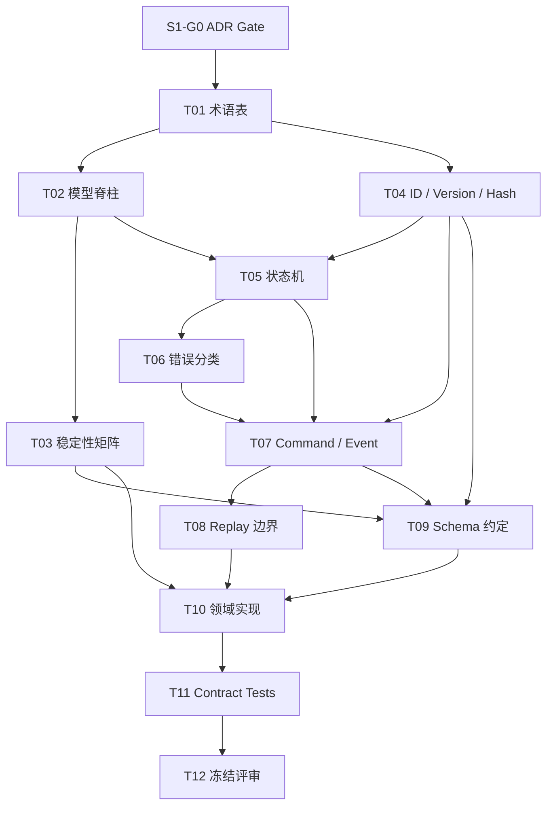

# Agentic Workflow 步骤 1 任务拆分

| 文档属性 | 值 |
| --- | --- |
| 文档版本 | 1.0 |
| 状态 | Completed / Frozen |
| 生效日期 | 2026-07-17 |
| 来源规划 | `agentic-workflow-implementation-plan.md` 1.0 |
| 对应范围 | 步骤 1：确定核心契约与模型脊柱 |
| 参考投入 | 1–2 person-weeks |

## 1. 目标

步骤 1 的目标是冻结确定性 Runtime Kernel 所依赖的核心契约，同时为尚未经过真实 Agent 场景验证的 Planner 扩展保留 Draft 演进空间。

完成后必须明确：

- WorkflowVersion、WorkflowRun、ExecutionPlan、NodeRun 和 Attempt 的关系。
- Runtime Kernel 的唯一执行输入和唯一状态转换入口。
- 核心状态机、错误、ID、版本、命令、事件和幂等规则。
- Frozen、Stable 和 Draft 契约的边界。
- Event Replay 不产生外部调用的硬约束。
- 后续步骤可以直接依赖的领域类型和 Schema。

## 当前进度

| 项目 | 状态 | 说明 |
| --- | --- | --- |
| S1-G0 | Completed | ADR-001 已接受，选择自研本地单机 Durable Kernel |
| S1-T01–T09 | Completed | 术语、模型脊柱、稳定性、状态机、Envelope、Replay 和 Schema 基线已实现 |
| S1-T10 | Completed | 纯领域包已建立，不依赖数据库、HTTP、旧引擎或 Agent SDK |
| S1-T11 | Completed | 34 个领域契约测试和 8 个 Golden fixtures 覆盖完整状态矩阵、Schema、Hash、幂等、Upcaster、Replay 和线性事件流 |
| S1-T12 | Completed | 1.0 契约评审、全量回归和 Completion Record 已完成 |

## 2. 前置门槛

### S1-G0：确认 Build-vs-Buy ADR

**目标**：确认已经选择自研本地单机 Durable Kernel 分支，步骤 1 才能开始。

**输入**：Build-vs-Buy ADR、验证原型和决策记录。

**工作内容**：

1. 确认 ADR 状态为 Accepted。
2. 确认选择自研 Kernel，而不是现成 Durable Execution 引擎。
3. 确认目标边界为本地单机、单项目、SQLite 持久化。
4. 确认不在当前范围实现跨区域一致性和高吞吐分布式队列。
5. 记录 ADR 的重新评估条件。

**交付物**：已接受的 ADR 引用和步骤 1 启动记录。

**验收标准**：ADR 未接受时，本任务之后的所有任务保持 blocked，不允许通过默认假设继续。

## 3. 任务清单

| 任务 | 建议角色 | 参考投入 | 可并行性 |
| --- | --- | ---: | --- |
| S1-T01 术语表 | Architecture | 0.5 pd | 首个任务 |
| S1-T02 模型脊柱 | Architecture + Runtime | 0.5 pd | T01 后 |
| S1-T03 稳定性矩阵 | Architecture | 0.25 pd | 可与 T04 并行 |
| S1-T04 ID/Version/Hash | Runtime | 0.5 pd | 可与 T03 并行 |
| S1-T05 状态机 | Runtime | 1 pd | T02/T04 后 |
| S1-T06 错误分类 | Runtime | 0.5 pd | T05 后 |
| S1-T07 Command/Event | Runtime | 1 pd | T04/T05/T06 后 |
| S1-T08 Replay 边界 | Runtime/Test | 0.5 pd | 可与 T09 并行 |
| S1-T09 Schema 约定 | Architecture/Runtime | 0.5 pd | 可与 T08 并行 |
| S1-T10 领域实现 | Runtime | 2 pd | T03–T09 后 |
| S1-T11 契约测试 | Runtime/Test | 1 pd | T10 后 |
| S1-T12 冻结评审 | Architecture + Runtime | 0.5 pd | 最终任务 |

`pd` 表示 person-day。总参考投入约 8.75 person-days，不包含 Build-vs-Buy ADR 本身，符合主规划步骤 1 的 1–2 person-weeks 量级。角色是能力要求，不代表必须由不同人员承担。

### S1-T01：建立术语表和对象边界

**目标**：为所有后续模块建立唯一术语来源。

**工作内容**：

1. 定义以下术语：
   - WorkflowDefinition
   - WorkflowIR
   - WorkflowVersion
   - WorkflowRun
   - ExecutionPlan / ExecutionPlanVersion
   - PlanPatch
   - NodeRun
   - Attempt
   - BranchToken
   - RunEvent
   - Value / Artifact
   - UsageSnapshot
   - BudgetAccount / BudgetReservation
2. 为每个对象写明：身份、生命周期、可变性、所有者和持久化边界。
3. 标明 Definition-time、Run-time 和 Execution-time 对象。
4. 清理同义词，禁止重新引入 `RuntimePlan`。

**交付物**：术语表和领域对象关系说明。

**验收标准**：每个术语只有一个定义；任意对象都能回答“谁创建、谁修改、何时终结、是否持久化”。

**依赖**：S1-G0。

### S1-T02：冻结模型脊柱

**目标**：明确 Kernel 执行对象，防止静态 IR 和动态 Plan 形成两套路由逻辑。

**工作内容**：

1. 固定以下关系：

   ```text
   Workflow DSL
     -> Canonical Workflow IR
     -> immutable WorkflowVersion
     -> WorkflowRun
     -> ExecutionPlan v1
     -> accepted PlanPatch
     -> ExecutionPlan v2 ... vN
     -> NodeRun
     -> Attempt
   ```

2. 明确 WorkflowRun 永久绑定 WorkflowVersion。
3. 明确 Run 启动时实例化 ExecutionPlan v1。
4. 明确 Kernel 只执行已提交的 ExecutionPlanVersion。
5. 明确 NodeRun 固定记录来源 PlanVersion。
6. 明确 PlanPatch 不能修改已经进入执行状态的历史节点。

**交付物**：领域关系图、对象不变量清单和至少一份线性运行示例。

**验收标准**：不存在“Kernel 直接执行 IR”与“Kernel 执行 Plan”两种并行解释。

**依赖**：S1-T01。

### S1-T03：定义契约稳定性矩阵

**目标**：避免过早冻结 Planner 相关设计，同时保护确定性内核接口。

**工作内容**：

1. 将契约划分为：
   - Frozen：状态机、Event Envelope、错误分类、ID、幂等和事务不变量。
   - Stable：DSL Core、IR Core、HandlerResult、Port、UsageSnapshot、Budget 预留与结算不变量；PlannerAction/ActionProposal 已在 Step 9 冻结为 Stable；PlanPatch、Agentic Region、PolicyDecision、HumanTask、Budget Ledger/Exhaustion、Foreach Scope、Subflow Link 和 Dynamic DAG Limits 已依据 ADR-002 升级为 Stable。
   - Draft：成本估算算法。
2. 定义每一级允许的修改方式。
3. 定义 Draft 契约进入 Stable 的评审门槛。
4. 定义破坏 Frozen 契约时的版本升级要求。

**交付物**：契约稳定性矩阵。

**验收标准**：所有步骤 1 领域对象都被标记稳定性级别；不存在未分类的跨模块契约。

**依赖**：S1-T01、S1-T02。

### S1-T04：定义 ID、时间、版本和 Hash 规则

**目标**：保证对象身份、顺序、去重和审计具有统一格式。

**工作内容**：

1. 定义各 Aggregate 和 Entity 的 ID 生成规则。
2. 定义 ID 的全局或局部作用域。
3. 定义 UTC 时间格式和数据库精度。
4. 定义 Schema Version、Event Version、Workflow Version、Plan Version 和 Aggregate Version。
5. 定义 Canonical JSON 序列化规则。
6. 定义 Workflow Definition Hash 的计算范围和算法。
7. 定义 Correlation ID、Causation ID、Command ID 和 Idempotency Key。

**交付物**：ID/Version/Hash 规范及示例。

**验收标准**：相同语义输入产生相同 Definition Hash；不同 Run、Plan、NodeRun 和 Attempt 不会发生身份冲突。

**依赖**：S1-T01、S1-T02。

### S1-T05：定义核心状态机

**目标**：冻结 Runtime Kernel 必须执行的合法状态转换。

**工作内容**：

1. 定义 WorkflowRun 状态机，包括：
   - created
   - running
   - waiting
   - budget_exhausted
   - waiting_for_budget
   - succeeded
   - failed
   - cancelled
2. 定义 NodeRun 状态机。
3. 定义 Attempt 状态机，包括 unknown_external_result。
4. 定义 Job、Lease 和 DurableTimer 状态机。
5. 定义 HumanTask 的最小核心生命周期：waiting、completed、cancelled。
6. 定义 BranchToken 状态：active、completed、failed、cancelled、not_selected。
7. 为每个状态转换定义 Command、前置条件、产生 Event 和幂等行为。
8. 定义终结状态和禁止转换。

**交付物**：状态转换表、状态图和状态机测试向量。

**验收标准**：每种状态都有合法进入和离开路径；所有非法转换可以被领域层拒绝；没有无法解释的非终结状态。

**依赖**：S1-T02、S1-T04。

### S1-T06：定义错误和失败分类

**目标**：让 Handler、Worker、Planner 和 Kernel 使用相同失败语义。

**工作内容**：

1. 定义：
   - validation_error
   - policy_rejected
   - transient_error
   - permanent_error
   - timeout
   - cancelled
   - lost
   - unknown_external_result
2. 定义每类错误是否允许 Retry、Rework、人工处理或直接终止。
3. 定义 Error Envelope：code、category、message、details、retryable、cause 和 source。
4. 规定用户可见信息与内部诊断信息的分离方式。

**交付物**：Error Code Registry 和失败处理矩阵。

**验收标准**：同一错误不会在不同模块被分类为相互冲突的 Retry 或 Permanent Failure。

**依赖**：S1-T05。

### S1-T07：定义 Command、Event Envelope 和因果规则

**目标**：建立事件溯源和幂等执行的基础协议。

**工作内容**：

1. 定义 Command Envelope：command_id、command_type、aggregate_id、expected_version、idempotency_key、actor、issued_at 和 payload。
2. 定义 Event Envelope：event_id、event_type、event_version、aggregate_id、sequence、correlation_id、causation_id、occurred_at 和 payload。
3. 定义 Command 到 Event 的一对多关系。
4. 定义 Aggregate Sequence 和乐观并发规则。
5. 定义重复 Command 的返回语义。
6. 定义事件命名和版本命名规则。
7. 定义 Event Upcaster 的纯函数约束。

**交付物**：Command/Event Schema 和示例事件流。

**验收标准**：重复 Command 不产生重复业务效果；Event 可以完整追溯其触发 Command 和上游事件。

**依赖**：S1-T04、S1-T05、S1-T06。

### S1-T08：定义 Replay 纯函数边界

**目标**：保证恢复和历史回放不会重新产生外部副作用。

**工作内容**：

1. 明确 Reducer 只能读取 State 和 Event，并产生新 State。
2. 禁止 Replay 调用 Planner、Handler、Tool、HTTP、Artifact Writer、Clock、Random 或数据库写操作。
3. 定义时间、随机数和外部响应必须先被记录成 Event。
4. 定义 PlannerResponse、HandlerResult 和 UsageSnapshot 的重放方式。
5. 建立测试替身，在 Replay 期间检测任何外部调用。

**交付物**：Replay Contract 和无副作用测试 Harness。

**验收标准**：同一事件流重复 Replay 产生相同 State，且外部调用计数始终为零。

**依赖**：S1-T07。

### S1-T09：定义序列化和 Schema 约定

**目标**：让所有跨模块对象具备稳定、可验证的表示形式。

**工作内容**：

1. 定义 Canonical JSON 规则。
2. 定义日期、数字、Enum、Null、Map 和集合的序列化方式。
3. 定义未知字段和缺失字段的处理方式。
4. 定义 Schema ID 和版本引用格式。
5. 定义不可变领域对象与 JSON Schema 的映射。
6. 为 Frozen 和 Stable 对象生成或编写 Schema。
7. Draft 对象必须显式携带 Draft Version，不能冒充 Stable Schema。

**交付物**：序列化规范、Schema Registry 目录和示例 Payload。

**验收标准**：所有 Frozen/Stable 对象均可无损往返序列化；非法 Payload 返回带字段路径的错误。

**依赖**：S1-T03、S1-T04、S1-T07。

### S1-T10：实现领域类型和不变量

**目标**：把已冻结契约转化为后续步骤可依赖的代码，而不引入持久化或调度实现。

**工作内容**：

1. 创建不可变领域类型和值对象。
2. 实现 ID、Version、Hash、Envelope 和 Error 类型。
3. 实现状态转换验证器。
4. 实现 Canonical JSON 编码。
5. 实现 Schema 校验入口。
6. 实现 Replay Reducer 接口，但只提供最小测试 Reducer。
7. 不实现 Repository、数据库、Job Queue、Worker 或 Planner。

**交付物**：领域模型代码、Schema、单元测试和契约测试。

**验收标准**：领域层不依赖 HTTP、数据库驱动、UI、Agent SDK 或具体 Handler；所有 Frozen 不变量有测试覆盖。

**依赖**：S1-T03 至 S1-T09。

### S1-T11：建立契约测试和 Golden Fixtures

**目标**：防止后续步骤静默破坏 1.0 核心契约。

**工作内容**：

1. 为每个状态机建立合法和非法转换测试。
2. 为 Command/Event Envelope 建立往返序列化测试。
3. 为 Definition Hash 建立稳定性 Fixture。
4. 为 Idempotency 和 Expected Version 建立测试向量。
5. 为 Replay 建立无外部调用测试。
6. 为旧 Event Version 预留 Upcaster Fixture 结构。
7. 保存 Golden JSON Fixtures 并纳入 CI。

**交付物**：Contract Test Suite 和 Golden Fixtures。

**验收标准**：修改 Frozen Schema、Hash、状态转换或 Event 表示时，测试会明确失败。

**依赖**：S1-T10。

### S1-T12：评审并冻结步骤 1

**目标**：确认步骤 1 达到退出条件，并形成后续步骤的正式输入。

**工作内容**：

1. 逐项检查步骤 1 验收标准。
2. 审查领域依赖方向。
3. 审查所有契约的稳定性标记。
4. 运行完整 Contract Test Suite。
5. 记录遗留 Draft 项和负责人。
6. 生成步骤 1 Completion Record。
7. 将步骤 1 契约基线标记为 1.0。

**交付物**：评审记录、测试结果、遗留项清单和 Completion Record。

**验收标准**：所有 Frozen/Stable 契约通过评审和测试；未完成项只能是已登记的 Draft，不存在隐含阻塞。

**依赖**：S1-T01 至 S1-T11。

## 4. 依赖与并行安排



可以并行：

- T03 与 T04。
- T05 完成后，T06 可以与 T07 的 Envelope 草案并行，但 T07 最终版依赖 T06。
- T08 与 T09。
- 文档示例、Schema Fixtures 和测试向量可以随各任务同步编写。

不可并行绕过：

- ADR Gate 未通过不能开始 T01。
- T02 未完成不能实现 Kernel 相关领域类型。
- T07 未完成不能冻结 Replay 和 Event Schema。
- T10 未完成不能进行最终契约测试。

## 5. 建议执行批次

| 批次 | 任务 | 预期结果 |
| --- | --- | --- |
| A | S1-G0、T01、T02 | ADR 确认，术语和模型脊柱确定 |
| B | T03、T04、T05 | 稳定性、身份版本和状态机确定 |
| C | T06、T07、T08、T09 | 错误、事件、Replay 和 Schema 确定 |
| D | T10、T11 | 领域代码和契约测试完成 |
| E | T12 | 步骤 1 正式冻结 |

## 6. 步骤 1 完成定义

只有同时满足以下条件，步骤 1 才能标记完成：

1. Build-vs-Buy ADR 已接受并选择自研分支。
2. 模型脊柱不存在双重执行解释。
3. 所有跨模块契约均标记 Frozen、Stable 或 Draft。
4. 核心状态机和非法转换已经编码并测试。
5. Command/Event Envelope、ID、Version 和 Hash 规则已经冻结。
6. Replay 测试证明不会产生外部调用。
7. Frozen/Stable 对象均有 Schema 和往返序列化测试。
8. Golden Fixtures 已纳入 CI。
9. Domain 层没有数据库、HTTP、UI、Agent SDK 或具体 Handler 依赖。
10. 所有遗留项都属于显式 Draft，并记录后续归属步骤。

## 7. 非目标

步骤 1 不实现：

- DSL Parser 和 Compiler。
- 数据库表和 Repository。
- Event Store 和 Snapshot Store。
- Runtime Scheduler。
- Durable Job、Lease 和 Timer。
- Handler SDK。
- Agent Planner。
- Artifact Store。
- HTTP API 和 UI。

这些能力只能在核心契约冻结后由后续步骤实现。

## 8. Step 1 Completion Record

| 项目 | 结果 |
| --- | --- |
| 完成日期 | 2026-07-17 |
| 契约基线 | 1.0 |
| ADR | ADR-001 Accepted：自研本地单机 Durable Kernel |
| Domain 包 | `src/orbit/workflow/domain/` |
| 契约说明 | `src/orbit/workflow/README.md` |
| Contract Tests | 34 passed |
| Full Regression | 314 passed |
| Golden Fixtures | 8 个，位于 `tests/fixtures/workflow_contracts/v1/` |

冻结结果：

- Frozen：状态机、Command/Event Envelope、错误分类、ID、版本、Canonical JSON、Definition Hash、幂等、乐观并发、Replay 与 Upcaster 不变量。
- Stable：领域引用类型、Value/Artifact、UsageSnapshot、BudgetAccount/BudgetReservation 及其 Schema 和记账不变量；PlannerAction/ActionProposal 已在 Step 9 冻结为 Stable；PlanPatch、Agentic Region、PolicyDecision、HumanTask、Budget Ledger/Exhaustion、Foreach Scope、Subflow Link 和 Dynamic DAG Limits 已依据 ADR-002 完成受控升级。
- Draft：成本估算算法；由后续对应步骤按稳定性政策推进。

评审结论：

1. Kernel 的唯一执行输入是已提交的 `ExecutionPlanVersion`；不存在直接执行 IR 的第二条路径。
2. Schema Registry 提供独立校验入口，非法 Payload 会返回精确字段路径，不依赖旧引擎。
3. Replay Guard 会审计并阻止文件、网络、子进程、时钟、随机数和 UUID 等外部输入；回放只消费已记录事件。
4. Correlation ID 由根 WorkflowRun 贯穿跨 Aggregate 链路，Causation ID 指向直接触发 Command 或 Event。
5. Budget 结算记录真实消耗，即使超过预留或总额度；负余额驱动后续 `budget_exhausted` 处理。
6. `unknown_external_result` 是 Attempt 终态；继续执行必须创建新 Attempt 或进入人工处理。
7. Rework 是图上的显式路由，不是 NodeRun 状态。
8. 完整状态转换矩阵、Definition Hash、幂等/并发、Upcaster 和线性事件流均由 1.0 Golden Fixtures 防篡改。

当前不存在阻塞 Step 2 的未完成 Frozen/Stable 契约。Draft 项均已显式登记，不属于 Step 1 遗漏。
