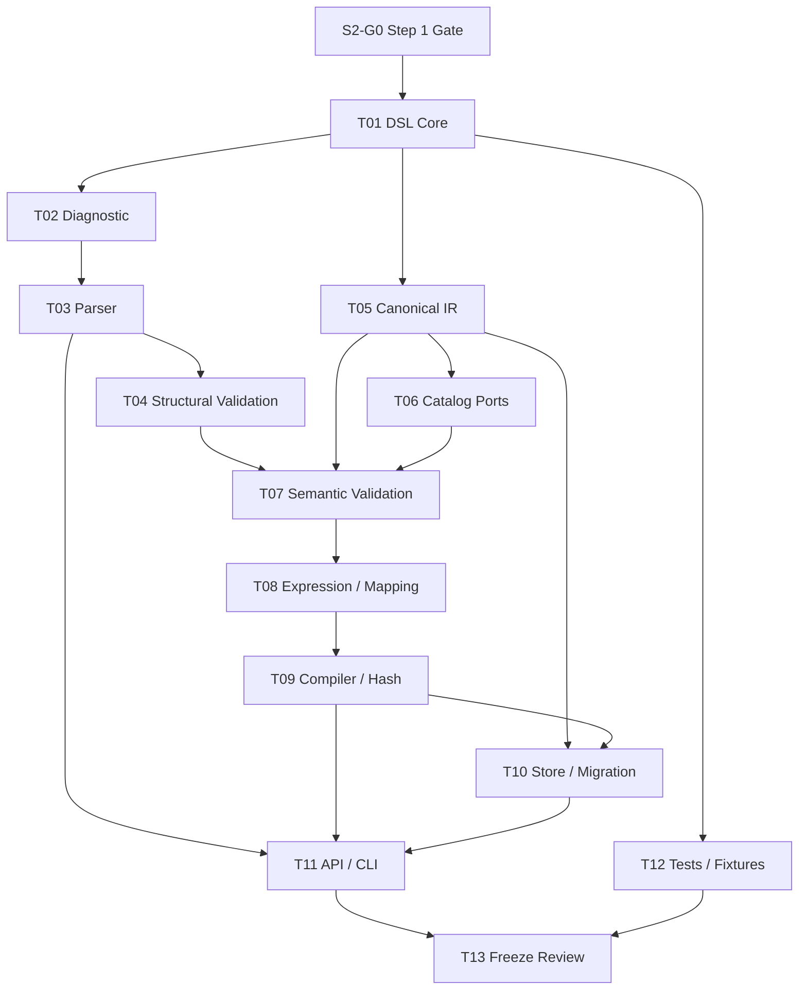

# Agentic Workflow 步骤 2 任务拆分

| 文档属性 | 值 |
| --- | --- |
| 文档版本 | 1.0 |
| 状态 | Completed / Stable 1.0 |
| 规划日期 | 2026-07-17 |
| 来源规划 | `agentic-workflow-implementation-plan.md` 1.0 |
| 输入基线 | Step 1 Contracts 1.0 |
| 对应范围 | 步骤 2：Workflow DSL、Canonical IR 与 Compiler |
| 参考投入 | 3–5 person-weeks |

## 1. 阶段目标

建立一条确定、可诊断、可测试的定义发布链路：

```text
YAML / JSON / UI Object
  -> Parsed DSL + Source Map
  -> Structural Validation
  -> Semantic Validation
  -> Normalization / Compilation
  -> Canonical WorkflowIR
  -> Definition Hash
  -> immutable WorkflowVersion
```

完成后，任何 Workflow 定义都必须在运行前完成默认值展开、引用解析、Handler 版本固定、条件和 Mapping 编译以及图索引生成。Runtime 不读取原始 DSL，也不补充 Compiler 遗漏的默认值或语义。

## 2. 范围边界与阶段决策

### 2.1 本阶段负责

- DSL 1.0 Schema、YAML/JSON Parser 和统一诊断格式。
- Canonical WorkflowIR 1.0 类型、Schema、序列化和 Hash。
- 结构校验、图语义校验、端口与 Handler 引用校验。
- Compiler 的规范化、条件表达式和 Mapping 编译。
- WorkflowDefinition 与不可变 WorkflowVersion 的发布和查询。
- `workflow_definitions`、`workflow_versions` 及 Migration Ledger。
- Python Application API 和 `orbit workflow validate|compile|publish` CLI。

### 2.2 本阶段不负责

- WorkflowRun、ExecutionPlan、NodeRun 或 Attempt 的创建。
- Event Store、Snapshot、Job、Lease、Timer 和 Worker。
- Handler 执行、Artifact 内容存储和 Runtime 数据 Mapping。
- 条件、Join、Iteration、Foreach、HumanTask、Subflow 的运行时语义。
- PlannerAction、ActionProposal 或 PlanPatch 的正式协议。
- HTTP/UI 编辑器。UI 以后只需生成同一个 DSL Object，并复用本阶段 API。
- 旧工作流格式、旧数据库或旧引擎的兼容与迁移。

### 2.3 开工前固定的设计决策

1. DSL 1.0 Core 的普通图必须是 DAG。循环只能由带版本的显式控制流扩展表达；在步骤 8 注册扩展前，Compiler 拒绝循环，不猜测循环意图。
2. Agentic Region 在本阶段只保留 `extension_id`、`extension_version`、边界端口和不可执行的 Draft 配置，不冻结 PlannerAction 或 PlanPatch。
3. 端口兼容性采用保守规则：默认要求源输出与目标输入引用完全相同的版本化 `schema_id`。显式 Mapping 必须声明结果 Schema；不做通用 JSON Schema 子类型推断。
4. Handler 在 DSL 中可以使用名称和版本约束；Canonical IR 中必须固定为精确 Handler Version。无法解析或匹配多个版本时编译失败。
5. Definition Hash 只覆盖 Canonical IR，不包含 YAML/JSON 格式、注释、字段顺序、源文件路径、发布时间和数据库 ID。
6. 同一 WorkflowDefinition 发布相同 Hash 是幂等操作，返回已有 WorkflowVersion；内容幂等优先于并发检查，因此相同 Hash 携带过期 `expected_latest_version` 仍成功返回。只有不同 Hash 才在乐观并发检查通过后生成下一个版本。
7. 发布后的 WorkflowVersion 禁止更新和删除。废弃版本通过新增状态事实或后续管理能力表达，不改写已发布 IR。
8. Step 1 的轻量领域 Schema Validator 保持不变。DSL 层独立负责 DSL 2020-12 Schema 校验和 Diagnostic 转换，不扩大 Frozen Domain 契约的职责。

## 当前进度

| 范围 | 状态 | 当前结果 |
| --- | --- | --- |
| S2-G0 | Completed | Step 1 Contracts 1.0 已冻结，34 个契约测试通过 |
| S2-T01 | Completed | DSL 1.0 Schema、扩展边界及字段级语义/Hash 规范已实现 |
| S2-T02–T04 | Completed | Diagnostic、严格 YAML/JSON Parser、Source Map、结构校验和 Extension Registry 已实现 |
| S2-T05–T09 | Completed | Canonical IR/Schema/反序列化、Catalog、图语义校验、引用作用域、受限 AST 和确定性 Compiler/Hash 已实现 |
| S2-T10 | Completed | 单一 Migration Ledger、定义期两张表、不可变 Trigger、幂等发布和乐观并发已实现 |
| S2-T11 | Completed | Application Service 与 `orbit workflow validate|compile|publish` CLI 已实现 |
| S2-T12 | Completed | 36 个 Step 2 测试和 6 个 DSL/IR Golden/Negative Fixtures 已通过，包含安全与依赖方向检查 |
| S2-T13 | Completed | 350 个项目全量测试通过，Completion Record 和 Gate 2 滚动估算已完成 |

## 3. 前置门槛

### S2-G0：确认 Step 1 基线

**目标**：确保 Compiler 依赖的基础语义已经冻结。

**输入**：

- `docs/agentic-workflow-step-1-tasks.md`
- `src/orbit/workflow/README.md`
- `tests/fixtures/workflow_contracts/v1/`

**验收标准**：

1. Step 1 状态为 `Completed / Frozen`，契约版本为 1.0。
2. Canonical JSON、DefinitionHash、EntityId、Revision、Value、ArtifactRef 和 Schema 错误路径规则可直接复用。
3. Step 1 Contract Tests 全部通过。
4. 如果实现需要破坏 Frozen 契约，停止 Step 2，并先提交显式的契约版本升级 ADR。

## 4. 任务总览

| 任务 | 内容 | 参考投入 | 依赖 |
| --- | --- | ---: | --- |
| S2-T01 | 冻结 DSL 1.0 Core 与扩展边界 | 1.5 pd | G0 |
| S2-T02 | 定义 Diagnostic 与 Source Map | 1 pd | T01 |
| S2-T03 | 实现 YAML/JSON Parser | 1.5 pd | T02 |
| S2-T04 | 实现 DSL 结构校验 | 1.5 pd | T01–T03 |
| S2-T05 | 定义 Canonical WorkflowIR 1.0 | 2 pd | T01 |
| S2-T06 | 定义 Handler/Schema Catalog Port | 1.5 pd | T01、T05 |
| S2-T07 | 实现语义与图校验 | 3 pd | T04–T06 |
| S2-T08 | 实现条件与 Mapping Compiler | 2 pd | T05–T07 |
| S2-T09 | 实现规范化 Compiler 与 Hash | 3 pd | T07、T08 |
| S2-T10 | 实现 Definition/Version Store 与 Migration | 3 pd | T05、T09 |
| S2-T11 | 实现 Application API 与 CLI | 2 pd | T03–T10 |
| S2-T12 | 建立 Golden、负例和属性测试 | 2 pd | 随 T01–T11 持续进行 |
| S2-T13 | 阶段评审、滚动估算与冻结 | 1 pd | T01–T12 |

总参考投入约 25 person-days，与总规划的 3–5 person-weeks 上限一致。可由两条主线并行：DSL/Compiler 与 Persistence/CLI；但 T10 的 Migration 必须使用仓库唯一顺序号，并先于 Step 3 的运行期表 Migration 合并。

## 5. 详细任务

### S2-T01：冻结 DSL 1.0 Core 与扩展边界

**目标**：定义面向用户和 UI 的唯一输入结构。

**工作内容**：

1. 定义顶层字段：`dsl_version`、`metadata`、`inputs`、`outputs`、`nodes`、`edges`、`policies`、`extensions`。
2. 定义 Metadata：稳定 Workflow 身份、名称、描述、标签；禁止把发布时间或数据库版本写入 DSL。
3. 定义 Port：方向、必需性、版本化 `schema_id`、默认值和可选描述。
4. 定义 Node Core：`id`、`kind`、输入/输出端口、Handler 约束、配置、Policy 引用。
5. 定义 Edge Core：源节点/端口、目标节点/端口、条件、Mapping 和错误路由标记。
6. 定义显式 Entry/Terminal 约定，禁止通过数组位置或名称猜测。
7. 定义 Policy 引用结构；策略内容在对应后续阶段扩展。
8. 定义 `extension_id + extension_version + config` 扩展信封。
9. 为 Agentic Region 定义 Draft 信封和边界端口，不定义 Planner 内部行为。
10. 决定字段是否参与语义与 Hash，并形成字段级表格。

**交付物**：DSL 1.0 规范、JSON Schema、正例与最小示例。

**验收标准**：YAML、JSON 和 UI Object 使用同一逻辑 Schema；未知核心字段默认拒绝；扩展只能出现在显式扩展点。

### S2-T02：定义统一 Diagnostic 与 Source Map

**目标**：让 Parser、Schema Validator、Semantic Validator、Compiler 和 Store 返回一致错误。

**工作内容**：

1. 定义 `Diagnostic`：`code`、`severity`、`message`、`path`、`source_range`、`related_paths`、`hint`、`phase`。
2. 定义 JSON Path 表示法和数组索引规则，与 Step 1 的 `$...` 路径一致。
3. 定义 Source Range：文件标识、1-based 行列、起止位置。
4. 建立稳定错误码 Registry，至少区分 Parse、Schema、Reference、Graph、Handler、Port、Expression、Mapping、Publish。
5. 定义多错误收集顺序：先阶段、再 JSON Path、再错误码，保证输出确定。
6. 定义最大错误数量和截断 Diagnostic，防止错误风暴。

**交付物**：Diagnostic 类型、Schema、错误码 Registry 和格式化器。

**验收标准**：同一非法输入在 YAML/JSON 中产生相同错误码和字段路径；能定位源文本时同时给出行列。

### S2-T03：实现 YAML/JSON Parser

**目标**：把不同文本格式转换为同一种未编译 DSL Object 和 Source Map。

**工作内容**：

1. JSON 使用严格解析：拒绝重复键、NaN/Infinity 和非对象顶层值。
2. YAML 使用安全加载：禁止自定义 Tag、对象构造和任意代码执行。
3. YAML 禁止会导致跨实现歧义的隐式类型；日期保持字符串，不自动转为时间对象。
4. 检测重复键、Alias 循环和超限 Alias 展开。
5. 为 YAML 和 JSON 构建字段路径到源位置的 Source Map；缺失字段回退定位到最近父对象。
6. 统一 BOM、UTF-8、换行和空文档行为。
7. Parser 不展开默认值、不解析 Handler、不访问数据库或网络。
8. 在 `pyproject.toml` 明确加入并锁定 YAML Parser；禁止依赖旧工作流解析器。
9. 限制输入字节、文档嵌套深度、展开后节点数和 YAML Alias 数；越界必须返回 Diagnostic，不得泄漏 `RecursionError`。

**交付物**：`ParsedDslDocument`、JSON/YAML Parser 和 Parser tests。

**验收标准**：语义相同的 YAML 与 JSON 产生相同 DSL Object；恶意或歧义 YAML 被安全拒绝并返回 Diagnostic。

### S2-T04：实现 DSL 结构校验

**目标**：在语义分析前拒绝形状、类型和必填字段错误。

**工作内容**：

1. 采用 JSON Schema 2020-12 校验 DSL Core。
2. 将第三方 Validator 的错误转换为项目 Diagnostic，不泄漏库内部异常。
3. 验证 `dsl_version` 和 Extension Version。
4. 拒绝未知核心字段、错误 Enum、非法 ID 语法和不合法 Schema ID。
5. 对 Extension 先校验统一信封，再交给版本化 Extension Validator。
6. 保证 Validator 只读，不修改 Parser 结果。

**交付物**：结构 Validator、Extension Schema Registry 和错误适配器。

**验收标准**：Schema 负例全部返回稳定错误码与精确路径；改变 JSON Schema 会触发 Golden Contract Test。

### S2-T05：定义 Canonical WorkflowIR 1.0

**目标**：建立 Runtime 以后唯一可以消费的定义表示。

**工作内容**：

1. 定义不可变 `WorkflowIR`、`IRNode`、`IRPort`、`IREdge`、`IRPolicyRef`、`IRExtension`。
2. 每个 IR 对象携带 `ir_version`；IR 中不携带 Source Map、注释或原始文本。
3. 所有默认值在 IR 中显式存在。
4. Node、Port、Edge 使用稳定 ID；Runtime 不根据名称、数组位置或文本重新生成 ID。
5. Handler 引用只允许精确版本。
6. 条件和 Mapping 保存已编译的结构化 AST，不保存待解释源字符串作为执行依据。
7. 生成 Runtime 索引：节点表、入边、出边、Entry、Terminal、端口索引和错误路由索引。
8. 明确有序字段和无序字段；无序集合进入 IR 前按稳定键排序。
9. 定义 WorkflowIR JSON Schema 和无损往返序列化。
10. IR Core 标记 Stable；Agentic Region payload 保持 Draft Version。

**交付物**：Canonical IR 类型、Schema、序列化器和最小 IR Fixture。

**验收标准**：IR 不含隐式默认值、未解析引用或非确定顺序；序列化后可以无损恢复相同 IR。

### S2-T06：定义 Handler Catalog 与 Schema Catalog Port

**目标**：让 Compiler 可以解析外部能力，但不依赖 Handler SDK 或具体运行时。

**工作内容**：

1. 定义只读 `HandlerCatalog` Port：按名称和约束解析唯一精确版本。
2. 定义最小 Handler Manifest：名称、版本、Node Kind、输入/输出 Port Schema、静态配置 Schema、Capability。
3. 定义只读 `SchemaCatalog` Port：按版本化 Schema ID 读取 Port Schema 元数据。
4. 提供纯内存实现和 Fixture Loader，供测试与 CLI 使用。
5. 解析结果写入 IR；Compiler 不把 Catalog 对象或可执行代码写入 IR。
6. Catalog 不允许在一次编译过程中变化；编译开始时获取不可变 Snapshot/Fingerprint。
7. Catalog Fingerprint 写入编译报告，但不进入 Definition Hash，精确解析结果进入 Hash。

**交付物**：Catalog Ports、Manifest 类型、内存实现和 fixtures。

**验收标准**：相同 DSL 和相同 Catalog Snapshot 得到相同 IR；Handler 缺失、版本冲突和端口声明冲突均在编译期失败。

### S2-T07：实现语义与图校验

**目标**：拒绝结构合法但无法确定执行的 Workflow。

**工作内容**：

1. 检查 Node、Port、Edge、Policy 和 Extension ID 唯一性。
2. 检查节点、端口、Schema、Policy 和 Handler 引用存在。
3. 检查输入只能连接输出，边方向合法，单值输入不能被多个源写入。
4. 按保守兼容规则检查版本化 Schema ID。
5. 检查 Entry 存在且可达；Terminal 存在且可从每条成功路径到达。
6. 检查不可达 Node、无结束路径、悬空 Port 和重复 Edge。
7. 对 DSL Core 图执行环检测；发现环返回包含完整环路径的 Diagnostic。
8. 检查错误路由不会伪装为成功路由，Terminal 不允许出边。
9. 验证 Handler Manifest 与 Node 声明的端口和配置一致。
10. 一次运行收集尽可能多的独立错误，但不在前置引用缺失后产生级联噪音。

**交付物**：Semantic Validator、Graph Analyzer 和负例 fixtures。

**验收标准**：所有非法图返回确定 Diagnostic；合法图中每个 Node 都位于 Entry 到某个 Terminal 的路径上。

### S2-T08：实现条件表达式与 Mapping Compiler

**目标**：消除 Runtime 对用户表达式文本的二次解释。

**工作内容**：

1. 定义受限表达式语法，只允许常量、端口引用、布尔/比较操作和白名单纯函数。
2. 禁止属性反射、动态函数、文件、网络、时间、随机数和任意代码。
3. 将条件编译为版本化 AST，并进行类型检查。
4. 定义 Mapping：字段选择、重命名、对象/数组构造和受限转换。
5. Mapping 编译结果显式声明输出 `schema_id`。
6. 检查所有数据引用在对应节点作用域中可见。
7. 提供纯函数 Evaluator 仅用于 Compiler 测试；Runtime Evaluator 在步骤 8 接入。
8. 对 AST 设置深度、节点数量和字符串长度上限。

**交付物**：Expression/Mapping Grammar、AST 类型、Compiler 和测试 Evaluator。

**验收标准**：等价表达式生成相同 AST；非法或非确定表达式在编译期失败；Runtime 不需要保存原始表达式才能执行。

### S2-T09：实现规范化 Compiler 与 Definition Hash

**目标**：把合法 DSL 确定地编译为唯一 Canonical IR。

**工作内容**：

1. 建立显式阶段 Pipeline：Parse → Structure → Resolve → Analyze → Normalize → Emit → Hash。
2. 展开所有默认值，规范化 ID、Enum、空集合和可选字段。
3. 固定 Handler Version、Schema Version 和 Extension Version。
4. 编译条件、Mapping、Policy 引用和扩展边界。
5. 生成稳定 Runtime 索引。
6. 按 T05 的顺序规则产生 Canonical IR。
7. 使用 Step 1 `canonical_json` 和 `DefinitionHash` 计算 Hash。
8. 产生 `CompilationResult`：IR、Hash、Diagnostic、Catalog Fingerprint 和 Compiler Version。
9. Compiler 全程无数据库写入、无时钟、无随机数和无网络访问。
10. 相同语义的 YAML/JSON、字段重排和无序集合重排必须生成相同 IR 字节与 Hash。

**交付物**：Compiler、CompilationResult 和 determinism tests。

**验收标准**：Compiler 是确定性纯计算；IR 中不存在 Runtime 才能解析的引用或默认值。

### S2-T10：实现 WorkflowDefinition、WorkflowVersion Store 与 Migration

**目标**：持久化定义身份和不可变的已编译版本。

**工作内容**：

1. 建立 workflow 子系统的单一 Migration Ledger 和顺序号分配规则。
2. 创建 `workflow_definitions`：稳定 Workflow ID、名称、创建时间和必要审计字段。
3. 创建 `workflow_versions`：Workflow ID、单调版本、Definition Hash、DSL/IR/Compiler Version、Canonical IR JSON、可选原始 Source、创建时间和发布者。
4. 唯一约束至少覆盖 `(workflow_id, version)` 与 `(workflow_id, definition_hash)`。
5. 用数据库 Trigger 或等价机制拒绝 WorkflowVersion 的 UPDATE/DELETE。
6. 定义 Repository Port 与 SQLite Adapter；Domain/DSL 不 import SQLite。
7. 发布事务接收 `expected_latest_version`，原子比较并分配下一版本。
8. 相同 Hash 重复发布返回已有版本，不创建空版本号。
9. Source 仅用于诊断和审计，不参与 Hash，也不是 Runtime 输入。
10. Migration 只创建定义期表，不创建 Run、Event、Planner 或 HumanTask 表。

**交付物**：Migration、Repository Port、SQLite Adapter 和并发/不可变测试。

**验收标准**：并发发布不会产生重复版本；发布后的 Canonical IR 无法原地修改；重新读取后的 IR 和 Hash 与发布结果一致。

### S2-T11：实现 Application API 与 CLI

**目标**：提供可被本地用户、自动化和未来 HTTP/UI 共同复用的入口。

**工作内容**：

1. 实现 Application Service：`validate_workflow`、`compile_workflow`、`publish_workflow`、`get_workflow_version`。
2. CLI 使用同一 Service，不复制 Parser/Validator/Compiler 逻辑。
3. 增加命令：
   - `orbit workflow validate FILE`
   - `orbit workflow compile FILE [--output FILE|-]`
   - `orbit workflow publish FILE [--db PATH] [--expected-version N]`
4. 定义 Handler/Schema Catalog 的 CLI 输入或项目级发现方式；发现结果在编译开始后冻结。
5. 定义退出码：成功、输入/校验错误、并发冲突、内部错误。
6. 人类输出显示路径、行列、错误码、说明和 Hint；`--json` 输出稳定机器格式。
7. `validate` 和 `compile` 不写数据库；`publish` 只写定义期表。
8. 输出 Canonical IR 时保证字节稳定，避免终端格式化改变 Hash 输入。

**交付物**：Application Service、CLI、机器输出 Schema 和 CLI tests。

**验收标准**：CLI 与 Python API 对同一输入返回相同诊断、IR 和 Hash；失败时不产生部分发布。

### S2-T12：建立 Golden、负例和属性测试

**目标**：保护 DSL/IR/Compiler 1.0 不被后续步骤静默改变。

**工作内容**：

1. 建立等价 YAML/JSON → 同一 IR/Hash Golden Fixture。
2. 建立最小线性图、多分支 DAG、Handler 配置、条件、Mapping 和 Draft Extension fixtures。
3. 建立每个 Diagnostic Code 的最小负例 fixture。
4. 建立字段顺序、Node/Edge 无序排列、空值表示和 YAML 标量差异的变形测试。
5. 建立重复键、Alias Bomb、非法表达式和超深 AST 安全测试。
6. 建立完整 IR Schema Golden 和无损 round-trip 测试。
7. 建立发布幂等、expected version 冲突、并发版本分配和数据库不可篡改测试。
8. 建立依赖方向测试：`domain`/`dsl` 不得 import SQLite、HTTP、UI、旧引擎或 Agent SDK。
9. 将 fixtures 固定在 `tests/fixtures/workflow_dsl/v1/` 和 `tests/fixtures/workflow_ir/v1/`。
10. 运行现有全量测试，Step 2 不能破坏 Step 1 的 1.0 Golden Contracts。

Diagnostic 覆盖分布：Compiler/Graph 的 12 类错误由 `negative-cases.json` 统一驱动；Parse Error、Duplicate Key、Unsafe YAML、Publish Conflict 等依赖原始文本或事务环境的 4 类错误位于对应 Parser/Store 专门测试。两部分共同覆盖 Registry，不能仅按负例矩阵文件数量判断遗漏。

**交付物**：Compiler Contract Suite、Golden/Negative/Security Fixtures 和测试清单。

**验收标准**：修改 DSL Schema、IR 表示、规范化规则、Hash 输入或 Diagnostic Code 时，测试明确失败。

### S2-T13：阶段评审、滚动估算与冻结

**目标**：确认 Step 2 可以作为 Step 3 和 Step 4 的稳定输入。

**工作内容**：

1. 逐项审查任务和阶段完成定义。
2. 审查 DSL → IR 单向边界，确认 Runtime 不解释原始 DSL。
3. 审查所有 IR 引用、默认值和 Handler Version 已固定。
4. 审查 WorkflowVersion Store 的不可变与并发语义。
5. 运行 Contract、Migration、CLI 和全量回归测试。
6. 记录 Draft Extension、已知限制和 Step 8/9 的归属。
7. 形成 Step 2 Completion Record，并将 DSL Core/IR Core 标记为 1.0 Stable。
8. 执行总规划 Gate 2，依据实际 Compiler 复杂度重新估算步骤 3–12。

**交付物**：评审记录、Completion Record、遗留 Draft 清单和更新后的滚动估算。

**验收标准**：所有 Stable 交付物通过测试；未完成项只能是已登记且不影响确定性编译的 Draft Extension。

## 6. 依赖与并行安排



可以并行：

- T02–T04 Parser/Structure 线与 T05–T06 IR/Catalog 线。
- T10 的 Migration/Repository Port 设计可在 T05 完成后开始，但发布逻辑必须等待 T09 的 Hash 语义固定。
- T12 随各任务同步补充，不在阶段末集中补测试。
- Step 3 可以在 T10 的定义期 Migration 合并后并行开发 Repository/Event Store；Step 3 不得修改 T10 已发布表的不可变语义。

不可绕过：

- T07 之前不得开始最终 Compiler 规范化。
- T09 之前不得持久化临时或未规范化 IR。
- T10 Migration 必须先于 Step 3 带外键的运行期 Migration。
- T13 之前不得把 DSL Core/IR Core 标记为 Stable 1.0。

## 7. 建议执行批次

| 批次 | 任务 | 阶段产物 |
| --- | --- | --- |
| A | G0、T01、T02 | DSL Core、扩展边界、Diagnostic |
| B | T03、T04、T05、T06 | Parser、结构校验、Canonical IR、Catalog Ports |
| C | T07、T08、T09 | 语义校验、表达式/Mapping、确定性 Compiler |
| D | T10、T11 | 不可变 WorkflowVersion Store、Migration、API/CLI |
| E | T12、T13 | Golden/Security/Regression Tests、冻结评审 |

## 8. 建议代码与 Fixture 布局

```text
src/orbit/workflow/
├── domain/
│   └── definitions.py
├── dsl/
│   ├── diagnostics.py
│   ├── parser.py
│   ├── schema.py
│   ├── validator.py
│   ├── expressions.py
│   ├── mapping.py
│   └── compiler.py
├── catalogs/
│   ├── handlers.py
│   └── schemas.py
├── application/
│   └── workflows.py
└── persistence/
    ├── database.py
    ├── migrations.py
    └── workflow_versions.py

tests/
├── fixtures/
│   ├── workflow_dsl/v1/
│   └── workflow_ir/v1/
├── test_workflow_dsl.py
├── test_workflow_compiler.py
├── test_workflow_version_store.py
└── test_workflow_cli.py
```

模块依赖必须保持：

```text
domain <- dsl/compiler <- application <- CLI
   ^            ^              |
   |            |              v
catalog ports   +------ repository ports <- SQLite adapters
```

`domain` 和 `dsl` 不依赖 SQLite、Starlette、UI、具体 Handler 或旧 workflow engine。

## 9. Step 2 完成定义

只有同时满足以下条件，Step 2 才能标记完成：

1. YAML、JSON 和 UI Object 共享 DSL 1.0 Schema。
2. 所有 Parse、Schema、Semantic 和 Compile 错误使用统一 Diagnostic，包含错误码和字段路径。
3. 相同语义输入生成字节一致的 Canonical IR 和 Definition Hash。
4. IR 中所有默认值、引用、Handler Version、条件、Mapping 和 Runtime 索引已经显式固定。
5. DSL Core 环、不可达节点、无终点路径、悬空引用和不兼容端口在编译期被拒绝。
6. WorkflowVersion 发布支持幂等和乐观并发，且发布后不能更新或删除。
7. `validate`、`compile` 和 `publish` API/CLI 使用同一业务实现。
8. 定义期 Migration 已合并，且没有提前创建任何运行期或 Planner 表。
9. Golden、Negative、Security、Migration、CLI 和全量回归测试全部通过。
10. Step 1 1.0 Frozen Contracts 未被修改。
11. Agentic Region 和其他未实现控制流只作为明确版本化的 Draft Extension，不伪装成可执行 Stable Core。
12. 已完成 Gate 2 滚动估算并生成 Step 2 Completion Record。

## 10. 主要风险与控制措施

| 风险 | 影响 | 控制措施 |
| --- | --- | --- |
| YAML 隐式类型和 Alias | 同一文本跨解析器语义不同或资源耗尽 | 安全加载、重复键检查、限制 Alias、Golden/Security tests |
| 结构校验与语义校验混杂 | 错误级联、Compiler 难测试 | 固定 Pipeline 和统一 Diagnostic，中间阶段不可跳过 |
| JSON Schema 子类型推断 | 兼容性判断不可靠 | v1 使用相同版本化 Schema ID 的保守规则 |
| Handler Catalog 漂移 | 同一 DSL 编译出不同版本 | 编译期 Catalog Snapshot，IR 固定精确版本 |
| 无序集合影响 Hash | 字段/节点重排导致假版本 | 明确顺序语义、稳定排序、变形测试和 Golden Hash |
| Source 与 IR 混淆 | Runtime 重新解释 DSL | Source 仅审计，Runtime 只加载 Canonical IR |
| Migration 并行冲突 | Step 3 外键或版本号冲突 | 单一 Migration Ledger，Step 2 Migration 先合并 |
| Draft 扩展提前固化 | Planner/控制流返工污染 IR Core | 版本化扩展信封，Draft payload 不进入 Stable Core 语义 |

## 11. Step 2 Completion Record

| 项目 | 结果 |
| --- | --- |
| 完成日期 | 2026-07-17 |
| DSL Core | Stable 1.0 |
| WorkflowIR Core | Stable 1.0 |
| Compiler | 1.0，确定性纯计算 |
| 定义期 Migration | `workflow_schema_migrations` version 1 |
| Step 2 Tests | 36 passed |
| Full Regression | 350 passed |
| Golden/Negative Fixtures | 6 个，位于 `tests/fixtures/workflow_dsl/v1/` 与 `tests/fixtures/workflow_ir/v1/` |
| CLI | `orbit workflow validate / compile / publish` |

评审结论：

1. YAML、JSON 和未来 UI Object 共享 DSL 1.0 Schema 与同一 Application Service。
2. Parser 严格拒绝重复键、非有限数字、递归/超限 YAML Alias、超深/超大文档和不安全类型；YAML/JSON Diagnostic 均使用稳定错误码、JSON Path 和 Source Map。
3. Compiler 完成默认值展开、Handler 精确版本解析、条件/Mapping AST、引用作用域、图索引和稳定排序。
4. 同义 YAML/JSON 产生字节一致的 Canonical IR 与 Definition Hash，结果由 Golden Fixture 固定。
5. DSL Core 图必须是 DAG；引用缺失、环、不可达节点、无终点路径、Handler/Port/Schema 冲突均在编译期拒绝。
6. Runtime 以后只消费 WorkflowIR，不读取 DSL Source 或 Catalog。
7. WorkflowVersion 发布支持相同 Hash 幂等、`expected_latest_version` 乐观并发和事务内版本分配；相同 Hash 的幂等命中优先于并发检查；数据库 Trigger 禁止更新或删除。
8. 本阶段只创建 `workflow_definitions` 和 `workflow_versions`，没有提前创建 Run、Event、Planner 或 HumanTask 表。
9. Domain/DSL 依赖方向测试证明其不依赖 SQLite、HTTP、UI、旧 workflow engine 或 Agent SDK。
10. Agentic Region 和未实现控制流继续是版本化 Draft Extension，不具备稳定 Runtime 执行语义。

### Gate 2 滚动估算

Compiler 的实际复杂度仍在原 3–5 person-weeks 区间内，未发现需要扩大后续总范围的新架构风险。Migration Ledger 和 Definition Store 已建立，但 Event Store、租约恢复和动态计划仍是独立高风险项，因此不下调其估算。

| 后续步骤 | 更新后参考投入 | Gate 2 结论 |
| --- | ---: | --- |
| 3 Persistence/Event Store | 4–7 pw | 保持；重点验证事务、Upcaster、Snapshot 与长期 Replay |
| 4 Runtime Kernel | 4–6 pw | 保持；可以直接加载 Stable WorkflowIR |
| 5 Job/Timer/Worker | 5–8 pw | 保持；崩溃恢复仍是主要风险 |
| 6 Handler SDK | 3–5 pw | 保持；需将本阶段 Manifest Port 演进为执行协议 |
| 7 Data/Artifact | 4–7 pw | 保持；Port Schema 边界已经明确 |
| 8 Static Graph | 5–8 pw | 保持；循环、Join 和 Rework 仍需显式扩展语义 |
| 9 Planner/Replay/Eval | 5–8 pw | 保持 Draft，等待 Planner Eval 数据 |
| 10 Policy/ExecutionPlan | 8–13 pw | 保持；动态计划和 Budget Ledger 仍是最大集成面 |
| 11 General Workflow | 8–12 pw | 保持；Foreach/Subflow/Dynamic DAG 未提前实现 |
| 12 Production Readiness | 8–14 pw | 保持；安全、容量和 UI 尚未获得实测基线 |

Step 2 当前没有阻塞 Step 3 的 Stable 契约缺口。Step 3 必须继续使用同一个 Migration Ledger，并从 version 2 开始分配运行期 Migration。
