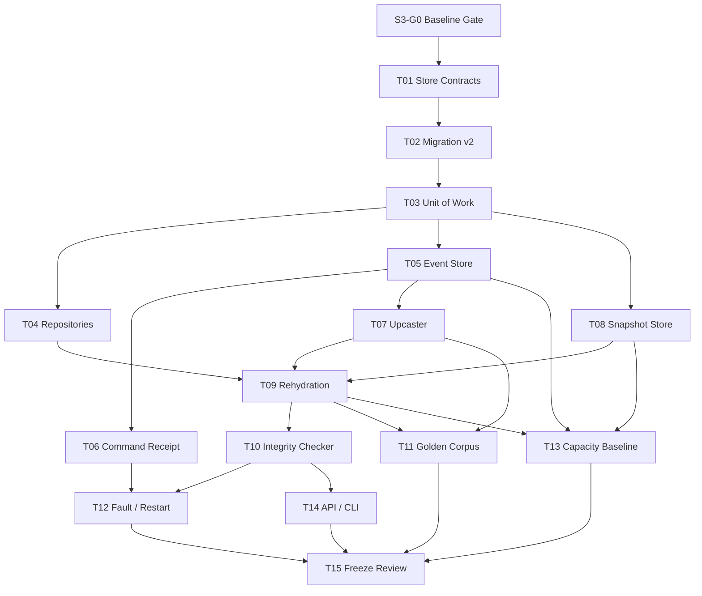

# Agentic Workflow 步骤 3 任务拆分

| 文档属性 | 值 |
| --- | --- |
| 文档版本 | 1.0 |
| 状态 | Completed / Stable 1.0 |
| 规划日期 | 2026-07-17 |
| 来源规划 | `agentic-workflow-implementation-plan.md` 1.0 |
| 输入基线 | Step 1 Contracts 1.0、DSL/WorkflowIR Stable 1.0 |
| 对应范围 | 步骤 3：Persistence、Event Store、Snapshot 与 Replay |
| 参考投入 | 4–7 person-weeks |

## 1. 阶段目标

建立确定性 Runtime 的持久化事实来源和事务边界，使后续 Kernel 可以在不直接操作 SQLite 的前提下完成：

```text
Command
  -> Unit of Work
  -> Expected Version / Idempotency Check
  -> Aggregate Projection Update
  -> Event Append
  -> BranchToken Update
  -> Command Receipt
  -> Atomic Commit

Stored Event Stream
  -> Event Upcaster
  -> Reducer
  -> Rehydrated State
  -> optional Snapshot + Tail Events
```

完成后，Event 是不可覆盖的事实；Run、NodeRun、Attempt 和 BranchToken 表是可核对、可重建的当前投影；Snapshot 只是恢复加速器，删除全部 Snapshot 不影响正确性。

## 2. 范围边界

### 2.1 本阶段负责

- Migration version 2 和确定性运行期核心表。
- Repository Ports、SQLite Adapters 和 Unit of Work。
- Aggregate Expected Version、Event Sequence、全局 Event Position。
- 只追加 Event Store 和持久化 Command Receipt。
- Event Version Catalog、Upcaster 接入和旧事件读取策略。
- Run-scoped Snapshot Store、兼容性判断和 Snapshot Policy。
- Aggregate Replay 与跨 Aggregate RunView Replay。
- 数据库一致性检查工具。
- Golden Event Streams、并发、事务回滚、重启和容量基线测试。

### 2.2 本阶段不负责

- Command 的业务处理、状态推进或下游调度；属于 Step 4 Runtime Kernel。
- Job、Lease、DurableTimer 和 Worker；属于 Step 5。
- Handler SDK 和实际外部调用；属于 Step 6。
- Artifact 内容、Value Mapping 和 Lineage；属于 Step 7。
- Branch/Join/Retry/Rework 的完整运行语义；属于 Step 8。
- Planner、PlanPatch、HumanTask、Budget、Foreach 或 Subflow 表。
- HTTP/UI Run API。
- Event 删除、压缩或归档。Step 3 默认长期保留 Event。
- 旧 orbit 工作流数据库兼容或迁移。

## 3. 开工前固定的设计决策

### 3.1 两种事件顺序

Event Store 同时维护：

1. `aggregate_sequence`：同一 Aggregate 内从 1 开始严格连续，对应 Aggregate Version。
2. `global_position`：SQLite Store 内单调递增，用于 Run 内跨 Aggregate 的确定顺序、增量订阅和 Snapshot Tail Replay。

`EventEnvelope.sequence` 表示 Aggregate Sequence；Store 返回的 `StoredEvent` 额外携带 `run_id` 和 `global_position`。两者禁止混用。

### 3.2 两种 Replay

- Aggregate Replay：只消费一个 Aggregate 的 Event，继续使用 Step 1 `replay_events`，按 Aggregate Sequence 校验。
- RunView Replay：按 `global_position` 消费同一 Run 下多个 Aggregate 的 `StoredEvent`，用于恢复 Run 视图和 Snapshot。Reducer 必须显式支持跨 Aggregate 输入。

Run Snapshot 使用 `last_global_position` 作为正确的 Tail Cursor，同时记录 `last_run_event_sequence` 便于诊断。只记录 WorkflowRun Aggregate Sequence 不足以覆盖 NodeRun/Attempt/Token Event。

### 3.3 Aggregate Version

- Aggregate Version 等于该 Aggregate 已提交的最后 Event Sequence，未创建时为 0。
- 一个 Command 可以产生多个 Event；提交后 Version 从 `expected_version` 增加 Event 数量。
- Event 必须从 `expected_version + 1` 开始连续排列。
- 当前状态表中的 `aggregate_version` 必须与 Event Stream Head 一致。

不额外创建 `aggregate_heads` 表。Event Store 通过 `(aggregate_id, aggregate_sequence)` 唯一索引确定 Stream Head，状态投影保存当前 Version。

### 3.4 持久化幂等

Step 3 增加 `command_receipts` 表。原因是 Step 1 已冻结的 Idempotency Key、Command Fingerprint 和重复 Command 返回原 Event ID 语义必须跨进程重启成立，仅依赖内存记录或 Event Causation ID 不足够。

- 唯一键：`(aggregate_id, idempotency_key)`。
- 相同 Key + 相同 Fingerprint：返回已提交 Event IDs，不追加 Event。
- 相同 Key + 不同 Fingerprint：返回 Idempotency Conflict。
- Receipt、Event、Projection 和 Token 变更必须在同一事务提交。
- Receipt 只记录提交成功的 Command；失败或回滚事务不留占位记录。

`command_receipts` 是确定性 Kernel 必需表，不属于 Planner Draft Schema。主规划原有七张表清单应据此扩充为八张。

### 3.5 Event 不可变与 Upcasting

- Store 永远保存原始 Event Version 和 Payload，不原地升级历史行。
- 普通 Replay 读取时根据 Current Event Version Catalog 顺序 Upcast。
- 审计接口可以读取 Raw Stored Event。
- Upcaster 必须保持 Event ID、Aggregate、Sequence、Correlation、Causation、Occurred At 和 Global Position 不变。
- 缺失 Upcaster、未知未来版本或 Downcast 请求必须明确失败，不能静默跳过 Event。

### 3.6 Snapshot 是可丢弃缓存

- Snapshot 只追加，不覆盖旧 Snapshot；可以删除损坏或不兼容 Snapshot。
- Snapshot 记录 Schema Version、Reducer Version、Last Global Position、Last Run Event Sequence、Checksum 和 Canonical State JSON。
- 加载时选择最新兼容且校验通过的 Snapshot；否则从 Event 0 完整 Replay。
- Event 默认长期保留，Snapshot 不得成为唯一事实来源。

### 3.7 ExecutionPlan 的持久化边界

Step 3 只冻结 ExecutionPlan 的不可变存储信封：Plan ID、Run ID、Plan Version、Workflow Version、Plan Schema Version、Canonical Plan JSON、Definition Hash 和创建 Event。PlanPatch 与动态图语义仍是 Draft，由 Step 10 定义。通用 JSON 存储信封不能被解释为提前冻结 PlanPatch Payload。

### 3.8 Attempt 归属与运维扫描边界

- `node_attempts` 有意不冗余 `run_id`；Attempt 的 Run 归属规范化为 `node_attempts.node_run_id -> node_runs.run_id`。Run 级过滤和删除必须 Join，不得修改已冻结的 Migration v2 直接加列。
- `check_database` 当前为离线运维工具，会物化所检查范围的 Event、Event ID 和 Causation Map，峰值内存复杂度为 O(events)。1M Event 基线已验证时间，但没有把开发机内存数字作为 SLA；更大保留规模应改为 Cursor 流式扫描与有界 Receipt Lookup。

## 当前进度

| 范围 | 状态 | 当前结果 |
| --- | --- | --- |
| S3-G0 | Completed | Step 1/2 基线与 Migration Ledger 已确认，Step 3 从 version 2 开始 |
| S3-T01 | Completed | Immutable Records、Repository/Event/Snapshot/UoW Ports、稳定错误 Registry 和事务不变量已固定 |
| S3-T02–T03 | Completed | Migration v2、八张确定性运行期表、WAL/Read Session 和显式 Unit of Work 已实现 |
| S3-T04–T06 | Completed | SQLite/Memory Contract Adapters、Projection Repositories、只追加 Event Store、并发控制和持久化 Receipt 已通过测试 |
| S3-T07–T09 | Completed | Sealed Upcaster、Version Catalog、Snapshot Store/Policy、Aggregate/RunView Rehydration 和 Replay Guard 已完成 |
| S3-T10–T12 | Completed | Integrity Checker、Golden Corpus、并发/回滚/重启/Snapshot 故障矩阵已完成 |
| S3-T13–T15 | Completed | 10k Run/1M Event 基线、只读 db-check CLI、Completion Record 和冻结评审已完成 |

## 4. 前置门槛

### S3-G0：确认输入基线和 Migration 所有权

**输入**：

- `docs/agentic-workflow-step-1-tasks.md`
- `docs/agentic-workflow-step-2-tasks.md`
- `src/orbit/workflow/README.md`
- `src/orbit/workflow/dsl/README.md`
- `src/orbit/workflow/persistence/migrations.py`

**验收标准**：

1. Step 1 为 `Completed / Frozen`，Step 2 为 `Completed / Stable 1.0`。
2. Step 1/2 全部 Contract 和 Golden Tests 通过。
3. Step 3 沿用 `workflow_schema_migrations`，下一个 Migration 版本固定为 2。
4. `workflow_definitions`、`workflow_versions` 不改变不可变发布语义。
5. 如果需要破坏 Event Envelope、ID、Canonical JSON 或 Aggregate Version，必须先提交契约升级 ADR。

## 5. 任务总览

| 任务 | 内容 | 参考投入 | 依赖 |
| --- | --- | ---: | --- |
| S3-T01 | 冻结 Store Record、事务与错误契约 | 2 pd | G0 |
| S3-T02 | 设计并实现 Migration version 2 | 3 pd | T01 |
| S3-T03 | 实现数据库连接策略与 Unit of Work | 2 pd | T02 |
| S3-T04 | 实现核心 Projection Repositories | 3 pd | T02、T03 |
| S3-T05 | 实现只追加 Event Store | 4 pd | T01–T03 |
| S3-T06 | 实现 Command Receipt 与持久化幂等 | 2 pd | T03、T05 |
| S3-T07 | 接入 Event Version Catalog 与 Upcaster | 2 pd | T05 |
| S3-T08 | 实现 Snapshot Store 与 Policy | 3 pd | T03、T05 |
| S3-T09 | 实现 Aggregate/RunView Rehydration | 3 pd | T04、T05、T07、T08 |
| S3-T10 | 实现一致性检查与修复报告 | 2 pd | T04–T09 |
| S3-T11 | 建立 Golden Event/Replay Corpus | 2 pd | T07–T09 |
| S3-T12 | 并发、事务、重启与故障注入测试 | 3 pd | T03–T11 |
| S3-T13 | 建立容量与性能基线 | 1.5 pd | T05、T08、T09 |
| S3-T14 | 提供检查 Application API 与 CLI | 1 pd | T10 |
| S3-T15 | 阶段评审、冻结与滚动估算 | 1 pd | T01–T14 |

总参考投入约 34.5 person-days，位于总规划 4–7 person-weeks 的上沿。Event Store/Snapshot 主线与 Projection Repository 主线可以并行，但共享 Migration、Transaction 和 Record Contract 必须先完成。

## 6. 详细任务

### S3-T01：冻结 Store Record、事务与错误契约

**目标**：让 Domain、Kernel 和 SQLite Adapter 对持久化语义只有一种解释。

**工作内容**：

1. 定义 `StoredEvent`：Run ID、Global Position 和原始 EventEnvelope。
2. 定义 `RawEvent` 与 Upcasted Event 的 API 区别。
3. 定义 `CommandReceipt`：Aggregate、Idempotency Key、Fingerprint、Command ID、Expected Version、Result Event IDs、Committed At。
4. 定义 `SnapshotRecord` 和 Snapshot Compatibility Result。
5. 定义 Projection Record：WorkflowRun、ExecutionPlanVersion、NodeRun、Attempt、BranchToken。
6. 定义 Repository Port、EventStore Port、SnapshotStore Port 和 UnitOfWork Port。
7. 定义错误：Concurrency Conflict、Idempotency Conflict、Duplicate Event ID、Sequence Gap、Unsupported Event Version、Snapshot Corruption、Integrity Violation。
8. 定义 Repository 的 Not Found、Already Exists 和 Stale Version 语义。
9. 所有 Record 使用不可变类型；跨层 Payload 使用 Canonical JSON。
10. 明确 Persistence Adapter 不产生业务 Event、不推进状态机。

**交付物**：Record 类型、Ports、错误 Registry、事务不变量文档。

**验收标准**：Kernel 可以只依赖 Port；任何写操作都能回答 Expected Version、事务归属、Event 结果和重复调用语义。

### S3-T02：设计并实现 Migration version 2

**目标**：创建确定性 Runtime 当前必需且不包含 Draft 领域的 Schema。

**工作内容**：

1. 在现有 Migration Ledger 增加 version 2。
2. 创建：
   - `workflow_runs`
   - `execution_plans`
   - `node_runs`
   - `node_attempts`
   - `run_events`
   - `run_snapshots`
   - `branch_tokens`
   - `command_receipts`
3. `workflow_runs` 使用 `(workflow_id, workflow_version)` 外键绑定不可变 WorkflowVersion。
4. `execution_plans` 使用 `(run_id, plan_version)` 唯一键并禁止 UPDATE/DELETE。
5. NodeRun 固定 `source_plan_version`；Attempt 使用 `(node_run_id, attempt_number)` 唯一键。
6. 每个可变 Aggregate Projection 存储 `aggregate_version`。
7. `run_events` 具有：
   - `global_position INTEGER PRIMARY KEY AUTOINCREMENT`
   - 全局唯一 `event_id`
   - `run_id`
   - `aggregate_id`
   - 唯一 `(aggregate_id, aggregate_sequence)`
   - Event Type/Version、Correlation、Causation、Occurred At、Payload JSON
8. 为 Run Timeline、Aggregate Stream、Correlation 和 Causation 查询建立索引。
9. 用 Trigger 禁止 Event UPDATE/DELETE；Snapshot 允许删除，不允许更新。
10. Command Receipt 唯一 `(aggregate_id, idempotency_key)`，Event ID 列表使用 Canonical JSON。
11. 不创建 Job、Timer、Artifact、Planner、Human、Budget 或 Foreach 表。
12. Migration 必须原子、可重复检查且支持空库和已有 version 1 数据库。

**交付物**：Migration version 2、Schema 图、索引/约束清单和 Migration tests。

**验收标准**：所有外键和唯一约束生效；Event/Plan/Snapshot 不可被错误改写；version 1 → 2 与新建数据库结果一致。

### S3-T03：实现数据库连接策略与 Unit of Work

**目标**：提供所有运行期写操作共享的唯一事务边界。

**工作内容**：

1. 明确 SQLite PRAGMA：Foreign Keys、Busy Timeout、WAL、Synchronous 和事务模式。
2. 写事务使用显式 `BEGIN IMMEDIATE`，避免先读后写竞争窗口。
3. Unit of Work 在同一 Connection 暴露 Repositories、Event Store、Snapshot Store 和 Receipt Store。
4. Context 退出时未显式成功则 Rollback；禁止隐式部分 Commit。
5. Commit 前执行 staged write 不变量检查。
6. 不允许 Repository 自行打开第二写 Connection 或内部 Commit。
7. 支持测试 Fault Hook，在关键 SQL 前后抛出异常验证回滚。
8. Read-only Query Session 与 Write UoW 分离。
9. SQLite 异常转换为稳定 Persistence Error，不向 Kernel 泄漏驱动细节。

**交付物**：Connection Factory、Read Session、UnitOfWork 和 Transaction tests。

**验收标准**：Projection、Event、Token、Receipt 任一写入失败时整个事务回滚；连接关闭和进程重启后无半提交状态。

### S3-T04：实现核心 Projection Repositories

**目标**：为 Step 4 Kernel 提供类型化当前状态读写接口。

**工作内容**：

1. 实现 WorkflowRun Repository：Create、Get、Compare-and-Set Projection。
2. 实现不可变 ExecutionPlanVersion Repository：Append、Get、List Versions。
3. 实现 NodeRun Repository：Create、Get、List by Run、Compare-and-Set。
4. 实现 Attempt Repository：Create、Get、List by NodeRun、Compare-and-Set。
5. 实现 BranchToken Repository：Create、Get、List Active/By Run、Compare-and-Set。
6. 每次更新要求 Expected Aggregate Version，新 Version 必须等于事务内 Event Stream Head。
7. Repository 不接受自由状态字符串，使用 Step 1 Enum/Validator。
8. JSON 字段读取时验证 Schema 和 Canonical 表示。
9. 禁止 Repository 绕过 UoW 写入。
10. 提供纯内存 Contract Adapter，确保 Port 测试不绑定 SQLite 行为。

**交付物**：Repository Ports、SQLite/Memory Adapters 和 Contract tests。

**验收标准**：同一 Contract Suite 可验证 Memory 与 SQLite Adapter；过期 Expected Version 不能覆盖新状态。

### S3-T05：实现只追加 Event Store

**目标**：建立 Runtime 唯一事实日志。

**工作内容**：

1. 实现 `append(aggregate_id, expected_version, events)`。
2. 校验 Event Aggregate 一致、Sequence 连续、首 Sequence 为 Expected + 1。
3. 校验 Event ID 全局唯一、Envelope Schema、Correlation/Causation 和 UTC 时间。
4. 在事务中读取 Stream Head 并比较 Expected Version。
5. 实现 `read_stream(aggregate_id, after_sequence, to_sequence)`。
6. 实现 `read_run(run_id, after_global_position, limit)`。
7. 实现 `read_all(after_global_position, limit)`，为以后 Projection/诊断预留。
8. Store 返回 `StoredEvent`，保留原始版本；Upcasting 由读取管线显式请求。
9. 分页读取使用稳定 Cursor，不使用 Offset。
10. 限制单 Event Payload 和单事务 Event 数量，超限返回明确错误。
11. Event Store 不生成事件时间、ID 或业务 Payload。
12. 为 Event UPDATE/DELETE Trigger 建立防篡改测试。

**交付物**：EventStore Port、SQLite/Memory Adapter、分页与并发 tests。

**验收标准**：Event 只追加；相同 Expected Version 并发写只有一个成功；重启后 Stream 顺序和 Global Position 保持一致。

### S3-T06：实现 Command Receipt 与持久化幂等

**目标**：让重复 Command 跨重启仍返回原业务结果。

**工作内容**：

1. 实现 Receipt Lookup 和 Stage Insert。
2. 复用 Step 1 Command Fingerprint 规则。
3. 相同 Key/Fingerprint 返回原 Event IDs，并验证这些 Event 均存在。
4. 相同 Key/不同 Fingerprint 返回 Idempotency Conflict。
5. Receipt 与 Event Append、Projection/Token Update 同事务。
6. 并发相同 Key 只允许一个事务创建 Receipt。
7. Receipt 中 Expected Version 用于审计，不在幂等命中时重新触发并发拒绝。
8. 定义 Receipt 长期保留策略；Step 3 不清理 Receipt。

**交付物**：Receipt Store、UoW 集成和 duplicate-command tests。

**验收标准**：服务重启后重复提交不会产生新 Event；Fingerprint 冲突不能复用旧结果。

### S3-T07：接入 Event Version Catalog 与 Upcaster

**目标**：新 Reducer 可以安全消费历史 Event，而不改写事实表。

**工作内容**：

1. 定义 Current Event Version Catalog：Event Type → Current Version。
2. 扩展 Step 1 UpcasterRegistry，启动后 Seal，防止 Replay 过程中规则变化。
3. 读取管线按 Event Type 逐级 Upcast 到 Catalog Version。
4. 保留 Raw Read API 供审计和迁移诊断。
5. 拒绝未知未来 Event Version、缺失链路和 Downcast。
6. Upcaster 运行在 Replay Guard 中，禁止外部调用。
7. Upcast 后重新验证 Event Schema 和身份/因果不变量。
8. 记录 Upcaster Failure 的 Event ID、Type、Source/Target Version，不吞掉异常。

**交付物**：Version Catalog、Sealed Upcaster Registry、读取管线和兼容性 tests。

**验收标准**：v1 Golden Event 可以通过纯函数链升级为当前版本；Raw 数据字节不变；错误链路明确失败。

### S3-T08：实现 Snapshot Store 与 Snapshot Policy

**目标**：加速长 Run 恢复，同时保持 Event-only 恢复能力。

**工作内容**：

1. 定义 SnapshotRecord：Run ID、Snapshot Sequence、Schema Version、Reducer Version、Last Global Position、Last Run Event Sequence、State JSON、Checksum、Created At。
2. Snapshot State 使用 Canonical JSON，Checksum 覆盖版本、Cursor 和 State。
3. 实现 Append、Latest Compatible、List 和 Delete。
4. Snapshot 行禁止 UPDATE，允许显式 DELETE。
5. 加载时验证 Checksum、Schema Version、Reducer Version 和 Cursor 不超过 Event Head。
6. 定义纯函数 Snapshot Policy：
   - 每 N 个 Event
   - 进入长期 waiting
   - Run 终结
7. Step 3 提供 Policy 判定，不监听状态变化；实际触发由 Step 4 Kernel 调用。
8. 不兼容或损坏 Snapshot 返回 Ignore/Diagnostic，不阻断 Event-only Replay。
9. Snapshot 写入失败不得影响已经提交的业务事务；若 Snapshot 与业务写同事务，必须明确选择并测试。默认采用业务提交后独立 Snapshot 事务。

**交付物**：Snapshot Store、Policy、Checksum 和 corruption tests。

**验收标准**：Snapshot + Tail 与 Event-only Replay 状态一致；删除或损坏 Snapshot 后可以自动完整重建。

### S3-T09：实现 Aggregate 与 RunView Rehydration

**目标**：提供统一恢复服务，隔离 Event 读取、Upcasting、Snapshot 和 Reducer 组合。

**工作内容**：

1. 实现 Aggregate Rehydrator：Raw Stream → Upcast → Step 1 Replay。
2. 实现 RunView Rehydrator：Compatible Snapshot → Run Events after Global Position → Upcast → Run Reducer。
3. Reducer、Initial State、Schema Version 和 Reducer Version 通过注册表注入。
4. Replay 全程进入 Step 1 `guarded_replay` 测试边界。
5. 校验 Global Position 单调、Run ID 一致和 Cursor 连续性。
6. 定义空 Stream、缺失 Aggregate、未知 Event 和 Reducer Failure 语义。
7. 记录 Rehydration Report：Snapshot 命中、Event 数、版本升级数、最终 Cursor 和耗时。
8. Step 3 使用 Fake Reducer 验证机制；业务 Run Reducer 在 Step 4 实现。

**交付物**：Rehydration Service、Reducer Registry、Report 和 replay tests。

**验收标准**：同一 Event 集合在 Event-only、Snapshot+Tail 和重启后产生相同状态；Replay 不产生外部调用。

### S3-T10：实现数据库一致性检查与修复报告

**目标**：能够解释数据库是否满足事件、投影和 Snapshot 不变量。

**工作内容**：

1. 检查 Foreign Key 和 SQLite Integrity。
2. 检查 Event Sequence 从 1 连续、Event ID 唯一和 Global Position 单调。
3. 检查 Projection Aggregate Version 等于 Stream Head。
4. 检查 NodeRun/Attempt/Token 所属 Run 和 Plan 外键。
5. 检查 Command Receipt 引用的 Event ID 存在且 Causation 匹配。
6. 检查 Snapshot Cursor、Checksum 和兼容性。
7. 检查 WorkflowRun 绑定的 WorkflowVersion/Hash 存在。
8. 输出结构化 `IntegrityReport`：Error Code、表、主键、说明、可否自动修复。
9. Step 3 只允许自动删除可丢弃的损坏 Snapshot；不自动修改 Event 或业务 Projection。
10. 支持全库和单 Run 检查。

**交付物**：Integrity Checker、Report Schema 和 corruption fixtures。

**验收标准**：人工注入的缺口、版本漂移、Receipt 悬空和 Snapshot 损坏都能被定位；工具不会静默修复事实数据。

### S3-T11：建立 Golden Event 与 Replay Corpus

**目标**：防止 Event、Upcaster、Snapshot 和 Reducer 演进破坏长期 Run。

**工作内容**：

1. 建立最小 WorkflowRun Aggregate Stream。
2. 建立 Run + NodeRun + Attempt 跨 Aggregate Global Stream。
3. 建立旧 Event Version → 当前版本 Upcaster Fixture。
4. 建立 Snapshot + Tail Fixture。
5. 建立无 Snapshot 的完整 Replay Fixture。
6. 建立损坏/不兼容 Snapshot Fixture。
7. 建立重复 Command Receipt Fixture。
8. Golden 文件同时保存 Raw Event、Expected Upcasted Event、Expected State 和 Cursor。
9. Fixture 固定在 `tests/fixtures/workflow_persistence/v1/`。
10. CI 对 Raw JSON、Canonical Hash、Replay State 和 Integrity Report 逐项比较。

**交付物**：Golden Corpus 和 Golden Replay tests。

**验收标准**：修改 Event 表示、Upcaster、Reducer Version、Snapshot Cursor 或 Receipt 语义时测试明确失败。

### S3-T12：并发、事务、重启与故障注入测试

**目标**：验证最容易出现不可恢复中间态的边界。

**工作内容**：

1. 两个 Writer 使用相同 Expected Version 竞争。
2. 两个 Writer 使用相同/冲突 Idempotency Key 竞争。
3. 在 Projection Update 前后抛出异常。
4. 在 Event Append 每条 Event 前后抛出异常。
5. 在 BranchToken Update 前后抛出异常。
6. 在 Receipt Insert 前后抛出异常。
7. 在 Commit 前抛出异常并关闭 Connection。
8. Snapshot 写入前后失败。
9. 关闭并重新打开数据库后 Replay、Receipt 和 Version 保持一致。
10. 删除全部 Snapshot 后完整恢复。
11. 模拟 SQLite Busy、唯一约束、磁盘错误 Adapter 异常并检查错误转换。
12. 每个 Kill Point 验证“不存在状态已更新但 Event/Token/Receipt 缺失”。

**交付物**：Fault Injector、Concurrency/Restart tests 和故障矩阵。

**验收标准**：所有故障点只产生完整提交或完整回滚；重试不会重复业务效果。

### S3-T13：建立容量与性能基线

**目标**：为 Snapshot 周期、索引和 Step 12 产品化目标提供数据。

**工作内容**：

1. 记录 CPU、内存、磁盘、Python 和 SQLite 版本。
2. 测量单 Event 和批量 Event Append P50/P95/P99。
3. 测量 Aggregate Stream 与 Run Global Stream 分页读取。
4. 测量 100、1,000、10,000 Event 的 Event-only Replay。
5. 测量不同 Snapshot 周期的生成成本和恢复收益。
6. 测量 10k Run、1M Event 下的未终结 Run 查询与 Integrity Scan。
7. 记录数据库文件、WAL 和 Snapshot 体积。
8. 本阶段先建立可重复基线，不把开发机绝对数值当生产 SLA。
9. 根据结果确认默认 Snapshot N 值和必要索引。

**交付物**：Benchmark Harness、环境记录、结果报告和 Snapshot/Index 决策。

**验收标准**：Benchmark 可重复运行且有正确性断言；Snapshot 周期和索引选择有测量依据。

### S3-T14：提供检查 Application API 与 CLI

**目标**：让开发者可以检查和验证 Event Store，而不直接执行 SQL。

**工作内容**：

1. 实现 `check_database(db, run_id=None)` Application API。
2. 增加 `orbit workflow db-check --db PATH [--run-id ID] [--json]`。
3. 输出 Migration Version、表/索引状态、Event/Run/Snapshot 计数和 Integrity Issues。
4. Error 输出使用稳定 Code 和非零退出码。
5. 默认只读；`--drop-invalid-snapshots` 必须显式开启。
6. CLI 与 Application API 使用同一 Checker。

**交付物**：Application API、CLI 和 machine-readable Report Schema。

**验收标准**：健康数据库返回成功；损坏 Fixture 返回稳定错误和定位信息；默认不修改数据库。

### S3-T15：阶段评审、冻结与滚动估算

**目标**：确认 Step 3 可以作为 Runtime Kernel 的稳定持久化基础。

**工作内容**：

1. 逐项检查 Step 3 完成定义。
2. 审查 Event/Projection/Receipt/Token 原子事务。
3. 审查 Aggregate Sequence 与 Global Position 没有混淆。
4. 审查 Snapshot Cursor 和 Event-only Fallback。
5. 审查 Upcaster 纯函数、Raw Event 不可变和 Golden Replay。
6. 运行 Contract、Migration、Concurrency、Fault、Restart、Golden、Integrity 和全量测试。
7. 记录容量基线和 Snapshot/Index 决策。
8. 生成 Step 3 Completion Record。
9. 执行下一次滚动估算，重点更新 Step 4、5、9、10、12。

**交付物**：评审记录、Completion Record、性能报告和更新估算。

**验收标准**：所有 Frozen/Stable 持久化契约通过测试；没有 Projection/Event 不一致；未完成项只能属于明确后续步骤。

## 7. 依赖与并行安排



可以并行：

- T04 Projection Repository 与 T05 Event Store，在 T01–T03 稳定后并行。
- T06 Receipt、T07 Upcaster 与 T08 Snapshot，在 Event/UoW 基础完成后并行。
- T11 Golden Corpus 随 T07–T09 持续建设。
- T13 Benchmark Harness 可在 T05 API 稳定后开始，但最终结论等待 Snapshot/Rehydration。

不可绕过：

- Migration v2 未合并前不得创建任何运行期 Repository 表。
- Unit of Work 未稳定前不得实现会分别 Commit 的 Repository/Event API。
- Receipt 未进入同一事务前不得宣称 Command 幂等可跨重启。
- RunView Snapshot 未使用 Global Position 前不得冻结 Snapshot Schema。
- Golden Replay、删除 Snapshot 恢复和故障注入未通过前不得开始 Step 4 主线集成。

## 8. 建议执行批次

| 批次 | 任务 | 阶段产物 |
| --- | --- | --- |
| A | G0、T01、T02、T03 | Record/错误契约、Migration v2、Unit of Work |
| B | T04、T05、T06 | Projection Repositories、Event Store、持久化幂等 |
| C | T07、T08、T09 | Upcaster、Snapshot、Aggregate/RunView Replay |
| D | T10、T11、T12 | Integrity、Golden Corpus、并发/故障/重启验证 |
| E | T13、T14、T15 | 容量基线、检查 CLI、冻结评审 |

## 9. 建议代码与 Fixture 布局

```text
src/orbit/workflow/
├── domain/
│   └── persistence.py
├── persistence/
│   ├── database.py
│   ├── migrations.py
│   ├── uow.py
│   ├── repositories.py
│   ├── event_store.py
│   ├── receipts.py
│   ├── snapshots.py
│   ├── upcasters.py
│   ├── rehydration.py
│   ├── integrity.py
│   └── workflow_versions.py
├── application/
│   └── database_check.py
└── testing/
    └── persistence_faults.py

tests/
├── fixtures/workflow_persistence/v1/
├── test_workflow_migrations.py
├── test_workflow_repositories.py
├── test_workflow_event_store.py
├── test_workflow_receipts.py
├── test_workflow_snapshots.py
├── test_workflow_rehydration.py
├── test_workflow_integrity.py
└── test_workflow_persistence_faults.py
```

依赖方向：

```text
domain records/ports
        ^
        |
persistence adapters <- application services <- CLI
        ^
        |
 SQLite connection
```

Domain 不 import SQLite。Repository、EventStore、SnapshotStore 只能使用 UnitOfWork 提供的事务 Connection，不自行 Commit。

## 10. Step 3 完成定义

只有同时满足以下条件，Step 3 才能标记完成：

1. Migration v2 原子创建八张确定性运行期表，不包含 Draft 领域表。
2. Event 具有不可变 Raw 表示、Aggregate Sequence 和 Store Global Position。
3. Projection Aggregate Version 与 Event Stream Head 始终一致。
4. Projection、Event、BranchToken 和 Command Receipt 在同一 Unit of Work 提交。
5. 相同 Expected Version 的并发写只有一个成功。
6. 相同 Idempotency Key/Fingerprint 跨重启返回原 Event IDs，不追加 Event。
7. Raw Event 不被 Upcaster 改写；当前 Reducer 可以消费 Golden 历史版本或明确拒绝。
8. Event-only、Snapshot+Tail 和重启恢复产生相同状态。
9. Snapshot 损坏、不兼容或全部删除时自动回退完整 Replay。
10. Replay Guard 证明 Aggregate/RunView Replay 和 Upcaster 不产生外部调用。
11. Integrity Checker 能定位 Sequence Gap、Projection Version Drift、Receipt 悬空和 Snapshot 损坏。
12. 所有事务故障点只产生完整提交或完整回滚。
13. Event Append、Replay、Snapshot 和 Integrity Scan 已建立可重复容量基线。
14. Step 1/2 Golden Contracts 与项目全量测试继续通过。
15. Completion Record、Snapshot/Index 决策和滚动估算已写入文档。

## 11. 主要风险与控制措施

| 风险 | 影响 | 控制措施 |
| --- | --- | --- |
| Aggregate Sequence 与 Global Position 混用 | Replay 丢失或乱序 | 两种 Record/API 类型，Snapshot 只用 Global Position Tail Cursor |
| Projection 和 Event 分别提交 | 无法恢复的中间状态 | 单一 UoW、禁止 Repository 内 Commit、Fault Injection |
| 幂等只存在内存 | 重启后重复业务效果 | 持久化 Command Receipt 与 Event 同事务 |
| Upcaster 修改历史 | 审计失真、Golden Replay 漂移 | Raw Event 永不更新，读取时纯函数 Upcast |
| Snapshot 成为事实来源 | Snapshot 损坏导致 Run 丢失 | Event 长期保留、Snapshot 可删除、Event-only Golden Replay |
| Snapshot 只记 Run Sequence | 漏掉 Node/Attempt Event | 使用 Run-scoped Global Position Cursor |
| 提前冻结动态 Plan/Human/Planner Schema | 后续返工污染持久化 | 只存 ExecutionPlan 版本信封，Draft 表延后 Migration |
| SQLite 单 Writer 争用 | 延迟和 Busy Error | 短事务、BEGIN IMMEDIATE、Busy Timeout、容量基线 |
| Integrity 工具自动修复事实 | 二次破坏审计数据 | 默认只读，只允许显式删除可丢弃 Snapshot |
| Golden Corpus 只测当前版本 | 部署后长期 Run 无法升级 | 保存 Raw Old Version、Upcasted Event、State 和 Snapshot Cursor |

## 12. Step 3 Completion Record

### 12.1 冻结结果

Step 3 于 2026-07-17 完成并固定为 Stable 1.0。下列边界已可供 Step 4 Runtime Kernel 使用：

- Migration v2 的八张确定性 Runtime 表及其索引、外键和不可变 Trigger。
- Immutable Store Records、Persistence Error Registry 和结构化 Ports。
- SQLite Unit of Work、Read Session、Projection Repositories、Event Store、Command Receipt 和 Snapshot Store。
- Memory Event/Snapshot/Projection Contract Adapters。
- Sealed Event Version Catalog/Upcaster、Reducer Registry、Aggregate Replay 和 RunView Snapshot+Tail Replay。
- Read-only Integrity Application API 与 `orbit workflow db-check` CLI。

Step 4 不得直接访问 SQLite Connection，不得绕过 UoW 更新 Projection，也不得在 Repository 中产生业务 Event。Snapshot 触发采用业务事务提交后的独立事务。`SnapshotPolicy.should_snapshot` 对 waiting/终态是 level-triggered 恒真建议，Step 4 必须按最新 Snapshot Cursor 和状态转换自行去重，禁止对未变化状态反复写 Snapshot。

### 12.2 验证记录

- Golden Fixture：`tests/fixtures/workflow_persistence/v1/golden-run.json`，固定 Raw Event、v1→v2 Upcast、跨 Aggregate Global Stream、Snapshot Cursor、Expected State 和 Receipt。
- 事务验证覆盖 Event、Projection、Token、Receipt、Commit、Snapshot Insert 前后故障；所有未提交写均回滚。
- 并发验证覆盖相同 Expected Version/Idempotency Key 的单一提交与重放。
- Snapshot 损坏、不兼容或删除时回退 Event-only Replay；Raw Event 保持不变。
- Integrity Fixture 可定位 Sequence Gap、Projection Drift、Receipt 悬空、Causation 不匹配、WorkflowVersion Binding、Snapshot 损坏和 Foreign Key 问题。
- 容量基线见 `agentic-workflow-step-3-benchmark.md`：10k Run / 1M Event 完整性扫描约 3.97 秒，数据库约 266.8 MB。

### 12.3 Snapshot 与索引决策

- 默认 `SnapshotPolicy.every_n_events = 100`；waiting、waiting_for_budget 和 Run 终态也触发建议。
- 保留 Aggregate Sequence 与 Global Position 两套索引；没有增加基于 Offset 的分页索引。
- Integrity Scan 不进入 Command 热路径；Timeline/订阅必须以 Global Position 流式分页。
- Event 和 Receipt 长期保留，Snapshot 可显式删除且不得成为唯一事实来源。

### 12.4 滚动估算

Step 3 没有改变 Step 4/5 的领域范围，但为它们消除了自建事务、幂等和恢复基础设施的工作。进入 Step 4 前应预留 1–2 pd 集成 Repository Ports、Reducer Registry 和 Snapshot Post-Commit Hook。Step 5 仍需按原估算实现 Job/Lease/DurableTimer，禁止复用 Snapshot 作为 Timer 状态。Step 9/10 使用 Event Version Catalog、Plan Envelope 和 Receipt，不需要新增 Step 3 表；其 Draft Migration 仍在各自步骤落地。Step 12 的恢复演练可直接复用 Fault Hook、Golden Corpus 和 Integrity Checker。

### 12.5 后续约束

本阶段不冻结业务 Event Type 清单、业务 Reducer、ExecutionPlan 动态图、Job/Timer、Artifact、Planner、HumanTask 或 Budget Schema。新增业务 Event 必须登记 Current Version Catalog；修改已发布 Event 只能新增纯函数 Upcaster 和 Golden Fixture，禁止改写历史行。
