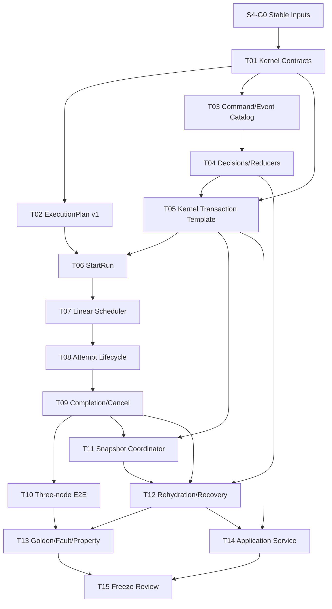

# Agentic Workflow 步骤 4 任务拆分

| 文档属性 | 值 |
| --- | --- |
| 文档版本 | 1.0 |
| 状态 | Completed / Stable 1.0 |
| 规划日期 | 2026-07-17 |
| 来源规划 | `agentic-workflow-implementation-plan.md` 1.0 |
| 输入基线 | Step 1 Contracts 1.0、WorkflowIR Stable 1.0、Persistence Stable 1.0 |
| 对应范围 | 步骤 4：Deterministic Runtime Kernel 与三节点线性 Workflow |
| 参考投入 | 4–6 person-weeks，约 29.5 person-days |

## 1. 阶段目标

实现唯一有权推进新 Workflow Runtime 状态的确定性 Kernel，并跑通最小线性 Workflow：

```text
Published WorkflowVersion
  -> StartRun Command
  -> committed ExecutionPlan v1
  -> first NodeRun ready
  -> Attempt created -> leased -> running
  -> CompleteAttempt / FailAttempt
  -> next NodeRun or Run terminal state
```

每个成功 Command 必须遵循同一提交路径：

```text
Command Envelope
  -> Payload Schema Validation
  -> Receipt Lookup (idempotency has precedence)
  -> Primary Aggregate Expected Version Check
  -> State/Plan Preconditions
  -> Pure Decision
  -> Events + Projection Reactions
  -> Receipt
  -> Atomic Commit
  -> optional deduplicated post-commit Snapshot
  -> CommandResult
```

完成后，三节点线性 Workflow 可以从 `created` 确定性推进到 `succeeded`；相同 Command 跨重启重放只返回原 Event IDs，不重复创建 NodeRun、Attempt 或下游调度。

## 2. 范围边界

### 2.1 本阶段负责

- Kernel Command、Command Payload、CommandResult 和稳定拒绝语义。
- `StartRun`、`ScheduleNode`、`StartAttempt`、`CompleteAttempt`、`FailAttempt`、`CancelRun`。
- ExecutionPlan v1 的静态实例化、Schema、Codec、Hash 和不可变提交。
- WorkflowRun、NodeRun、Attempt 的纯 Reducer 与 Projection 反应。
- 单链、无条件、无分支、无循环的线性 Scheduler。
- 最小输入准备与内联 JSON 输出提交。
- Completion/Failure/Cancel Evaluator。
- Command Receipt、Expected Version、跨 Aggregate 原子反应。
- Snapshot Post-Commit Coordinator 和 level-triggered 去重。
- Event-only 与 Snapshot+Tail 的 Runtime View 重建。
- 内存执行驱动，用于模拟三节点 Handler 完成，不作为生产 Handler SDK。
- Golden、属性、并发、重启、故障注入和依赖边界测试。

### 2.2 本阶段不负责

- Job、Lease、DurableTimer、Worker、Backoff 或崩溃回收；属于 Step 5。
- 正式 Handler SDK、Agent/Tool CLI 调用、流式 Usage；属于 Step 6。
- Artifact 内容、Lineage、Secret 或大输出；属于 Step 7。
- 条件边、BranchToken 路由、并行、Join、Retry、Rework 或异常路由；属于 Step 8。
- Planner、PlanPatch、动态 ExecutionPlan、Policy、Budget 或 HumanTask。
- HTTP/UI Runtime API；本阶段只提供 Application Service。
- 修改旧 `server.py` 工作流引擎的行为或迁移旧任务。
- 新数据库表。Step 4 必须使用 Migration v2 已冻结的八张表。
- 对不可信 Handler 执行代码或任何外部 I/O。

### 2.3 Step 4 支持的线性子集

ExecutionPlan v1 在本阶段只接受：

1. 从唯一 Entry 到 Terminal 的单链。
2. 每个非 Terminal 节点最多一个入边、一个出边。
3. 边不包含 Condition、Join、Retry、Rework 或 Error Route 语义。
4. 节点不包含 Agentic Region、Foreach 或 Subflow。
5. 节点 Handler 必须是 WorkflowVersion 中已解析的精确版本引用。

合法但超出此子集的 WorkflowIR 可以发布，但 Step 4 `StartRun` 必须以稳定的 `UNSUPPORTED_PLAN_SHAPE` 拒绝，不能静默忽略边或退化执行。

## 3. 开工前固定的设计决策

### 3.1 Kernel 是唯一写入口

- API、测试驱动、未来 Worker 和 Handler 只能提交 Command，不能直接更新 Repository。
- Kernel 只依赖 Domain Contract、WorkflowVersion Reader、Persistence Ports、Reducer、Clock/ID Policy 和结构化 Logger。
- Kernel 不 import SQLite，不调用旧 `Store` 或旧 `server.py` 的调度函数。
- Repository 不决定业务状态，Reducer 不访问 Repository，Application Service 不复制状态机。

### 3.2 Primary Aggregate 与 Secondary Reactions

现有 Frozen `CommandEnvelope` 只携带一个 `aggregate_id` 和一个 `expected_version`。Step 4 固定以下解释：

- Command 的 `aggregate_id` 是 Primary Aggregate，调用方只对它提供 Expected Version。
- Kernel 可以在同一 `BEGIN IMMEDIATE` 事务内产生确定性的 Secondary Reactions，例如：
  - `StartAttempt` 主体为 NodeRun，同时创建 Attempt 并推进 NodeRun。
  - `CompleteAttempt` 主体为 Attempt，同时推进 NodeRun、创建下一个 NodeRun，或终结 Run。
  - `CancelRun` 主体为 WorkflowRun，同时取消当前 NodeRun/Attempt。
- Secondary Aggregate 的当前 Version 由 Kernel 在事务内读取；Event 必须从对应 Stream Head + 1 连续追加，Projection 必须 CAS 到新的 Stream Head。
- Secondary Reaction 必须是 Command Type、已提交 Plan 和当前状态的纯函数，调用方不能在 Payload 中指定任意副作用 Aggregate。
- 任一 Secondary Reaction 冲突或失败，Primary Event、全部 Projection、Receipt 和下游创建全部回滚。

这一规则不扩展 Command 的权限范围，只解决单个业务事实需要原子维护多个 Aggregate 投影的问题。

### 3.3 幂等优先于并发

- Kernel 进入事务后先按 `(aggregate_id, idempotency_key)` 查询 Receipt。
- 相同 Key + Fingerprint 直接返回原 Event IDs，即使 Command 的 Expected Version 已经过期。
- 相同 Key + 不同 Fingerprint 返回 `IDEMPOTENCY_CONFLICT`。
- Receipt 未命中时才比较 Primary Aggregate Expected Version。
- Command 成功但响应丢失时，调用方使用同一 Command ID/Key/Payload 重试；不得生成新 Idempotency Key。

### 3.4 确定性 ID 与时间

- Kernel 不调用 `datetime.now()`、`uuid4()`、随机数或外部服务。
- Command ID、Issued At、Actor 和 Correlation ID 由调用边界提供。
- Plan ID、NodeRun ID、Attempt ID 和 Event ID 由稳定 Derivation Policy 生成，例如 `sha256(command_id + semantic_role + ordinal)`。
- 同一 Command、相同前置状态和相同 Plan 必须产生相同的逻辑决定、实体 ID、Event ID、Payload 和顺序。
- Event `occurred_at` 使用 Command `issued_at`；未来 Worker 观测时间作为显式 Command Payload 输入，不由 Reducer读取时钟。

### 3.5 ExecutionPlan v1

- `StartRun` 从一个已发布且 Hash 校验通过的 WorkflowVersion 实例化 Plan v1。
- Plan v1 是对 WorkflowIR 的运行期不可变投影，至少包含：Workflow Binding、Entry、Terminal、按拓扑顺序的节点、精确 Handler Ref、端口/Mapping、线性 Successor Index 和 Plan Schema Version。
- Kernel 只执行已经在 `execution_plans` 提交成功的 Plan；不得执行临时内存 Plan。
- Plan v1 的 Definition Hash 只覆盖 Canonical Plan，不复用 WorkflowIR Hash。
- Step 4 只创建 `plan_version = 1`；PlanPatch 和更高版本由 Step 10 定义。

### 3.6 Command 与 Event 边界

建议的主 Aggregate：

| Command | Primary Aggregate | 主要结果 |
| --- | --- | --- |
| StartRun | 新 WorkflowRun | 创建 Run、Plan v1，Run `created -> running`，调度首节点 |
| ScheduleNode | 新 NodeRun | 创建 NodeRun，`pending -> ready` |
| StartAttempt | NodeRun | NodeRun `ready -> running`，创建 Attempt 并依次 `created -> leased -> running` |
| CompleteAttempt | Attempt | Attempt `running -> succeeded`，NodeRun `running -> succeeded`，调度下一节点或 Run `running -> succeeded` |
| FailAttempt | Attempt | Attempt `running -> failed`，NodeRun `running -> failed`，Run `running -> failed` |
| CancelRun | WorkflowRun | Run 和所有非终态 NodeRun/Attempt 进入 `cancelled` |

`ScheduleNode` 是 system-only Command：恢复协调器或 Kernel 内部调用方可以提交它，但普通 Handler/API 不得任意调度节点。StartRun 与 CompleteAttempt 不开启嵌套 Kernel/UoW，而是在同一 Kernel/UoW 内复用调度规则作为当前 Command 的 Secondary Reaction；这些 Event 的 Causation 仍是外层 StartRun/CompleteAttempt Command。该调度规则在 Step 4 尚未抽成独立纯 Decision 函数，见 13.6。

Step 4 不允许为了省事跳过 Frozen 中间状态。例如内存执行驱动的 Attempt 仍必须记录 `created -> leased -> running`，即使 Step 5 尚未实现真实 Lease。

状态转换 Event 使用 Step 1 已定义的 Transition Contract；Plan/输入/输出等非状态事实使用独立、版本化 Event Schema。Event Catalog 必须在 Kernel 启动前注册并 Seal。

### 3.7 Reducer 与 Projection

- Decision 产生 Event；Reducer 只根据 Event 计算 Aggregate State；Repository 只保存 Reducer 结果。
- WorkflowRun、NodeRun、Attempt 分别有独立 Reducer，禁止一个 Reducer 查询其他 Aggregate。
- RunView Reducer 可以按 Global Position 聚合跨 Aggregate Timeline，但不能成为 Command 决策的隐藏事实来源。
- Kernel 在提交前断言 Projection Version 等于新 Stream Head。
- Replay 不调用 Scheduler、Handler、Clock、ID Factory、Logger 或 Snapshot Writer。

### 3.8 线性调度与 Completion

- `StartRun` 原子创建第一个 NodeRun；不允许出现 Running Run 没有首节点的半提交状态。
- `CompleteAttempt` 根据已提交 Plan 的 Successor Index 至多创建一个下游 NodeRun。
- 最后一个可执行节点成功后，Kernel 将 Run 原子推进到 `succeeded`。
- 任一节点在 Step 4 失败，Run 直接 `failed`；不 Retry、不 Rework。
- Terminal IR 节点不创建 Attempt；它由 Completion Evaluator 表示流程边界。
- 重复 CompleteAttempt 必须 Receipt 命中，不得创建第二个下游 NodeRun。

### 3.9 输入与输出

- 本阶段只允许符合注册 Schema 的内联 JSON `Value`，并受 Event Payload 1 MiB 限制。
- 输入由 Plan Mapping 和前序成功 Event 的输出确定性生成。
- Handler/测试驱动不能传入任意 NodeRun ID 或覆盖 Plan Mapping。
- Attempt 输出作为版本化 Event Payload 提交，并参与下游输入准备。
- 大内容、二进制、ArtifactRef、Secret 和 Lineage 均拒绝或推迟到 Step 7。

### 3.10 Snapshot 是 Post-Commit 优化

- Snapshot 不进入业务 Command 事务；业务 Commit 成功后才评估 Snapshot Policy。
- `SnapshotPolicy.should_snapshot` 对 waiting/终态是 level-triggered 恒真建议。
- Snapshot Coordinator 必须比较最新兼容 Snapshot 的 `last_global_position`；Cursor 未前进时不得重复写入。
- 状态触发 Snapshot 还要记录/比较上次已快照状态转换；同一 Cursor、同一状态最多一份。
- Snapshot 失败只记录诊断，不把已成功 Command 改写为失败。

### 3.11 拒绝与诊断

- 成功 Command 才写业务 Event 和 Receipt。
- Schema 错误、未知 Command、非法转换、Plan Shape 不支持、Expected Version 冲突和 Policy 前置条件失败返回稳定 `KernelDiagnostic`。
- Stale Expected Version 无法安全追加到目标 Stream，因此拒绝不写 `command_rejected` Event。
- 本阶段“留下诊断记录”定义为稳定 CommandResult + 结构化 Logger 记录；持久化运维诊断表属于 Step 12，不能为此提前建 Draft 表。
- Logger 失败不得改变业务事务结果，日志不得包含 Secret。

### 3.12 Attempt 的 Run 归属

`node_attempts` 没有 `run_id` 是 Step 3 固定的规范化设计。Kernel 所有 Run 级 Attempt 查询和取消必须通过 `node_attempts -> node_runs` Join 或 Repository Port 完成，不得修改 Migration v2 增加冗余列。

## 4. 前置门槛

### S4-G0：确认 Step 2/3 输入可用

**状态**：Completed。

**验收标准**：

1. Step 2 为 `Completed / Stable 1.0`，可按 ID/Version 读取并验证 WorkflowVersion。
2. Step 3 为 `Completed / Stable 1.0`，Migration v2、UoW、Event、Receipt、Snapshot、Replay 和 Integrity 测试通过。
3. 全量测试基线为 378 tests 通过。
4. Build-vs-Buy ADR 继续选择自研本地单机 Durable Kernel 分支。
5. Step 4 不需要 Migration v3；如实现发现必须建表，先停止并提交范围 ADR。

## 当前进度

| 范围 | 状态 | 当前结果 |
| --- | --- | --- |
| S4-G0 | Completed | Step 2/3 Stable 输入和全量测试基线已确认 |
| S4-T01–T03 | Completed | Kernel/Logger/Snapshot Ports、CommandResult、ExecutionPlan v1、Command/Event Schema 和确定性 ID 已固定 |
| S4-T04–T06 | Completed | Aggregate/RunView Reducer、统一 Dispatcher、Receipt First 和原子 StartRun/Plan/首节点已实现 |
| S4-T07–T10 | Completed | 线性 Scheduler、Attempt 生命周期、Completion/Failure/Cancel 和三节点内存驱动已实现 |
| S4-T11–T12 | Completed | Post-Commit Snapshot Cursor 去重、Event-only/Snapshot+Tail Recovery 和 Projection 验证已实现 |
| S4-T13–T15 | Completed | Golden Timeline、并发/故障/重启测试、Application Service 和冻结评审已完成 |

## 5. 任务总览

| 任务 | 内容 | 参考投入 | 依赖 |
| --- | --- | ---: | --- |
| S4-T01 | 固定 Kernel Ports、CommandResult 与错误边界 | 2 pd | G0 |
| S4-T02 | 定义 ExecutionPlan v1 Schema 与 Instantiator | 2 pd | T01 |
| S4-T03 | 定义 Command/Event Catalog 与确定性 Factory | 2 pd | T01 |
| S4-T04 | 实现 Aggregate State、Decision 与 Reducer | 3 pd | T03 |
| S4-T05 | 实现 Kernel Dispatcher、幂等与事务模板 | 3 pd | T01、T03、T04 |
| S4-T06 | 实现 StartRun 与 Plan 原子提交 | 2 pd | T02、T05 |
| S4-T07 | 实现 ScheduleNode 与线性 Scheduler | 2.5 pd | T02、T05、T06 |
| S4-T08 | 实现 Attempt 生命周期和输入输出提交 | 3 pd | T05、T07 |
| S4-T09 | 实现 Completion、Failure 与 Cancellation | 2 pd | T07、T08 |
| S4-T10 | 实现内存执行驱动和三节点端到端流程 | 1.5 pd | T08、T09 |
| S4-T11 | 实现 Snapshot Post-Commit Coordinator | 1.5 pd | T05、T09 |
| S4-T12 | 实现 Runtime Rehydration、恢复扫描与诊断 | 1.5 pd | T04、T09、T11 |
| S4-T13 | 建立 Golden、属性、并发与故障测试 | 2.5 pd | T06–T12 |
| S4-T14 | 提供 Runtime Application Service | 1 pd | T05–T12 |
| S4-T15 | 阶段评审、冻结与滚动估算 | 1 pd | T01–T14 |

总参考投入约 29.5 person-days，位于主规划 4–6 person-weeks 上沿。估算包含机制测试和故障注入，不包含 Step 5 Worker、Step 6 Handler SDK、HTTP/UI 或旧引擎迁移。

## 6. 详细任务

### S4-T01：固定 Kernel Ports、CommandResult 与错误边界

**目标**：让 Kernel 不依赖 SQLite、旧引擎或不稳定调用约定。

**工作内容**：

1. 定义 `RuntimeKernelPort.handle(command) -> CommandResult`。
2. 定义 immutable `CommandResult`：Disposition、Result Event IDs、Primary Version、Run/Node/Attempt 摘要和 Diagnostics。
3. 定义 `KernelDiagnostic`：稳定 Code、Category、Message、JSON Path、Aggregate ID、Expected/Actual Version 和 Retryable。
4. 为六种 Command 定义类型化 Payload，不允许 Kernel 内使用自由 Dict 分支。
5. 补全 `UnitOfWorkPort`：Runs、Plans、NodeRuns、Attempts、Tokens、Events、Receipts、Snapshots 和 Commit/Rollback。
6. 定义 `CommandReceiptStorePort`、`WorkflowVersionReaderPort`、`RuntimeLoggerPort` 和 Snapshot Coordinator Port。
7. 明确 Step 1 纯并发错误与 Step 3 Adapter 错误的映射；不删除 Frozen 类型，Kernel Boundary 统一转换为稳定 Diagnostic Code。
8. 定义 Not Found、Already Terminal、Unsupported Command、Invalid Transition 和 Corrupt Projection 语义。
9. 建立 Import Boundary Test：`runtime/domain` 不 import SQLite、Starlette、旧 Store/Server、subprocess 或网络库。
10. 更新 Contract Stability Matrix；本阶段新增 Runtime Command/Event 为 Stable，Application Service 为可演进接口。

**交付物**：Kernel Ports、CommandResult、Diagnostic Registry、依赖边界测试。

**验收标准**：Fake UoW 可以驱动 Kernel；Kernel 不知道数据库路径或 SQLite Connection；所有拒绝都映射为唯一稳定 Code。

### S4-T02：定义 ExecutionPlan v1 Schema 与 Instantiator

**目标**：把 WorkflowIR 转换为 Kernel 唯一可执行、不可变的静态 Plan。

**工作内容**：

1. 定义 `execution-plan/1.0` JSON Schema 和 immutable Domain 类型。
2. 固定 WorkflowVersion Binding、Plan Version、Entry、Terminal、Node Index、Successor Index、Handler Ref、Port/Mapping 和拓扑序。
3. 实现 WorkflowIR → Plan v1 纯函数 Instantiator。
4. 实现 Linear Shape Validator，并返回精确 Node/Edge Path Diagnostic。
5. 拒绝条件边、分支、Join、Retry、Rework、Foreach、Subflow 和 Agentic Region。
6. 验证所有 Node/Edge 引用、Entry/Terminal 和拓扑序一致。
7. Canonical JSON 和 Definition Hash 使用 Step 1 规则。
8. Plan Codec Round-trip 后对象、Canonical JSON 和 Hash 不变。
9. UI/人类字符串表达式不进入 Runtime Plan；只接受 Step 2 已编译结构。
10. 建立一节点、三节点和非法非线性 Golden Fixture。

**交付物**：Plan v1 Domain、Schema、Instantiator、Shape Validator 和 Golden tests。

**验收标准**：同一 WorkflowVersion 在不同进程实例化出相同 Plan/Hash；非线性 IR 在任何持久化写入前被拒绝。

### S4-T03：定义 Command/Event Catalog 与确定性 Factory

**目标**：冻结 Kernel 的输入事实与输出事实表示。

**工作内容**：

1. 为六种 Command Payload 建立 Schema 和 Parser。
2. 固定 Command Type → Handler、Primary Aggregate Kind 和 Payload Schema 映射。
3. 定义状态转换 Event Payload：From、To、Reason、Plan/Node/Attempt Context。
4. 定义 Plan Instantiated、Node Scheduled、Input Prepared 和 Attempt Output Recorded 等非状态 Event。
5. 建立 Current Event Version Catalog 并在启动后 Seal。
6. 实现稳定 ID Derivation Policy；Domain Decision 不调用 UUID/Clock。
7. 固定每个 Command 的 Event Ordinal，禁止根据 Dict/Set 遍历顺序生成 Event。
8. Event `occurred_at`、Correlation 和 Causation 严格继承 Command Contract。
9. 对生成的 Command/Event 执行 Schema Validation 和大小限制。
10. Golden 固定六种 Command、成功 Event 序列和拒绝 Diagnostic。

**交付物**：Command/Event Schema、Catalog、Factory、ID Derivation 和 Golden fixtures。

**验收标准**：相同输入向量重复生成字节一致 Canonical Event；变更 Ordinal、Payload 或 Version 会使 Golden Test 明确失败。

### S4-T04：实现 Aggregate State、Decision 与 Reducer

**目标**：把业务决定和状态重建保持为无副作用纯函数。

**工作内容**：

1. 定义 WorkflowRunState、NodeRunState、AttemptState 和最小 RunViewState。
2. 实现每个 Aggregate 的 Initial State 和 Event Reducer。
3. 实现六种 Command 的纯 Decision 函数。
4. 所有转换调用 Frozen `validate_transition` / `transition_contract`。
5. Reducer 校验 Aggregate ID、Sequence、Event Type/Version 和必需 Payload。
6. Unknown Event、Future Version、缺失创建事实和非法顺序明确失败。
7. RunView Reducer 按 Global Position 聚合 Plan、Node、Attempt 和 Output 摘要。
8. Reducer 不调度新节点；Scheduler 只根据已提交 Plan 和 Decision 输入产生反应。
9. 使用 Replay Guard 阻断 Clock、Random、Filesystem、Network 和 Process 调用。
10. 建立 Event-only、Snapshot+Tail 和不同分页大小的状态等价属性测试。

**交付物**：Aggregate States、Decisions、Reducers、RunView Reducer 和属性测试。

**验收标准**：Projection 可由 Event-only Replay 重建；同一 Stream 重放结果稳定；Reducer 无外部调用。

### S4-T05：实现 Kernel Dispatcher、幂等与事务模板

**目标**：为所有 Command 提供唯一、可审计的原子执行框架。

**工作内容**：

1. Validate Envelope、Command Type、Aggregate Kind 和 Payload。
2. 打开单一 UoW；禁止 Command Handler 自行 Commit。
3. Receipt Lookup 先于 Expected Version 比较。
4. 加载并验证 Primary Aggregate Projection/Stream Head。
5. 调用纯 Decision，收集 Primary Events 与 Secondary Reactions。
6. 按稳定顺序执行：创建 Projection → Append Event → Reducer → CAS Projection → Plan/下游变更 → Receipt。
7. Commit 前验证所有 Projection Head、Event Causation、Plan Binding 和 Receipt Event IDs。
8. Duplicate Command 返回原 Event IDs，不再次调用 Decision、Scheduler 或 Snapshot Writer。
9. 将 Domain/Persistence 异常转换为 CommandResult Diagnostic；未知异常回滚并向调用方传播稳定 Internal Error。
10. Commit 后调用 Snapshot Coordinator；其失败仅记录诊断。
11. Logger 在事务外记录结果摘要，禁止记录完整 Secret/Input/Output。
12. 为每个事务 Kill Point 提供 Fault Hook。

**交付物**：RuntimeKernel、Command Registry、Transaction Template 和 Fake UoW contract tests。

**验收标准**：任何 Handler 都无法绕过模板；业务写只产生完整提交或完整回滚；重复命令无二次业务效果。

### S4-T06：实现 StartRun 与 Plan 原子提交

**目标**：从不可变 WorkflowVersion 创建可执行 Run，而不存在半绑定状态。

**工作内容**：

1. Validate StartRun Payload：Workflow ID、Version、Definition Hash 和初始 Input。
2. 读取并验证 WorkflowVersion；Hash 不一致明确失败。
3. 实例化并验证 Plan v1，拒绝非线性 Shape。
4. 创建 WorkflowRun Projection v0，Correlation Root 固定为 Run ID。
5. 追加 Run `created -> running` Event 并更新 Projection。
6. 使用该已提交 Event 作为 ExecutionPlan `created_event_id`，Append Plan v1。
7. 原子调度首个可执行 NodeRun；空流程直接由 Completion Evaluator 终结。
8. Receipt 覆盖 Run、Plan 和首节点的所有 Result Event IDs。
9. 重复 StartRun 返回同一 Plan/Node/Event IDs。
10. WorkflowVersion 在 Run 启动后发布新版本，不影响现有 Run Binding。

**交付物**：StartRun Handler、Plan Commit 和 Binding tests。

**验收标准**：Run 永远绑定启动时版本；数据库中不出现无 Plan 的 Running Run；重复 Start 不创建 Plan v2 或第二个首节点。

### S4-T07：实现 ScheduleNode 与线性 Scheduler

**目标**：为静态单链确定性创建且仅创建一个下一节点。

**工作内容**：

1. 根据 Plan Node Index 校验 Node ID 和 Source Plan Version。
2. NodeRun ID 由 Run、Plan Version、Node ID 和 Activation Ordinal 确定性派生。
3. 创建 NodeRun Projection v0。
4. 追加 `pending -> ready` Event 并更新 Projection。
5. 输入准备只读取前序成功 Output Event 和 Plan Mapping。
6. `StartRun` 调度 Entry 后第一个执行节点；`CompleteAttempt` 调度唯一 Successor。
7. Terminal 不创建 NodeRun/Attempt。
8. 已存在相同派生 NodeRun 时，只有同一 Command Receipt 可以重放；其他路径视为 Integrity Violation。
9. Scheduler 不递归执行节点，不调用 Handler，不打开嵌套 UoW。
10. 建立一节点、三节点、缺失 Successor 和篡改 Plan tests。

**交付物**：LinearScheduler、ScheduleNode Handler 和 Node creation tests。

**验收标准**：任一成功节点至多创建一个下游 NodeRun；节点顺序严格等于 Plan 拓扑单链。

### S4-T08：实现 Attempt 生命周期和输入输出提交

**目标**：在没有 Durable Worker 的前提下完整验证 Attempt 状态与数据提交语义。

**工作内容**：

1. StartAttempt 只接受 `ready` NodeRun。
2. Attempt Number 在 Step 4 固定为 1；Retry 到 Step 8 实现。
3. 创建 Attempt v0，并依次记录 `created -> leased -> running`。
4. 同事务将 NodeRun `ready -> running`。
5. Leased 仅为 Step 4 内存驱动的状态占位，不创建假 Lease Row/Token。
6. CompleteAttempt 只接受 `running` Attempt，并验证 Output Schema。
7. Output Recorded Event 先于 Attempt/Node 成功终态，Event Ordinal 固定。
8. CompleteAttempt 同事务推进 Attempt、Node，并调用 Scheduler/Completion。
9. FailAttempt 记录结构化 ErrorInfo，推进 Attempt、Node 和 Run 为 failed。
10. 不在失败后创建 Retry Attempt；Unknown External Result 留给 Step 6/9 场景。
11. Attempt Run 归属通过 NodeRun Repository Join 获取。
12. Output 超过 Event 限制或需要 Artifact 时返回稳定 `ARTIFACT_REQUIRED`。

**交付物**：Start/Complete/Fail Attempt Handlers、Input/Output Mapper 和 lifecycle tests。

**验收标准**：Attempt 不跳过中间状态；输出和终态同事务；失败不会调度下游。

### S4-T09：实现 Completion、Failure 与 Cancellation

**目标**：确定性收敛 Run，不留下无法解释的活动投影。

**工作内容**：

1. 最后一个执行节点成功后 Run `running -> succeeded`。
2. 一节点和零执行节点 Workflow 具有明确完成路径。
3. FailAttempt 导致 Node/Run failed；Step 4 不做 Retry/Rework。
4. CancelRun 支持 created/running/waiting 等 Frozen 合法来源。
5. Cancellation 按稳定顺序取消活动 Attempt、NodeRun，最后更新 Run 或按已冻结转换顺序执行。
6. 已终态 Run 的 Cancel 返回稳定 Already Terminal Diagnostic，不追加 Event。
7. Completion Evaluator 只读取 Plan 和已提交 Projection/Event，不依赖 UI 状态。
8. 成功 Run 不得存在 ready/running NodeRun 或非终态 Attempt。
9. 失败/取消 Run 的残余活动对象由同事务收敛；不创建 Job/Timer。
10. 建立 success/failure/cancel terminal invariant tests。

**交付物**：CompletionEvaluator、Failure/Cancellation Handler 和 terminal invariant tests。

**验收标准**：所有路径收敛到 Frozen 终态；Completion 不会提前成功或重复终结。

### S4-T10：实现内存执行驱动和三节点端到端流程

**目标**：不引入 Step 5/6 基础设施，验证 Kernel 的完整业务闭环。

**工作内容**：

1. 实现 test-only InMemoryExecutionDriver。
2. Driver 只能构造并提交 StartAttempt/CompleteAttempt/FailAttempt Command。
3. Driver 不直接访问 Repository，不持有 SQLite Connection。
4. Handler Fixture 为纯函数：Input Value → Output Value 或 ErrorInfo。
5. 跑通 `collect -> transform -> publish -> terminal` 三节点 Workflow。
6. 验证每一步 Input 来自前序 Output Mapping。
7. 注入第二节点失败，验证无第三节点且 Run failed。
8. 在每个 Command 后关闭并重开 Application Service，验证仍可继续。
9. 重复投递每个 Command，最终 Event/Projection 数量不变。
10. 明确 Driver 不进入生产 Export，不伪装 Durable Worker。

**交付物**：InMemoryExecutionDriver、三节点 Fixture 和端到端 tests。

**验收标准**：三节点流程从 created 到 succeeded；逐 Command 重启和重复投递不改变最终状态。

### S4-T11：实现 Snapshot Post-Commit Coordinator

**目标**：安全使用 Snapshot 加速，而不因 level-triggered Policy 产生快照风暴。

**工作内容**：

1. 业务 Commit 后读取最新 Compatible Snapshot 和 Run Event Head。
2. 调用 SnapshotPolicy 判断 Event 数/状态条件。
3. Cursor 未前进时直接 No-op。
4. waiting/终态重复扫描同一 Cursor/状态只生成一份 Snapshot。
5. Snapshot Sequence 从最新 Snapshot + 1 派生并以独立 UoW Append。
6. Snapshot State 通过 Step 3 `rehydrate_run_view` 从 Compatible Snapshot + Tail 产生；Tail 必须经过与 Recovery 相同的 UpcastingEventReader，禁止从位置 0 全量物化或复制未提交内存对象。
7. Snapshot Conflict、Corruption 或写失败记录 Diagnostic，不改变 CommandResult 成功事实。
8. Duplicate Command Receipt Replay 不触发新 Snapshot。
9. 并发 Coordinator 最多提交一个相同 Cursor 的 Snapshot；必要时在应用层重新检查。
10. 建立 N Event、waiting 恒真、terminal 恒真、重复扫描和故障 tests。

**交付物**：SnapshotCoordinator、Dedup tests 和 post-commit fault tests。

**验收标准**：相同 Cursor/状态重复 100 次最多一份 Snapshot；删除 Snapshot 后 Event-only 恢复不变。

### S4-T12：实现 Runtime Rehydration、恢复扫描与诊断

**目标**：让 Application Service 重启后能解释并继续未终态线性 Run。

**工作内容**：

1. 注册 Aggregate Reducer 和 RunView Reducer Version。
2. 使用 Step 3 Rehydrator 加载 Event-only 或 Snapshot+Tail 状态。
3. 比较重建 State 与 Projection；不一致返回 Integrity Diagnostic，禁止继续推进。
4. 恢复扫描只查询非终态 Run，Attempt 通过 NodeRun Join 定位。
5. 对 Running Node/Attempt 不擅自重执行外部效果；Step 4 内存驱动由调用方显式继续。
6. 对 Running Run 且无活动 Node 的情况验证 Plan/Completion，能确定推进才提交新的内部 Command。
7. Unknown/Future Event Version、Missing Plan、Hash Drift 和 Corrupt Projection 明确阻断。
8. Snapshot 不兼容/损坏自动回退 Event-only，并带 Diagnostic。
9. 恢复扫描有稳定分页，不一次物化所有 Run。
10. 建立每个 Command 边界重启的 Golden Recovery tests。

**交付物**：RuntimeRehydrator、RecoveryScanner、Projection Verifier 和 recovery tests。

**验收标准**：任一已提交 Command 后重启都可重建相同状态；不确定的运行中外部结果不会被自动重复执行。

### S4-T13：建立 Golden、属性、并发与故障测试

**目标**：冻结 Runtime 机制语义并验证原子边界。

**工作内容**：

1. Golden：六种 Command、Event 序列、Plan v1、三节点完整 Timeline、Expected State/Hash。
2. Property：Replay 分页不变、Duplicate Command 不变、Terminal 无活动对象、Event Sequence 连续。
3. Concurrency：相同 Expected Version 两 Command 仅一个成功。
4. Concurrency：相同 Key/Fingerprint 返回同结果；相同 Key/不同 Fingerprint 冲突。
5. Fault：Primary Event 前后、Secondary Event 前后、Projection CAS 前后、Plan Append、下游 Node Create、Receipt、Commit 前。
6. Fault：业务 Commit 后 Snapshot 前后，验证业务事实不回滚。
7. Restart：每个 Command 后关闭 Connection/Service，再继续到终态。
8. Tamper：Plan Hash、Projection Version、Event Payload/Version、Workflow Binding。
9. Replay Guard：Reducer、Plan Instantiator、Scheduler、Input Mapper 无外部调用。
10. Contract：Memory/SQLite UoW 的 Kernel 行为一致。
11. Dependency：Runtime Domain 不 import Persistence Adapter、旧 Engine 或 Web Framework。
12. 全量 Step 1–3 Golden 与项目测试持续通过。

**交付物**：`tests/fixtures/workflow_runtime/v1/`、fault matrix、property/concurrency/restart tests。

**验收标准**：所有 Kill Point 只有完整提交或完整回滚；改变 Event Ordinal、Plan Hash、Completion 或幂等优先级会使测试明确失败。

### S4-T14：提供 Runtime Application Service

**目标**：为 Step 5 Worker 和后续 API 提供单一调用入口。

**工作内容**：

1. 实现 `RuntimeApplicationService.submit(command)`。
2. 实现类型化便捷方法，但它们最终必须构造同一 CommandEnvelope。
3. 提供 Get Run/Timeline/Plan 的只读 Query API，不暴露 Connection。
4. 提供 Resume Scan API，使用稳定 Run Cursor。
5. 返回 CommandResult，不泄漏 sqlite3 Error、MappingProxy 或内部 Record。
6. Application Service 不执行 Handler，不循环 Poll，不启动线程。
7. 定义未来 Step 5 Worker 只依赖的最小 Kernel Port。
8. 暂不增加 CLI/HTTP；测试直接调用 Service。

**交付物**：RuntimeApplicationService、Query DTO 和 API contract tests。

**验收标准**：调用者无需了解 Repository/UoW；所有写路径最终进入同一个 Kernel Dispatcher。

### S4-T15：阶段评审、冻结与滚动估算

**目标**：确认 Step 4 可以作为 Step 5–8 的唯一状态推进基础。

**工作内容**：

1. 逐项检查 Step 4 完成定义。
2. 审查 Command Primary/Secondary Aggregate 事务语义。
3. 审查 Plan Binding、Hash、Linear Shape 和只执行已提交 Plan。
4. 审查 Reducer/Scheduler/Input Mapper 纯函数边界。
5. 审查 Duplicate CompleteAttempt 不重复下游节点。
6. 审查 Failure/Cancel/Completion 终态不变量。
7. 审查 Snapshot 去重和 Post-Commit 失败语义。
8. 运行 Contract、Golden、Property、Concurrency、Fault、Restart、Integrity 和全量测试。
9. 生成 Step 4 Completion Record。
10. 滚动重估 Step 5、6、7、8、9 和 10；重点记录 Step 5 如何替换内存 leased 占位为真实 Job/Lease。

**交付物**：评审记录、Completion Record、冻结清单和更新估算。

**验收标准**：三节点线性 Workflow 和所有故障边界通过；Step 5 不需要绕过 Kernel 即可接入 Worker。

## 7. 依赖与并行安排



可以并行：

- T02 Plan v1 与 T03 Command/Event Catalog 在 T01 后并行。
- T04 Reducer 与 T05 事务模板前半段可以并行，但 Dispatcher 集成等待 Reducer Contract。
- T11 Snapshot Coordinator 可与 T08 Attempt 主线并行，最终测试等待 T09。
- T12 Recovery 的 Event-only 路径可在 T09 前启动，最终恢复矩阵等待完整生命周期。
- T13 Golden Fixture 从 T02/T03 开始持续建设，不在最后一次性补。

不可绕过：

- CommandResult/Error Mapping 未固定前不得写 Dispatcher。
- Plan v1 未提交前不得调度首节点。
- Receipt 未与全部 Secondary Reactions 同事务前不得实现 CompleteAttempt 下游调度。
- 三节点线性流程未通过前不得开始 Step 5 Worker 主线。
- Snapshot Cursor 去重未通过前不得在恢复扫描中自动触发 Snapshot。
- 不得通过修改旧 `server.py` 复用其隐式状态推进逻辑。

## 8. 建议执行批次

| 批次 | 任务 | 阶段产物 |
| --- | --- | --- |
| A | G0、T01、T02、T03 | Kernel Contract、Plan v1、Command/Event Catalog |
| B | T04、T05、T06 | Reducer、Dispatcher、StartRun/Plan Commit |
| C | T07、T08、T09 | Linear Scheduler、Attempt、Completion/Cancel |
| D | T10、T11、T12 | 三节点 E2E、Snapshot 去重、Recovery |
| E | T13、T14、T15 | Golden/Fault、Application Service、冻结评审 |

## 9. 实际代码与 Fixture 布局

```text
src/orbit/workflow/
├── domain/
│   ├── runtime.py
│   ├── runtime_ports.py
│   └── execution_plan.py
├── runtime/
│   ├── kernel.py
│   ├── reducers.py
│   ├── events.py
│   ├── event_reader.py
│   ├── plan_instantiator.py
│   ├── snapshot_coordinator.py
│   ├── recovery.py
│   └── testing_driver.py
├── application/
│   └── runtime_service.py
tests/
├── fixtures/workflow_runtime/v1/
├── test_workflow_runtime.py
└── test_workflow_runtime_faults.py
```

依赖方向：

```text
domain runtime contracts
          ^
          |
runtime reducers/plan instantiator <- runtime kernel <- application service
          ^                            |
          |                            v
    WorkflowVersion Port        Persistence Ports/UoW
```

`domain/` 不 import `runtime/` 或 `persistence/`；Reducer/Plan Instantiator 不 import Adapter；Application Service 不复制 Kernel 规则。Scheduler、Completion、Input Mapping 在 Step 4 实际为 Kernel 私有方法，Step 8 开始前拆出纯 Decision 层。

## 10. Step 4 完成定义

只有同时满足以下条件，Step 4 才能标记完成：

1. 六种 Command 具有版本化 Payload Schema、稳定 Diagnostic 和 Golden Fixture。
2. ExecutionPlan v1 可由 WorkflowVersion 确定性实例化、Hash、Round-trip 并不可变提交。
3. Kernel 是所有新 Runtime 状态写入的唯一入口，不 import SQLite/旧 Engine。
4. Receipt Lookup 优先于 Expected Version；重复命令跨重启返回原 Event IDs。
5. Primary 与全部 Secondary Aggregate Event/Projection/Receipt 同事务。
6. Run 启动后永久绑定原 WorkflowVersion 和已提交 Plan v1。
7. StartRun 原子创建 Plan 和首 NodeRun，不存在 Running Run 无 Plan/首节点的半状态。
8. Attempt 严格经过 created、leased、running，再进入终态。
9. CompleteAttempt 重复提交不创建重复下游 NodeRun。
10. 三节点线性 Workflow 从 created 运行至 succeeded，输入输出 Mapping 正确。
11. FailAttempt 不调度下游并使 Run failed；CancelRun 收敛所有活动对象。
12. Event-only、Snapshot+Tail、分页 Replay 和重启恢复产生相同 Runtime State。
13. Snapshot Policy 对 waiting/终态重复恒真时，相同 Cursor/状态最多一份 Snapshot。
14. Reducer 和 Plan Instantiator 通过 Side-effect Guard；Step 4 Scheduler/Input Mapper 当前作为 Kernel 私有确定性方法，仅由 Golden、事务和故障测试间接约束，Step 8 扩展控制流前必须抽为独立纯 Decision 层并补独立 Side-effect Guard。
15. 所有 Kill Point 只产生完整提交或完整回滚；Snapshot 失败不回滚已提交业务事实。
16. Recovery 遇到未知外部结果、Projection Drift、Plan Hash Drift 或 Future Event 时明确阻断，不猜测执行。
17. Step 4 不增加数据库表，不修改 Migration v2，不给 `node_attempts` 冗余 `run_id`。
18. Step 1–3 Golden、Integrity 和项目全量测试继续通过。
19. Completion Record、冻结清单和滚动估算写入本文。

## 11. 主要风险与控制措施

| 风险 | 影响 | 控制措施 |
| --- | --- | --- |
| 单 Expected Version 无法覆盖跨 Aggregate 反应 | Complete/Cancel 出现竞态 | Primary Expected Version + 事务内 Secondary Head/CAS + 全部回滚 |
| Receipt 检查晚于并发检查 | 合法重试被错误 409 | Dispatcher 模板固定 Receipt First，并用 Golden/重启测试冻结 |
| StartRun 先创建 Run 后创建 Plan | Running Run 无可执行计划 | Run、Plan、首节点同一 UoW |
| Kernel 执行临时 Plan | Replay 与审计不一致 | 只接受已提交 ExecutionPlanRecord |
| 为测试跳过 Attempt leased | Step 5 无法接入 Frozen 状态机 | 内存驱动仍记录 created→leased→running |
| CompleteAttempt 重复调度 | 重复 NodeRun/外部效果 | Receipt + 确定性 ID + Node uniqueness/integrity check |
| Reducer 内隐式调度 | Replay 产生新副作用 | Reducer 纯函数，Scheduler 只在 Command Decision 阶段运行 |
| waiting/终态 Snapshot 恒真 | 重复 Snapshot 风暴 | 最新 Cursor/状态去重，Duplicate Receipt 不触发 Coordinator |
| Attempt 查询想当然使用 run_id | 错误 SQL 或破坏 v2 | Repository Join node_runs，文档和测试固定规范化设计 |
| 失败 Command 写拒绝 Event | Stale Version 无法安全追加 | 返回稳定 Diagnostic + Logger；持久诊断延后 Step 12 |
| Step 4 偷跑 Job/Handler 语义 | 后续 Lease/Unknown Result 返工 | test-only Driver，不建 Job/Lease，不调用外部进程 |
| 复用旧 server.py 推进逻辑 | 两套状态源和隐式兼容负担 | 新 Runtime 独立包和依赖边界测试 |
| Inline Output 变成隐形 Artifact Store | Event 膨胀、Secret 泄漏 | Schema/1 MiB 限制，明确 ARTIFACT_REQUIRED，Step 7 接管 |

## 12. 开始实现前的首批检查清单

1. 审查并固定 Primary/Secondary Aggregate 规则。
2. 补齐 UnitOfWork/Receipt/WorkflowVersion Reader Ports，不改 SQLite Schema。
3. 固定 CommandResult 和 Diagnostic Error Codes。
4. 固定 ExecutionPlan v1 Schema 与 Linear Shape 判定。
5. 固定确定性 ID Derivation 和 Event Ordinal。
6. 为三节点 Fixture 写出期望 Command/Event Timeline，再实现 Kernel。
7. 确认 Snapshot 去重测试先于 Recovery 自动扫描。
8. 确认 Step 5 接入点只依赖 Application/Kernel Port，不依赖内存执行驱动。

## 13. Step 4 Completion Record

### 13.1 冻结结果

Step 4 于 2026-07-17 完成并固定为 Stable 1.0。已实现：

- `ExecutionPlan` / `PlanNode` immutable Domain、`execution-plan/1.0` Schema、严格 Codec 和 Linear Instantiator。
- 六种 Runtime Command Payload Schema、六种 Runtime Event Payload Schema、Current Event Version Catalog 和确定性 ID/Event Ordinal。
- `RuntimeKernelPort`、`CommandResult`、`KernelDiagnostic`、Logger/Snapshot/WorkflowVersion/Persistence Ports。
- WorkflowRun、NodeRun、Attempt Aggregate Reducer 和跨 Aggregate RunView Reducer。
- Receipt First 的统一 Dispatcher，以及 Primary Aggregate + Kernel-owned Secondary Reactions 的单 UoW 提交。
- StartRun、system-only ScheduleNode、StartAttempt、CompleteAttempt、FailAttempt 和 CancelRun。
- Required Port/Schema Validator Hook、Identity/Map/Ref 输入 Mapping 和内联 Output Event。
- Snapshot Post-Commit Coordinator、Cursor/状态去重、RuntimeRecovery 和 Projection Verifier。
- RuntimeApplicationService 与 test-only InMemoryExecutionDriver。

Step 4 没有增加数据库表、没有修改 Migration v2、没有给 `node_attempts` 增加 `run_id`，也没有调用旧 `server.py` 工作流推进逻辑。

### 13.2 Golden 与测试记录

- Golden Fixture：`tests/fixtures/workflow_runtime/v1/three-node.json`。
- 固定三节点 Timeline 为 26 个 Event，包含 Plan/输入准备、Node/Attempt 转换、Output 和 Run Completion。
- 三节点 `collect -> transform -> publish -> terminal` 输出依次为 1、2、5，最终 Run 为 succeeded。
- Attempt 严格记录 `created -> leased -> running -> succeeded/failed`，未跳过 Step 5 将依赖的中间状态。
- Duplicate StartRun/CompleteAttempt 跨重启返回原 Event IDs，不重复创建 Plan、NodeRun、Attempt 或 Snapshot。
- 并发 CancelRun 使用相同 Expected Version 时只有一个成功。
- Fault Matrix 覆盖 Run Create、Event Append、Plan Append、Node Create、Attempt/Node Secondary Reaction、Receipt 和 Commit；所有失败均完整回滚。
- Snapshot 写失败不回滚已提交业务 Command；终态重复/并发扫描同一 Cursor 最多保留一份 Snapshot。
- SnapshotCoordinator 与 Recovery 共用 sealed UpcastingEventReader，并从 Compatible Snapshot Cursor 之后分页重放 Tail，不再进行每次从零全量重放。
- Aggregate Event-only Replay、RunView 分页 Replay、Snapshot+Tail 和删除 Snapshot 后 Replay 状态一致。
- Runtime Core Dependency Test 禁止导入 SQLite、Web Framework、旧 Store/Server、Network 或 Process API。
- Memory/SQLite UoW 运行相同 Kernel Command 的 Result、Event IDs、Timeline 和 Projection 一致。
- CompleteAttempt、FailAttempt、CancelRun 均覆盖 Event、Secondary Projection、Receipt/Commit 边界故障注入，失败后 Event 与全部 Projection 保持提交前状态。
- 最终全量回归为 396 项测试通过；`compileall` 与 `git diff --check` 均通过。

### 13.3 Step 5 接入约束

1. Step 5 Worker 只能通过 RuntimeApplicationService/RuntimeKernelPort 提交 Command。
2. 当前 InMemoryExecutionDriver 仅用于测试，禁止被 Worker import 或部署为生产执行器。
3. Step 5 用真实 Job/Lease 决定何时提交 StartAttempt，但不得改变 Attempt `created -> leased -> running` Event 语义。
4. Worker Complete/Fail 必须复用现有 Command Schema、Receipt First 和 Secondary Reaction 事务模板。
5. 外部结果未知时不得重提 CompleteAttempt；Step 5/6 必须按 Frozen `unknown_external_result` 语义处理。
6. Job/Lease/Timer 使用新的所属步骤 Migration，不能把运行信息塞入 Step 3/4 JSON Payload 规避契约评审。

### 13.4 滚动估算

- Step 5 保持 5–8 pw。Kernel 接口已经稳定，但真实 Job/Lease、Claim、续租、Lost、Timer 和故障注入仍是主要工作量。
- Step 6 保持 3–5 pw。Handler SDK 可直接产出 Complete/Fail Command，但仍需取消、Usage、Unknown Result 和可信边界。
- Step 7 保持 4–7 pw。Step 4 只接受内联 JSON；Artifact/Lineage/Secret 仍需独立原子提交设计。
- Step 8 保持 5–8 pw。当前 Plan/Scheduler 主动拒绝条件、并行、Retry 和 Rework，未提前实现其语义。
- Step 8 开始实现条件、分支、并行、Retry/Rework 前，必须把当前内联于 `kernel.py` 的 Scheduler、Completion 和 Input Mapper 抽成可脱离 UoW 单测的纯 Decision 层；UI 继续只生成结构化 AST。
- Step 9/10 估算不变。Planner/PlanPatch 只能生成新的已提交 ExecutionPlanVersion，不能绕过 Kernel 执行临时 Plan。

### 13.5 未扩展的边界

本阶段没有实现持久化拒绝诊断表、HTTP/UI、生产 Query DTO、Job、Timer、Artifact 或动态图。拒绝通过稳定 CommandResult 和 best-effort 结构化 Logger 暴露；持久化运维诊断仍属于 Step 12。Application Query 当前返回 Stable immutable Record，后续 HTTP 层必须映射为独立 View Model。

### 13.6 评审勘误与有意延期

- 原任务书要求六种 Command 各有独立纯 Decision 函数。Step 4 实际将线性 Scheduler、Completion 和 Input Mapping 合并为 Kernel 私有确定性方法，决策与 UoW 编排尚未物理解耦；因此不再声称已经交付完整纯 Decision 层。该拆分是 Step 8 的前置任务。
- S4-T12.6 的“Running Run 且无活动 Node 自动推进”在 Step 4 线性子集中不可达：StartRun 与首 Node、CompleteAttempt 与后继 Node/Run Completion 均在同一 UoW 原子提交。Step 4 不增加装饰性恢复分支；真正会产生等待态的 Job/Lease、Retry/Rework 接入后，由 Step 5/8 实现并用故障测试冻结。
- CancelRun 当前按 Repository 的稳定顺序（`created_at, node_run_id`）取消，不承诺 Plan 拓扑顺序；Step 8 引入并行图时重新定义拓扑取消语义。
