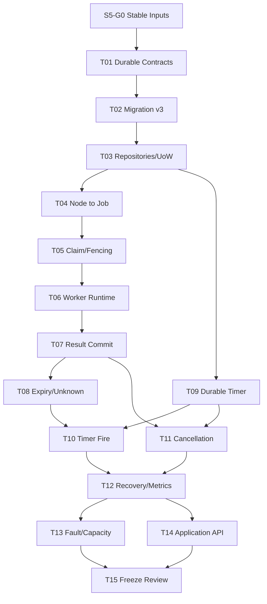

# Agentic Workflow 步骤 5 任务拆分

| 文档属性 | 值 |
| --- | --- |
| 文档版本 | 1.0 |
| 状态 | Completed / Stable 1.0 |
| 规划日期 | 2026-07-17 |
| 来源规划 | `agentic-workflow-implementation-plan.md` 1.0 |
| 输入基线 | Step 1 Contracts 1.0、Persistence Stable 1.0、Runtime Kernel Stable 1.0 |
| 对应范围 | 步骤 5：Durable Job、Lease、Timer 与 Worker Runtime |
| 参考投入 | 5–8 person-weeks，约 38 person-days |

## 1. 阶段目标

把节点执行和时间触发从 Kernel 事务中分离，同时保持 Kernel 是唯一可以推进业务状态和创建下游工作的入口：

```text
NodeRun scheduled
  -> Job ready
  -> Worker scans candidate
  -> ClaimJob Command
  -> Job leased + Lease active + Attempt created/leased
  -> StartJob Command
  -> Job running + Attempt running + NodeRun running
  -> ExecutorPort
  -> CompleteJob / FailJob Command
  -> Job/Lease/Attempt/NodeRun/Run atomic reaction
```

时间触发走同一套持久化机制：

```text
ScheduleTimer Command
  -> Timer scheduled
  -> TimerDispatcher scans due candidate
  -> ClaimTimer Command
  -> Timer leased
  -> FireTimer Command
  -> Timer fired + target reaction in one UoW
```

完成后，Worker 或进程在任一边界崩溃都不会丢 Job、重复推进 Run，过期 Lease 的迟到结果不能覆盖新 Attempt；服务重启后 Timer 仍可恢复并且相同 Fire 只产生一次目标反应。

## 2. 范围边界

### 2.1 本阶段负责

- Migration v3：`jobs`、`job_leases`、`durable_timers`。
- Job、Lease、Timer immutable Record、Repository Port、SQLite/Memory Adapter 和 UoW 接入。
- NodeRun ready 与 Durable Job 的原子创建。
- Job candidate scan、Claim、Start、Renew、Release、Expire、Complete、Fail 和 Cancel。
- Lease Bearer Token Hash、单调 Fencing Token 和迟到结果隔离。
- Worker 单次执行与可停止主循环，使用抽象 `ExecutorPort`。
- test-only Fake Executor；不执行真实 Tool、Agent CLI、网络或不可信代码。
- 运输层重新投递：Claim 前失败、Lease 丢失、已知未产生外部效果的执行失败。
- 运行中 Lease 丢失后的 `lost` / `unknown_external_result` 分类。
- 通用 DurableTimer 的 Schedule、Claim、Fire、Cancel、Deduplicate 和 Recover。
- 本阶段实际接线的 Timer Purpose：Job Backoff、Node Timeout、Lease Recovery。
- 为 Join Deadline、Planner Timeout、Human Reminder/Escalation、Run Deadline 预留版本化 Purpose/Payload 注册点；对应领域反应由后续步骤实现。
- CancelRun 向 Job、Lease、Timer 和 Worker Cancellation Token 的传播。
- Queue Depth、Oldest Ready Age、Lease Age、Timer Lag、Claim Conflict 和 Worker Heartbeat 指标。
- 并发、故障注入、重启、Clock Skew、容量和 Memory/SQLite Contract 测试。

### 2.2 本阶段不负责

- 正式 Handler SDK、Handler Registry、Tool/Agent/Transform Handler；属于 Step 6。
- 实际外部调用、子进程、网络请求、Secret 或 Usage 上报。
- Artifact、Blob、Lineage 或大输出；属于 Step 7。
- 业务错误 Retry、Workflow Retry Policy、Rework、条件边、Join 或并行；属于 Step 8。
- Planner Job、HumanTask Reminder/Escalation 的目标领域逻辑；只提供 Timer 基础设施。
- Unknown External Result 的自动重试。Unknown Attempt 是终态，必须等待后续人工/恢复策略创建新 Attempt。
- 分布式数据库、多项目共享队列或跨主机一致性。本阶段按单机、单项目 SQLite Runtime 设计，但所有 Claim 仍必须并发安全。
- Worker 自动发现具体 Handler。Step 5 只消费已注入的 `ExecutorPort`。
- 修改旧 `server.py` 的 runner、queue 或调度循环。

### 2.3 Retry 术语边界

本阶段把两种 Retry 严格分开：

| 类型 | 本阶段是否实现 | 语义 |
| --- | --- | --- |
| Transport Redelivery | 是 | Claim 前失败、Lease 过期或明确 replay-safe 的执行重新投递，不改变 Workflow 路由 |
| Business Retry | 否，Step 8 | Handler 已返回 transient/permanent 业务失败后，根据 Workflow Policy 创建新 Attempt |
| Rework | 否，Step 8 | 新建目标 NodeRun 并保留上一轮历史 |
| Unknown External Result Retry | 禁止 | 可能已产生外部效果，只进入 waiting/诊断，不自动重放 |

`Job.retry_wait` 在 Step 5 只表示运输层 Backoff，不能被解释为 Workflow Business Retry。

## 3. 开工前固定的设计决策

### 3.1 Kernel 与 Durable Execution 的权限边界

- Runtime Kernel 仍是唯一可以改变 Job/Attempt/NodeRun/Run/Timer 状态、创建 Attempt 或创建下游 Job 的组件。
- Candidate Scan 是只读操作；Application 层读到候选 Job/Timer 后提交带 Expected Version 的 Claim Command。多个 Worker 读到相同候选时只有一个 Claim 成功。
- Lease Renewal 是唯一允许不产生业务 Event 的写操作：它只延长当前 Active Lease 的 `expires_at`，必须校验 Lease Token Hash、Fencing Token、当前状态和 CAS Revision，不能修改 Job、Attempt、NodeRun 或 Run 状态。
- Lease Claim、Release、Expire 必须进入 Kernel Command/Event/UoW；Renewal 作为高频 Operational Metadata 不写 Event，避免心跳造成无界 Event 增长。
- Worker、TimerDispatcher、Executor 和 API 不直接调用 Repository 写方法。

### 3.2 Step 4 leased/running 占位的替换方式

Step 4 的 `InMemoryExecutionDriver` 会直接提交 `StartAttempt`，并在一个 Command 中记录 `created -> leased -> running`。Step 5 固定以下替换：

- 生产 `RuntimeApplicationService` 必须安装 Durable Work Scheduler；创建非 Terminal NodeRun 时，在同一 UoW 创建 Job ready。
- `ClaimJob` 创建新 Attempt 并推进 `created -> leased`，NodeRun 暂时保持 ready。
- `StartJob` 推进 Job `leased -> running`、Attempt `leased -> running`、NodeRun `ready/waiting -> running`。
- `StartAttempt`、`CompleteAttempt`、`FailAttempt` 保留为 Kernel 内部反应构件和 Step 4 conformance 测试入口；Durable Worker 不得直接提交它们。
- `InMemoryExecutionDriver` 继续是 test-only，不得出现在生产组合根。
- Step 4 的 26 Event Golden 保留为 Deterministic Kernel conformance；Step 5 另建包含 Job/Lease/Timer Event 的 Durable Timeline Golden。

### 3.3 Job 与 Attempt 的关联

- 一个 NodeRun 同一时刻最多有一个非终态普通执行 Job。
- Job 在 NodeRun ready 时创建，此时 `current_attempt_id = null`。
- 每次成功 Claim 创建新的 Attempt，Attempt Number 单调增加，并把 Job 的 `current_attempt_id` 指向它。
- Claim 后、Start 前 Lease 过期：Attempt `leased -> lost`，Job `leased -> ready`，NodeRun 保持 ready；下次 Claim 创建新 Attempt。
- Start 后 Lease 过期：
  - 明确 `replay_safe`：Attempt `running -> lost`，NodeRun `running -> waiting`，Job `running -> retry_wait`，Timer 到期后重新 ready。
  - 可能有外部副作用：Attempt `running -> unknown_external_result`，NodeRun `running -> waiting`，Job `running -> failed`；禁止自动创建新 Job/Attempt。
- Step 5 Fake Executor 默认 `replay_safe`。Step 6 Handler Registry 必须显式声明执行安全类别；未声明时默认 `unknown_on_lease_loss`。
- 外部调用幂等键按主规划固定为：`run_id + node_run_id + attempt_number`。它不能替代 Lease Fencing，也不能用于反查模型调用结果。

### 3.4 Lease、Token 与 Fencing

- `lease_id` 是公开标识；`lease_token` 是随机 Bearer Secret，只在 Claim Result 中返回一次，数据库只保存带版本标识的 Hash。
- 随机 Token 在 Application 边界生成，不由 Reducer 或 Kernel 隐式调用随机源。
- 每个 Job 的 `fencing_token` 从 1 单调递增；新 Claim 永远大于历史 Lease。
- Start、Complete、Fail、Renew、Release 必须同时提供 Lease ID、Bearer Token 和 Fencing Token。
- Claim 的初始 Lease TTL 由 Kernel 强制限制为最多 5 分钟；Application 或 Handler 声明的执行时长不能绕过该上限，长任务必须持续续租。
- Kernel Event、Snapshot、普通日志和 Metric 不得包含 Bearer Token。
- 旧 Worker 即使持有仍未过本地时间的 Token，只要数据库当前 Lease/Fence 已变化，其结果必须返回稳定 `STALE_LEASE`，且不写 Event/Receipt。
- Lease Expiry 只使用 Runtime 注入的权威 UTC Clock；Worker Payload 中的时间不能决定是否过期。

### 3.5 Job Claim 顺序

单机 SQLite 候选顺序固定为：

```text
priority DESC, available_at ASC, created_at ASC, job_id ASC
```

- Scan 必须分页且有上限，不能加载全部 ready Job。
- Claim 使用候选 Job 的 Expected Version；冲突后重新扫描，不在同一事务无限重试。
- `available_at > now` 的 Job 不可 Claim。
- Cancelled/terminal Run 的 Job 在 Claim 前必须被拒绝；恢复扫描负责收敛遗留 ready Job。
- SQLite `BEGIN IMMEDIATE` 保证单库写串行，但实现和测试不能依赖“通常只有一个 Worker”来证明正确性。

### 3.6 Durable Timer 语义

- Timer 是独立 Aggregate，不是进程内 `sleep`、线程或 asyncio Task。
- 唯一去重键：`(run_id, purpose, dedupe_key)`；不同 Idempotency Key 的重复 Schedule 返回 `REPLAYED`、原 Timer ID 与原 `timer_created` Event ID，不创建第二个 Timer 或伪造新 Receipt。精确 Idempotency Key 重放仍走 Command Receipt。
- Timer Payload 有独立 `purpose`、`payload_schema_version` 和大小上限；未来 Purpose 可以增量注册而不修改表结构。
- Timer Candidate 顺序：`due_at ASC, created_at ASC, timer_id ASC`。
- Claim 创建短期 Timer Lease Metadata 并推进 `scheduled -> leased`；Fire 推进 `leased -> fired` 并在同一 UoW 执行目标反应。
- 重复 Fire 使用 Command Receipt + Timer 状态双重去重。
- Timer 晚到仍记录实际 Fired At；目标状态已过期时 Timer 正常 fired，但目标反应记为 `obsolete/no-op`，不得回滚或复活终态对象。
- Clock 向后跳不能缩短已经发出的 Lease；Renew 以 `max(current_expires_at, authoritative_now) + extension` 计算并受最大 TTL 限制。
- Clock 向前跳会使更多 Timer/Lease 到期，这是可接受的 fail-safe 行为；故障测试必须覆盖。

### 3.7 Cancellation 语义

- CancelRun 与当前 NodeRun/Attempt 的取消反应中，必须在同一 UoW：
  - Job `ready/leased/running/retry_wait -> cancelled`
  - Active Lease `active -> released`
  - 未 Fired Timer `scheduled/leased -> cancelled`
- Worker 通过 Renewal/Heartbeat Response 和 CancellationToken 观察取消；Step 5 不承诺强杀线程或进程。
- Cancel 后到达的 Complete/Fail/Fire 一律返回 `STALE_LEASE` 或 `ALREADY_TERMINAL`，不能覆盖 cancelled。
- Cancelled Run 不得再由 Timer 或恢复扫描创建普通执行 Job。

### 3.8 Unknown External Result

- Lease 在 Start 前丢失属于 `lost`，可以安全创建新 Attempt。
- Lease 在 Executor 已开始后丢失且无法证明无副作用，属于 `unknown_external_result`，不是 transient failure。
- Unknown Attempt 永远不重新打开；后续恢复只能创建新的 Reconciliation/Manual Attempt，并建立因果关系。
- Step 5 不实现人工解决 UI，但必须让 Run 保持“有 waiting NodeRun 的可解释非终态”，并在恢复诊断中明确返回 `UNKNOWN_EXTERNAL_RESULT`。
- 迟到结果只能记录到结构化 Logger/审计诊断；不能成为业务 Event，也不能把 Unknown Attempt 改为 succeeded。
- Step 10 Budget Ledger 必须把 Unknown Attempt 按最终已知用量或预留上限结算；Step 5 先保留 Attempt/Job/Lease 关联和指标维度。

### 3.9 数据库 Migration v3

Migration v3 只创建确定性 Durable Execution 所需的三张表，不提前创建 Handler、Artifact、Planner 或 Human 表。

#### `jobs`

至少包含：

- `job_id`, `run_id`, `node_run_id`, `current_attempt_id`
- `job_kind`, `execution_safety`, `status`
- `priority`, `available_at`, `delivery_count`, `max_delivery_attempts`
- `aggregate_version`, `created_at`, `updated_at`

约束：一个 NodeRun 同时最多一个非终态普通执行 Job；Attempt 仍通过 NodeRun 归属 Run，不给 `node_attempts` 增加 `run_id`。

#### `job_leases`

至少包含：

- `lease_id`, `job_id`, `attempt_id`, `worker_id`
- `token_hash`, `token_hash_version`, `fencing_token`
- `status`, `acquired_at`, `expires_at`, `released_at`
- `aggregate_version`, `renewal_revision`

约束：一个 Job 同时最多一个 Active Lease；`(job_id, fencing_token)` 唯一；Renewal 只 CAS `renewal_revision/expires_at`。

#### `durable_timers`

至少包含：

- `timer_id`, `run_id`, `purpose`, `dedupe_key`
- `target_type`, `target_id`, `payload_schema_version`, `payload_json`
- `status`, `due_at`, `fired_at`
- Timer Lease 的 owner/token hash/fence/expires 字段
- `aggregate_version`, `created_at`, `updated_at`

约束：`(run_id, purpose, dedupe_key)` 唯一；Payload Canonical JSON；索引覆盖 due scan 和 run cancel。

### 3.10 Event、Snapshot 与 Replay

- 新增 Job/Lease/Timer Event 必须进入 Runtime Event Version Catalog 和 Schema Registry。
- RunView Snapshot 至少增加 `jobs`、`leases`、`timers` 摘要；Snapshot Schema/Reducer Version 必须升级，旧 Snapshot 自动忽略并从 Event Replay。
- SnapshotCoordinator 和 Recovery 继续共享同一个 UpcastingEventReader。
- Lease Renewal 不进入 Event/RunView；Recovery 读取 Lease Projection 的 operational expiry，并与最后状态 Event 核对。
- Replay 绝不启动 Worker、Claim Job、Renew Lease、调用 Executor 或 Fire Timer。

### 3.11 Metrics 与可观测性

- Metrics 通过 `DurableExecutionMetricsPort` 上报，不在 Domain/Reducer 中调用。
- 最小指标：
  - ready/retry_wait/running Job 数量
  - oldest ready age
  - active/expired Lease 数量和 lease age
  - claim conflict、renew failure、stale result 计数
  - due Timer 数量、fire latency、obsolete fire 计数
  - Worker heartbeat timestamp、run_once duration、executor duration
- 指标失败不能改变 Claim、Renew、Fire 或 Command 结果。
- Worker Heartbeat 在 Step 5 是指标/健康信号，不作为 Lease 有效性的事实来源；Lease 有效性只由数据库 Lease 状态、Fence 和 `expires_at` 决定。

## 4. 前置门槛

### S5-G0：确认 Step 3/4 输入与范围

**状态**：Completed。

**验收标准**：

1. Step 3 Persistence 为 Completed / Stable 1.0，Migration Ledger 最新版本为 2。
2. Step 4 Runtime Kernel 为 Completed / Stable 1.0，396 项全量测试通过。
3. Job、Lease、Timer Frozen 状态机和 Error Registry 测试通过。
4. Build-vs-Buy ADR 继续选择自研、单机、单项目 SQLite 分支。
5. Step 5 的生产路径不 import 或复用旧 `server.py` 调度/runner。
6. 如实现需要改变 Frozen 状态转换，必须先提交契约升级 ADR，不能在 Migration 或 Repository 中绕过。

## 当前进度

| 范围 | 状态 | 当前结果 |
| --- | --- | --- |
| S5-G0 | Completed | Step 3/4 Stable 输入、Migration v2 和测试基线已确认 |
| S5-T01 | Completed | Durable Record、Command/Event Catalog、Schema、Port、游标与 Stability Matrix 已固定 |
| S5-T02 | Completed | Migration v3、三张表、索引、Codec 与 Integrity 扩展已实现 |
| S5-T03 | Completed | SQLite/Memory Repository、Renewal CAS、分页 Scan 与 UoW Contract 已实现 |
| S5-T04 | Completed | NodeRun ready 与 Job ready 原子提交、Durable Event/Reducer/Snapshot v2 已实现 |
| S5-T05–T08 | Completed | Claim/Fence、Worker、Result、Renew/Expire、Lost/Unknown 和 Transport Backoff 已实现 |
| S5-T09–T12 | Completed | DurableTimer、Fire Reaction、Cancel、Recovery、Projection 诊断和 Metrics 已实现 |
| S5-T13–T15 | Completed | Golden/Fault/Concurrency/Capacity、Application API、README 和冻结评审已完成 |

## 5. 任务总览

| 任务 | 内容 | 参考投入 | 依赖 |
| --- | --- | ---: | --- |
| S5-T01 | 固定 Durable Execution Contract 与权限边界 | 2 pd | G0 |
| S5-T02 | 设计并实现 Migration v3 与 Record | 3 pd | T01 |
| S5-T03 | 实现 Job/Lease/Timer Repository、Memory Adapter 与 UoW | 3 pd | T02 |
| S5-T04 | 接入 NodeRun → Job 原子调度与 Runtime Event/Reducer | 3 pd | T01–T03 |
| S5-T05 | 实现 Job Scan、Claim、Lease Token 与 Fencing | 3.5 pd | T03、T04 |
| S5-T06 | 实现 StartJob、Renew、Release 与 Worker Runtime | 3 pd | T05 |
| S5-T07 | 实现 CompleteJob、FailJob 与迟到结果隔离 | 3 pd | T04–T06 |
| S5-T08 | 实现 Lease Expiry、Lost、Unknown 与 Transport Backoff | 3.5 pd | T05–T07 |
| S5-T09 | 实现 DurableTimer Store、Command 与去重 | 3 pd | T01–T03 |
| S5-T10 | 实现 Timer Dispatcher、Fire Reaction 与 Clock 规则 | 3 pd | T08、T09 |
| S5-T11 | 实现 CancelRun 向 Job/Lease/Timer/Worker 传播 | 2 pd | T07、T09 |
| S5-T12 | 实现恢复扫描、Projection 诊断与 Metrics | 2 pd | T08–T11 |
| S5-T13 | 建立 Golden、并发、故障、重启与容量测试 | 2.5 pd | T04–T12 |
| S5-T14 | 提供 Durable Application Service 与运维 Query | 1 pd | T05–T12 |
| S5-T15 | 阶段评审、冻结与滚动估算 | 0.5 pd | T01–T14 |

总参考投入约 38 person-days，位于 5–8 person-weeks 估算内。Migration/Repository、Worker Contract 和 Timer Contract 可以在 T01 后并行；所有状态写入最终必须收敛到同一 Kernel/UoW 模板。

## 6. 详细任务

### S5-T01：固定 Durable Execution Contract 与权限边界

**目标**：在建表前固定 Job/Lease/Timer 的身份、状态所有权、Command/Event 和安全边界。

**工作内容**：

1. 定义 JobRecord、LeaseRecord、DurableTimerRecord immutable Domain。
2. 定义 `ExecutorPort`、JobQueueReadPort、LeaseRenewalPort、TimerQueueReadPort、MetricsPort。
3. 固定 Durable Command Catalog：ClaimJob、StartJob、ReleaseJob、DeferJob、CompleteJob、FailJob、ExpireLease、CancelJob、ScheduleTimer、ClaimTimer、FireTimer、ExpireTimerLease、CancelTimer，以及恢复专用的 system-only MaterializeJob。
4. 固定 Command Primary Aggregate、Expected Version、Secondary Reaction 和 Receipt 规则。
5. 固定 Job/Lease/Timer Event Catalog、Payload Schema、Version 和 ID Ordinal。
6. 固定 Lease Token/Fence、Clock、TTL、Renewal、Stale Result 和 Unknown Result 语义。
7. 固定 Transport Redelivery 与 Business Retry 边界。
8. 固定生产组合根必须安装 Durable Scheduler，test-only Driver 不可进入生产。
9. 更新 Stability Matrix：状态机 Frozen；Step 5 Command/Event/Record/Port 在阶段完成时进入 Stable 1.0。
10. 建立完整状态转换、非法转换和 Command→Event Golden 向量。

**交付物**：Domain Contract、Schema、Port、Command/Event Matrix、安全决策记录。

**验收标准**：任何写路径的所有者明确；Renewal 例外不能推进业务状态；实现无需猜测 lost、unknown、late result 或 Clock Skew 行为。

### S5-T02：设计并实现 Migration v3 与 Record

**目标**：建立最小且可增量演进的 Durable Execution Schema。

**工作内容**：

1. 创建 Migration v3，且只创建 `jobs`、`job_leases`、`durable_timers`。
2. 实现三类 Row Codec 与公开 Record Factory。
3. 建立状态 CHECK、外键、Canonical JSON、时间格式和 ID Kind 约束。
4. 建立 Job Claim、Timer Due Scan、Run Cancel、Active Lease 的覆盖索引。
5. 使用 Partial Unique Index 保证每 Job 只有一个 Active Lease。
6. 固定每 Job 单调 Fence 和每 NodeRun 单一非终态普通 Job 约束。
7. Timer Purpose 使用注册表，不用新增列支持后续类型。
8. 更新 Schema Golden、Migration Ledger、空库/升级/重复执行测试。
9. 更新 Integrity Checker 表计数、外键、索引和 Projection/Event Head 检查。
10. 不修改 Migration v1/v2，不给 node_attempts 添加 run_id。

**交付物**：Migration v3、Record Codec、Schema Golden、Integrity 扩展。

**验收标准**：升级在一个事务完成；约束能阻止双 Active Lease、重复 Timer 和非法状态；旧 Migration 文件保持字节不变。

### S5-T03：实现 Repository、Memory Adapter 与 UoW

**目标**：让 Kernel 通过 Port 原子维护 Durable 状态，不感知 SQLite。

**工作内容**：

1. 实现 Job、Lease、Timer Repository Port 与 SQLite Adapter。
2. 实现 Candidate Scan 的稳定分页和严格 limit。
3. 实现 Lease Renewal CAS，校验 Token Hash/Fence/状态/Expiry/Revision。
4. 扩展 SQLiteUnitOfWork 暴露 jobs、leases、timers。
5. 扩展 MemoryRuntimeDatabase/MemoryUnitOfWork，并保持 copy-on-write 回滚。
6. Repository 状态更新必须核对对应 Event Stream Head；Renewal 字段除外。
7. 所有 SQLite 错误映射为稳定 Persistence Error，不泄漏 sqlite3 异常。
8. 建立 Memory/SQLite Contract Adapter Tests。
9. 建立并发 Scan/Claim、Renew/Expire 和 Timer Fire CAS 测试。
10. 建立 10k ready Job、10k due Timer 的有界分页基线。

**交付物**：Repository、UoW 扩展、Memory Adapter、Contract Tests。

**验收标准**：两种 Adapter 返回相同排序、冲突和错误；回滚后 Job/Lease/Timer/Event/Receipt 全部恢复提交前状态。

### S5-T04：接入 NodeRun → Job 原子调度与 Runtime Replay

**目标**：确保生产 NodeRun ready 时一定存在对应 Durable Job，不产生“可运行但无人调度”的半状态。

**工作内容**：

1. 实现 DurableWorkScheduler Secondary Reaction。
2. StartRun/ScheduleNode/CompleteAttempt 创建非 Terminal NodeRun 时，同 UoW 创建 Job ready 和 Job Event。
3. 固定 Job ID 由 run、plan version、node run、job kind 确定性派生。
4. 禁止 Terminal、cancelled Run 或已存在非终态 Job 再创建普通 Job。
5. 扩展 Runtime Event Catalog、Schema、RunView Reducer 和 Snapshot State。
6. 升级 Snapshot Schema/Reducer Version，验证旧 Snapshot 回退 Event-only。
7. Production Application Service 强制安装 Durable Scheduler。
8. Step 4 test-only Kernel/Driver 保留 conformance 路径并显式标记非生产。
9. 建立 StartRun、下游调度、重复 Complete 和 Cancel 竞态测试。
10. 建立 Running Run 无 active Node/Job 的 Integrity Diagnostic。

**交付物**：DurableWorkScheduler、Job Event/Reducer、Snapshot v2、生产组合配置。

**验收标准**：NodeRun ready 与 Job ready 只可能同时提交或同时回滚；重复调度不会创建第二个 Job。

### S5-T05：实现 Scan、Claim、Lease Token 与 Fencing

**目标**：多个 Worker 竞争同一候选时只产生一个有效 Lease 和 Attempt。

**工作内容**：

1. 实现只读 `list_claimable_jobs(now, cursor, limit)`。
2. Application Claim Service 为候选构造 ClaimJob Command。
3. Token 在边界生成，Kernel 只保存 Hash；Event 不包含 Token。
4. ClaimJob 校验 Job/Run/Node 状态、available_at 和 Expected Version。
5. 原子执行 Job ready→leased、Lease active、Attempt created→leased、current_attempt 更新。
6. 每个 Claim 单调递增 delivery_count、Attempt Number 和 Fencing Token。
7. 相同 Claim Command Receipt Replay 返回相同 Lease ID/Fence；Bearer Token 丢失后不得从数据库反查明文，只能释放并重新 Claim。
8. Claim Conflict 返回稳定 Diagnostic，Application 有界重扫。
9. 建立 2/8/32 Worker 竞争测试和随机调度属性测试。
10. 日志、Snapshot、Metrics Secret Scan 必须证明无 Bearer Token。

**交付物**：Claim Service、ClaimJob Kernel Handler、Lease Authority、竞争测试。

**验收标准**：任一 Job 同时最多一个 Active Lease；只有胜出 Worker 获得可用 Token；失败 Claim 不创建 Attempt。

### S5-T06：实现 StartJob、Renew、Release 与 Worker Runtime

**目标**：建立不依赖具体 Handler 的 Worker 生命周期。

**工作内容**：

1. 实现 StartJob：验证 Lease 后原子推进 Job/Attempt/NodeRun 到 running。
2. 实现 Lease Renewal CAS 和最大 TTL/最大连续执行时间。
3. 实现显式 Release；terminal Job 不能保留 Active Lease。
4. ReleaseJob 只处理 Executor 尚未开始的 Claim 放弃：Attempt leased→lost、Job leased→ready、Lease released，Node 保持 ready/waiting。
5. 定义 ExecutorRequest、ExecutorResult、CancellationToken 和 ExecutorPort。
6. 实现 `WorkerRuntime.run_once()`：scan→claim→start→execute→result command。
7. 实现可停止主循环；空队列只返回建议 poll delay，不在核心代码 blocking sleep。
8. Worker 使用注入 Clock/TokenFactory/WorkerID/Metrics，不读取 Runtime Repository。
9. 提供 Fake Executor：success、known failure、hang、cancel、crash。
10. Heartbeat 只上报健康指标；Lease 以数据库为准。
11. 建立 Executor 抛异常、Renew 失败、Stop Signal 和重启测试。

**交付物**：WorkerRuntime、ExecutorPort、Fake Executor、Lease Renewal Service。

**验收标准**：Worker 不知道 SQLite/Kernel 内部；Executor 不能直接更新状态；任一异常都收敛为明确 Job/Attempt 状态或保持可恢复 Lease。

### S5-T07：实现 CompleteJob、FailJob 与迟到结果隔离

**目标**：把 Worker 结果通过 Fence 安全提交到 Step 4 Completion/Failure 语义。

**工作内容**：

1. CompleteJob/FailJob 以 Job 为 Primary Aggregate。
2. 验证 Job current_attempt、Active Lease、Token Hash、Fence、未过期和 Run 非取消。
3. CompleteJob 原子执行 Job completed、Lease released、Attempt succeeded、Node succeeded、下游 Node+Job 或 Run succeeded。
4. FailJob 原子执行 Job failed、Lease released，并调用已知失败分类；Step 5 默认保持 Step 4 fail-fast，Business Retry 到 Step 8。
5. Result Command Receipt First；响应丢失后相同 Command 返回原 Event IDs。
6. 旧 Fence、错误 Attempt、过期/释放 Lease 返回 `STALE_LEASE`，零写入。
7. Complete 与 Cancel、Expire 与 Complete、两个不同 Result 的竞态只有一个胜出。
8. Output 继续受 Step 4 内联 JSON/Schema/1 MiB 约束。
9. 建立下游 Job 创建、Receipt、Commit 全 Kill Point 矩阵。
10. 建立迟到结果永不改变 Projection/Event Timeline 的属性测试。

**交付物**：CompleteJob/FailJob Handler、Fence Validator、Result Race/Fault Tests。

**验收标准**：只有当前有效 Lease 可以提交结果；成功结果与全部下游反应同事务；迟到结果不写任何业务事实。

### S5-T08：实现 Expiry、Lost、Unknown 与 Transport Backoff

**目标**：把 Worker 崩溃和不确定外部效果转成可恢复且不重复副作用的状态。

**工作内容**：

1. 实现分页扫描 expired Active Lease。
2. ExpireLease 使用 Lease Expected Version/Fence，重复执行幂等。
3. Start 前 Expire：Attempt lost、Lease expired、Job ready、Node ready。
4. Start 后 replay_safe Expire：Attempt lost、Lease expired、Node waiting、Job retry_wait。
5. Start 后 unknown-on-loss Expire：Attempt unknown_external_result、Lease expired、Node waiting、Job failed。
6. 达到 max_delivery_attempts 时停止 Transport Redelivery，并返回稳定 exhausted Diagnostic。
7. Transport Backoff 使用 DurableTimer，不用进程 sleep。
8. DeferJob 处理已知 replay-safe 的运输层错误：Attempt running→lost、Lease released、Node running→waiting、Job running→retry_wait，并原子创建 Backoff Timer。
9. Timer Fire 将匹配的 Job retry_wait→ready，并使 Node waiting 保持可再次 Start。
10. 迟到 Complete/Fail 对 lost/unknown Attempt 永远 STALE_LEASE。
11. 恢复报告区分 claim-safe、replay-safe waiting 和 unknown-manual waiting。

**交付物**：Lease Reaper、Expiry Decision、Transport Backoff Policy、Unknown Diagnostics。

**验收标准**：崩溃发生在 Start 前后都可解释；Unknown 不自动重跑；replay-safe Job 最终可由新 Worker 接管。

### S5-T09：实现 DurableTimer Store、Command 与去重

**目标**：提供后续所有 Backoff、Timeout、Deadline、Reminder 的统一持久化闹钟。

**工作内容**：

1. 实现 Purpose/Payload Schema Registry 并在启动后 Seal。
2. 实现 ScheduleTimer、ClaimTimer、CancelTimer Command/Event/Reducer。
3. Schedule 使用 run/purpose/dedupe_key 幂等。
4. 实现 due candidate 稳定分页。
5. Timer Claim 使用 Token Hash/Fence/TTL，不与 Job Lease 混用 Token。
6. CancelRun 可按 run 分页取消 Timer。
7. Timer Payload 禁止 Secret，受 Canonical JSON/大小限制。
8. 实现 Memory/SQLite Contract、重启和重复 Schedule 测试。
9. 注册 Step 5 Purpose：job_backoff、node_timeout、lease_recovery。
10. 预注册后续 Purpose 名称但不实现目标反应。

**交付物**：DurableTimer Repository/Commands、Purpose Registry、Timer Golden。

**验收标准**：服务关闭期间到期的 Timer 重启后仍可发现；同一 dedupe key 只有一个 Timer。

### S5-T10：实现 Timer Dispatcher、Fire Reaction 与 Clock 规则

**目标**：可靠触发 Timer，且重复、迟到或时钟跳变不会重复推进状态。

**工作内容**：

1. 实现 TimerDispatcher.run_once：scan→claim→fire。
2. FireTimer 校验 Lease/Fence/Expected Version，Timer 与目标反应同 UoW。
3. 实现 job_backoff、node_timeout、lease_recovery Reaction。
4. 目标已终态/版本不匹配时把 Timer fired 标记 obsolete，不复活目标。
5. 重复 Fire 返回 Receipt Prior Result。
6. Fire 失败保留可恢复 leased Timer；Lease 过期后回到 scheduled。
7. ExpireTimerLease 使用当前 Fence/Expected Version 把未 fired 的 leased Timer 恢复到 scheduled；重复执行幂等。
8. 使用注入 AuthoritativeClock；测试向前/向后跳和最大 TTL。
9. 指标记录 scheduled delay、actual lag、obsolete reason，不记录 Payload Secret。
10. 建立 Fire Event 前后、Target Reaction 前后、Receipt/Commit 前 Kill Point。
11. 建立 10k due Timer 有界吞吐与公平性基线。

**交付物**：TimerDispatcher、Fire Reaction Registry、Clock/Fault Tests。

**验收标准**：相同 Timer 最多产生一次有效目标反应；任何崩溃后 Timer 要么未 Fire，要么完整 Fire。

### S5-T11：实现 Cancellation 传播

**目标**：取消 Run 后不再执行、重投或触发属于该 Run 的普通工作。

**工作内容**：

1. 扩展 CancelRun Secondary Reaction 到 Job/Lease/Timer。
2. Ready/RetryWait Job 直接 cancelled。
3. Leased/Running Job cancelled，并 Release Active Lease。
4. Scheduled/Leased Timer cancelled；已 fired Timer 保持事实不变。
5. Worker Renewal/Heartbeat 返回 cancellation_requested。
6. CancellationToken 支持协作式停止 Fake Executor。
7. Cancel 与 Claim/Start/Complete/Expire/Fire 全竞态测试。
8. 恢复扫描收敛 Cancelled Run 下的遗留 active 工作。
9. Cancel 分页必须有界；单个 Run 大量 Timer 的原子上限需要容量测试和明确阈值。
10. 不实现强杀外部进程；Step 6 Handler.cancel 接入协作式协议。

**交付物**：Cancel Protocol、Kernel Reactions、Worker CancellationToken、Race Tests。

**验收标准**：Cancel 提交后不会创建新普通 Job；所有迟到结果/Fire 均不能覆盖 cancelled。

### S5-T12：实现恢复扫描、诊断与 Metrics

**目标**：重启后识别并安全推进所有可自动恢复的 Durable 状态。

**工作内容**：

1. 分页扫描 claimable Job、expired Lease、due Timer 和异常 Run。
2. 自动修复仅通过 Kernel Command：ExpireLease、FireTimer、Cancel 收敛、缺失 Job 修复。
3. Running Run + ready Node 无 Job 时，根据已提交 Plan 创建 deterministic Job；重复修复幂等。
4. Running Job 无 Active Lease、Active Lease 指向错误 Attempt、Projection/Event Drift 必须阻断并报告 Integrity Diagnostic。
5. Unknown External Result 只报告，不自动执行。
6. Recovery Replay 不调用 Executor、TokenFactory 或 Clock；扫描阶段把 observed_at 显式放入 Command。
7. 实现 DurableExecutionMetricsPort 和 No-op/In-memory Adapter。
8. 实现 Queue/Lease/Timer/Worker 指标，失败不改变业务结果。
9. 提供结构化 RecoveryReport 和稳定分页 Cursor。
10. 建立每个 Command 边界重启、删除 Snapshot、损坏 Projection 的测试。

**交付物**：DurableRecoveryScanner、RecoveryReport、Metrics Adapter、Restart Matrix。

**验收标准**：可安全恢复的工作最终重新可执行；不确定工作永不被猜测重跑；扫描内存有界。

### S5-T13：建立 Golden、并发、故障、重启与容量测试

**目标**：冻结 Durable Execution 的安全和恢复语义。

**工作内容**：

1. Golden：Job/Lease/Timer Record、Command/Event、完整 Durable 三节点 Timeline。
2. Property：单 Active Lease、Fence 单调、Terminal 无 Active Lease、重复 Command/Fire 不变。
3. Concurrency：Claim、Complete/Cancel、Complete/Expire、Fire/Cancel。
4. Fault：Job Create、Claim、Lease Create、Attempt Create、Start、Result、下游 Job、Timer Claim/Fire、Receipt、Commit。
5. Restart：Claim 前、Claim 后、Start 后、Executor 返回后、Result Commit 后、Timer Fire 各边界。
6. Clock：Forward Jump、Backward Jump、Expired At Boundary、Late Fire。
7. Security：Token 不出现在 Event/Snapshot/Log/Metric/Exception。
8. Contract：Memory/SQLite UoW 的 Kernel 行为一致。
9. Capacity：10k ready Job、10k due Timer、100k Lease History；记录 Scan/Claim/Fire 延迟和内存。
10. 全量 Step 1–4 Golden 与项目测试持续通过；新增 Durable Golden 不覆盖 Step 4 conformance fixture。

**交付物**：`tests/fixtures/workflow_durable/v1/`、Fault Matrix、Benchmark Report。

**验收标准**：所有 Kill Point 只有完整提交或完整回滚；并发与随机调度无法产生双 Lease、重复结果或重复 Timer Reaction。

### S5-T14：提供 Durable Application Service 与运维 Query

**目标**：让 Worker/Timer/运维调用方只依赖稳定 Application API。

**工作内容**：

1. 扩展 RuntimeApplicationService 的生产组合根，强制 Durable Scheduler。
2. 提供 claim_job、start_job、renew_lease、complete_job、fail_job 的类型化方法，最终提交同一 CommandEnvelope。
3. 提供 WorkerRuntime/TimerDispatcher Factory，不暴露 SQLite Connection。
4. 提供 queue summary、lease detail、timer detail、recovery report 的只读 DTO。
5. Query DTO 不直接返回 MappingProxy/内部 Record/Token Hash。
6. API 不自动启动后台线程；serve 集成属于显式组合层。
7. 记录单机建议 poll interval、lease TTL、renew interval 和 batch size 默认值。
8. 更新 Runtime README 和 Step 6 接入约束。

**交付物**：DurableRuntimeApplicationService API、Query DTO、README。

**验收标准**：Worker 无需了解 Repository/UoW；所有状态写最终进入 Kernel 或受限 Renewal Port。

### S5-T15：阶段评审、冻结与滚动估算

**目标**：确认 Step 5 可以作为 Step 6 Handler 和后续 Planner/Human Timer 的唯一执行底座。

**工作内容**：

1. 逐项检查 Step 5 完成定义。
2. 审查 Kernel/Queue/Renewal 权限边界。
3. 审查 Claim、Fence、Unknown、Cancel 和 Timer Fire 事务语义。
4. 审查 Migration v3、Snapshot v2、Upcasting 和 Recovery。
5. 运行 Contract、Golden、Property、Concurrency、Fault、Restart、Security、Capacity 和全量测试。
6. 确认生产组合根不使用 InMemoryExecutionDriver。
7. 输出 Step 5 Completion Record、冻结清单和已知限制。
8. 触发总规划 Rolling Estimate Gate 3，重点重估 Step 9 Planner 和 Step 10 Policy/Budget。

**交付物**：Completion Record、Stable Matrix、Benchmark、滚动估算。

**验收标准**：Fake Executor 三节点流程、崩溃接管、Unknown 隔离、Cancel 和 Timer Recovery 全部通过；Step 6 不需要绕过 Worker/Kernel 即可接入 Handler。

## 7. 依赖与并行安排



可以安全并行：

- T02/T03 主线与 T09 的 Timer Domain/Schema 设计可在 T01 后并行，但 Migration v3 只能由一条线落地。
- T06 Worker Runtime 可先基于 Fake Claim/Executor Port 开发，最终等待 T05/T07 接入。
- T13 Golden/Fault Fixture 从 T02 开始持续建设，不在最后一次性补齐。
- Metrics Adapter、Security Secret Scan 和 Capacity Harness 可在 T03 后独立推进。

不可绕过：

- Lease/Fence 语义未固定前不得执行 Executor。
- NodeRun ready 与 Job ready 未做到同 UoW 前不得启用生产 Worker。
- CompleteJob 迟到结果隔离未通过前不得接入真实 Handler。
- Timer Fire 与目标 Reaction 未做到同 UoW 前不得用于 Backoff/Timeout。
- Unknown External Result 测试未通过前不得接入有外部副作用的 Handler。

## 8. 建议执行批次

| 批次 | 任务 | 阶段产物 |
| --- | --- | --- |
| A | G0、T01、T02、T03 | Contract、Migration v3、Persistence Adapter |
| B | T04、T05 | Node→Job、Claim、Lease/Fence |
| C | T06、T07、T08 | Worker、Result、Expiry/Unknown |
| D | T09、T10、T11 | DurableTimer、Fire、Cancellation |
| E | T12、T13、T14、T15 | Recovery、Fault/Capacity、Application API、冻结评审 |

## 9. 建议代码与 Fixture 布局

```text
src/orbit/workflow/
├── domain/
│   ├── durable_execution.py
│   └── durable_ports.py
├── runtime/
│   ├── durable_commands.py
│   ├── durable_reducers.py
│   ├── work_scheduler.py
│   ├── lease_authority.py
│   ├── timers.py
│   └── durable_recovery.py
├── worker/
│   ├── runtime.py
│   ├── executor.py
│   └── metrics.py
├── persistence/
│   ├── jobs.py
│   ├── leases.py
│   ├── timers.py
│   └── migrations.py
└── application/
    └── durable_runtime_service.py

tests/
├── fixtures/workflow_durable/v1/
├── test_workflow_durable_contracts.py
├── test_workflow_jobs.py
├── test_workflow_leases.py
├── test_workflow_worker.py
├── test_workflow_timers.py
├── test_workflow_durable_recovery.py
└── test_workflow_durable_faults.py
```

依赖方向：

```text
domain contracts
       ^
       |
runtime durable decisions <- kernel <- application service <- worker/timer loop
       ^                         |
       |                         v
executor/metrics ports      persistence ports/UoW
```

Worker 和 Timer loop 只能依赖 Application/Port；Domain/Reducer 不 import Worker、SQLite、Clock、Network 或 Process API。

## 10. Step 5 完成定义

只有同时满足以下条件，Step 5 才能标记完成：

1. Migration v3 只创建 jobs、job_leases、durable_timers，并通过升级/重复执行/Golden 测试。
2. NodeRun ready 与对应 Job ready 同 UoW 提交，不存在生产 orphan ready Node。
3. 多 Worker 竞争同一 Job 时最多一个 Active Lease。
4. Lease Token 不落明文，Fencing Token 对 Job 单调递增。
5. Claim 原子创建 Attempt leased；Start 原子推进 Job/Attempt/NodeRun running。
6. Complete/Fail 只接受当前有效 Lease，并与下游 Node+Job/Run Completion 同事务。
7. 旧 Fence、过期 Lease、Cancelled Run 的迟到结果零业务写入。
8. Claim 前崩溃、Claim 后崩溃、Start 后崩溃都有明确恢复路径。
9. Start 后不可证明无副作用的 Lease 丢失进入 unknown_external_result，绝不自动重试。
10. replay-safe 运输层失败通过 DurableTimer Backoff 后可重新 Claim。
11. CancelRun 原子取消 Job/Lease/Timer，取消后不创建普通 Job。
12. DurableTimer 可 Schedule/Claim/Fire/Cancel/Deduplicate/Recover。
13. 重复或迟到 Fire 最多产生一次有效目标反应。
14. Snapshot+Tail/Event-only Replay 包含 Job/Lease/Timer 并结果一致；Renewal metadata 单独核对。
15. Recovery 分页有界，未知状态只报告不猜测执行。
16. Worker/TimerDispatcher 不直接写 Repository，不调用旧 server.py。
17. Memory/SQLite Adapter Contract 和 Kernel 结果一致。
18. Job Claim、Lease Expire、Timer Fire、Result Commit 所有 Kill Point只有完整提交或完整回滚。
19. Queue/Lease/Timer/Heartbeat 指标失败不改变业务结果。
20. 10k ready Job、10k due Timer 基线满足记录的单机容量预算，无全量物化。
21. Step 1–4 Golden 与项目全量测试继续通过。
22. Completion Record、Stable Matrix、Benchmark 和 Rolling Estimate Gate 3 已完成。

## 11. 主要风险与控制措施

| 风险 | 影响 | 控制措施 |
| --- | --- | --- |
| Claim 与业务状态写分成两套入口 | 双 Attempt、绕过 Kernel | Scan 只读，Claim/Start/Result/Expire/Fire 全走 Kernel |
| Heartbeat 每次写 Event | Event 无界膨胀 | Renewal 只 CAS operational metadata，不产生业务 Event |
| Lease 过期 Worker 仍提交成功 | 新旧 Attempt 相互覆盖 | Token Hash + 单调 Fence + current_attempt 三重校验 |
| 崩溃后一律自动重试 | 外部写重复执行 | Start 前 lost；Start 后按 execution_safety 分 replay-safe/unknown |
| Job retry 与 Workflow retry 混淆 | Step 8 Policy 被提前固化 | Step 5 只实现 Transport Redelivery，文档/事件命名明确 |
| Timer Purpose 各自建表/线程 | 三套恢复和去重逻辑 | 单一 durable_timers + Purpose Registry + Reaction Registry |
| Timer Fire 先落状态后做反应 | fired 但目标未推进 | Timer fired 与目标 Reaction 同 UoW |
| Clock 由 Worker Payload 控制 | 伪造续租或提前到期 | 只使用注入的 Runtime AuthoritativeClock |
| Cancel 只改 Run/Attempt | Ready Job 或 Timer 继续触发 | CancelRun Secondary Reaction 覆盖 Job/Lease/Timer |
| Snapshot 绕过 Upcasting | 恢复与快照分叉 | 继续复用 Step 4 shared runtime_event_reader |
| Step 5 偷跑真实 Handler | 安全边界和 Unknown 语义返工 | 只提供 ExecutorPort + Fake Executor，真实 Handler 到 Step 6 |
| 单机假设掩盖竞态 | 后续多 Worker 即出错 | SQLite 下仍做 Expected Version、CAS、Fence 和并发测试 |

## 12. 开始实现前的首批检查清单

1. 审查并固定 Job/Attempt 一对多时间关系和 current_attempt 语义。
2. 冻结 Lease Token Hash、Fence、TTL、Renewal Revision 和 STALE_LEASE Diagnostic。
3. 冻结 Start 前 lost 与 Start 后 unknown/replay-safe 决策矩阵。
4. 固定 Migration v3 三张表、索引和 Partial Unique 约束。
5. 固定 Job/Timer Candidate 顺序与分页 Cursor。
6. 固定 Durable Command/Event Catalog 和 Event Ordinal。
7. 固定 Snapshot Schema/Reducer 升级与旧 Snapshot 回退策略。
8. 为 NodeRun+Job、Claim+Attempt+Lease、Complete+Downstream Job、Fire+Reaction 先写事务 Golden。
9. 为 32 Worker Claim 和 Complete/Expire Race 先写失败测试。
10. 确认 Step 6 只需要实现 Executor/Handler Adapter，不需要访问 Repository 或改变 Lease 协议。

## 13. Completion Record

**完成日期**：2026-07-17  
**冻结结果**：Step 5 Completed / Stable 1.0

本阶段实际交付如下：

- Migration v3 仅新增 `jobs`、`job_leases`、`durable_timers`，包含 Claim/Due Scan 索引、Active Lease 与 Active Job 唯一约束。
- Durable Contract 固定 14 个 Command（含 system-only `MaterializeJob`）、8 类版本化 Event、Job/Lease/Timer Record、Repository/Executor/Metrics Port。
- NodeRun 与 Job 原子调度、Claim/Start/Result/Fence、Lease Expiry、Lost/Unknown、Transport Backoff、Timer Fire、Cancel 与恢复扫描均通过同一 Kernel/UoW 推进。
- RunView Snapshot 升级到 2.0；Snapshot 与 Recovery 共用 Upcasting Event Reader，Replay 不调用 Executor、Clock、TokenFactory 或外部系统。
- Durable 三节点 Golden 覆盖 47 个事件；并发 Claim、迟到结果、故障回滚、Timer 恢复、ScheduleTimer 跨 Idempotency Key 语义去重、取消传播、Memory/SQLite parity 与 Secret 泄漏测试已覆盖。
- `DeferJob` 将 `available_at` 写入 `job_transitioned` Event 并同步更新 Projection，Event-only Replay 不依赖 Timer 反推；Lease Authority 使用专用异常映射 `STALE_LEASE`，不依赖错误文本。
- Recovery 会把含 `unknown_external_result` Attempt 的 waiting Node 排除在 Job Materialization 之外，避免周期性提交必然失败的恢复命令。
- 10k ready Job + 10k due Timer 的有界扫描基线已记录于 `agentic-workflow-step-5-benchmark.md`；该结果是开发机基线，不是生产 SLA。
- Application 层提供类型化 Job、Lease、Timer、Queue DTO；Bearer Token Hash、内部 Mapping 和 SQLite Connection 不向运维查询泄露。

Step 6 接入约束：真实 Handler 只能实现 `ExecutorPort`，必须声明 `ExecutionSafety`，不得访问 Runtime Repository；Tool/Agent 默认 `unknown_on_lease_loss`。取消是协作式协议，本阶段不强杀线程、子进程或远端调用。系统边界继续限定为单机、单项目 SQLite；多主机与共享队列不属于 Stable 1.0 承诺。

Rolling Estimate Gate 3 结论：Step 9 的 Planner Unknown Attempt 与 Step 10 的 Budget Ledger/Reservation/Interaction Gate 仍是后续主要风险，进入对应步骤前必须重新估算，不能沿用最初的粗估。
