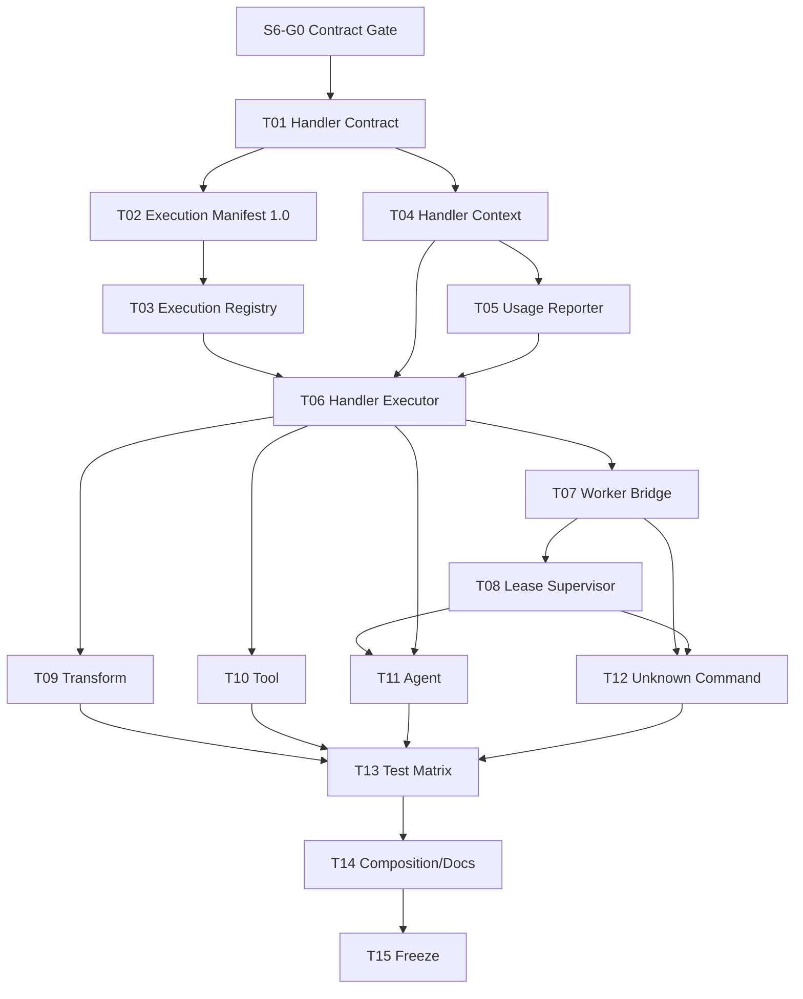

# Agentic Workflow 步骤 6 任务拆分

| 文档属性 | 值 |
| --- | --- |
| 文档版本 | 1.0 |
| 状态 | Completed / Stable 1.0 |
| 规划日期 | 2026-07-17 |
| 来源规划 | `agentic-workflow-implementation-plan.md` 1.0 |
| 输入基线 | Step 1 Contracts 1.0、Step 4 Runtime Kernel Stable 1.0、Step 5 Durable Execution Stable 1.0 |
| 对应范围 | 步骤 6：Handler SDK、Execution Registry 与基础 Handler |
| 参考投入 | 4–6 person-weeks，约 30 person-days |

## 1. 阶段目标

把 Step 5 的通用 `ExecutorPort` 收敛为可注册、可验证、可取消、可计量的 Handler 执行协议，使 ExecutionPlan 中已经固定的 Handler 名称和版本可以安全执行：

```text
ExecutionPlan exact handler ref
  -> sealed ExecutionRegistry resolves exact implementation
  -> Application builds immutable ExecutorRequest
  -> Worker owns Lease renewal / timeout / cancellation
  -> HandlerExecutor runs NodeHandler with scoped HandlerContext
  -> normalize + input/output schema validation
  -> HandlerResult + final UsageSnapshot
  -> CompleteJob / FailJob / ReportUnknownJobResult
```

本阶段完成后，Transform、可信第一方 Tool 和 Agent 都通过同一协议执行；Handler 不能读取 Runtime Repository、不能直接推进 Run，也不能通过异常文本、非结构化 Agent 输出或 Usage 上报失败绕过 Kernel、Schema 和后续 Budget Policy。

## 2. 范围边界

### 2.1 本阶段负责

- NodeHandler 生命周期、HandlerResult、HandlerFailure、HandlerContext、ExecutorRequest/Response。
- 扩展现有 HandlerManifest，加入 ExecutionSafety、ResourceProfile、Secret/Capability 和 Recovery 声明。
- 编译期 Manifest Catalog 与运行时 Execution Registry 的一致性校验。
- Exact Version Binding、实现指纹、Registry Seal 和启动时完整性检查。
- SecretResolver、ArtifactWriter、UsageReporter、Logger、Tracer、Clock、CancellationToken Port。
- UsageSnapshot 累计序列、去重、乱序处理和最终快照规则。
- Worker 到 HandlerExecutor 的生产接线；Worker 不再直接读取 Runtime UoW 构造执行请求。
- 执行期 Lease Renewal Supervisor、最大执行时长、协作式取消和超时收敛。
- TransformHandler、ToolHandler、AgentHandler、FakeHandler。
- Agent 结构化输出提取、Schema 校验、Provider Request ID 和 Unknown Result 分类。
- Handler 主动报告 Unknown External Result 的 Durable Command/Event 接线。
- Handler Contract、故障、取消、Secret、Usage、Replay 和端到端测试。

### 2.2 本阶段不负责

- Artifact Metadata/Blob/Lineage 持久化；属于 Step 7。本阶段只固定 `ArtifactWriterPort`，默认实现拒绝 Artifact 写入，基础 Handler 只返回受限内联 JSON。
- 通用 Input/Output Port Mapping 和 Value Store；属于 Step 7。本阶段消费 Step 4 已准备好的节点输入，并校验 Handler 边界。
- Business Retry、Retry Policy、Rework、条件边或 Join；属于 Step 8。
- UsageSnapshot、Budget Reservation 或 Cost 的持久化记账；属于 Step 10。本阶段只提供 No-op/In-memory Reporter 和最终快照。
- 不可信 Script、第三方插件、任意 Shell、完整 Network Policy、Sandbox、OS 级强杀和 Secret Manager；属于 Step 12。
- Handler 热加载和运行中替换。Registry 在 Worker 启动前 Seal，变更实现必须重启组合根。
- 任意联网 Tool。M4 之前只允许系统维护、预注册且可信的第一方 Tool/Agent Adapter。
- 修改旧 `server.py` 的 runner 或 agent CLI 调度路径。

### 2.3 与后续步骤的接口

| 后续步骤 | Step 6 预留接口 | Step 6 不提前实现 |
| --- | --- | --- |
| Step 7 | ArtifactWriterPort、InputManifest、OutputManifest | Blob、Artifact DB、Lineage、Port Mapping |
| Step 8 | 标准 ErrorInfo、HandlerFailure、ExecutionSafety | Business Retry/Rework Policy |
| Step 9 | AgentHandler、结构化结果、Usage、Provider ID | Planner Prompt/Proposal/Eval |
| Step 10 | UsageReporter、UsageSnapshot、ResourceProfile | Budget Ledger、Reservation、耗尽状态机 |
| Step 12 | Capability/Secret/Network 声明、ProcessRunnerPort | Sandbox、权限系统、Network Enforcement |

## 3. 开工前固定的设计决策

### 3.1 Catalog、Manifest 与 Execution Registry

- `HandlerCatalog` 是编译期只读 Manifest Catalog，只负责 DSL 校验和把版本约束解析为精确版本。
- `ExecutionRegistry` 是运行期实现注册表，键固定为 `(handler_name, exact_semver)`，不接受 `^1` 等范围。
- 每个运行时注册项包含 immutable HandlerManifest、NodeHandler 实现、实现类型标识和实现指纹。
- Worker 启动前 Registry 必须 Seal；Seal 时校验重复版本、Manifest 指纹、Capability、ExecutionSafety 和 ResourceProfile 完整性。
- ExecutionPlan 只执行其中固定的 `handler_name + handler_version`。运行时缺失、版本不符或 Manifest 指纹漂移时，Job 不执行，返回稳定 `HANDLER_NOT_AVAILABLE` / `HANDLER_CONTRACT_MISMATCH`。
- 相同名称和版本不得静默替换实现。实现变化必须发布新 Patch Version，或者显式执行开发态破坏性重建；生产语义禁止“同版本换代码”。
- 编译 Catalog 与执行 Registry 可以由同一配置构造，但必须是两个权限边界，不能把可执行对象放进 WorkflowVersion 或 IR。

### 3.2 Handler Execution Manifest 1.0

在现有字段上增量增加：

- `execution_safety`：`replay_safe` 或 `unknown_on_lease_loss`；未声明默认拒绝注册，不再隐式猜测。
- `resource_profile`：
  - `max_input_tokens`
  - `max_output_tokens`
  - `max_tool_calls`
  - `max_duration_seconds`
  - `max_cost_microunits`
  - `cost_class`
- `required_secrets`：逻辑 Secret 名称，不包含值或环境变量名。
- `capabilities`：例如 `filesystem.read`、`process.agent_cli`、`tool.issue_tracker.write`。
- `supports_cancel`、`supports_recover`、`result_schema_id`。

Handler Execution Manifest 1.0 保持纯数据、Canonical JSON 和确定性指纹，并直接替换当前仅用于 Compiler 的 preliminary Manifest；本项目不保留旧 Manifest 运行时兼容层，全部 Fixture/Catalog 显式改写。DSL 发布时保存解析后的精确 Manifest 摘要/指纹；Step 6 不修改已经发布的 WorkflowVersion。

### 3.3 NodeHandler 生命周期

统一接口包含：

```text
validate(manifest, config) -> ValidationResult       # 纯函数，注册/发布时执行
prepare(request, context) -> PreparedExecution       # 纯函数，不访问外部系统
execute(prepared, context) -> RawHandlerResult       # 唯一允许产生声明内副作用的阶段
cancel(execution_ref, context) -> CancelAck           # 幂等、best effort
recover(recovery_ref, context) -> RecoveryResult      # 只查询，不重新 execute
normalize_result(raw, context) -> HandlerResult       # 纯函数
```

- `validate`、`prepare`、`normalize_result` 必须确定性且无外部调用；建立与 Replay Harness 相同的副作用检测。
- `prepare` 只获得 Context 的标识/Manifest 只读视图，不得解析 Secret、写 Artifact 或上报 Usage；完整 Capability Port 只在 execute/cancel/recover 阶段可用。
- `execute` 只能使用 Context 暴露的 Port，不接收 Repository、UoW、Kernel 或 Application Service。
- `cancel` 不得把“请求已发送”当成“远端一定停止”；无法确认时保留 Unknown 语义。
- `recover` 只能查询已有 Provider/Tool Request ID；不支持查询的 Provider 返回 unknown，绝不重新提交请求。
- Handler 对象默认要求无跨 Attempt 可变状态；缓存必须只读或按 Attempt 隔离。

### 3.4 ExecutorRequest 与 HandlerContext

`ExecutorRequest` 是 immutable DTO，至少包含：

- workflow/run/plan/node_run/attempt/job/lease 标识和 Attempt Number。
- Handler 精确名称、版本、Manifest 指纹。
- 节点 ID、配置、已准备输入、Input/Output Manifest。
- 外部幂等键：`run_id + node_run_id + attempt_number`。
- authoritative deadline、ExecutionSafety 和 ResourceProfile。

`HandlerContext` 至少包含：

- 上述只读标识和 Manifest。
- scoped `SecretResolverPort`。
- `ArtifactWriterPort`。
- `UsageReporterPort`。
- `CancellationTokenPort`。
- structured `LoggerPort`、`TracerPort` 和只读 `ClockPort`。

Context 不包含 Runtime Repository、SQLite Connection、Command Bus 或可自行推进状态的 Service。通过 AST Dependency Test 和运行期 Capability Object 白名单共同约束。

### 3.5 Secret 与 Artifact 边界

- Secret 只能按 Manifest 的 `required_secrets` 逻辑名称解析；未声明名称直接拒绝。
- Resolver 返回短生命周期 `SecretValue`，禁止 repr/序列化；HandlerResult、Usage、Event、Snapshot、Log、Trace 和异常消息执行 Secret Scan。
- Step 6 提供 Mapping/Test Resolver 和可选的进程环境注入 Adapter；环境变量映射只能在组合根配置，不能来自 DSL。
- Step 6 的 `RejectingArtifactWriter` 对所有写入返回稳定 `ARTIFACT_NOT_AVAILABLE`。不能把 Base64 大对象塞入内联 JSON 规避限制。
- Step 7 接入真实 ArtifactWriter 时不得改变 HandlerContext 或 HandlerResult 主协议。

### 3.6 HandlerResult 与 Failure

标准 `HandlerResult` 至少包含：

- `status`：`succeeded`、`failed`、`cancelled`、`unknown_external_result`。
- 结构化 `output` 或 `ErrorInfo`，两者互斥。
- 最终 `UsageSnapshot`。
- 可选 `provider_request_id`、结构化 diagnostics 和 artifact references 预留字段。
- `external_effect`：`none`、`known_applied`、`unknown`，用于阻止错误自动重放。

规则：

- `succeeded` 必须有符合 Result Schema 的结构化输出。
- `failed` 必须使用 Error Registry 中的 code/category；不得靠异常类名或文本判断 transient/permanent/policy。
- `cancelled` 只在 Handler 已确认没有可接受结果时使用；取消请求发出但远端结果未知时必须是 `unknown_external_result`。
- Worker 未捕获异常统一映射为 `handler_permanent`，但如果执行已越过外部提交边界且结果未知，Handler Adapter 必须抛出 typed `UnknownExternalResult`。
- Result Schema 校验发生在提交 CompleteJob 之前；非法 Agent 文本返回 validation failure，不能作为 output 进入 Event。

Worker 映射固定为：

| Handler outcome | Durable 动作 |
| --- | --- |
| succeeded | `CompleteJob` |
| known failed / timeout | `FailJob`；Business Retry 留到 Step 8 |
| unknown external result | `ReportUnknownJobResult` |
| CancelRun 已提交 | 不提交 Handler 结果，由 Cancel/Fence 收敛 |
| execute 前放弃 | `ReleaseJob` |
| 已证明 replay-safe 的运输故障 | `DeferJob`；不能用于普通业务 transient failure |

### 3.7 Unknown External Result 主动报告

Step 5 已覆盖 Lease 丢失后的 Unknown，但 Handler 可能在 Lease 仍有效时遇到“请求已提交、响应丢失”。Step 6 增量增加 `ReportUnknownJobResult`：

- Primary Aggregate 为 Job，要求当前有效 Lease ID、Bearer Token、Fence 和 Expected Version。
- 原子推进 Attempt `running -> unknown_external_result`、NodeRun `running -> waiting`、Job `running -> failed`、Lease `active -> released`。
- 状态变化复用既有 transition events，并额外记录 `attempt_usage_recorded`；Command Schema/Catalog 和 Runtime Event Catalog 升级为 Stable 1.1。
- Command 携带最后已接受的 UsageSnapshot、Provider Request ID、`usage_incomplete` 和脱敏原因，使恢复不依赖 Worker 内存。
- 重复提交由 Receipt 幂等；迟到 Complete/Fail 返回 `STALE_LEASE`。
- 不自动创建 Attempt、Job 或 Timer；Recovery 只报告。

这是向后兼容的命令增量，不改变 Frozen 状态机、Lease/Fence 或 Event Envelope。若评审认为 Stable 1.1 不可接受，Step 6 必须暂停，不能用 FailJob 或等待 Lease 过期伪造语义。

### 3.8 UsageSnapshot 与 UsageReporter

- Usage 是累计快照，不是裸 Delta；键为 `(attempt_id, sequence)`。
- Sequence 从 1 单调递增；计数器只能不下降，`observed_at` 不能倒退。
- 同 Sequence、同内容为幂等 no-op；同 Sequence、不同内容为 Integrity Error；较旧 Sequence 忽略并计指标。
- In-memory Reporter 保存每个 Attempt 的最高 Sequence，不访问 Runtime Repository。
- Reporter 故障不能中断 Handler，但必须被 Context 记录；最终 HandlerResult 必须携带最终 UsageSnapshot。
- 最终快照不得低于已经接受的流式快照。缺失最终快照时，Runtime 标记 `usage_incomplete`，Step 10 使用 ResourceProfile 上限保守结算。
- Provider Request ID 可在后续 Snapshot 中补齐，但一旦非空不得改变。
- Step 6 不持久化流式中间 Snapshot，也不创建 Budget Ledger。Step 6 生产 Worker 调用 CompleteJob、FailJob、ReportUnknownJobResult 时必须携带 execution metadata，并在结果事务内追加一个最终 `attempt_usage_recorded` Event，保存最高累计快照、Provider Request ID 和 `usage_incomplete`。为保持 Durable Commands Stable 1.0，CompleteJob/FailJob 的 metadata 是向后兼容可选字段；未携带时保持 Step 5 原事件流，只有 test-only Compatibility Adapter 可以走该路径。

### 3.9 Lease Supervisor、Timeout 与 Cancellation

- Handler 执行不得阻塞 Lease Renewal。Worker 使用独立 Execution Supervisor 定期续租，推荐 `renew_interval <= lease_ttl / 3`。
- `ResourceProfile.max_duration_seconds` 不得超过系统最大连续执行时长；初始 Claim 仍受 Step 5 Kernel 最大 5 分钟 TTL，长执行依靠受限续租。
- Renewal 失败后立即触发 CancellationToken 和 Handler.cancel；结果提交仍由 Kernel Fence 决定，Worker 不自行猜测所有权。
- Deadline 到达时先取消；已确认停止且无外部 Unknown 时提交 timeout failure，否则提交 Unknown。
- CancelRun 被观察到后调用 Handler.cancel；协作式 Handler 必须定期检查 CancellationToken。
- Step 6 不强杀任意线程。可信本地 Agent CLI Adapter 可以通过受控 ProcessRunner 发送 terminate/kill，但必须记录“已退出”与“结果未知”的区别。
- Worker 主循环不得持有 UoW 跨 Handler 执行；ExecutorRequest 由 Application 查询服务在执行前一次性构造。

单机默认值固定为：初始 Lease TTL 30 秒、Renew Interval 10 秒、Cancel Grace 5 秒、Process Kill Grace 2 秒；Handler Manifest 的默认最大执行时长为 1 小时，系统硬上限 24 小时。所有值由受信组合根配置，DSL 只能在 Manifest 上限内收紧，不能放宽 Kernel/Worker 上限。

### 3.10 基础 Handler

#### TransformHandler

- 只支持预注册、纯函数、确定性的 Transform Operation。
- 首批至少提供 `identity`、`select_fields` 和 `build_object`，不使用 `eval` 或 Python 表达式。
- 不解析 Step 7 Mapping DSL，不写 Artifact，不读取 Secret。
- ExecutionSafety 固定 `replay_safe`。

#### ToolHandler

- 只调用 `ToolRegistry` 中预注册的可信第一方 Tool Adapter；DSL 不能提供模块路径、Shell 或 URL。
- 每个 Tool 声明输入/输出 Schema、Capability、Secret、ExecutionSafety、超时和幂等支持。
- 外部写 Tool 默认 `unknown_on_lease_loss`；只有具备服务端幂等确认的 Tool 才可声明 replay-safe。
- Tool Adapter 返回 typed result/failure/unknown，不把任意异常文本直接暴露为业务错误。

#### AgentHandler

- 通过 `AgentClientPort` 调用 Provider/本地 Agent CLI，不直接依赖具体厂商 SDK。
- Prompt、模型/Agent 配置来自已发布节点配置和组合根允许列表，不能由输出反向修改 Handler/Command。
- 要求结构化 JSON 结果；提取后执行大小、JSON、Result Schema 三层校验。
- Provider Request ID、Usage 和 finish reason 进入 HandlerResult/UsageSnapshot，不把 Secret/原始认证头写日志。
- 默认 `unknown_on_lease_loss`；客户端幂等键不能被当作 Provider 结果查询能力。
- 本阶段至少交付 Fake AgentClient 和一个可信本地 Agent CLI Adapter；任意命令执行、网络 Policy 和沙箱仍留到 Step 12。

#### FakeHandler

提供 success、validation failure、transient/permanent failure、policy failure、cancel、timeout、crash、usage gap、unknown、recover found/not-found 等可编程场景，供 Worker、Kernel 和后续 Planner Eval 使用。

### 3.11 Replay 与恢复

- Event/Snapshot Replay 不解析 Registry、不构造 HandlerContext、不调用 validate/prepare/recover/execute/cancel。
- Worker 重启只扫描 Durable Job；有有效 Job/Lease 时遵守 Step 5 Recovery，不从 Handler 本地状态猜测结果。
- `recover` 只能由显式 Recovery Job/Operator Action 调用；Step 6 不自动把 Unknown Attempt 重新打开。
- Handler 的 Provider Request ID 必须来自已保存的 `attempt_usage_recorded` Event 或后续 Artifact/Budget 模型；内存中的 request ID 不能成为唯一恢复事实。
- 已向 Provider 提交但 Worker 在写入 Final Usage Event 前崩溃时，Step 5 Lease Expiry 仍会安全进入 Unknown，但可能没有可查询的 Provider Request ID。Step 6 将其作为显式已知限制；Step 10 持久化流式 Usage/Request ID 后才能缩小该恢复盲区。

### 3.12 MVP 信任假设

- 所有 Handler、Tool、AgentClient 和 ProcessRunner 都是系统维护、预注册的第一方代码。
- Registry 配置和 Secret 映射由本地管理员控制，不接受 Workflow 输入动态注册。
- Tool/Agent 可以产生真实外部副作用，因此 Lease/Fence/Unknown 语义必须先通过；但 Step 12 前不声称对恶意 Handler 提供进程隔离。
- Capability 在 Step 6 是注册和审计约束，不是完整 OS/Network Enforcement。文档和 API 必须明确这一点。

## 4. 前置门槛

### S6-G0：确认 Stable 输入和契约增量

**状态**：Completed。

**验收标准**：

1. Step 5 标记 Completed / Stable 1.0，全量 423 项测试通过。
2. Durable Claim、Renew、Cancel、Unknown、Timer 与 Recovery 语义不再有未决问题。
3. 审批 `ReportUnknownJobResult` 作为 Durable Commands Stable 1.1 的向后兼容增量。
4. 确认 Handler Execution Manifest 1.0 直接替换 preliminary Manifest，全部 Catalog/Fixture 显式声明 ExecutionSafety，不增加兼容分支或运行时默认猜测。
5. 确认 Step 6 不创建数据库 Migration；最终 Usage 使用 Event 持久化，若实现发现必须新增 Registry/Usage 表，先回到规划评审。
6. 确认真实 Agent 只接可信本地 CLI Adapter，不把任意命令或第三方插件纳入范围。

## 5. 当前进度

| 范围 | 状态 | 当前结果 |
| --- | --- | --- |
| S6-G0 | Completed | Step 5 Stable 输入和 Stable 1.1 增量方向已确认 |
| S6-T01 | Completed | Handler 生命周期、Result/Failure、typed error、Schema、Golden 和 Stability 已固定 |
| S6-T02–T03 | Completed | Handler Execution Manifest 1.0、逐节点 Manifest 指纹、Sealed Execution Registry |
| S6-T04–T07 | Completed | 受限 Context、Usage、Schema/Result Normalization、无 UoW Worker Bridge |
| S6-T08–T12 | Completed | Lease Supervisor、Transform/Tool/Agent、Final Usage 与主动 Unknown 闭环 |
| S6-T13–T15 | Completed | Contract/Fault/Security/E2E、组合根、运维摘要与 Stable 冻结 |

## 6. 任务总览

| 任务 | 内容 | 参考投入 | 依赖 |
| --- | --- | ---: | --- |
| S6-T01 | 固定 Handler SDK、Result 和 Error Contract | 2.5 pd | G0 |
| S6-T02 | 固定 Handler Execution Manifest 1.0 与 ResourceProfile | 2 pd | T01 |
| S6-T03 | 实现 Execution Registry、Exact Binding 与 Seal | 2 pd | T01、T02 |
| S6-T04 | 实现 HandlerContext 与 Secret/Artifact/Log/Trace Port | 2.5 pd | T01、T02 |
| S6-T05 | 实现 UsageReporter 与累计 UsageSnapshot 规则 | 2 pd | T01、T04 |
| S6-T06 | 实现 HandlerExecutor、Schema/Result Normalization | 2.5 pd | T03–T05 |
| S6-T07 | 重构 Application ExecutorRequest Query 与 Worker 接线 | 2 pd | T06、Step 5 |
| S6-T08 | 实现 Lease Supervisor、Timeout、Cancel 和 Recover 协议 | 3 pd | T04、T07 |
| S6-T09 | 实现 TransformHandler | 1.5 pd | T06 |
| S6-T10 | 实现 ToolRegistry 与 ToolHandler | 2 pd | T04、T06 |
| S6-T11 | 实现 AgentHandler、AgentClientPort 与可信 CLI Adapter | 3 pd | T04–T06、T08 |
| S6-T12 | 实现 Final Usage Event、ReportUnknownJobResult 与恢复收敛 | 2 pd | T01、T05、T07、T08 |
| S6-T13 | 建立 Contract、Fault、Security、Usage 和 E2E 测试 | 2 pd | T06–T12 |
| S6-T14 | 提供组合根、示例 Catalog 和运维诊断 | 1 pd | T07–T13 |
| S6-T15 | 阶段评审、冻结与 Step 7/9 输入移交 | 0.5 pd | T01–T14 |

总参考投入约 30 person-days。相对总规划原 3–5 person-weeks，Rolling Estimate Gate 3 调整为 4–6 person-weeks，增加部分主要来自真实 Agent CLI 取消、Lease Supervisor 和主动 Unknown 闭环。

## 7. 详细任务

### S6-T01：固定 Handler SDK、Result 和 Error Contract

**工作内容**：

1. 定义 NodeHandler、PreparedExecution、RawHandlerResult、HandlerResult、HandlerFailure。
2. 固定 validate/prepare/execute/cancel/recover/normalize_result 的副作用边界。
3. 固定 Handler Result Schema、状态互斥和最终 Usage 要求。
4. 定义 typed Handler 异常：Validation、Transient、Permanent、PolicyRejected、Cancelled、Timeout、UnknownExternalResult。
5. 定义外部效果 certainty，不用异常文本判断 Unknown。
6. 固定 Handler 幂等键、Provider Request ID 和 Result Replay 规则。
7. 更新 Schema Registry、Stability Matrix 和 Golden Contract。

**验收标准**：每种返回/异常只映射到一个明确 Runtime 动作；非法组合在 Handler 边界被拒绝。

### S6-T02：固定 Handler Execution Manifest 1.0 与 ResourceProfile

**工作内容**：

1. 新增 ExecutionSafety、ResourceProfile、required_secrets、supports_cancel/recover、result_schema_id。
2. ResourceProfile 所有上限非负且有系统级硬上限。
3. Manifest Canonical JSON、指纹；直接重写旧 Fixture/Catalog，不实现旧 Manifest Upcaster。
4. 更新 Catalog Loader、DSL Semantic Validation 和发布记录摘要。
5. Tool/Agent 未声明 ExecutionSafety 时拒绝；Transform 固定 replay-safe。
6. Manifest 破坏性变化要求新 Handler Version。

**验收标准**：编译期能拒绝资源、Secret、Capability 或结果 Schema 不完整的 Handler。

### S6-T03：实现 Execution Registry、Exact Binding 与 Seal

**工作内容**：

1. 实现 Registration、Registry Builder、Exact Resolve 和 Seal。
2. 检查 Manifest 与实现支持的 kind/lifecycle/capability 一致。
3. 启动时对已发布/配置 Workflow 所需 Handler 做完整性预检。
4. Registry Seal 后拒绝注册、替换和删除。
5. 缺失/漂移返回稳定诊断，不执行实现。
6. 建立重复注册、版本漂移、Catalog/Registry 不一致测试。

**验收标准**：相同 ExecutionPlan 在相同 Registry 指纹下解析到唯一实现。

### S6-T04：实现 HandlerContext 与受限 Port

**工作内容**：

1. 定义 immutable ExecutorRequest、Input/Output Manifest 和 HandlerContext。
2. 实现 scoped Secret Resolver、SecretValue 和 Secret Scan。
3. 实现 RejectingArtifactWriter，预留 Step 7 接口。
4. 实现结构化 Logger/Tracer、CancellationToken 和 Clock Adapter。
5. 建立 Capability Object 白名单；Context 无 Repository/Kernel/Service。
6. 建立 AST Import Boundary 与恶意 Fake Handler 探测测试。

**验收标准**：Handler 只能取得声明过的 Secret/Capability，且无法通过 Context 推进 Run。

### S6-T05：实现 UsageReporter

**工作内容**：

1. 实现 No-op 和 In-memory UsageReporter。
2. 校验 Attempt ID、Sequence、累计计数和 observed_at 单调性。
3. 实现重复、乱序、同序冲突和 Provider ID 不可变规则。
4. 合并最终 HandlerResult Usage，并生成待结果事务记录的 immutable final usage DTO 和 `usage_incomplete`。
5. Reporter 故障只记录诊断，不改变 Handler 业务结果。
6. 建立并发上报与属性测试。

**验收标准**：任意重复/乱序上报得到唯一最高累计快照，不发生重复计费语义。

### S6-T06：实现 HandlerExecutor 与结果规范化

**工作内容**：

1. Registry Exact Resolve 并构造 HandlerContext。
2. 执行 prepare→execute→normalize_result。
3. 在执行前校验输入/配置，在完成前校验 output/result schema 和 1 MiB 内联限制。
4. 将 typed failure 转为标准 HandlerResult/ErrorInfo。
5. 收集 final Usage、Provider ID、duration、diagnostics。
6. Handler 内部异常做 Secret Redaction 后映射。
7. 禁止在 normalize 期间外部调用。

**验收标准**：无论 Handler 如何返回或抛错，Executor 只输出合法标准结果。

### S6-T07：重构 Application Query 与 Worker 接线

**工作内容**：

1. Application Service 提供 `build_executor_request(claimed)` 类型化查询。
2. 从 Plan、NodeRun、Attempt、Job 和 Input Event 构造 immutable DTO；查询结束即关闭 UoW。
3. Worker 只调用 Application API 和 ExecutorPort，不直接访问 `uow_factory`。
4. Worker 根据 HandlerResult 提交 CompleteJob/FailJob/ReportUnknownJobResult，并携带 final usage metadata。
5. 保留 Step 5 Callable Fake Executor Compatibility Adapter，仅用于测试。
6. 建立 Worker Dependency Boundary 和 SQLite/Memory 行为测试。

**验收标准**：Worker/Handler 不 import Persistence；执行期间没有开放事务。

### S6-T08：实现 Lease Supervisor、Timeout、Cancel 和 Recover

**工作内容**：

1. 执行期间按 TTL/3 有界续租并记录 renewal revision。
2. Renewal 失败、CancelRun、Stop Signal 和 Deadline 触发 CancellationToken。
3. 调用 Handler.cancel 并区分 confirmed stopped 与 unknown。
4. 受控 ProcessRunner 支持 terminate→grace→kill 和退出状态审计。
5. recover 只查询已有 request ID，不调用 execute。
6. 执行线程退出、续租线程退出和 Worker shutdown 无泄漏。
7. 建立 Clock、竞态和进程终止测试。

**验收标准**：长 Handler 不因 Worker 同步阻塞自然丢 Lease；取消/超时不会被误报为普通成功或安全失败。

### S6-T09：实现 TransformHandler

**工作内容**：

1. 实现 identity、select_fields、build_object。
2. 操作和参数使用 JSON Schema，不使用 eval/import。
3. 保证输入不变、输出 Canonical JSON 和 replay-safe。
4. 建立确定性、深度/大小限制和属性测试。

**验收标准**：相同输入/配置产生字节级相同规范化输出和零 Usage。

### S6-T10：实现 ToolRegistry 与 ToolHandler

**工作内容**：

1. Tool Manifest/Adapter/Registry exact binding。
2. 输入/输出 Schema、Capability、Secret、timeout 和 execution safety 校验。
3. 注入外部幂等键；Adapter 明确报告请求是否已经提交。
4. 映射 typed success/failure/unknown 和 Usage。
5. 提供纯内存可信 Tool 示例，不接任意 URL/Shell。
6. 建立外部写响应丢失、取消和 Secret 测试。

**验收标准**：Tool 副作用确定性未知时只能进入 Unknown，不能自动 Defer/Retry。

### S6-T11：实现 AgentHandler 与 AgentClient

**工作内容**：

1. 定义 AgentClientPort request/result/recover/cancel。
2. 实现 Fake AgentClient 和可信本地 Agent CLI Adapter。
3. 固定 CLI allowlist、参数构造、stdin/stdout 大小、deadline 和 ProcessRunner。
4. 解析结构化 JSON，拒绝尾随文本、Schema 不符和超大结果。
5. 流式上报 Token/Tool Call Usage 和 Provider Request ID。
6. 处理进程退出、取消、无输出、半截 JSON、响应丢失和 Unknown。
7. Prompt/认证信息 Redaction，日志不保存 Secret。

**验收标准**：Agent 非结构化输出不能进入 Attempt output；CLI 崩溃或响应未知具有稳定可恢复语义。

### S6-T12：实现 Final Usage Event、主动 Unknown Command 与恢复收敛

**工作内容**：

1. 增加 `attempt_usage_recorded` Event Schema/Reducer/Golden，包含 final Usage、Provider ID 和 completeness。
2. CompleteJob/FailJob 接受向后兼容的可选 execution metadata；Step 6 生产 Worker 必须提供并在同一事务追加 Final Usage Event，Step 5 Compatibility Adapter 缺省时保持原事件流。
3. 增加 ReportUnknownJobResult Command Schema/Handler/Receipt。
4. Unknown 原子更新 Attempt/Node/Job/Lease 并记录 Final Usage，不创建重试。
5. 更新 Durable Command/Runtime Event Catalog Stable 1.1、Snapshot 和 Event-only Replay。
6. 建立迟到结果、Cancel、Expire 与 Unknown 竞态测试。
7. Recovery Report 从 Event/Projection 读取 Provider Request ID，但不自动 recover/execute。
8. 同一 Unknown Command 重放返回 prior result。

**验收标准**：Lease 有效时发现响应未知可立即、原子进入 Unknown；后续扫描不产生 Job。

### S6-T13：建立测试矩阵

覆盖：

- Contract：Manifest、Result、Context、Usage、Registry、Memory/SQLite。
- Lifecycle：六阶段合法/非法调用与副作用 Harness。
- Handler：Transform/Tool/Agent/Fake Contract Suite。
- Worker：renew、cancel、timeout、shutdown、stale fence、unknown。
- Fault：Result normalize、Usage、renew、process exit、Command commit 前后。
- Security：Secret/Token 不进 Event、Snapshot、Log、Trace、Metric、Result、Exception。
- Replay：Event/Snapshot Replay 零 Registry/Handler/Provider 调用。
- Concurrency：同 Attempt Usage、Cancel/Complete、Unknown/Complete、Renew/Expire。
- E2E：Transform→Tool→Agent 三节点 Durable Timeline。

**验收标准**：Step 1–5 全量测试持续通过；新测试不能依赖真实网络、账号或不稳定模型输出。

### S6-T14：组合根、示例与运维诊断

**工作内容**：

1. 提供 Production Handler Runtime Builder 和显式 Registry Seal。
2. 示例 Catalog 覆盖 Transform、可信 Tool、Agent CLI。
3. 提供 Registry Summary、Handler Detail、Capability/Resource Query DTO。
4. Worker 启动前预检缺失 Handler/Secret/CLI，并 fail fast。
5. 更新 Runtime README、MVP 信任假设和 Step 7/9 接入示例。

**验收标准**：调用方无需访问 Registry 内部对象即可诊断“为何 Handler 不可执行”。

### S6-T15：阶段评审与冻结

**工作内容**：

1. 逐项检查完成定义和所有 Contract Golden。
2. 审查 Handler 无 Repository、Worker 无 UoW、Replay 无外调。
3. 审查 Tool/Agent Unknown、Cancel、Usage 和 Secret 语义。
4. 冻结 Handler SDK/Manifest/Registry/Result/Usage 为 Stable 1.0 或 1.1。
5. 输出 Completion Record、已知限制和 Step 7/9 输入清单。
6. 更新总规划实际投入和剩余风险。

**验收标准**：Step 7 可以只替换 ArtifactWriter；Step 9 可以只复用 AgentHandler/Usage，不需要改变 Handler 执行协议。

## 8. 依赖与执行批次



建议批次：

| 批次 | 任务 | 阶段产物 |
| --- | --- | --- |
| A | G0、T01、T02、T03 | Handler Contract、Manifest、Registry |
| B | T04、T05、T06、T07 | Context、Usage、Executor、Worker Bridge |
| C | T08、T09、T10 | Supervisor、Transform、Tool |
| D | T11、T12 | Agent、主动 Unknown 闭环 |
| E | T13、T14、T15 | 测试、组合根、冻结评审 |

可以安全并行：

- T03 Registry 与 T04 Context 在 T01/T02 后并行。
- T05 UsageReporter 可与 Registry 独立实现。
- T09 Transform 和 T10 Tool 在 T06 后并行；T11 可先基于 Fake ProcessRunner 开发。
- T13 Fixture 从 T01 开始持续建立，不在最后集中补测。
- Step 7 可以在 T04 的 ArtifactWriterPort 固定后并行设计 Artifact Model，但不能提前接入生产 Handler。
- Planner Prompt/Eval 可继续在 Fake AgentClient 上并行实验，仍保持 Draft，不接 Kernel。

不可绕过：

- Manifest/Registry Exact Binding 未通过前不得启动真实 Handler。
- Lease Supervisor 与 Unknown Command 未通过前不得运行有外部副作用的 Tool/Agent。
- Secret Scan 与结构化 Result 校验未通过前不得接真实 Agent CLI。
- Step 12 安全能力完成前不得注册不可信 Handler、任意 Shell 或任意联网 Tool。

## 9. 建议代码布局

```text
src/orbit/workflow/
├── domain/
│   ├── handlers.py
│   ├── handler_context.py
│   └── usage.py                 # 或继续复用 accounting.py
├── handlers/
│   ├── registry.py
│   ├── executor.py
│   ├── transform.py
│   ├── tools.py
│   ├── agent.py
│   ├── process_runner.py
│   └── fake.py
├── worker/
│   ├── runtime.py
│   └── supervisor.py
├── application/
│   └── handler_runtime_service.py
└── catalogs/
    └── handlers.py

tests/
├── fixtures/workflow_handlers/v1/
├── test_workflow_handler_contracts.py
├── test_workflow_handler_registry.py
├── test_workflow_handler_executor.py
├── test_workflow_handler_usage.py
├── test_workflow_transform_handler.py
├── test_workflow_tool_handler.py
├── test_workflow_agent_handler.py
├── test_workflow_worker_supervisor.py
└── test_workflow_handler_faults.py
```

依赖方向：

```text
Handler domain contracts
        ^
        |
Handler implementations <- HandlerExecutor <- Worker <- Application API
        ^                                      |
        |                                      v
Secret/Artifact/Usage/Agent ports       Durable Kernel Commands
```

Handler 实现不得 import `persistence`、`runtime.kernel`、`application`、`sqlite3` 或旧 `orbit.server/store`。

## 10. Step 6 完成定义

只有同时满足以下条件，Step 6 才能标记完成：

1. Handler Execution Manifest 1.0、ResourceProfile、HandlerResult、HandlerContext 和 UsageSnapshot Schema/Golden 完成。
2. ExecutionPlan 的精确 Handler 只能解析到 Sealed Registry 中唯一实现。
3. Handler validate/prepare/normalize 是纯函数，Replay 不调用任何 Handler 生命周期。
4. Handler 和 Worker 均不能直接访问 Runtime Repository/UoW。
5. HandlerContext 只能解析 Manifest 声明的 Secret/Capability。
6. Secret、Lease Token 和认证信息不进入 Event、Snapshot、Log、Trace、Metric、Result 或异常。
7. 输入、配置、标准 Result 和输出都经过 Schema/大小校验。
8. UsageSnapshot 可去重、拒绝同序冲突并保持累计单调；Complete/Fail/Unknown 在同一事务持久化 Final Usage Event 或 `usage_incomplete`。
9. Worker 执行期间持续续租，不持有数据库事务。
10. Renewal 失败、CancelRun、Deadline 和 Stop Signal 都传播到 CancellationToken/Handler.cancel。
11. TransformHandler 字节级确定且 replay-safe。
12. ToolHandler 只能调用预注册 Tool，不能执行 DSL 指定 URL/Shell/模块。
13. AgentHandler 非结构化/超大/Schema 不符输出不能进入 Attempt output。
14. Tool/Agent 响应未知时通过 ReportUnknownJobResult 立即进入 Unknown，不自动重跑。
15. Recover 只查询既有 Request ID，绝不重新 execute。
16. Complete/Fail/Unknown/Cancel/Expire 竞态只有一个有效结果。
17. Step 6 不创建 Persistence Migration，不提前持久化 Artifact 或 Budget。
18. Transform→Tool→Agent Durable E2E、Fault、Security、Usage、Replay 和全量测试通过。
19. 生产组合根只注册可信第一方 Handler，并明确 Step 12 前的信任边界。
20. Completion Record、Stable Matrix、Step 7/9 输入清单和实际投入更新完成。

## 11. 主要风险与控制措施

| 风险 | 影响 | 控制措施 |
| --- | --- | --- |
| 编译 Catalog 与执行实现漂移 | 同一 WorkflowVersion 行为改变 | Exact Version + Manifest/Implementation Fingerprint + Registry Seal |
| Worker 为构造请求直接读 UoW | 执行边界泄漏、事务过长 | Application 构造 immutable ExecutorRequest，Worker 只用 API |
| 同步 Handler 阻塞续租 | Lease 过期、重复执行 | 独立 Lease Supervisor，TTL/3 续租 |
| 异常文本分类 Unknown | 改文案即改变安全语义 | typed HandlerFailure/UnknownExternalResult |
| Agent 返回解释文本绕过 Schema | 非结构化脏数据进入 Event | 严格 JSON 提取 + Result Schema + 大小限制 |
| Usage 使用 Delta | 重试/乱序导致重复计费 | 累计 Snapshot + Attempt/Sequence 幂等 |
| Reporter 故障漏记费用 | 后续预算被绕过 | 最终 Snapshot 或 ResourceProfile 上限保守结算 |
| Secret 进入日志/结果 | 凭据泄漏 | scoped SecretValue + Redaction + 全面 Secret Scan |
| Cancel 请求被当作已停止 | 外部写结果不确定 | CancelAck 区分 confirmed/unknown，未知进入 Unknown |
| Tool/Agent 被误标 replay-safe | 外部副作用重复 | 显式 ExecutionSafety，外部写默认 unknown-on-loss |
| Step 6 提前实现 Artifact/Budget | 后续模型返工 | RejectingArtifactWriter + 流式 In-memory Usage + Final Usage Event，无新表 |
| 可信 Adapter 被误解为安全沙箱 | 恶意代码/网络越权 | 显式 MVP 信任假设，第三方/任意执行延至 Step 12 |

## 12. 开始实现前的首批检查清单

1. 评审并批准 Durable Commands Stable 1.1 的 ReportUnknownJobResult。
2. 固定 HandlerResult 状态、ErrorInfo、external_effect 和 Runtime Command 映射矩阵。
3. 固定 Handler Execution Manifest 1.0 与 ResourceProfile 上限、默认和指纹。
4. 固定 Catalog/Registry/ExecutionPlan Exact Binding 关系。
5. 固定 HandlerContext Capability 白名单和禁止依赖清单。
6. 固定 Usage Snapshot 重复、乱序、冲突和最终合并规则。
7. 固定 Lease TTL、Renew Interval、Max Duration、Cancel Grace 默认值。
8. 固定 Agent CLI Allowlist、结构化输出协议和 ProcessRunner 边界。
9. 为 Unknown/Complete、Cancel/Complete、Renew/Expire 先写竞态失败测试。
10. 为 Secret 泄漏、Replay 外调和 Worker UoW 访问先写边界测试。

## 13. Completion Record

Step 6 已于 2026-07-17 完成，15 个任务全部交付。Handler SDK、Handler Execution Manifest、Execution Registry、Handler Result、Usage Reporter 固定为 Stable 1.0；Durable Command/Event Catalog 以兼容增量固定为 Stable 1.1；Run Snapshot/Reducer 因新增最终 Usage 投影升级为 3.0。

### 13.1 实际交付

- Workflow IR 与 ExecutionPlan 持久化精确的 Handler 名称、版本和逐 Handler Manifest 指纹；运行时只允许 Sealed Registry 精确解析，缺失或漂移在执行前失败。
- Worker 通过 Application 查询一次性构造 immutable ExecutorRequest，Handler 执行期间不持有 UoW；Handler/Worker 依赖边界测试禁止导入 Persistence、Kernel 和 Application Repository。
- HandlerExecutor 完成配置、输入、标准结果、输出 Schema 和 1 MiB 内联限制校验，并统一处理 typed failure、Error message/details/cause 深度 Secret Redaction、最终 Usage 合并；活动执行按 Attempt ID 隔离，定向取消不会命中其他并发 Attempt。
- HandlerContext 只暴露 scoped Secret、拒绝式 Artifact Writer、Usage、Cancellation、Logger、Tracer 和 Clock；Artifact 持久化继续留给 Step 7。
- LeaseSupervisor 独立续租；Deadline、Lease 明确丢失或连续三次续租失败会传播取消并调用 Handler cancel，单次瞬态 SQLite busy 在已知 Lease 有效期内允许恢复；Kernel Fence 仍是结果提交的最终授权边界。
- TransformHandler 提供 identity/select_fields/build_object；ToolHandler 只能解析预注册的 Tool Manifest/Adapter，并核对 ExecutionSafety、Capability 和 Secret；AgentHandler 提供 Fake Client 与构造参数固定的可信本地 CLI Adapter。CLI 进程按 execution_ref 隔离，stdout 流式有界读取，stderr 只记录长度与摘要，避免无界缓冲或把原文带入 Event。
- Complete/Fail/Unknown 在同一事务追加最终 `attempt_usage_recorded`；`ReportUnknownJobResult` 原子收敛 Attempt、NodeRun、Job 和 Lease，重复命令 Replay 返回原结果且不创建新 Job。
- Runtime Builder 提供注册、Seal、Secret/Schema/CLI preflight 和只读 Registry Summary。

### 13.2 已知限制

- Step 12 前只信任系统维护、预注册的第一方 Handler、Tool 和 Agent CLI；Capability 是注册/审计约束，不是 OS 或网络沙箱。
- Step 6 只把最终 Usage 持久化为 Event；流式中间 Usage 保存在 Attempt 内存 Reporter。Worker 在外部提交后、最终事件前崩溃时，Provider Request ID 仍可能缺失。
- ArtifactWriter 默认拒绝写入，真实 Blob、Metadata、Lineage 和 Port Mapping 由 Step 7 接入。
- 通用业务 Retry/Rework、Budget Ledger、持久化 Usage Reservation 和自动 Provider Recover 不在本阶段范围。
- Python 线程不能被安全强杀；可信 CLI 可 terminate/kill，线程型 Handler 必须协作检查 CancellationToken，迟到结果最终由 Lease/Fence 拒绝。

### 13.3 Step 7 / Step 9 移交输入

- Step 7 复用 ExecutorRequest 的 Input/Output Manifest、HandlerContext.ArtifactWriterPort 和 HandlerResult.artifact_refs，仅替换拒绝式 Artifact Writer，不修改 Handler 生命周期。
- Step 9 复用 AgentClientPort、AgentHandler、结构化 HandlerResult、Provider Request ID、累计 Usage 和 Unknown 语义；Planner Replay 必须读取已记录结果，不能重调 Agent。
- Step 10 以 `attempt_usage_recorded` 和 UsageReporter 稳定语义接入持久化 Budget Ledger/Reservation；不能允许 Handler 直接修改预算账户。

### 13.4 最终验证

- `.venv/bin/python -m unittest discover -s tests -q`：450 项通过。
- `.venv/bin/python -m compileall -q src tests`：通过。
- `git diff --check`：通过。
- 无网络、真实账号或非确定性模型依赖；可信 CLI 测试使用本机 Python 子进程和结构化 JSON 协议。
