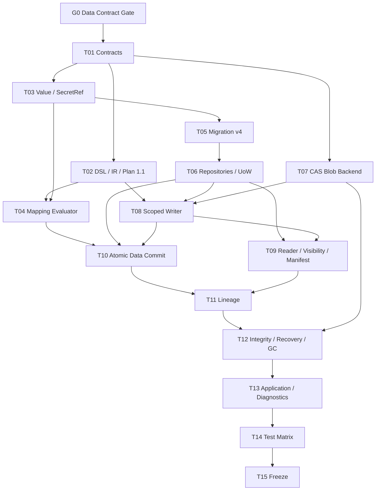

# Agentic Workflow 步骤 7 任务拆分

| 文档属性 | 值 |
| --- | --- |
| 文档版本 | 1.0 |
| 状态 | Completed |
| 规划日期 | 2026-07-17 |
| 来源规划 | `agentic-workflow-implementation-plan.md` 1.0 |
| 输入基线 | Step 2 DSL/IR Stable 1.0、Step 3 Persistence Stable 1.0、Step 4 Kernel Stable 1.0、Step 6 Handler Runtime Stable 1.0 |
| 对应范围 | 步骤 7：Port、Mapping、Value、Artifact 与 Lineage |
| 参考投入 | 4–7 person-weeks，约 35 person-days |

## 1. 阶段目标

建立节点之间可验证、可追踪、可恢复的数据传递层，使 Runtime 不再把任意 JSON 字典直接从一个 Attempt 塞给下一个 Attempt：

```text
HandlerResult
  -> typed output ports
  -> immutable inline Values / staged Artifacts
  -> CompleteJob transaction
  -> committed metadata + lineage + Events
  -> pure Mapping Evaluator
  -> authorized Input Manifest
  -> next Handler / Planner receives summaries and references
```

完成后，小型 JSON 数据以不可变 Value 传递，大型或二进制内容以 ArtifactRef 传递；Artifact 内容进入 Content-Addressed Blob Backend 后不可原地修改；一次 Job 完成要么同时提交输出、Artifact Metadata、Lineage 和后继输入，要么全部不对 Runtime 可见。

## 2. 范围边界

### 2.1 本阶段负责

- InputPort/OutputPort 的数据传输类型、Schema、大小和可见性策略。
- WorkflowIR/ExecutionPlan 的 Port Data Policy 与规范化 Mapping AST。
- 确定性、无副作用 Mapping Evaluator，替换 Step 4 Kernel 内联 `_map_value`。
- 小型结构化 Value Store、Value Checksum 和 Value Lineage。
- Artifact Metadata、Staging、Commit、ArtifactRef 和 Artifact Link。
- 本地 Content-Addressed Blob Backend、临时文件、原子 rename、checksum、大小和 content-type 限制。
- scoped Artifact Access，包括读取授权、写入授权和 Input Manifest。
- SecretReference 与普通 Value/Artifact 的隔离规则。
- CompleteJob 与 Artifact/Value 的同事务提交语义。
- Artifact Integrity Check、Staging/Orphan GC、故障恢复和运维诊断。
- Migration version 4：`values`、`value_links`、`artifacts`、`artifact_links`。

### 2.2 本阶段不负责

- Branch、Join、Retry、Rework、Loop 和多入边合并策略；属于 Step 8。本阶段 Mapping Evaluator 支持它们未来需要的纯数据操作，但只接入现有线性执行路径。
- Planner Context 裁剪和 Planner 自主读取 Artifact；属于 Step 9。本阶段只提供只读 Input Manifest Builder。
- Budget、Artifact 成本配额和动态 Policy；属于 Step 10。本阶段执行静态 Port/Manifest 大小上限。
- Subflow 实例和 Item Scope；属于 Step 11。`subflow` visibility 只固定契约，当前无 Subflow Scope 时 fail closed。
- 加密、远程对象存储、多租户 ACL、恶意文件扫描、网络下载、签名 URL 和跨节点分布式 Blob；属于 Step 12。
- 修改旧 `server.py` 的附件或 runner 路径。
- Event/Artifact 删除归档策略。已提交 Artifact 默认长期保留；本阶段只清理无引用 Blob 和未提交 Staging。

### 2.3 后续步骤接口

| 后续步骤 | Step 7 提供 | 后续步骤自行实现 |
| --- | --- | --- |
| Step 8 | 纯 Mapping Evaluator、Value/Artifact 输入集合、Lineage | 多入边合并、Join、Retry/Rework 轮次语义 |
| Step 9 | Input Manifest、Artifact 摘要/引用、受限读取 Port | Planner Context Policy、检索策略、Proposal Artifact |
| Step 10 | Value/Artifact 大小与静态资源数据 | Artifact Budget Reservation、动态配额与耗尽策略 |
| Step 11 | visibility/scope 契约 | Subflow/Item Scope 实例化和跨 Scope 传递 |
| Step 12 | Local Blob Backend Port、Integrity/GC | 远程 Backend、加密、扫描、多租户 ACL、分布式 GC |

## 3. 开工前固定的设计决策

### 3.1 Port Data Policy 与版本策略

现有 `IRPort` 只有 `schema_id/required/default`，不足以表达 Artifact 和 Secret 边界。Step 7 通过受控版本增量增加：

- `transport`：`inline`、`artifact_ref`、`secret_ref`。
- `max_size_bytes`：Port 级硬上限，不得大于系统上限。
- `content_types`：仅对 Artifact Port 有效，使用规范化 MIME type allowlist。
- `visibility`：`node`、`run`、`subflow`、`workflow`，仅对 Artifact Port 有效。

默认值固定为：未声明 transport 时为 `inline`；Artifact Port visibility 默认为 `run`、content type 默认为 `application/octet-stream`、单 Artifact 默认上限 64 MiB，系统硬上限 1 GiB。显式 `node` visibility 的 Artifact 不能连到其他 Node；Compiler 必须拒绝该 Edge。

WorkflowIR、ExecutionPlan 和对应 Schema 升级为 1.1，Compiler/Fixture 一次性重写，不维护开发期 1.0 WorkflowVersion 的兼容读取分支。Event Envelope、ID、Canonical JSON 和状态机保持不变。已经存在的 Port ID 和 Mapping Reference 语义保持稳定。

Handler Manifest 的 `inputs/outputs` 仍以 `port_id -> schema_id` 做精确校验；数据传输和可见性由已发布 Plan 的 Port Policy 决定，Handler 不能在运行时自行扩大权限。

成功的 HandlerResult.output 固定为 Port ID 到输出描述的映射：inline Port 放 Canonical JSON 数据，artifact_ref Port 放 ArtifactRef，secret_ref 不允许作为 Handler 输出。`HandlerResult.artifact_refs` 必须与 output 中出现的 Artifact ID 集合完全一致；缺失、额外或指向非本 Attempt staged Artifact 都拒绝完成。

### 3.2 Value Model

Value 是小型、不可变、Schema 已验证的 Canonical JSON：

- `value_id`：按 owner、port 和 generation 确定性派生。
- `run_id`、`owner_kind`、`owner_id`、`port_id`。
- `schema_id`、`data`、`checksum`、`size_bytes`。
- `created_event_id`、`created_at`。

Owner 至少包含 `run_input`、`node_input` 和 `attempt_output`。同一 Owner/Port 只允许一个 Value；相同 ID 和相同 checksum 为幂等，相同 ID 和不同内容为 Integrity Violation。

限制固定为：单 Value 最大 256 KiB，单 HandlerResult 的全部内联 JSON 最大 1 MiB；更大内容必须使用 Artifact。Value 内容继续写入 Event，`values` 是可重建、可查询的不可变索引，不成为 Event Replay 之外的隐藏事实。

`value_links` 记录 `mapped_from` 和 `consumed_by`；Mapping 输出必须能追溯到源 Value 和 Mapping AST Hash。

### 3.3 SecretReference

- SecretRef 只包含逻辑名称和版本/Provider hint，不包含 Secret 值。
- `secret_ref` Port 不写入 `values`、Artifact、普通 output Event、Snapshot 或日志。
- Runtime 输入只保存 SecretRef；Handler 通过 Step 6 的 scoped SecretResolver 获取实际值。
- Mapping Evaluator 禁止读取、拼接或输出 SecretRef；secret_ref Port 只允许通过独立的 exact identity binding 传播逻辑引用，Evaluator 永远看不到解析值。Secret 只能连接到 Handler Manifest 已声明的 `required_secrets`。
- Artifact Writer 和 Value Store 执行 Secret Scan；检测到已解析 Secret 值时拒绝提交并返回 Policy Error。

### 3.4 Mapping Evaluator

Step 2 已把字符串 Mapping 编译为结构化 AST。Step 7 实现唯一生产 Evaluator：

- 支持 `identity`、`literal`、`ref`、`object`、`array` 和 `map`。
- Reference 只遍历明确的 source/workflow input scope，不反射对象、不调用属性、不执行 Python 文本。
- 深度、节点数、数组长度和输出大小有硬上限。
- 输入与输出都经过 Schema Catalog 校验。
- 缺失路径、数组越界、Schema 不符返回带 JSON Path 的稳定 Mapping Error。
- Evaluator 是纯函数；同一 AST 与 Value 集得到字节级一致的 Canonical JSON。

Step 4 Kernel 的 `_map_value` 删除；Kernel 只调用注入的 Mapping Decision Port。Step 8 再继续抽取 Scheduler 和 Completion，不在本阶段提前实现 Graph 控制流。

### 3.5 Artifact Metadata 与状态

Artifact Metadata 至少包含：

- `artifact_id`、`run_id`、`workflow_id`。
- `producer_node_run_id`、`producer_attempt_id`、`output_port_id`。
- `schema_id`、`content_type`、`checksum`、`size_bytes`、`blob_key`。
- `visibility`、`scope_type`、`scope_id`。
- `status`：`staged`、`committed`、`abandoned`。
- `created_at`、`committed_at`、`created_event_id`。

只有 `committed` Artifact 能被查询、读取或放入下游 Input Manifest。`staged` 是 Artifact Backend 与完成事务之间的内部状态，不等价于成功输出；`abandoned` 只用于审计/GC，不能重新提交。

staged/abandoned 是 Blob 协调层的 operational record，不进入 Run Replay；只有 committed Artifact/Link 产生不可变 Event。committed Metadata 除审计/保留字段外禁止更新，Integrity Checker 以 committed Event 和 Blob 为准。

Artifact ID 按 Attempt ID、Output Port ID 和逻辑名称确定性派生。相同 ID、checksum 和 metadata 的重复 Stage/Commit 是幂等；相同 ID 不同 checksum 必须失败。Artifact 内容不可 update；新内容产生新 Artifact ID。

### 3.6 Blob 原子发布协议

SQLite 和文件系统不能形成真正的跨资源原子事务。本阶段明确采用以下协议，不声称“两者同时 commit”：

1. Scoped Writer 在 Backend 管理的 staging 目录创建独占临时文件，不接受调用方路径。
2. 流式写入时计算 SHA-256、大小并执行上限；fsync 文件。
3. Blob Key 固定为 checksum；在同一文件系统内原子 rename 到 content-addressed final path，并 fsync 父目录。
4. 创建/核对 `staged` Artifact Metadata。此时 Blob 可能存在，但对 Runtime 不可见。
5. StartRun 或 CompleteJob 的 SQLite 事务原子提交 Artifact Metadata、Value、Lineage、Event、运行状态和后继输入。
6. 事务失败时 Artifact 保持 staged；后台 GC 在安全期后标记 abandoned 并删除无任何 committed metadata 引用的 Blob。

CAS publish/dedupe + staged metadata insert 与 GC 的 reference recheck + delete 必须共享 Backend mutation lock；该锁同时覆盖进程内线程和同一 Artifact Root 的多个进程，禁止在引用检查与删除之间插入新的 staged 引用。

因此允许“无 Metadata 的孤儿 Blob”或“未提交的 staged Metadata”，但禁止 committed Metadata 指向不存在/校验失败的 Blob。Blob dedupe 只复用内容，不复用 Artifact 权限或 Lineage。

### 3.7 Artifact Access 与 Visibility

Step 6 的 `HandlerContext.artifacts.write(...)` 保持为小内容 convenience API；同一 capability object 以加法方式增加 `open_writer(...)` 流式写和 scoped `open/read(...)`，不改变 NodeHandler 生命周期：

- `write(name, content, content_type)` 中的 name 必须匹配当前节点 Artifact Output Port。
- schema、visibility、size 和 content-type 从 ExecutionPlan Port Policy 获取，Handler 不能通过参数扩大。
- `open/read` 只能读取当前 Input Manifest 已授权的 ArtifactRef；不能按任意 ID 枚举或读取。
- `node`：仅同一 NodeRun/其后续 Attempt。
- `run`：同一 Run。
- `workflow`：同一 Workflow 的 Run，但仍必须通过显式 Mapping/输入绑定。
- `subflow`：契约保留；Step 11 前无有效 Subflow Scope 时拒绝。

Visibility 只是授权上限，不是自动传播规则。任何 Artifact 即使是 workflow visibility，也必须由已发布 Mapping 或后续受审 Policy 显式进入消费者 Input Manifest。

### 3.8 Lineage

`artifact_links` 支持：

- `producer`：Artifact -> Attempt/NodeRun，提交时唯一且必需。
- `consumer`：Artifact -> Attempt/NodeRun，在构造授权 Input Manifest 时记录。
- `derived_from`：新 Artifact -> 输入 Artifact。

V1 不要求 Handler 手工声明 `derived_from`。Runtime 对每个输出 Artifact 连接本 Attempt Input Manifest 中实际暴露的全部 ArtifactRef，形成安全的保守血缘；精确字段级血缘留给后续可选 SDK。重复 Link 使用确定性 Link ID 去重。

### 3.9 Input Manifest

Input Manifest 每个 Port 只包含执行所需信息：

- Inline：schema、checksum、size 和 Value data。
- Artifact：ArtifactRef、logical name、schema、content type、size、checksum 和 visibility；默认不内联 Blob。
- Secret：逻辑 SecretRef；不包含解析值。

Application 在一个短 UoW 中加载 Plan、Value/Artifact Metadata 和权限，构造 immutable ExecutorRequest 后关闭事务。Handler 通过 scoped Artifact Access 按需读 Blob；Planner 默认只接收 Manifest 摘要，不能获得 Artifact Access capability。

工作流入口使用同一协议：Application 提供受限 Run Input Ingress Session，在 StartRun 前 Stage Artifact；StartRun 的 Data Commit Manifest 原子提交 run_input Value/Artifact 和 producer link（producer 为外部 actor/run ingress）。引用既有 workflow-visible Artifact 时仍需显式 Workflow Input Binding 和授权，不能只提交 Artifact ID。

### 3.10 Start/Completion 原子性与 Event

Application 根据 Workflow Input、HandlerResult.output、HandlerResult.artifact_refs 和 staged Artifact Repository 构造 Data Commit Manifest；调用方不能自报 schema、visibility、blob key 或 producer。StartRun/CompleteJob payload 携带该 Manifest，列出 Value、staged Artifact ID 和 checksum。Durable Kernel 在现有版本/Fence/Lease 校验后：

1. Application 在 Backend mutation lock 内验证 Blob 存在性、size 和 checksum，然后提交 Command；Kernel 验证输出 Port、Schema、Artifact ownership/status 和 metadata checksum。Kernel 本身不访问文件系统。
2. 插入 immutable Value、Value Link。
3. 将本 Attempt Artifact staged -> committed，插入 producer/derived links。
4. 追加 `value_recorded`、`artifact_committed`、`artifact_linked` 和升级后的 output Event。
5. 执行 Mapping，创建后继 Node Input Value/Artifact consumer links。
6. 完成 Attempt/Node/Job/Lease，并按现有规则调度后继。

上述数据库写入与 Command Receipt 在同一 UoW。任一步失败全部回滚；Blob/staged Artifact 按 3.6 的协议异步清理。Fail/Cancel/Unknown 不提交 Artifact，只留下可 GC 的 staged 数据。

## 4. 前置门槛

### S7-G0：批准 Data Contract 1.1 增量

**状态**：Completed。用户已批准按本规划开始实现；采用 IR/Plan 1.1、Migration v4 与 CAS publish-before-metadata 协议。

开工前必须确认：

1. Step 6 为 Completed / Stable 1.0，450 项基线测试通过。
2. WorkflowIR/ExecutionPlan/Port Schema 升级 1.1，并一次性重写开发期 Fixture，不实现 1.0 兼容读取。
3. HandlerContext 的 Artifact capability 以加法方式提供 scoped read，NodeHandler 生命周期和 HandlerResult 主状态不变。
4. CompleteJob 增加 Data Commit Manifest；新增 Value/Artifact Event，不改变 Event Envelope 和 Frozen 状态机。
5. Migration version 4 只创建 Data/Artifact 表，不修改 Migration 1–3。
6. 接受 publish-before-metadata + orphan GC 协议，不把文件系统和 SQLite 描述成同一个 ACID 事务。
7. Step 11 前 `subflow` visibility fail closed；Step 12 前只支持可信本地 Backend/Handler。

## 5. 当前进度

| 范围 | 状态 | 当前结果 |
| --- | --- | --- |
| S7-G0 | Completed | Data Contract/IR/Plan 1.1、Migration v4 和 Blob 提交协议已确认 |
| S7-T01–T04 | Completed | Data Contract/Golden、Compiler/IR/Plan 1.1、Value/SecretRef、纯 Mapping Evaluator 已实现 |
| S7-T05–T10 | Completed | Migration v4、双 Repository、CAS、Scoped Access、Input Manifest、StartRun/CompleteJob Data Commit |
| S7-T11–T15 | Completed | Lineage、Integrity/GC、Application facade、故障/安全/E2E 测试与 Stable 冻结 |

总计一个前置 Gate、15 个实现任务，按 5 个批次完成。

## 6. 任务总览

| 任务 | 内容 | 参考投入 | 依赖 |
| --- | --- | ---: | --- |
| S7-T01 | 固定 Port Data Policy、Value/Artifact/Secret Contract 1.1 | 2.5 pd | G0 |
| S7-T02 | 升级 DSL、WorkflowIR、ExecutionPlan 与 Compiler | 3 pd | T01、Step 2 |
| S7-T03 | 实现 Value、SecretRef 与 Data Commit Manifest | 2 pd | T01 |
| S7-T04 | 实现纯 Mapping Evaluator 与 Schema 边界 | 3 pd | T02、T03 |
| S7-T05 | 设计并实现 Migration version 4 | 3 pd | T01、T03 |
| S7-T06 | 实现 Value/Artifact/Link Repository 与 UoW | 3 pd | T05 |
| S7-T07 | 实现 Local Content-Addressed Blob Backend | 3 pd | T01 |
| S7-T08 | 实现 Scoped Artifact Staging Writer | 2.5 pd | T02、T06、T07 |
| S7-T09 | 实现 Artifact Reader、Visibility 与 Input Manifest | 2.5 pd | T06–T08 |
| S7-T10 | 将 Data Commit 接入 StartRun/CompleteJob 原子事务 | 3 pd | T04、T06、T08、Step 6 |
| S7-T11 | 实现 Value/Artifact Lineage 与查询 | 1.5 pd | T06、T10 |
| S7-T12 | 实现 Integrity、Recovery、Staging/Orphan GC | 2 pd | T07–T11 |
| S7-T13 | 提供 Application Query、诊断和组合根 | 1.5 pd | T09–T12 |
| S7-T14 | 建立 Contract/Fault/Security/E2E/容量测试 | 1.5 pd | T01–T13 |
| S7-T15 | 阶段评审、冻结与 Step 8/9 移交 | 0.5 pd | T14 |

总参考投入约 34.5 person-days，位于 4–7 person-weeks 区间上沿。风险主要集中在跨文件系统/SQLite 崩溃恢复、权限边界和 CompleteJob 事务扩展。

## 7. 详细任务

### S7-T01：固定 Data Contract 1.1

定义 PortDataPolicy、ValueRecord、ValueLink、ArtifactMetadata、ArtifactLink、SecretRef、InputManifest、DataCommitManifest；固定 ID、checksum、大小、visibility、状态和错误码；补 Schema、Golden 和 Stability Matrix。

**验收**：非法 transport/visibility/content-type/owner/ID 组合在 Domain 构造时失败，所有 Contract 可 Canonical JSON。

### S7-T02：升级 DSL/IR/ExecutionPlan

扩展 Port Schema 与 IRPort/PlanNode Port 表示；Compiler 展开默认值并生成规范化 Port Policy；Semantic 检查 Mapping 两端 transport/schema/visibility；重写 Fixture/Hash/Golden。

**验收**：Runtime 不读取原始 DSL，不补默认值；inline/artifact/secret 的非法连线在发布前失败。

### S7-T03：Value 与 SecretRef

实现不可变 Value、checksum、大小限制、确定性 ID、Data Commit DTO；SecretRef 禁止进入普通 Value/Artifact/Mapping；建立 Secret Scan。

**验收**：同 ID 不同内容失败；Value 可重建；任何已解析 Secret 值无法进入提交 Manifest。

### S7-T04：Mapping Evaluator

实现完整结构化 AST Evaluator、路径诊断、资源上限、Schema 前后校验和纯函数 Harness；替换 Kernel `_map_value`。

**验收**：Compiler AST 全部 op 有生产 Evaluator；相同输入输出 Canonical JSON 完全一致；无 filesystem/clock/random/network 调用。

### S7-T05：Migration version 4

新增 `values`、`value_links`、`artifacts`、`artifact_links`，包含 CHECK/FK/唯一约束和查询索引；Migration 1–3 字节不改；明确 staged/committed/abandoned 和 polymorphic link 约束。

**验收**：空库、只到 v3 的库均能升级；重复迁移 no-op；非法状态、跨 Workflow Link 和重复 producer 被拒绝。跨 Run Link 只允许 workflow visibility 且由 Runtime Authorizer 验证。

### S7-T06：Repository 与 UoW

实现 SQLite/Memory Contract Adapter、immutable insert、staged transition、按 owner/run/port 查询、lineage pagination；扩展 UnitOfWorkPort。

**验收**：Memory/SQLite 行为一致；Artifact commit、Value、Links、Events 和 Receipt 可同事务回滚。

### S7-T07：Local Blob Backend

实现受控 root、临时文件、流式 SHA-256、大小限制、MIME 规范化、fsync、同文件系统 atomic rename、CAS dedupe、read verify；阻止路径穿越和 symlink escape。

**验收**：相同内容复用 Blob，不复用权限；不同内容不可覆盖；进程在写/fsync/rename 前后终止均不会产生损坏的 committed Artifact。

### S7-T08：Scoped Artifact Writer

按 Attempt 和 Plan Output Policy 创建 Session；name 必须匹配 Artifact Output Port；Stage deterministic Artifact；收集 Data Commit Manifest；失败/取消关闭 Session。

**验收**：Handler 不能声明任意 schema/visibility/path；超限、错误 MIME、重复名不同内容和 Secret Scan 稳定失败。

### S7-T09：Artifact Reader 与 Input Manifest

实现 Visibility Authorizer、显式 Mapping 授权、scoped open/read、读取 checksum 校验；构造 inline/artifact/secret Input Manifest；默认不加载 Blob。

**验收**：知道 Artifact ID 仍不能越权读取；未显式进入 Input Manifest 的 Artifact 不可访问；构造请求后无开放 UoW。

### S7-T10：StartRun/CompleteJob Data Commit

扩展 Command/Event Schema 和 Durable Kernel；StartRun 提交入口 Value/Artifact，CompleteJob 在验证 Fence 后提交输出与后继输入；两者原子写 Metadata、Links、Events 和状态；Fail/Cancel/Unknown 不提交 staged Artifact；重复 Command Replay 原结果。

**验收**：任意 kill point 后只可能是“结果和全部 Data 已提交”或“结果未提交且 Data 不可见”，不存在成功 NodeRun 指向 staged/missing Blob。

### S7-T11：Lineage

建立 producer/consumer/derived_from 与 value mapped_from；提供按 Artifact、Attempt、NodeRun、Run 的正反向查询和循环防御；默认保守推导输入 Artifact 血缘。

**验收**：任意 committed Artifact 有且只有一个 producer，可列出消费者和上游；查询稳定分页且不跨授权范围。

### S7-T12：Integrity、Recovery 与 GC

扩展数据库检查：metadata/blob/checksum/size/link/owner/Event 一致性；启动恢复扫描 staged；实现带安全期、锁和 dry-run 的 orphan/staging GC；committed 引用优先，绝不因单次扫描删除。

**验收**：重复 GC 幂等；并发 Stage/Commit 不误删；损坏 Blob 隔离并报告，不伪造成功输出。

### S7-T13：Application 与组合根

提供 Run Input Ingress、Value/Artifact/Lineage 只读 Query DTO、Handler scoped access factory、Backend preflight（目录、权限、同 filesystem、容量）；诊断“为何不可读/不可提交”。

**验收**：调用方无需访问 Repository 或绝对文件路径；启动配置不安全时 fail fast。

### S7-T14：测试矩阵

覆盖 Contract/Golden、Compiler、Mapping 属性测试、Memory/SQLite parity、Blob 故障注入、事务 kill point、权限、Secret、重启、Replay、GC 竞态、Transform→Artifact Tool→Consumer E2E 和容量基线。

**验收**：Step 1–6 全量回归持续通过；测试不依赖网络；故障注入至少覆盖 temp write、fsync、rename、staged insert、Artifact commit、Lineage、Event 和 DB commit 前后。

### S7-T15：冻结与移交

逐项核对完成定义；冻结 Data Contract/Repository/Backend Port 为 Stable 1.0 或 1.1；输出 Completion Record、已知限制、实际投入和 Step 8/9 输入。

**验收**：Step 8 无需重写 Mapping/Data 层，Step 9 无需改变 Artifact 权限模型即可构造 Planner Context。

## 8. 依赖与执行批次



建议批次：

| 批次 | 任务 | 产物 |
| --- | --- | --- |
| A | G0、T01–T03 | Data Contract、IR/Plan 1.1、Value/SecretRef |
| B | T04–T07 | Mapping、Migration、Repository、Blob Backend |
| C | T08–T10 | Scoped Access、Input Manifest、原子 Data Commit |
| D | T11–T13 | Lineage、Integrity/GC、Application Diagnostics |
| E | T14–T15 | 故障/安全/E2E、冻结移交 |

可以安全并行：T02 与 T03；T04 与 T05/T06；T07 与数据库主线；T11 查询 API 与 T12 Integrity 的只读部分。Migration v4 必须在 Repository 两条实现线前唯一落地。

不可绕过：没有 Artifact commit 故障矩阵前不得让 NodeRun 成功引用 Artifact；没有 Visibility/Secret 测试前不得向 Planner 暴露 Artifact Access；Step 12 前不得注册不可信 Backend、任意路径或远程 URL。

## 9. 建议代码布局

```text
src/orbit/workflow/
├── domain/
│   ├── data.py
│   ├── artifacts.py
│   ├── input_manifest.py
│   └── data_ports.py
├── data/
│   ├── mapping.py
│   ├── manifests.py
│   └── lineage.py
├── artifacts/
│   ├── backend.py
│   ├── local_cas.py
│   ├── access.py
│   ├── staging.py
│   ├── integrity.py
│   └── gc.py
├── persistence/
│   ├── data.py
│   └── migrations.py
└── application/
    └── data_service.py

tests/
├── fixtures/workflow_data/v1/
├── test_workflow_data_contracts.py
├── test_workflow_mapping_runtime.py
├── test_workflow_data_persistence.py
├── test_workflow_artifact_backend.py
├── test_workflow_artifact_access.py
├── test_workflow_data_commit_faults.py
├── test_workflow_lineage.py
└── test_workflow_data_e2e.py
```

## 10. Step 7 完成定义

只有同时满足以下条件才能标记完成：

1. Port transport/Schema/size/content-type/visibility 在 WorkflowIR/ExecutionPlan 中显式固定。
2. inline/artifact/secret 非法 Mapping 在编译期或执行前 fail closed。
3. Value immutable、Schema 已验证、checksum 稳定且可从 Event 重建。
4. Mapping Evaluator 完整支持 Compiler AST，纯函数且有资源上限。
5. Migration v4 不修改历史 Migration，Memory/SQLite Repository parity 通过。
6. Blob 路径完全由 Backend 控制；无路径穿越、symlink escape 或覆盖写。
7. committed Artifact 的 checksum/size/blob 必须一致，内容不可原地修改。
8. Handler 只能写声明的 Artifact Output Port，只能读 Input Manifest 授权的 Artifact。
9. Visibility 是授权上限且显式 Mapping 是传播前提；subflow 在无 Scope 时拒绝。
10. Secret 值不进入 Value、Artifact、Event、Snapshot、Log、Trace、Error 或 Lineage。
11. StartRun/CompleteJob 的 Value、Artifact、Lineage、Event、状态、Receipt 和后继输入在各自 DB 事务提交。
12. DB 回滚后 staged Artifact 不可见，GC 可安全回收；不能产生 committed missing Blob。
13. Fail/Cancel/Unknown 不提交 Artifact；迟到结果受 Lease/Fence 拒绝。
14. 每个 committed Artifact 有唯一 producer，可查询 consumer 和 derived_from。
15. Input Manifest 默认只含小 Value、Artifact 摘要/引用和 SecretRef，不内联 Blob/Secret。
16. Replay 不读取 Blob、不调用 Handler/Artifact Writer，也不执行 Mapping 外部调用。
17. Integrity Checker 能发现 metadata/blob/Event/Lineage 不一致。
18. GC dry-run、grace period、并发保护和幂等测试通过。
19. Artifact Commit 全 kill-point、权限、Secret、重启和 E2E 测试通过。
20. Completion Record、Stable Matrix、实际投入和 Step 8/9 移交清单完成。

## 11. 主要风险与控制

| 风险 | 影响 | 控制 |
| --- | --- | --- |
| 把 FS + SQLite 误当单事务 | committed metadata 指向缺失 Blob | CAS publish first、staged metadata、DB commit、Integrity + GC |
| Handler 自报 visibility/schema | 权限扩大、脏数据 | 权限只来自发布后的 Port Policy |
| Artifact ID 可枚举即能读取 | 越权泄露 | scoped Input Manifest allowlist，不提供全局 read-by-id capability |
| Value/Event 双写分叉 | Replay 与查询结果不同 | 同 UoW、Event 含小 Value、Projection 可重建 |
| Mapping 留在 Kernel | 决策/UoW 混杂且 Step 8 膨胀 | Step 7 抽唯一纯 Evaluator |
| SecretRef 被 Mapping 展开 | Secret 泄漏 | Secret transport 隔离、Evaluator 拒绝、提交 Secret Scan |
| GC 与 Commit/Stage 竞态 | 删除即将提交或刚被 CAS dedupe 复用的 Blob | CAS publish+stage 与 GC recheck+delete 共享跨线程/进程 mutation lock；再叠加 grace、引用复核和两阶段删除 |
| content-type 伪造 | 不安全内容被误用 | allowlist + 文件签名检测扩展点；恶意内容扫描留 Step 12 |
| workflow visibility 自动扩散 | 跨 Run 数据泄露 | visibility 仅上限，仍需显式 Mapping/Policy |
| Lineage 由 Handler 自报 | 缺失或伪造来源 | Runtime 从 Input Manifest 和 Commit 事实生成 |

## 12. 开始实现前检查清单

1. 评审 WorkflowIR/ExecutionPlan/Port 1.1 字段及默认值。
2. 固定 Value/Artifact/Link ID、checksum 和幂等向量。
3. 固定 Migration v4 表、CHECK、FK、唯一键和索引。
4. 固定 Data Commit Manifest 与 StartRun/CompleteJob/Event 增量。
5. 固定 Local CAS root、临时目录、rename/fsync 和 orphan 协议。
6. 固定 node/run/subflow/workflow visibility 判定矩阵。
7. 固定 SecretRef 禁止流转和 Secret Scan 规则。
8. 固定 Mapping AST 全 op、资源上限和错误码。
9. 先写 Artifact Commit kill-point、权限越界和 GC 竞态失败测试。
10. 先写 Step 1–6 Golden/Replay 不变性回归。

## 13. Completion Record

### 13.1 交付结果

Step 7 已完成并冻结为 Data Contract 1.1 / Backend 与 Repository Port Stable 1.0：

- WorkflowIR 与 ExecutionPlan 使用 1.1 Port Data Policy，Compiler 在发布前拒绝非法 inline/artifact/secret 连线。
- 唯一生产 Mapping Evaluator 已从 Kernel 内联逻辑抽离，支持完整结构化 AST、Schema 边界和资源上限。
- Migration v4 增加 `values`（SQL 中始终使用标识符引用）、`value_links`、`artifacts` 和 `artifact_links`；Migration 1–3 未修改。
- SQLite/Memory UoW 均暴露 Value、Artifact 和 Link Repository；Value 及 Link 不可更新，Artifact 只允许 staged → committed/abandoned。
- Local CAS 使用受控 staging、流式 SHA-256、大小限制、文件 fsync、同文件系统原子 rename、目录 fsync、dedupe 和读时校验；调用方不能传入路径。
- Handler Artifact capability 按 Attempt 和 Plan Port Policy 限权；任意 ID 不等于读取授权，只有 Input Manifest allowlist 中的 committed Artifact 可读。
- StartRun 支持受限 Run Input Ingress；Run Input Value/Artifact、producer/consumer Link、Event、节点输入和 Receipt 在同一 SQLite 事务提交。
- CompleteJob 由 Application 在共享 mutation lock 内先校验 Blob checksum/size，再由 Kernel 执行 Fence/Lease 与 metadata 校验，并原子提交 Attempt Output Value、staged Artifact、producer/derived Link、后继 Node Input Value/consumer Link、Event、状态和 Receipt。
- Handler 成功输出与 Artifact 写入都执行已解析 Secret 值扫描；SecretRef 本身不进入 Mapping Evaluator。
- Lineage Query 有深度/节点上限和循环防御；Integrity Checker 校验 committed metadata/blob/checksum/size/producer；GC 支持 grace period、dry-run、二次引用检查、跨线程/进程 mutation lock 和幂等。
- Application facade 提供 Value/Artifact 查询、Lineage、Integrity、GC、诊断和 Run Input Ingress，不向调用方暴露 Repository 或绝对 Blob 路径。

### 13.2 验证记录

- 修订后全量回归：`486 tests`，全部通过，耗时约 `9.3s`。
- 新增覆盖：CAS rename 前后故障、损坏 Blob、路径穿越、symlink escape、Scoped Access、Secret Scan、Migration v4、Value Mapping Lineage、Run Input Ingress、Artifact CompleteJob preflight、事务回滚、Integrity、GC dry-run/grace、GC 与 CAS dedupe Stage 竞态和 E2E。
- 原子性故障点验证：Artifact Link 写入前终止时，Attempt/Node/Job 不成功，Artifact 保持 staged，producer Link 与 Receipt 均不存在；使用同一合法结果重试可完成。
- Step 1–6 Golden、Replay、Memory/SQLite Kernel parity、Durable Worker 与旧 UI/Server 测试持续通过。

### 13.3 稳定性与已知边界

- Stable：PortDataPolicy、Value/Artifact/Link、InputManifest、DataCommitManifest、Artifact Backend Port、Data Repository Port、Artifact Access Capability。
- Frozen 不变：Event Envelope、ID、Canonical JSON、状态机、幂等和事务不变量。
- 本阶段 Backend 只信任本机文件系统和第一方 Handler；远程对象存储、加密、恶意文件扫描、多租户 ACL 与分布式 GC 留 Step 12。
- `subflow` visibility 在缺少 Subflow Scope 时 fail closed。
- Blob 与 SQLite 不组成跨资源 ACID 事务；协议固定为 publish Blob → staged metadata → Kernel DB commit → grace-period GC。
- Value 可由 `node_input_prepared` / `attempt_output_recorded` Event 重建；Artifact committed metadata 以对应 output/start Event 为创建事实，Replay 不读取 Blob。

### 13.4 Step 8 / Step 9 移交

- Step 8 必须复用 `data.mapping.evaluate_mapping`，并在 Branch/Join/Retry/Rework 中定义多源 Value/Artifact 合并及 generation 规则；不得恢复 Kernel 内联 Mapping。
- Step 8 调度新 NodeRun 时必须继续通过 `_schedule` 的 Value/Artifact consumer 投影路径；分支取消不能删除 committed Artifact。
- Step 9 Planner Context 只能使用 Input Manifest 摘要和显式授权的只读能力；Planner 默认不能获得 Handler 的 Artifact Access capability。
- Step 9 Proposal/Prompt/Eval 产生的大对象应直接使用 Artifact Port，不得扩大 inline 1 MiB 总上限。
