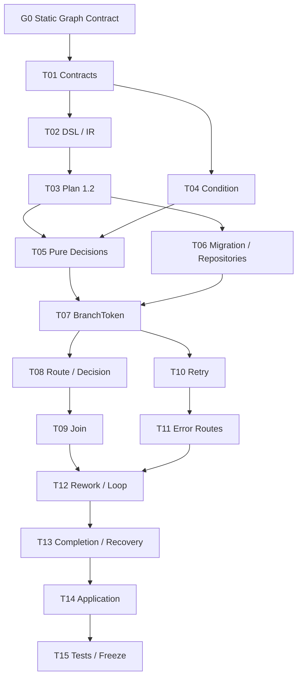

# Agentic Workflow 步骤 8 任务拆分

| 文档属性 | 值 |
| --- | --- |
| 文档版本 | 1.0 |
| 状态 | Completed（2026-07-17） |
| 规划日期 | 2026-07-17 |
| 来源规划 | `agentic-workflow-implementation-plan.md` 1.0 |
| 输入基线 | Step 4 Kernel、Step 5 Durable Execution、Step 7 Data/Artifact 均为 Completed / Stable |
| 对应范围 | 步骤 8：静态 Graph 控制流 |
| 参考投入 | 5–8 person-weeks，约 39 person-days |

## 1. 阶段目标

在引入非确定性 Agent Planner 前，把当前单链 Runtime 扩展为完整、确定性、可恢复的静态 Graph Runtime：

```text
immutable ExecutionPlan 1.2
  -> pure graph decisions
  -> BranchToken / JoinGroup facts
  -> action or controller NodeRun
  -> Retry on the same NodeRun
  -> bounded Rework / Loop as new NodeRun generations
  -> deterministic Completion Decision
```

完成后，静态 Workflow 支持条件路由、并行分支、显式 Join、Retry、错误/超时/局部取消路由、Rework 和有界 Loop；任意调度顺序、Worker 数量和进程重启都不能改变最终选择、合并结果或完成状态。

## 2. 范围边界

### 2.1 本阶段负责

- 将 Scheduler、Completion、Input Assembly 和 Graph Routing 从 Kernel UoW 操作中抽成纯 Decision 层。
- WorkflowIR / ExecutionPlan 1.2 的静态 Graph、PlanEdge、Graph Policy 和邻接索引。
- 结构化 Condition AST 的唯一生产 Evaluator。
- Action 后置路由和无 Handler 的纯 Decision Controller。
- exclusive 和 parallel route。
- BranchToken 的创建、传播、终结、跳过和恢复。
- 显式 Join：`all`、`any`、`n_of_m`、`all_successful`、`deadline`。
- Retry：同一 NodeRun、多 Attempt、Durable Backoff。
- Error、Timeout、局部 Cancel Edge 和失败处理优先级。
- Rework / Loop：新 NodeRun generation、上限和输出历史保留。
- 静态 Completion Policy、stalled 检测和恢复推进。
- Migration version 5：Graph projection 增量和 Join/Counter 持久化。

### 2.2 本阶段不负责

- Planner、Proposal、PlanPatch 或动态 ExecutionPlan；属于 Step 9–10。
- HumanTask 和“转人工”耗尽动作；Step 8 的 Retry/Rework/Loop 耗尽只支持 `fail` 或显式静态 error route。
- Foreach、动态 fan-out、Subflow 和运行时未知分支数；属于 Step 11。
- 动态修改 Join 参与者集合；Step 8 的参与边在发布 Plan 时固定。
- 跨 Run Join、跨 Workflow Token 或分布式协调。
- 删除或覆盖 Step 7 committed Value/Artifact；分支取消只终结控制责任。
- 修改旧 `server.py` Workflow Engine。

### 2.3 后续步骤接口

| 后续步骤 | Step 8 提供 | 后续步骤自行实现 |
| --- | --- | --- |
| Step 9 | Graph Summary、活动 Token、失败/Join 摘要 | Planner Context、LLM 调用与 Eval |
| Step 10 | ExecutionPlan 1.2、Graph Decision Port、Completion Policy | PlanPatch、Policy Validator、Budget、最小 HumanTask |
| Step 11 | BranchToken、JoinGroup、generation、Loop Counter | Foreach Group/Item、Subflow、动态参与者 |
| Step 12 | Graph 恢复扫描、容量指标、故障点 | 分布式协调、运维 UI、生产容量与安全加固 |

## 3. 开工前固定的设计决策

### 3.1 Contract 与版本

- WorkflowIR、ExecutionPlan 和 DSL Schema 升级为 1.2；开发期 1.1 Fixture 一次性重写，不维护 1.1 Plan 的执行分支。
- Migration 1–4、Event Envelope、Canonical JSON、ID、状态机和 Command Receipt 不变量不修改。
- BranchToken 状态仍使用 Step 1 Frozen 状态机；本阶段只补身份、scope 和事件语义。
- 新 Event 使用 v1 新类型，不修改历史 Event Payload；Replay 只消费已记录的 Route/Join/Completion 事实，不重新执行 Condition 或 Mapping。
- Condition、Graph Policy、PlanEdge、RouteDecision、JoinDecision、CompletionDecision 在 Step 8 完成后标记 Stable。

### 3.2 ExecutionPlan 1.2 图模型

ExecutionPlan 不再保存单一 `successors` 和按 target 索引的 `mappings`，改为：

- `PlanNode`：`action`、`decision`、`join`、`terminal`。
- `PlanEdge`：edge ID、source/target node 和 port、route、priority、Condition AST、Mapping AST、control policy reference。
- `outgoing_by_node`、`incoming_by_node`、`edge_by_id`：Compiler 生成的不可变索引。
- `graph_policies`：规范化 Retry、Join、Route、Rework、Loop、Completion Policy。
- `entry_node_ids` 和 `terminal_node_ids`：允许多个静态入口和终点。

除显式 Join 外，任何 Node 入度不得大于 1。静态并行可以任意嵌套；汇合必须显式写 Join，避免“多个上游谁负责启动目标节点”的隐式语义。

### 3.3 Condition Evaluator

- 输入仅包含 `source`、`workflow_input` 和已记录的静态上下文；不包含 Repository、Clock、Secret 解析值或 Python 对象。
- 支持 Step 2 已编译的 literal/ref、布尔、比较、成员测试和受限组合 AST。
- 比较类型不兼容、路径缺失和资源超限返回稳定 Condition Error，不使用 Python 隐式真值或对象比较。
- UI 只生成结构化 AST；Python 白名单字符串仅是人类 DSL 的编译入口，Runtime 不执行文本。
- Route Event 记录 Condition AST Hash、输入 Value Checksum、所有命中边和最终选择；Replay 使用该事实，不重新求值。

### 3.4 Route 模式与确定性

- `exclusive`：条件 Edge 按显式 `priority`、再按 edge ID 排序，选择第一条为 true 的 Edge；可声明唯一 default Edge，但 default 必须排序在该路由组所有条件 Edge 之后，否则 DSL Semantic 拒绝发布。Runtime 也会防御性地最后评估 default。没有条件命中且没有 default 时按 Policy fail。
- `parallel`：所有为 true 的 Edge 均选中；false Edge 产生 `not_selected` 控制事实。
- Action 在成功后可执行 route；Decision 是无 Handler Controller，输入就绪后在 Kernel 反应中完成并 route，不创建 Job/Lease/Attempt。
- Condition 评估顺序、Event 顺序、Token ID 和 Input Merge 顺序只依赖 Plan，不依赖 Worker 完成顺序。

### 3.5 BranchToken 与传播

- 每条静态 Edge Activation 对应一个确定性 BranchToken；ID 至少绑定 Run、Plan Version、source NodeRun、edge ID、generation 和 activation key。
- Entry 使用 `source_node_run_id = null` 的 root Token。
- 选中 Edge 创建 active Token；未选中 Edge 创建 not_selected Token。
- 单入边 Action 消费 active Token并执行；not_selected 到达时创建 skipped NodeRun 并继续向下传播 not_selected，直到所有显式 Join 都能收齐责任。
- Action 成功、失败、超时或局部取消会终结其入站 Token，并根据 route 创建新的 Token。
- Token Scope 固定保存 edge、target、generation、join group、loop/rework counter 和父 Token；不能依赖 Event Timeline 猜测控制责任。
- Global CancelRun 仍直接收敛整个 Run，不触发局部 cancel Edge；cancel Edge 只处理 Node/Attempt 局部取消结果。

### 3.6 NodeRun generation 与激活身份

- Retry 不创建新 NodeRun，只增加同一 NodeRun 的 Attempt Number。
- Rework 和 Loop 每次重新进入业务节点都创建新 NodeRun，`generation` 从 1 单调增加。
- NodeRun ID 固定绑定 Run、Plan Version、node ID、generation 和 activation key。
- Migration v5 为 NodeRun 增加 generation/activation identity 和唯一索引；Step 7 Value/Artifact ID 因 owner ID 不同而自然保留每轮历史。
- 同一静态激活重复到达必须命中同一 NodeRun；相同 ID 不同 Input Manifest 为 Integrity Violation。

### 3.7 Join 语义

JoinGroup 由 Run、Join Node、generation 和上游 activation scope 确定；参与者是 Plan 中固定的 incoming edge 集合。

| 模式 | 确定性触发条件 |
| --- | --- |
| `all` | 所有选中参与者成功；not_selected 为中性；任一不可恢复失败则失败 |
| `any` | 按 Edge priority 选择第一个成功者，但必须先确认所有更高优先级参与者已终结为非成功 |
| `n_of_m` | 按稳定 Edge priority 选择前 N 个成功者；成功数不可能达到 N 时提前失败 |
| `all_successful` | 等待所有参与者终结，合并全部成功者并忽略已由静态路由处理的失败；零成功按 Policy 失败 |
| `deadline` | 首个参与者到达时创建 JOIN_DEADLINE Timer；到期后按稳定顺序使用已成功参与者，且必须满足 `min_successful` |

`any` 和 `n_of_m` 不采用“墙钟先完成者”，因此并行完成顺序不会改变 winner 或输出。Join 打开后，未被选择但仍 active 的分支转 cancelled；迟到结果仍受 Lease/Fence 拒绝。

### 3.8 Join Input Assembly 与 Data Lineage

- Join 每个 Input Port 必须声明 merge mode：`single`、`array_by_edge`、`object_by_edge` 或 `first_by_priority`。
- 多写入只允许发生在 Join Input 且存在显式 merge mode；普通 Node 继续拒绝多个 writer。
- Mapping 继续调用 Step 7 的纯 `evaluate_mapping`；Input Assembler 只组合各 Edge 的 Mapping 结果。
- 合并顺序按 Plan Edge priority/ID，不按完成时间。
- `array_by_edge` 和 `object_by_edge` 仅用于 inline Value，且合并结果必须通过目标 Schema 和 1 MiB 上限。
- Artifact/Secret 多来源 V1 必须使用不同目标 Port 或 `first_by_priority` exact identity；不隐式构造 Artifact 数组或展开 Secret。
- Join Value 为新的 Node Input Value，并为所有来源建立 `mapped_from` Lineage；Artifact 为显式 consumer Link，不复制 Blob。

### 3.9 Retry Policy

Retry Policy 固定包含：匹配 Error Category/Code、`max_attempts`、backoff 类型、base/max delay。V1 不使用随机 jitter；如以后增加，只能由确定性 Hash 派生并记录 Event。

失败处理顺序固定为：

1. 验证 Lease/Fence 和 Attempt 当前状态。
2. 记录失败 Attempt 和 Usage；failed staged Artifact 不提交。
3. 若 Retry Policy 匹配且 Attempt 未耗尽：NodeRun `running -> waiting`，Job `running -> retry_wait`，创建 JOB_BACKOFF Timer。
4. Timer 到期后同一 NodeRun 创建下一 Attempt。
5. Retry 耗尽后才评估 error/timeout/cancel Edge。
6. 无匹配 Edge时形成 unhandled failure，交给 Completion Policy 失败 Run。

`unknown_external_result` 永不自动 Retry、Rework 或走普通 error route，只能保持 waiting，留给 Step 10 HumanTask/Policy；Global Cancel 可终结。

### 3.10 Error、Timeout 与 Cancel Route

- Edge route 扩展为 `success`、`error`、`timeout`、`cancel`。
- Error/Timeout Condition Context 只含结构化 ErrorInfo、Attempt 摘要和输入 checksum，不含异常对象或 Secret。
- 同一路由模式仍执行 exclusive/parallel 规则。
- 已选 error route 是“失败已被静态图处理”的事实；原 NodeRun 保持 failed，不回写 succeeded。
- Node timeout 复用 DurableTimer；Timer Fire、Attempt/Node 终态、Token 路由和后继调度必须在一个 UoW。
- CancelRun 不等价于局部取消，不能被 Workflow Edge 捕获。

### 3.11 Rework 与 Loop

- 只有显式标记 `rework` 或 `loop` Policy 的 back Edge 可以形成图环；移除这些 back Edge 后的控制图必须是 DAG。
- Rework 创建目标 NodeRun 的新 generation，记录 source generation、reason 和 mapping hash；旧输出不可覆盖。
- Loop Policy 固定 `max_iterations`、counter scope 和 exhausted action；每次 back Edge 提交原子递增持久化 Counter。
- Counter ID 按 Run、Policy、scope/generation 派生，重复 Command 不重复递增。
- V1 exhausted action 只允许 `fail` 或静态 error route；`request_human` 留 Step 10。
- Compiler 必须拒绝无上限环、多个 Policy 争用同一 back Edge和可能绕过 Counter 的旁路环。

### 3.12 Completion、Stalled 与 Recovery

- Completion Evaluator 是纯函数，输入为 Plan、Node/Token/Join/Job/Timer/Human 摘要，输出 `continue`、`waiting`、`succeed`、`fail` 或 `cancel`。
- 默认成功条件：Completion Policy 指定的 Terminal 已满足，且没有会改变结果的 active Token、Join、Job 或 Timer。
- 只要存在 Retry Timer、Join Deadline、Unknown Attempt 或后续 Step HumanTask，Run 必须有明确 waiting reason。
- `running` 且无 active Token/Job/Join/Timer/Human、未满足 Terminal 的状态立即产生 `graph_stalled` 并失败，不允许静默悬挂。
- Graph Reaction 每个 Command 有硬上限；达到上限创建可恢复 continuation，不递归占满 Python 栈或无限持有写事务。
- Recovery Scanner 查找可推进 Token/Join、过期 Join Timer和无 Job 的 ready NodeRun，提交 system-only `advance_graph`；恢复不调用 Handler 或重新评估已记录 Route Decision。

## 4. 前置门槛

### S8-G0：批准 Static Graph Contract 1.2

**状态**：Completed（2026-07-17）。

开工前必须确认：

1. IR/Plan 升级 1.2，并重写开发期 1.1 Fixture。
2. 普通多入边非法；汇合必须显式 Join。
3. `any/n_of_m` 使用稳定 priority，而不是完成时间。
4. Retry 优先于失败路由；Unknown 永不自动重试。
5. Retry 复用 NodeRun，Rework/Loop 创建新 generation。
6. 只允许有界、显式 Policy back Edge。
7. Migration 1–4 不修改；Graph 增量进入 Migration v5。
8. Replay 使用已记录 Route/Join 事实，不重新运行 Condition/Mapping。

## 5. 当前进度

| 范围 | 状态 | 当前结果 |
| --- | --- | --- |
| S8-G0 | Completed | Static Graph Contract 1.2、失败优先级及版本策略已批准 |
| S8-T01 | Completed | Graph Policy、Decision Facts、Schema、Golden 与稳定 ID 向量已落地 |
| S8-T02–T05 | Completed | DSL/IR/Plan 1.2、Condition 与纯 Decision 层已落地 |
| S8-T06–T12 | Completed | Migration v5、Token、Route、Join、Retry、异常、Rework/Loop 已落地 |
| S8-T13–T15 | Completed | Completion/Recovery、Application、测试与 Stable 冻结已完成 |

总计一个前置 Gate、15 个实现任务，按 5 个批次完成。

## 6. 任务总览

| 任务 | 内容 | 参考投入 | 依赖 |
| --- | --- | ---: | --- |
| S8-T01 | 固定 Static Graph Contract 1.2 和失败优先级 | 2.5 pd | G0 |
| S8-T02 | 升级 DSL、WorkflowIR 与 Semantic Validator | 3.5 pd | T01、Step 2 |
| S8-T03 | 实现 ExecutionPlan 1.2 Graph Compiler/Indexes | 3 pd | T02 |
| S8-T04 | 实现纯 Condition Evaluator | 2 pd | T01、T02 |
| S8-T05 | 抽取 Scheduler/Completion/Input/Route Decision 层 | 3.5 pd | T03、T04、Step 7 |
| S8-T06 | 实现 Migration v5、Graph Repository 与 UoW | 3 pd | T01、T03 |
| S8-T07 | 实现 BranchToken 生命周期与传播 | 3 pd | T05、T06 |
| S8-T08 | 实现 Decision、exclusive 和 parallel route | 2 pd | T04、T07 |
| S8-T09 | 实现 JoinGroup、合并和 Deadline | 3.5 pd | T05–T08、Step 5/7 |
| S8-T10 | 实现 Retry 与 Durable Backoff | 2.5 pd | T05–T07、Step 5/6 |
| S8-T11 | 实现 Error/Timeout/Cancel Edge | 2 pd | T08、T10 |
| S8-T12 | 实现 Rework、Loop 与 Counter 上限 | 3 pd | T07–T11 |
| S8-T13 | 实现 Completion、Stalled 和 Recovery 推进 | 2.5 pd | T07–T12 |
| S8-T14 | 提供 Application Query、诊断和组合根 | 1 pd | T13 |
| S8-T15 | 建立测试矩阵、阶段评审和 Step 9/10 移交 | 2 pd | T01–T14 |

总参考投入约 39 person-days，位于总规划 5–8 person-weeks 区间上沿。主要风险是 Join 确定性、Token 守恒、失败路由优先级和 Loop/Recovery 收敛。

## 7. 详细任务

### S8-T01：Static Graph Contract 1.2

**状态**：Completed（2026-07-17）。

定义 PlanEdge、GraphPolicy、RouteDecision、JoinDecision、CompletionDecision、Node generation、Token scope、Join mode、Retry/Rework/Loop 优先级、稳定 ID 和错误码；补 Schema/Golden/Stability Matrix。

**验收**：所有控制事实可 Canonical JSON；不存在依赖完成时间或隐式多写入的字段。

**完成记录**：新增独立 Graph 1.2 Domain Contract，未修改 ExecutionPlan 1.1、Migration 1–4 或 Frozen Event；固定 Unknown → Retry → Route → Terminate 优先级、三类稳定 ID 向量、九个 Contract Schema 和 Golden Fixture。新增 8 个契约测试，完整测试集 494 项通过。

### S8-T02：DSL / IR / Semantic

**状态**：Completed（2026-07-17）。

增加 join kind、Edge priority 和四类 route；为 Route/Join/Retry/Rework/Loop/Completion Policy 建版本化 Schema；允许显式有界 back Edge；修改 decision 无 Handler 语义和多 writer 规则。

**验收**：普通多入边、无界环、冲突 Policy、不完整 Join 和 Unknown 耗尽动作在发布前失败；UI AST 路径无需 Python 文本。

### S8-T03：ExecutionPlan 1.2

**状态**：Completed（2026-07-17）。

生成 PlanEdge、邻接/反向/priority 索引、规范化 Policy、entry/terminal 集合和 back-edge index；删除 Kernel 对单一 successor/mapping index 的依赖。

**验收**：Plan 不读取 DSL、不补默认值；相同 IR/Catalog 产生相同 Plan Hash；静态图全部引用闭合。

### S8-T04：Condition Evaluator

**状态**：Completed（2026-07-17）。

实现完整 AST、类型规则、路径诊断、资源上限、Schema/Checksum Context 和无副作用 Harness。

**验收**：相同 AST/Value 得到字节级一致结果；无 filesystem/clock/random/network；字符串表达式不能进入 Runtime。

### S8-T05：纯 Decision 层

**状态**：Completed（2026-07-17）。

建立 `graph/conditions.py`、`routing.py`、`input_assembly.py`、`joins.py`、`completion.py` 和 `scheduler.py`；Kernel 只负责加载事实、调用纯函数、校验版本并写 Event/Projection。

**验收**：Decision 单测不构造 UoW；源码守卫阻止 Repository/Clock/IO；Kernel 不再包含图选择算法。

### S8-T06：Migration v5 / Repository

**状态**：Completed（2026-07-17）。

为 node_runs 增加 generation/activation identity；为 branch_tokens 增加 edge/target/generation/group scope；新增 join_groups 和 control_counters；增加唯一约束、扫描索引和 Memory/SQLite adapter。

**验收**：Migration 1–4 字节不改；Token/Join/Counter/Event/Receipt 同事务回滚；Memory/SQLite parity。

### S8-T07：BranchToken

**状态**：Completed（2026-07-17）。

实现 root、selected、not_selected、completed、failed、cancelled 传播；建立 Token 守恒不变量、skip propagation、确定性 Event 顺序和 system advance。

**验收**：每个已激活 Edge 有且只有一个 Token；未选中路径最终抵达 Join；重复反应不重复调度。

### S8-T08：Decision / Route

**状态**：Completed（2026-07-17）。

在 Action completion 和纯 Decision Controller 中执行 Route Decision；实现 exclusive/parallel/default、稳定 priority、route fact 和后继 activation。

**验收**：并发顺序不改变 selected edge；Decision 不创建 Job；Replay 不调用 Condition Evaluator。

### S8-T09：Join

**状态**：Completed（2026-07-17）。

实现 JoinGroup 状态、五种模式、稳定 winner、Input Assembly、Lineage、JOIN_DEADLINE Timer、提前成功/失败和 loser 收敛。

**验收**：not_selected 不阻塞；any/n_of_m winner 与完成顺序无关；Timer Fire 与 Join 打开互斥且只有一个胜者。

### S8-T10：Retry

**状态**：Completed（2026-07-17）。

将 Retry Policy 接入 FailJob、NodeTimeout 和 Job/Attempt 状态；复用 Job/NodeRun，创建新 Attempt；使用 Durable Backoff Timer；Unknown fail closed。

**验收**：Retry 不生成新 NodeRun；每次只存在一个 active Lease；耗尽后只路由一次；失败 Artifact 不提交。

### S8-T11：异常路由

**状态**：Completed（2026-07-17）。

实现 error/timeout/cancel Condition Context、优先级、handled/unhandled failure、parallel error route 和局部取消；保持 Global CancelRun 语义。

**验收**：已处理失败不会提前失败 Run；无 route 的失败可诊断；Secret 不进入 Condition/Event。

### S8-T12：Rework / Loop

**状态**：Completed（2026-07-17）。

实现 back-edge Counter、generation、Input Mapping、上限、耗尽 route 和历史输出；Compiler 与 Runtime 双重检查边界。

**验收**：每轮新 NodeRun、旧 Value/Artifact 可查；重复 Command 不重复计数；超过上限确定性失败或走静态 error route。

### S8-T13：Completion / Recovery

**状态**：Completed（2026-07-17）。

实现 Completion Evaluator、Terminal Policy、waiting reason、graph_stalled、reaction limit/continuation 和 Recovery Scanner。

**验收**：不存在无原因 running；重启后 Token/Join/Retry/Loop 可继续；完成顺序不改变最终 Run 状态。

### S8-T14：Application / Diagnostics

**状态**：Completed（2026-07-17）。

提供 Graph Summary、Token/Join/Generation/Retry 查询、为何等待/未选中/未完成诊断和 system advance 组合根。

**验收**：调用方不直接访问 Repository；诊断可区分 retry_wait、join_wait、unknown_wait、stalled 和 terminal。

### S8-T15：测试与冻结

**状态**：Completed（2026-07-17）。

覆盖 Contract/Golden、Condition 属性、Decision purity、Memory/SQLite parity、并发完成排列、Join race、Timer race、Retry/Expire race、Rework/Loop、Recovery、Replay、容量和 E2E；输出 Completion Record。

**验收**：Step 1–7 全量回归通过；同一 Graph 对完成顺序的排列测试得到相同 Event-derived 结果；Step 9/10 不需重写静态控制层。

## 8. 依赖与执行批次



| 批次 | 任务 | 产物 |
| --- | --- | --- |
| A | G0、T01–T04 | Graph Contract、IR/Plan 1.2、Condition |
| B | T05–T07 | Pure Decisions、Migration v5、BranchToken |
| C | T08–T10 | Route/Decision、Join、Retry |
| D | T11–T13 | 异常、Rework/Loop、Completion/Recovery |
| E | T14–T15 | Diagnostics、并发/故障/E2E、冻结 |

可安全并行：T02 与 T04；T05 纯函数与 T06 Migration；T09 Join Decision 与 T10 Retry；T14 Query DTO 与 T15 前半测试基建。

不可绕过：没有 Token 守恒属性测试前不得启用 parallel；没有完成顺序排列测试前不得冻结 any/n_of_m；没有 Loop Counter 故障矩阵前不得允许 back Edge；没有 stalled 检测前不得标记 Step 8 完成。

## 9. 建议代码布局

```text
src/orbit/workflow/
├── domain/
│   ├── graph.py
│   ├── graph_policies.py
│   └── execution_plan.py
├── graph/
│   ├── conditions.py
│   ├── routing.py
│   ├── scheduler.py
│   ├── input_assembly.py
│   ├── joins.py
│   └── completion.py
├── runtime/
│   ├── graph_kernel.py
│   └── graph_recovery.py
├── persistence/
│   ├── graph.py
│   └── migrations.py
└── application/
    └── graph_service.py

tests/
├── fixtures/workflow_graph/v1/
├── test_workflow_graph_contracts.py
├── test_workflow_condition_runtime.py
├── test_workflow_graph_decisions.py
├── test_workflow_graph_persistence.py
├── test_workflow_branching.py
├── test_workflow_joins.py
├── test_workflow_retry_routing.py
├── test_workflow_rework_loop.py
├── test_workflow_graph_faults.py
└── test_workflow_graph_e2e.py
```

## 10. Step 8 完成定义

只有同时满足以下条件才能标记完成：

1. IR/Plan 1.2 显式保存完整静态图、Edge priority、Condition、Mapping 和 Policy。
2. Condition、Route、Join、Input Assembly、Completion 都是无 UoW/IO 的纯函数。
3. 普通 Node 多入边、无界环和不完整 Join 在发布前失败。
4. 每个 Edge Activation 有唯一 BranchToken，Token 不丢失、不重复、不跨 Run。
5. false 分支产生 not_selected 并传播，Join 不会因此永久等待。
6. exclusive/parallel 选择只依赖 Plan 和 Value，不依赖完成时间。
7. any/n_of_m winner 和 Join merge 顺序稳定。
8. Join Deadline 使用 DurableTimer，Open/Timeout 竞态只有一个事务胜者。
9. Retry 在同一 NodeRun 创建新 Attempt，不提交失败 Artifact。
10. Unknown External Result 不自动 Retry/Rework/route。
11. Error/Timeout/局部 Cancel route 在 Retry 耗尽后只执行一次。
12. Rework/Loop 每轮创建新 generation，旧输出和 Lineage 保留。
13. 所有 back Edge 有持久化硬上限，重复 Command 不重复计数。
14. Step 7 Mapping、Value、Artifact 和 Secret 边界不被绕过。
15. Replay 不调用 Condition/Mapping/Handler，只消费已记录控制事实。
16. 并行完成顺序的全排列不改变最终选择、合并和 Run 状态。
17. Run 不会无原因停在 running；waiting 必须有 Retry/Join/Unknown/Human 等明确原因。
18. Recovery 能推进 Token、Join、Retry 和 continuation，不重复 Job/NodeRun/Event。
19. Migration v5、Memory/SQLite parity、故障注入、容量和 E2E 通过。
20. Completion Record、Stable Matrix、实际投入和 Step 9/10 移交完成。

## 11. 主要风险与控制

| 风险 | 影响 | 控制 |
| --- | --- | --- |
| any 使用先完成者 | 结果随 Worker 时序变化 | Edge priority + 高优先级终结证明 |
| false 分支无 Token | Join 永久等待 | not_selected 传播和 Token 守恒测试 |
| Retry 与 error route 同时触发 | 重复执行或双路由 | 固定优先级 + 单事务 Decision Fact |
| Rework 复用 NodeRun | 覆盖历史和幂等冲突 | generation + activation identity |
| 多来源输入隐式覆盖 | 数据丢失、顺序相关 | Join merge mode + 稳定 Edge 排序 |
| Join open 与 deadline 同时发生 | 双重调度 | JoinGroup Expected Version + Timer Fence |
| 循环只靠内存计数 | 重启后无限循环 | 持久化 Counter + Event + 原子递增 |
| Kernel 继续膨胀 | 无法验证控制逻辑 | Pure Decision modules + source guard |
| Replay 重算条件 | 新版本代码改变历史 | route/join decision Event 是恢复事实 |
| active 责任丢失 | Run 静默 running | Completion Evaluator + graph_stalled |

## 12. 开始实现前检查清单

1. 评审 PlanEdge、GraphPolicy 和 ExecutionPlan 1.2 Schema。
2. 固定 BranchToken、JoinGroup、Counter 和 NodeRun generation ID 向量。
3. 固定五种 Join 的成功、失败、not_selected 和 winner 矩阵。
4. 固定 Retry/Error/Timeout/Cancel/Unknown 优先级。
5. 固定 Join Input merge mode 和 Artifact/Secret 限制。
6. 固定 Migration v5 和历史 Migration 不变性。
7. 先写 completion-order permutation 和 Token conservation 属性测试。
8. 先写 Join Open/Deadline、Retry/Expire、Loop Counter kill-point 测试。
9. 固定 stalled/waiting reason 与 Recovery advance Command。
10. 确认 Step 9 Planner 只能读取 Graph Summary，不能直接创建 Token。

## 13. Completion Record

**完成日期**：2026-07-17  
**结论**：S8-G0 与 S8-T01–T15 全部完成，Step 8 可作为 Step 9 Planner Context 和 Step 10 动态 PlanPatch 的稳定静态图基线。

### 13.1 已交付

- DSL、WorkflowIR 与 ExecutionPlan 1.2：显式 Graph Edge、Route、Join、Retry、Rework/Loop Policy 及不可变邻接索引。
- 纯 Decision 层：Condition、Routing、Input Assembly、Join、Scheduler 与 Completion 均不访问 UoW 或外部系统。
- Migration v5：NodeRun generation/activation、BranchToken 图字段、JoinGroup、ControlCounter 及 Memory/SQLite Repository。
- Kernel：exclusive/parallel route、not_selected 传播、显式 Join、同 NodeRun Retry、新 generation Loop/Rework、稳定终态判断与 graph_stalled。
- Durable Runtime：Retry Backoff、Join Deadline、局部 timeout/cancel 收敛以及 Graph Reaction continuation。
- Recovery 与诊断：`advance_graph`、controller 恢复推进、Graph Summary、projection integrity 检查。
- Replay：Route/Join/Token/Counter 使用已记录事实恢复，不重新调用 Condition、Mapping 或 Handler。

### 13.2 Stable Matrix

以下契约在 Step 8 完成后标记为 Stable：

- `execution_plan_v1_2`
- `static_graph_contract_1_2`
- `graph_policy`
- `graph_decision_facts`
- `graph_runtime_decisions`
- `graph_persistence_v5`

Event Envelope、状态机、ID、幂等和事务不变量继续保持 Frozen；Planner、PlanPatch、Agentic Region 与成本估算继续保持 Draft。

### 13.3 验证与移交

- 新增 20 个 Step 8 专项测试（8 个契约测试、12 个 Runtime/Decision 场景），覆盖静态契约 Golden、Schema 路径诊断、稳定 ID、DSL Semantic、default fallback、Plan round-trip、Join 完成顺序、并行 Token、Retry、Loop 上限、事务故障回滚、continuation 恢复及 Memory/SQLite Kernel parity。
- Kernel 级双分支测试执行 `left -> right` 与 `right -> left` 两种完整完成顺序，断言 Run、Node、Join 和 Token 终态一致；同时显式断言每个静态 Edge Activation 恰有一个唯一 Token，且全部控制责任收敛。
- Step 9 只通过 Graph Summary 读取活动 Node、Token、Join、generation 和 waiting reason；不得直接写 projection 或创建 Token。
- Step 10 的 PlanPatch 必须继续经 Kernel 唯一入口，并复用本阶段的确定性 Route/Join/Completion 语义。
- Planner、HumanTask、Foreach、Subflow 和动态参与者仍明确不属于 Step 8。

### 13.4 实际布局与规划偏差

- 第 9 节的代码布局是建议结构，不是已交付目录清单。实际实现保留六个独立纯图模块，但事务编排集中在 `runtime/kernel.py`，Graph Query 合并在 `application/runtime_service.py`，没有创建薄包装的 `runtime/graph_kernel.py` 或 `application/graph_service.py`。
- 测试按契约与 Runtime 行为合并为 `test_workflow_graph_contracts.py` 和 `test_workflow_graph_runtime.py`，没有机械拆成建议的十个文件；测试边界由测试类和场景名表达。
- `runtime/kernel.py` 在 Step 8 完成时约 1286 行。图算法已抽到纯模块，但事实装载、Event 生成和 projection 写入仍集中；为避免 Step 10 PlanPatch、HumanTask 和 Budget 继续放大单文件，拆分已升级为 S10-G0 前置门槛。
