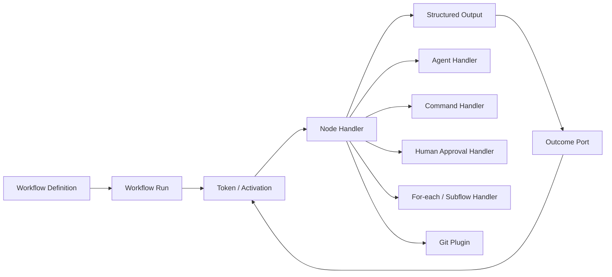
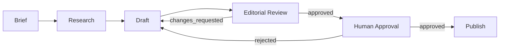
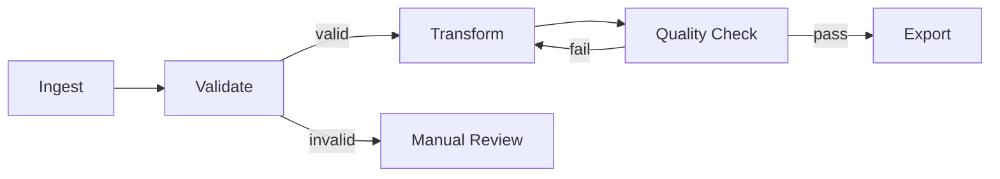
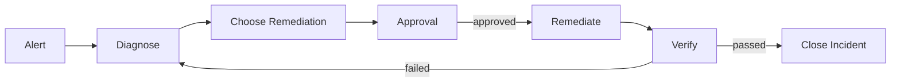

# Orbit 通用工作流图设计

## 1. 背景与目标

Orbit 当前的图拓扑能力已经具备较好的通用基础，包括有向图、分支、汇合、回退边、环路识别、入口与终点识别，以及活跃节点计算。真正限制 Orbit 使用范围的并不是画布或图算法，而是节点能力、执行协议和运行状态仍然绑定软件开发流程。

本文目标是将 Orbit 演进为：

> 通用工作流内核 + 可插拔节点处理器 + 领域工作流模板

软件开发仍然作为内置模板存在，但 Git worktree、代码审查、测试和集成不再是工作流引擎的固有概念。内容生产、数据处理、人工审批、运营流程和故障处置等场景应使用同一套图与执行模型。

## 2. 当前实现评估

### 2.1 已经通用的部分

`workflow_graph.py` 已支持：

- 有向图拓扑；
- 入口节点与终点节点识别；
- 前向边和回退边；
- 分支与汇合；
- required 节点可达性检查；
- 活跃节点和运行节点计算；
- 有界 rework 所需的 transition 记录。

这些能力可以直接复用于开发之外的工作流。

### 2.2 受开发流程限制的部分

#### 节点能力由 ID 决定

当前部分能力通过节点 ID 判断：

- 只有 `implement`、`review`、`test` 支持多个 Agent；
- 只有部分设计节点和 `decompose` 支持人工审批；
- `intake`、`integrate`、`decompose` 被强制设为 required；
- `implement`、`review` 在 UI 中不可删除；
- `implement`、`review`、`test` 带有不可编辑的开发专用执行约束。

这导致语义相同但名称不同的节点无法获得同样能力。例如 `editorial_review` 和 `legal_review` 无法自然复用 `review` 的审批或多 Agent 能力。

#### 节点类型被表达成布尔 flag

当前节点使用如下字段表达特殊执行行为：

```json
{
  "isolate": true,
  "integrate": false,
  "decompose": false,
  "approval_required": false
}
```

这些字段主要来自 Git 开发流程。继续增加领域能力会产生越来越多互斥或组合复杂的布尔字段，例如 `publish`、`send_email`、`foreach`、`wait`、`human_input`。

#### 边只有普通前进和 rework

当前边主要区分：

- 普通前向边；
- `rework: true` 回退边。

通用工作流通常需要表达更多结果：成功、失败、驳回、超时、跳过、人工介入、条件成立、条件不成立，以及领域自定义结果。

#### 数据传递以文本为主

节点之间主要通过 `upstream_result` 传递文本。这适合 Agent prompt，但不适合可靠表达：

- 结构化表单；
- 审批决定；
- 文件和 artifact 引用；
- 数据集引用；
- 批量 item；
- 条件判断所需字段。

#### Goal 拆解是引擎内建语义

当前引擎直接负责：

- 解析 `decompose` 输出；
- 创建业务子任务；
- 处理 `depends_on`；
- 释放被依赖关系挂起的任务；
- 聚合子任务状态；
- 在主分支执行 goal verify。

其中 `decompose` 本质上是一个 `foreach/map` 节点，依赖释放属于 join/dependency 语义，`goal_verify` 属于 workflow-level validator。它们不应长期作为核心引擎中的开发专用规则。

## 3. 总体架构



核心引擎只负责：

1. 读取和校验图定义；
2. 激活满足条件的节点；
3. 调用节点 handler；
4. 保存 node run、输出和事件；
5. 根据结果端口路由；
6. 处理并发、汇合、重试、循环上限和恢复；
7. 判断 workflow run 是否结束。

领域行为由 handler、validator 和模板提供。

### 3.1 执行组件边界

通用化后必须避免把所有能力都称为 handler。运行时组件分为四类：

| 组件 | 职责 | 示例 |
|---|---|---|
| Node handler | 执行节点的业务动作并返回结果 | Agent、shell、人工审批、Git merge |
| Environment provider | 创建、复用和清理执行环境 | project root、临时目录、Git worktree、容器 |
| Validator | 在 handler 完成后客观校验结果 | shell verify、schema validator、workflow validator |
| Guard / middleware | 在执行前后实施横切策略 | 互斥、预算、权限、超时、重试 |

`git.worktree` 是 environment provider，不是 node handler。`git.merge` 可以是 action handler，但迁移时必须明确执行主体：当前流程由 Agent 根据 prompt 执行 merge、处理冲突并给出验收结论，不能在迁移时无提示地改成引擎自动 merge。开发模板首版应继续使用 Agent handler，并将 Git merge 指令作为受保护 contract；后续可另行提供自动化 `git.merge` handler。

## 4. 通用工作流定义

```json
{
  "schema_version": 2,
  "definition_id": "content_publish",
  "revision": 7,
  "requires": {
    "engine": ">=2.0",
    "capabilities": ["outcome_ports"]
  },
  "name": "Content publishing",
  "inputs_schema": {},
  "nodes": [],
  "edges": []
}
```

建议顶层包含：

| 字段 | 说明 |
|---|---|
| `schema_version` | 配置结构版本，用于 schema 迁移 |
| `definition_id` | 工作流稳定标识 |
| `revision` | 定义修订号；每次保存产生不可变的新 revision |
| `requires` | 运行定义所需的最低引擎版本和 capability 集合；启动前必须校验 |
| `name` | 展示名称 |
| `inputs_schema` | 工作流输入 JSON Schema |
| `variables` | 默认变量和运行参数 |
| `nodes` | 节点定义 |
| `edges` | 带结果端口和条件的连接 |
| `result_mapping` | 工作流最终输出映射 |
| `ui` | 画布、缩放和布局等展示信息 |

### 4.1 定义版本与运行快照

Schema 版本和业务定义版本必须分离。`schema_version` 回答“如何解析这个文件”，`revision` 回答“某次运行使用了哪一版流程”。

创建 `workflow_run` 时必须固定定义：

- 保存不可变的 `(definition_id, revision)` 引用，并保证该 revision 永不原地修改；或
- 直接在 run 上保存完整 definition snapshot。

运行过程中编辑画布只生成新 revision，不影响已经开始的 run。恢复、重试、审批和回退始终使用 run 固定的定义。现有 v1 工作流仍维持“活跃 Goal 期间禁止编辑”的保护；迁移到 revision 模型后才允许新旧 revision 并存运行。

## 5. 通用节点模型

```json
{
  "id": "editorial_review",
  "name": "Editorial review",
  "type": "action",
  "handler": "agent",
  "executor": {
    "agents": ["editor-a", "editor-b"],
    "strategy": "round_robin",
    "max_agents": 3
  },
  "input": {
    "article": "$.nodes.draft.output.article"
  },
  "output_schema": {
    "type": "object",
    "properties": {
      "verdict": {
        "enum": ["approved", "changes_requested"]
      },
      "comments": {
        "type": "array"
      }
    }
  },
  "timeout_seconds": 1800,
  "retry": {
    "max_attempts": 2
  },
  "ui": {
    "x": 600,
    "y": 200
  }
}
```

节点 ID 只负责标识，不再决定节点能力。示例中 `input` 使用的 `$.nodes.draft.output.article` 是简化引用形式，完整的作用域引用语法见 §8.2。

节点 schema 的完整字段集（本文各节引用的字段都收录于此，schema 以本表为单一来源）：

| 字段 | 说明 | 定义处 |
|---|---|---|
| `id` / `name` / `type` | 标识、展示名、节点类型 | §5、§6 |
| `handler` | 执行该节点的 handler 名 | §9 |
| `executor` | 执行者分配：`agents`、`strategy`、`max_agents`、`command_overrides`、`rework_affinity` | §5.1 |
| `input` | 输入字段映射 | §8.2 |
| `output_schema` | 结构化输出 JSON Schema（第二版启用） | §8 |
| `ports` | 声明的业务结果端口 | §7 |
| `default_port` | 进程成功但未输出端口时的默认端口 | §7.2 |
| `unrouted` | 端口无出边时是否允许视为分支正常终止 | §7.3 |
| `timeout_seconds` / `retry` | 超时与重试策略（attempt 计数，区别于循环 iteration） | §7.4 |
| `environment` | 执行环境：`type`、`scope`、`cleanup` | §5.2、§5.3 |
| `exclusive` | 互斥键，同键节点全局串行 | §5.3 |
| `contract` | 不可编辑的受保护执行约束（如 git_merge、legacy_decompose） | §3.1、§15 |
| `enabled` / `removable` / `skippable` | 模板默认启用、可否删除、可否人工跳过（v1 `required` 的拆分） | §6.5 |
| `join_policy` | 汇合节点的等待策略 | §6.5 |
| `terminal` | 显式标记终点（与 End 节点二选一） | §6.6 |
| `approval_required` | 附着式审批开关（completion policy） | §6.2 |
| `ui` | 画布坐标等展示信息 | §13 |

### 5.1 执行器配置

`executor` 显式声明分配策略：

```json
{
  "agents": ["agent-a", "agent-b"],
  "strategy": "round_robin",
  "max_agents": 3,
  "command_overrides": {
    "agent-a": "agent-a --json"
  }
}
```

可支持的策略包括：

- `single`：固定单执行者；
- `round_robin`：按节点独立轮转；
- `least_busy`：选择当前负载最低的执行者；
- `all`：所有执行者并行执行；
- `quorum`：收集一定数量的独立结果。

第一阶段可以只实现 `single` 和 `round_robin`。

此外必须保留现有引擎的返工亲和性语义：同一任务沿 rework 边回到某节点时，应分配给上一轮执行该节点的同一执行者，而不是继续推进轮转游标。该行为在现有实现中是刻意设计（返工反馈只有原执行者拥有完整上下文），通用化后作为显式字段保留：

```json
{
  "strategy": "round_robin",
  "rework_affinity": "same_executor"
}
```

`rework_affinity` 取值：`same_executor`（默认，与现状一致）或 `next_in_rotation`。

### 5.2 执行环境

将 worktree 从节点布尔字段改为通用执行环境：

```json
{
  "environment": {
    "type": "git.worktree",
    "scope": "workflow_item",
    "cleanup": "on_terminal"
  }
}
```

非开发流程可以使用：

```json
{
  "environment": {
    "type": "project_root"
  }
}
```

以后还可扩展临时目录、容器或远程执行环境，而无需修改图算法。

### 5.3 共享环境与互斥资源

按节点声明 environment 不足以表达现有的关键语义：implement、review、test 共用**同一个 per-task worktree**（review 必须读到 implement 的产物）。环境必须有独立于节点的身份和生命周期：

- `scope` 决定环境实例的归属：`node_run`（每次执行新建）、`workflow_item`（同一 item 内所有声明相同 environment 的节点共享一个实例）、`workflow_run`（整个 run 共享）；
- 环境实例由第一个进入该 scope 的节点触发创建，由声明的 `cleanup` 策略销毁（`on_terminal`、`on_success`、`manual`）；
- 同一 scope 内声明相同 `environment.type` 的节点读写同一实例，这是 v1 中 implement/review/test 共享 worktree 的通用化表达。

互斥资源同样需要通用对应物。现有 integrate 步骤在主树串行执行（`exclusive_workspace`），这不是 Git 特有需求——内容流程的"发布"节点、运维流程的"变更执行"节点同样不能并发。节点可声明：

```json
{
  "exclusive": "project_root"
}
```

引擎对同一互斥键的节点执行全局串行化。`exclusive` 是核心引擎概念，不属于 Git handler。

## 6. 节点类型

目标形态共六种节点类型（首版只交付其中三种，见 §17 的范围裁剪）。

| 类型 | 作用 |
|---|---|
| `action` | 执行 Agent、shell command 或其他 handler |
| `approval` | 等待人工批准、驳回或补充信息 |
| `decision` | 根据结构化输入或输出选择结果端口 |
| `foreach` | 将数组展开为多个并行 item |
| `join` | 等待全部、任一、quorum 或指定数量的分支 |
| `end` | 明确结束并生成 workflow result |

### 6.1 Action

用于当前的 intake、设计、implement、review 和 test，也可用于内容撰写、数据清洗和运营操作。

### 6.2 Approval

审批支持两种形式，各有明确适用场景，不再互相替代：

**附着式（默认，v1 迁移目标）**：审批作为 action 节点的 completion policy（`approval_required: true` 的通用化）。现有实现刻意采用此设计（"Human approval belongs to the preceding step's completion state, never to a separate workflow node"），理由是：审批对象天然是前置节点的产出，驳回反馈天然回到产出节点重做，无需额外画边；UI 上审批和返工反馈内联在产出节点的卡片上。v1 的 `approval_required` 迁移到此形式，保留已有的审批交互不变。区别于 v1：任意 action 节点都可启用，不再限定于设计类节点。

**独立节点（通用新增）**：当审批本身是流程主体（多级审批链）、驳回需要路由到**非产出节点**、或审批人需要在多个上游产出间做选择时，附着式表达不了，使用独立 approval 节点：

```json
{
  "id": "legal_approval",
  "type": "approval",
  "handler": "human",
  "ports": ["approved", "changes_requested", "cancelled"]
}
```

模板默认使用附着式；独立节点是图作者的显式选择。

### 6.3 Decision

Decision 节点只读取结构化字段，不解析自然语言：

```json
{
  "id": "quality_gate",
  "type": "decision",
  "rules": [
    {"when": "$.quality.score >= 80", "port": "pass"},
    {"when": "$.quality.score < 80", "port": "revise"}
  ]
}
```

表达式不自造 DSL，直接采用 [JSONLogic](https://jsonlogic.com/)：规则本身是纯数据（JSON），无任意代码执行面，实现和安全审查成本都远低于自定义解析器，且天然覆盖字段比较、布尔组合、数组长度和空值判断。上例规范形式：

```json
{
  "rules": [
    {"when": {">=": [{"var": "quality.score"}, 80]}, "port": "pass"},
    {"when": {"<": [{"var": "quality.score"}, 80]}, "port": "revise"}
  ]
}
```

工作流定义必须记录 `expression_language: {name: "jsonlogic", version: "1", profile: "orbit-safe-v1"}`。Orbit 不承诺支持某个第三方实现的全部扩展操作符；`orbit-safe-v1` 只开放比较、布尔组合、`var`、数组长度和空值判断，并禁止自定义函数、动态代码、文件和环境变量访问。保存配置和启动 run 时都要用同一解释器执行静态校验测试，避免不同版本产生不同路由结果。

Decision 节点依赖阶段三的结构化输出才有实际价值，因此不进入首版交付范围（见 §17）。

### 6.4 For-each（item DAG）

注意：当前 `decompose` **不是纯 map**。拆解产生的子任务之间存在动态 `depends_on`（拆解时按 architecture 模块生成的兄弟依赖），引擎负责依赖释放——item B 等 item A 合入后才开始。纯 foreach（独立 item 并行 + join 收口）表达不了这个语义，照搬会砍掉现有能力。

因此该节点的通用形式是 **item DAG 调度**：items 是运行时产生的一组 item，每个 item 可声明对兄弟 item 的依赖，节点内部按 DAG 就绪顺序调度：

```json
{
  "id": "process_items",
  "type": "foreach",
  "items": "$.nodes.plan.output.items",
  "item_depends_on": "$.item.depends_on",
  "body": "item_subflow",
  "max_concurrency": 4
}
```

- 每个 item 获得独立 scope，包含自己的节点运行、输出和状态；
- `item_depends_on` 缺省为空，此时退化为普通并行 foreach；
- 依赖释放（一个 item 到达其 body 的终态后唤醒等待它的兄弟）是该节点 handler 的职责，从核心引擎的开发专用规则迁出。

### 6.5 Join

显式声明汇合策略，替代通过 required predecessor 隐式推断：

```json
{
  "id": "collect_reviews",
  "type": "join",
  "policy": "all"
}
```

支持：

- `all_activated`（默认，即下文的 `all`——等待本次 run/item scope 中实际激活的全部上游分支）；
- `any`；
- `quorum`；
- `count`；
- `all_successful`。

`all` 是 `all_activated` 的别名；不提供"等待所有静态入边"的策略，理由见下文条件分支说明。

#### Required 与 Join 的拆分

v1 的 `required` 同时承担静态校验、UI 可选性和汇合等待条件，通用模型中必须拆开：

```json
{
  "enabled": true,
  "removable": false,
  "skippable": false,
  "join_policy": "all_activated"
}
```

- `enabled`：模板中是否默认启用；
- `removable`：图作者能否删除节点；
- `skippable`：运行时能否人工跳过；
- `join_policy`：汇合节点如何等待实际进入本次运行的分支。

Join 不能只观察“当前已经激活的上游”，否则一个快分支先到达时，另一个稍后才激活的分支会导致 Join 过早执行。每次 fork/decision 路由必须创建一个 correlation group：

```text
correlation key = (workflow run, item scope, iteration, join activation)
```

对于该 group，Join 的每条声明入边都必须最终处于以下状态之一：

- `selected`：本轮路由选择了该分支，Join 必须等待它的 token；
- `arrived`：该分支 token 已到达 Join；
- `not_selected`：条件或 decision 明确排除了该分支；
- `cancelled`：分支已被显式取消；
- `failed` / `blocked`：分支以非成功状态结束。

Fork 在一次事务中记录本轮实际选中的出边，并为能够汇入同一 Join 的分支建立 correlation lineage。Decision 未选择的互斥分支必须产生 `not_selected` 闭合事件，不能简单地什么都不写。嵌套 fork 继承父 lineage，并为内层 Join 创建子 correlation group。

Join 只有在其声明的所有入边都已“闭合”（arrived、not_selected、cancelled、failed 或 blocked）后，才能评估策略并决定是否激活。这样既不会等待未选择的条件分支，也不会因为慢分支尚未激活而提前执行。

各策略的剩余分支语义必须固定：

- `all` / `all_activated`：等待全部 `selected` 分支到达；`not_selected` 不参与数量计算；
- `all_successful`：任一已激活上游 failed/blocked 时，join 自身 blocked；
- `any`：首个满足条件的 token 激活 join，其余分支默认继续运行但结果不再触发该 join；可显式配置 `remaining: cancel`；
- `quorum` / `count`：达到阈值后激活，未完成分支按 `remaining: continue|cancel` 处理。

从 v1 迁移时先保留现有 required predecessor 算法，不自动插入 Join 节点；只有用户保存为 v2 或显式添加 Join 后才使用新策略，避免迁移时改变图结构。

### 6.6 End

通用工作流应显式声明结束节点，而不是只通过“没有出边”推断终点。

兼容读取 v1 时，无普通出边的节点继续视为隐式 End，不修改用户文件。保存为 v2 时，编辑器可提示用户选择：保留 `terminal: true` 的 action，或生成显式 End 节点；不得静默改变终点结果映射。

## 7. Outcome Port 与边模型

使用结果端口替代 `rework: true`：

Port 分为两类：

- **业务 port**：仅在 handler execution status = `succeeded` 时由 handler 返回，例如 `approved`、`invalid`、`changes_requested`；
- **引擎保留 port**：由运行时根据执行状态生成，例如 `error`、`blocked`、`timeout`、`cancelled`。Handler 不能伪造这些名称。

因此 execution status 仍保留真实结果。例如进程异常退出时 node run 是 `failed`，引擎可沿 `error` port 路由到人工处理节点；路由不会把原 node run 改写成 succeeded。若保留 port 没有出边，则 workflow 保持对应失败或阻塞状态。

### 7.1 保留端口路由后的 Workflow 状态

原 node run 的状态与 workflow run 的可推进状态分开计算：

- 保留端口存在匹配出边并成功激活恢复节点时，原 node run 保持 `failed`、`blocked`、`cancelled` 等真实状态；workflow run 继续为 `running`，恢复节点若等待人工输入则 workflow run 显示为 `waiting`；
- 保留端口没有匹配出边时，workflow run 才进入对应的 `failed`、`blocked` 或 `cancelled` 终止/暂停状态；
- 匹配出边存在但恢复节点无法激活（配置错误、缺少 handler、输入映射失败）时，workflow run 进入 `blocked`，同时记录原始故障和恢复失败两个 event；
- 恢复节点成功完成后，不回写原 node run；它通过自己的业务 port 继续路由。审计视图必须同时展示“原节点失败”和“恢复路径成功”；
- 同一个保留端口只能在一个 correlation group 中消费一次，防止恢复节点被重复激活。

Goal/UI projection 取 workflow run 状态，而不是看到任意历史 blocked node 就永久显示 blocked。详情页仍展示失败节点及 blocked reason。

```json
[
  {
    "from": "editorial_review",
    "port": "approved",
    "to": "publish"
  },
  {
    "from": "editorial_review",
    "port": "changes_requested",
    "to": "draft",
    "max_iterations": 3
  },
  {
    "from": "editorial_review",
    "port": "blocked",
    "to": "manual_resolution"
  }
]
```

建议边字段包括：

| 字段 | 说明 |
|---|---|
| `from` | 来源节点 |
| `port` | 来源节点的结果端口 |
| `to` | 目标节点 |
| `condition` | 可选结构化条件 |
| `priority` | 多条条件边的评估顺序 |
| `max_iterations` | 循环边最大进入次数 |
| `mapping` | 输出到目标输入的字段映射 |

旧配置迁移规则：

- 普通边迁移为 `port: success`；
- `rework: true` 迁移为 `port: rework`；
- 没有 blocked 出边时，blocked 继续表示暂停等待人工处理。

### 7.2 首版自定义端口协议

首版交付 outcome port，但完整 JSON 结构化 output 延后，因此必须提供轻量文本协议，不能只依赖现有固定枚举的 `WORKFLOW_OUTCOME`：

```text
WORKFLOW_PORT: approved
RESULT_SUMMARY: Editorial review passed
ARTIFACTS: ["article.md"]
```

规则如下：

1. `WORKFLOW_PORT` 必须匹配节点声明的 port；
2. 同一输出出现多次时取最后一个，并在 run event 中记录协议警告；
3. 未输出 port 时，进程成功默认走节点的 `default_port`，没有默认值则进入 blocked；
4. 输出未声明 port 时进入 blocked，保留原始输出并通知 supervisor；
5. 兼容期继续接受 `WORKFLOW_OUTCOME: done/rework/blocked/approval`：前三个映射到 `success/rework/blocked`；`approval` 映射到附着式审批的等待态——execution status = `waiting`，走现有审批流，批准后发出 `success`（与 §10.2 第 4 个示例一致），不新增业务 port；
6. 第二版启用结构化 JSON 后，JSON 中的 `port` 优先于文本协议，但两者冲突必须记录警告。

该协议使内容发布等首版模板可以返回 `approved`、`changes_requested`，而不必等待完整结构化数据流。

### 7.3 未匹配端口的路由语义

必须明确定义，不能留给实现：

- **静态校验**：节点 `output_schema` / `ports` 中声明的每个端口，要么有出边，要么在节点上显式标注 `unrouted: allowed`（表示该端口到达即视为此分支正常终止）。既无出边也未标注的端口是图校验错误——`workflow_execution_errors` 需要升级为 port 感知。
- **运行时兜底**：节点发出了声明之外的端口（handler bug 或 agent 输出异常），任务进入 `blocked` 并通知 supervisor（迁移期由现有 hub 承担，见 §11），与现有 blocked 行为一致。永远不静默丢弃。

### 7.4 循环计数的作用域

边级 `max_iterations` 的计数器作用域必须明确：

- 计数器键 = `(workflow run, item scope, 边)`：每个 foreach item 的循环独立计数；不同来源边进入同一目标节点分别计数；
- 到达上限的行为与现有全局 rework cap 一致：任务 `blocked`，通知 supervisor，人工可重置计数并恢复；
- 迁移期全局 rework cap 作为所有循环边的默认 `max_iterations` 继续生效，边级配置覆盖全局默认。

Retry 与循环必须分开计数：retry 是同一 node activation 因执行故障或协议错误产生的新 attempt，不发出 token、不增加边 iteration；循环是节点成功产生业务 port 后沿回边形成的新 activation，会增加 `max_iterations` 计数。UI 和审计日志分别展示 attempt 与 iteration。

## 8. 结构化数据流

每次节点执行应产生：

```json
{
  "port": "approved",
  "output": {
    "comments": [],
    "artifact": "article.md"
  },
  "summary": "Editorial review passed",
  "artifacts": [
    {
      "type": "file",
      "uri": "article.md"
    }
  ]
}
```

其中：

- `port` 用于控制流；
- `output` 用于可靠的数据流；
- `summary` 用于 UI 和下游 Agent 的人类可读上下文；
- `artifacts` 用于文件、链接、数据集和报告引用；
- 原始 stdout/stderr 继续保存在 run log 中。

Agent 可以继续输出文本协议，但 runner 必须将其规范化为统一结构。条件节点和字段映射不得依赖自然语言解析。

### 8.1 规范化失败的语义

CLI Agent 稳定输出符合 per-node `output_schema` 的 JSON 是不可假设的（现有实现只有 decompose 一处做 JSON 解析，失败时把原始输出留在卡片上可查）。通用化后每个节点都可能解析失败，行为必须统一定义：

1. 解析或 schema 校验失败 → 按节点 `retry` 配置重试，重试 prompt 附带失败原因和期望 schema；
2. 重试耗尽 → 节点进入 `blocked`（不是 `failed`——`failed` 表示 handler 执行故障，业务结果由 outcome port 表达），原始输出完整保留可查，通知 supervisor；
3. 无 `output_schema` 的节点跳过校验：原始文本进入 `summary`，`output` 为空对象，只能走无条件出边。

Decision 节点和条件边的可靠性完全取决于上游节点规范化成功，这是把 decision 节点排除出首版的直接原因。

### 8.2 数据引用与作用域

`$.nodes.draft.output` 只适用于没有循环和 foreach 的简单 run。完整引用必须带明确作用域，避免同一节点在不同 item 或 iteration 中运行多次后出现歧义：

```text
$.run.inputs                         工作流输入
$.run.variables                     run 级变量
$.scope.item                        当前 foreach item
$.scope.iteration                   当前循环轮次
$.nodes.draft.latest.output         当前 scope 中最新一次成功输出
$.nodes.draft.runs[2].output        指定 node run 输出
$.join.inputs[*].output             Join 收集到的上游输出
```

规则如下：

- 默认引用只允许访问当前 workflow run 和当前 item scope，禁止跨 run；
- 循环节点引用未限定 run 时，`.latest` 只选择当前 iteration 之前最新一次 succeeded 输出；
- foreach body 中的节点输出按 item 隔离，父 scope 必须通过 Join 或 foreach aggregation 显式收集；
- Join 输出必须声明 aggregation，例如 `list`、`object_by_source`、`first` 或自定义受信 handler；
- artifact URI 必须绑定 run/scope，不能仅以相对文件名作为全局身份；
- 字段缺失默认是映射错误并进入 blocked，只有映射显式声明 optional/default 时才允许继续。

## 9. Handler 注册机制

引擎不应直接识别 Git、Agent 或 shell：

```python
NODE_HANDLERS = {
    "agent": AgentHandler(),
    "command": CommandHandler(),
    "human": HumanApprovalHandler(),  # 与 §6.2 节点示例的 handler: "human" 一致
    "foreach": ForEachHandler(),
    "subflow": SubflowHandler(),
    "git.merge": GitMergeHandler(),
}

ENVIRONMENT_PROVIDERS = {
    "project_root": ProjectRootEnvironment(),
    "git.worktree": GitWorktreeEnvironment(),
}
```

统一接口示例：

```python
class NodeHandler:
    def prepare(self, context): ...
    def execute(self, context): ...
    def cancel(self, run): ...
    def recover(self, run): ...
```

Handler 的执行结果统一为：

```json
{
  "port": "success",
  "output": {},
  "summary": "Completed",
  "artifacts": []
}
```

软件开发模板启用 Git handler；内容生产或审批流程不加载这些能力。

## 10. 运行模型

建议逐步从“根据 task transitions 推断当前步骤”演进为 token/activation 模型。

### 10.1 Token 规则

1. Workflow 启动时向入口节点投递 token；
2. 节点满足激活条件后创建 node run；
3. 节点完成后从选定 port 发出 token；
4. Join 根据策略消费多个上游 token；
5. For-each 为每个 item 建立独立 scope；
6. 循环边创建新 iteration；
7. 没有可执行 token且结束条件满足时，workflow run 完成。

#### 事务、幂等与崩溃恢复

运行时采用 **at-least-once** 执行语义，不能声称外部 side effect 天然 exactly-once。引擎必须提供：

- 稳定的 `node_run_id`、`attempt` 和 `idempotency_key`；
- node run 结果落库与输出 token 创建在同一 SQLite 事务完成；
- claim/lease 保证同一 attempt 同时只有一个执行者；
- handler 声明 `idempotency: guaranteed|keyed|none`；
- retry 复用同一业务 idempotency key，同时递增 attempt；
- publish、发邮件、付款、生产变更等非幂等 handler 必须将 key 传给下游系统，或在崩溃后进入 `needs_confirmation`，禁止自动重放。

关键崩溃窗口的处理：

```text
外部操作成功 → 进程崩溃 → 结果尚未落库
```

若 handler 无法通过 idempotency key 查询操作结果，引擎只能将 node run 标为 `needs_confirmation`，由人工确认“视为成功”或“重新执行”。`recover()` 不能默认重新调用非幂等 `execute()`。

### 10.2 状态模型

执行状态和业务结果必须正交，不能同时用 `failed` 表示“执行器崩溃”和“业务检查正常发现不合格”。

Node run 的执行状态统一为：

```text
pending
ready
running
waiting
succeeded
failed
blocked
cancelled
skipped
needs_confirmation
```

业务结果只通过 outcome port 表达，例如：

```text
approved / changes_requested
valid / invalid
published / rejected
success / rework
```

示例：

- 校验程序正常运行并发现数据不合格：execution status = `succeeded`，port = `invalid`；
- Agent CLI 无法启动或进程异常退出：execution status = `failed`，不产生业务 port，按 retry policy 处理；
- 输出无法解析或违反 schema：execution status = `blocked`，等待修复协议或人工介入；
- 人工审批尚未完成：execution status = `waiting`；批准后变为 `succeeded` 并发出 `approved` port。

领域展示状态与运行状态分离。例如软件开发模板可以将 `succeeded` 的终点映射为 Accepted，内容模板可以映射为 Published。

### 10.3 持久化模型

建议逐步引入：

```text
workflow_definitions
workflow_runs
node_runs
workflow_tokens
workflow_variables
workflow_events
artifacts
```

现有 `tasks`、`task_transitions` 和 `run_jobs` 可暂时保留：

- `workflow_runs` 关联现有 Goal；
- `node_runs` 可由 task transition 和 task run 双写生成；
- 当前任务看板继续作为 projection；
- 新旧配置通过 schema version 区分。

不建议第一阶段立即重写全部数据库。

### 10.4 Goal 与现有 UI 的兼容验收

“通过 projection 保持兼容”必须落实为可测试的不变量：

1. 未迁移的 v1 Goal、普通任务、step card、task run、artifact 和 transition 继续正常显示；
2. v1 活跃 Goal 始终使用启动时读取的 v1 配置，不在运行中切换到 v2 revision；
3. v2 `workflow_run` 在 Goal 页面仍投影为一个 Goal，foreach item 投影为现有业务子任务，item body 的 node run 投影为 step card；
4. `waiting` approval 映射到当前 `workflow_step` 和现有批准/请求修改操作；
5. blocked reason、rerun、skip、force close、预算冻结与恢复必须在新旧 run 上保持等价行为；
6. token budget 统计覆盖一个 run 的所有 item scope 和 node attempt，但重试不得重复计算同一 provider 已报告的 token；
7. 历史 run 固定显示自己的 definition revision、节点名称和图快照，不能使用当前最新模板重绘；
8. v1 transition 无法可靠反推出 token 时不做推测性回填：已有活跃 run 继续由旧引擎完成，新 token runtime 只接管新启动的 v2 run；
9. `/api/goals` 和现有 Goal UI 在迁移期保持响应字段兼容；新增通用字段只能追加，不能静默改变旧字段含义。

以上每一项都需要自动化迁移测试和至少一个持久化数据库 fixture。

## 11. 软件开发流程的映射

| 当前概念 | 通用模型 |
|---|---|
| intake/product design/architecture | `action(handler=agent)` |
| implement/review/test | `action(handler=agent)` |
| approval_required | action completion policy（附着式审批，见 §6.2） |
| decompose | `foreach`（item DAG，见 §6.4） |
| 子任务间 depends_on 与依赖释放 | `foreach.item_depends_on`，由 foreach handler 调度 |
| required predecessors | v1 保留旧算法；v2 显式汇合迁移为 `join(policy=all_activated)` |
| integrate | 首版仍为 `action(handler=agent)` + Git merge contract；未来可选 `action(handler=git.merge)`；两者均使用 `exclusive: project_root` |
| exclusive_workspace / 主树串行 | 节点 `exclusive` 互斥键（见 §5.3） |
| implement/review/test 共享 worktree | `environment.scope = workflow_item`（见 §5.3） |
| 返工回原 Agent | `executor.rework_affinity = same_executor`（见 §5.1） |
| verify | node validator |
| goal_verify | workflow validator |
| worktree | execution environment |
| rework edge | outcome port + `max_iterations` |
| 卡死巡检 hub 命令 = Decompose 首个 Agent | workflow 级 `supervisor` 显式配置 |
| goal token budget | workflow run 级 `variables`（预算与用量归 run，不归节点） |

两个此前隐式的耦合点需要显式落点：

- **卡死巡检**：现状用"Decompose step 首个 Agent 的命令"充当 hub 巡检命令，这是隐式角色假设，decompose 变 foreach 后失去锚点。通用模型中监督者是 workflow 级显式配置（`supervisor: {agent, command}`），与任何节点解耦。
- **token 预算**：goal 级预算和冻结/恢复逻辑迁移为 workflow run 级变量与引擎级 guard，不依赖任何特定节点 ID。

开发专用 prompt、Git 行为和默认产物路径应进入 `software-development` 模板，不进入核心 schema。

## 12. 非开发流程示例

### 12.1 内容发布



### 12.2 数据处理



### 12.3 故障处置



## 13. UI 设计

当前图画布和 Dagre 布局可以继续使用。主要需要改造节点编辑器和边编辑器。

### 13.1 节点面板

新增节点类型选择（首版面板只提供 Action、Approval、End 三种，与 §17 的交付范围一致；其余类型随后续版本开放）：

- Action；
- Approval；
- Decision；
- For-each；
- Join；
- End。

选择类型后，根据服务端提供的 handler schema 动态生成配置表单，不再在前端维护：

```javascript
MULTI_AGENT_STEPS
APPROVAL_CAPABLE_STEPS
NON_REMOVABLE_STEP_IDS
```

### 13.2 端口

节点应显示输入端口和多个结果端口：

```text
                ┌──────────────────┐
article ───────▶│ Editorial Review │── approved ─────▶
                │                  │── changes ──────▶
                │                  │── blocked ──────▶
                └──────────────────┘
```

### 13.3 边编辑器

连接或选择边时允许配置：

- 结果端口；
- 条件；
- 优先级；
- 最大循环次数；
- 输入映射。

### 13.4 模板

提供以下内置模板：

- 软件开发；
- 内容生产；
- 数据处理；
- 人工审批；
- 故障处置；
- 空白工作流。

模板只生成通用节点配置，不添加引擎特例。

## 14. 迁移方案

### 阶段一：去除节点 ID 特权

目标是在不改数据库的情况下，让现有引擎可以表达大部分非开发流程。

具体修改：

- 使用 `executor.max_agents` 和 `executor.strategy` 替代 `_MULTI_AGENT_STEP_IDS`；
- 允许任意节点配置审批；
- 使用 `enabled`、`removable`、`skippable`（见 §6.5）替代特殊 ID 的 required/锁定规则；
- 将不可编辑约束迁移到节点 `contract`；
- 增加 `handler`；
- 使用 `environment` 替代 `isolate`；
- 将 `integrate` 显式化为 Agent handler + Git merge contract + `exclusive=project_root`；自动化 `git.merge` handler 作为后续可选迁移；
- UI 完全依据服务端 schema 渲染能力。

兼容层继续将旧字段转换为新字段。

### 阶段二：Outcome Port

- 为节点声明输出 ports；
- 边增加 `port`；
- 将普通边迁移为 `success`；
- 将 rework 边迁移为 `rework`；
- 支持自定义结果端口；
- 循环上限从全局 rework 次数逐步迁移到边级别。

### 阶段三：结构化输入输出

- 节点声明 input mapping；
- 节点声明 output schema；
- runner 将 Agent 输出规范化为结构化结果；
- artifact 成为一等数据；
- Decision 和条件边只使用结构化字段。

### 阶段四：For-each（item DAG）、Join 和 Subflow

- 引擎具备 `structured_output` 和 `foreach.item_dag` capability 后，提供 `legacy.decompose` 到 producer action + item-DAG For-each 的原子升级；`item_depends_on` 承接现有子任务依赖释放语义（见 §6.4、§15）；
- 使用 Join 替代隐式 required predecessor 汇合；
- 支持可复用子工作流；
- 引入 item scope 和 workflow variables（goal token 预算迁入 run 级 variables）。

### 阶段五：开发能力插件化

将以下功能移出核心引擎：

- Git worktree；
- Git merge；
- 自动测试命令检测；
- 软件开发 prompt contract；
- `docs/product.md`、`docs/ui.md` 和 `docs/architecture.md` 等默认约定。

它们进入软件开发模板和 Git handler。

### 阶段六：Token 运行时

在前述 schema 稳定后，再引入 workflow run、node run、token 和 variable 表。通过双写和 projection 保持现有 Goal 看板兼容。

## 15. 兼容策略

配置读取时执行升级，不立即重写用户文件：

```text
v1 step（任意 id）
  → handler = agent
  → executor.strategy = round_robin（多 Agent 步骤）
  → executor.rework_affinity = same_executor

v1 isolate=true
  → environment = {type: git.worktree, scope: workflow_item}
    （scope 必须是 workflow_item：implement/review/test 共享
     同一 per-task worktree，见 §5.3；映射按 isolate 字段，
     不按 step id）

v1 integrate=true
  → handler = agent + contract = git_merge + exclusive = project_root
    （首版保持 Agent 执行 merge，见 §3.1；自动化 git.merge
     handler 是后续可选迁移，不在兼容映射中默认启用）

v1 decompose=true
  → type = action
  → handler = legacy.decompose
  → contract = legacy_decompose

v1 edge.rework=true
  → edge.port = rework
```

`decompose` 不能直接一对一改写成纯 foreach：当前节点既调用 Agent 生成任务列表，又调度带兄弟依赖的 items。阶段一至阶段三由 `legacy.decompose` handler 完整保留现有行为，不依赖结构化 output、foreach 或 token runtime。

只有引擎声明支持 `structured_output` 和 `foreach.item_dag` capability 后，编辑器才能提供原子升级：

```text
legacy.decompose
  → producer = action(handler=agent, contract=legacy_decompose_output)
  → scheduler = foreach(items=producer.output.tasks,
                        item_depends_on=$.item.depends_on)
```

升级必须同时写入 producer、scheduler、两者之间的映射和新的 definition revision；任一步校验失败都保持原 revision 不变。新建工作流推荐在图上显式画出这两个节点。

读取定义时必须先校验顶层 `requires.engine` 和 `requires.capabilities`。缺少 capability 的定义只允许查看和导出，不能启动；保存操作也不得把当前引擎不能执行的节点类型写入新 revision。

只有用户主动保存工作流时才写入 v2 schema，并保留备份或提供导出功能。

旧 API 在迁移期继续返回兼容字段，UI 切换完成后再逐步删除。

## 16. 风险与约束

### 不应直接支持任意代码条件

边条件必须使用受限表达式语言，避免配置文件成为任意代码执行入口。具体选型为 JSONLogic（见 §6.3），不自造 DSL。

### 模板分发即命令分发

节点的 handler 命令和 `command_overrides` 本来就是任意 shell，这在单机自用时可接受；但通用化后模板会被导出和分享，**导入外部模板 = 导入可执行命令**。导入流程必须完整展示模板包含的全部命令并要求用户确认，模板不应在未审阅的情况下自动获得可运行状态（现有"步骤未选 Agent 不能启动"的门槛在导入场景同样生效）。

### Secret、权限与 artifact 边界

- 工作流定义只能保存 secret 引用，例如 `${secret:cms_token}`，不能保存 secret 明文；
- secret 只在 handler 启动时注入，日志、prompt、event、output 和导出模板必须统一脱敏；
- handler 声明 capability，例如 `filesystem.write`、`network`、`git.merge`、`publish`，首次启用模板时逐项展示并确认；
- 默认文件访问限制在 project root 或分配的 environment root，解析 symlink 后仍必须校验边界；
- artifact URI 必须经过 provider 注册和校验，禁止通过 `../`、绝对路径或伪造 URI 越界读取；
- Decision/JSONLogic 永远无权直接读取环境变量、secret、文件和网络；需要这些数据时必须由受审计 handler 显式产生普通字段；
- API 返回 node output 前执行字段级敏感信息过滤，不能只依赖 handler 自觉。

### 循环必须有边界

任何可能形成循环的边应声明 `max_iterations`，或继承工作流默认上限。

### Handler 必须可取消和恢复

节点 handler 需要定义取消、超时和崩溃恢复行为，否则通用化后会增加永久挂起的运行。

### Schema 与执行器能力需要版本化

工作流定义需要记录 schema version；handler 也应暴露版本和能力，避免配置依赖未安装的插件。

### 不要过早实现完整 BPMN

近期重点应是节点能力配置化、outcome port 和结构化数据。补偿事务、复杂事件网关和跨组织消息等 BPMN 能力不属于首版范围。

## 17. 建议的近期交付范围

第一个可用版本建议只完成：

1. 节点能力不再依赖 ID（含 `rework_affinity`、`exclusive`、`environment.scope` 的显式化）；
2. `action`、`approval`（附着式为主）、`end` 三种节点；
3. `success`、引擎保留的 `error/blocked/timeout/cancelled`（与 §7 的保留端口枚举一致）和自定义业务 outcome port，含 §7.2 的文本协议及 §7.3 的未匹配端口语义；
4. 边级循环次数限制（含 §7.4 的计数作用域）；
5. 软件开发、内容发布、数据处理三个模板；
6. v1 工作流兼容读取。

以下明确移出首版：

- **Decision 节点**：依赖阶段三的结构化输出才有实际价值（见 §6.3、§8.1），随结构化数据流一起交付；
- **前端动态节点属性编辑器**：首版节点类型少、字段固定，静态表单即可，动态 schema 渲染随 handler 生态扩大再做；
- **JSON 结构化 output**：整体移入第二版，与 decision、字段映射同批交付——它是三者中实现风险最高的一项（Agent 输出规范化，见 §8.1），不应拖住去 ID 特权和 outcome port 的落地。

For-each（item DAG）、Join、Subflow 和完整 token runtime 在第二或第三个版本实现。

## 18. 结论

Orbit 不需要推翻现有图算法。最合理的演进方向是：

1. 保留当前图拓扑与 transition 基础；
2. 首先消除 step ID 特权；
3. 将节点能力改为显式配置；
4. 将 rework 边升级为 outcome port；
5. 增加结构化数据流；
6. 将 decompose、Git worktree、merge 和 goal verify 逐步迁移为 handler；
7. 最后再演进为 token runtime。

完成前两阶段后，Orbit 即可自然表达大部分非开发工作流，同时保持现有软件开发流程和 Goal 看板兼容。
