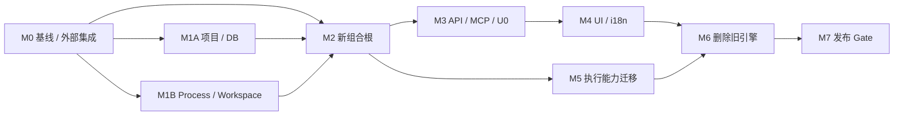

# Agentic Workflow Runtime 清洁迁移方案

> 文档版本：1.0  
> 状态：Implementation Plan  
> 适用分支：`agentic-workflow-runtime`  
> 前置文档：[Agentic Workflow 实现规划](agentic-workflow-implementation-plan.md)、[UI API 契约](ui/agent-workflow-ui-api-contract.md)、[UI 可实施设计](ui/agent-workflow-ui-implementation.md)

## 1. 目标

本迁移将 Orbit 从旧的 `Goal / Task / Message / run_jobs / scheduler / runner` 引擎一次性切换到 `Workflow IR + ExecutionPlan + Runtime Kernel + Durable Worker + Artifact + Planner`。迁移完成后，仓库只保留一套工作流语义、一套数据库、一组版本化 API 和一套 UI。

本方案明确：

1. 不迁移旧 `messages.db` 中的任何数据，包括旧 Goal、Task、Message、Run，以及已经由新 Runtime 写入该文件的 WorkflowVersion、Event、Plan、Artifact、HumanTask、Budget 等数据。
2. 不兼容旧 API、旧 CLI 参数、旧 `workflow.json` 或旧 UI URL。
3. 不做双写、影子写、旧新状态同步或长期 Feature Flag。
4. 新 Runtime 的 Event、Command、Projection 和 Migration 契约仍然有效；“不兼容”只针对旧引擎，不允许绕过新 Runtime 已冻结的不变量。
5. 切换失败时只通过 Git 回退代码，不承诺把新数据库降级给旧引擎读取。

## 2. 核心架构决策

### 2.1 唯一状态入口

所有运行状态改变必须经过：

```text
UI / CLI / Recovery / Worker
          |
          v
Versioned Command API
          |
          v
Application Service
          |
          v
Runtime Kernel + UnitOfWork
          |
          v
Event + Projection + Command Receipt
```

禁止保留任何旁路：

- HTTP Handler 不直接更新 Projection。
- Worker 不直接完成 NodeRun 或 Run。
- UI 不从 Event 重建状态、不推导按钮。
- Scheduler 不读取配置后自行决定下一个步骤。
- Recovery 不直接修表，必须提交已注册的 Repair Command。

### 2.2 Goal 不建立第二套状态机

旧系统的 Goal 生命周期全部删除。新 UI 中的 **Goal 是根 Run 的产品视图**：

- 新建 Goal：提交 `GoalSpec`，选择 WorkflowVersion，然后发送 `start_run`。
- `goal_id`：MVP 直接使用根 `run_id`，不再创建独立 `goals` 表。
- Goal 状态：直接映射 Run 的 Event-derived 状态，不单独存储或推进。
- Goal Plan：读取该 Run 的当前 ExecutionPlan；PlanPatch 产生新 PlanVersion。
- Goal Steps：读取 NodeRun/Join/BranchToken 等 Runtime Projection。
- Goal 历史：读取 Timeline、PlanVersion 和 Artifact，不读旧 Task Transition。
- Goal Wizard 草稿：只存在于浏览器内存；提交成功前不是服务端领域对象。

如果未来确认一个 Goal 必须管理多个独立根 Run，再通过 ADR 引入 Goal Aggregate；本次迁移不得提前创建空壳表或第二状态机。

### 2.3 数据库只保留新 Runtime Schema

新安装只创建 `src/orbit/workflow/persistence/migrations.py` 定义的新 Runtime Schema。旧 `Store._TABLE_SCHEMA`、旧 `_migrate()` 和以下表全部退出产品：

```text
agents
messages
tasks
task_transitions
task_runs
workflow_actions
run_jobs
```

项目数据库文件改名为 `runtime.db`，不得继续使用带旧语义的 `messages.db`。默认路径切换后不打开、不导入旧数据库；但必须只通过文件系统存在性检查检测同项目旧路径。若旧 `messages.db` 存在，`orbit serve` 以及使用默认数据库的 CLI 在执行前输出一次明确警告：该文件可能同时包含旧引擎数据和迁移前已经写入的新 Runtime 数据，本次切换会全部放弃。检测不得连接 SQLite、读取表或提供复制/导入建议。

显式 `--db` 只允许指向通过新 Runtime Schema 校验的数据库；不得借此继续运行旧混合数据库。不存在旧文件时保持安静。

新 Runtime 现有 Migration Ledger 不因本次切换被压平；Fresh Database 顺序执行已评审 Migration。新增 API/Audit 等持久化需求只能按现有 Ledger 增量提交。

### 2.4 单机组合根

`orbit serve` 是唯一默认产品入口，并在同一进程内管理：

```text
Starlette Web App
├─ Versioned Query/Command API
├─ New Workflow UI
├─ Durable Worker Pool
├─ Durable Timer Dispatcher
├─ Planner Dispatcher
├─ Recovery Scanner
└─ Graceful Shutdown / Health / Metrics
```

所有后台组件由 Starlette lifespan 创建和停止；禁止在 `create_app()` 中启动无法追踪的 daemon thread。单项目默认只打开一个 Runtime 数据库，各 Worker 使用独立连接/UoW。

### 2.5 URL 与 CLI 一次切换

最终 HTTP 路由只保留：

```text
GET  /ui
GET  /ui/assets/*
/api/v1/*
/mcp
/health/live
/health/ready
```

`GET /ui` 返回 `index.html`，CSS、JavaScript、字体和图标统一从 `/ui/assets/*` 读取。MVP 使用 hash navigation，不增加任意 SPA fallback；静态资源路由只能处理 GET/HEAD，绝不能承载 mutation。`/mcp` 是独立的 MCP 协议端点，不属于 REST `/api/v1`，但必须使用同一个新 Runtime composition root、身份和 Capability Policy。开发期的 `/workflow-ui` 在最终切换时改为 `/ui`；旧 `/ui` 内容和未版本化 `/api/*` 同时删除，不提供重定向或别名。

默认 CLI：

```text
orbit serve
orbit workflow validate
orbit workflow publish
orbit run start
orbit run inspect
orbit db check
```

这组 CLI 是交付契约，不只是目标示例：M1A 实现顶层 `orbit db check`，M3 实现 `orbit run start` 和 `orbit run inspect`，M7 执行安装包级 CLI 测试。`orbit db check` 取代当前 `orbit workflow db-check`，不保留嵌套别名。

旧 `orbit start/up`、`orbit config/init`、message、task、agent mailbox 和 `orbit runner` CLI 全部删除。若将来需要独立 Worker，使用新的 `orbit worker`，不得复用旧 runner 命令和 `run_jobs`。

## 3. 最终代码结构

建议迁移后的顶层结构：

```text
src/orbit/
├─ __main__.py                  # 仅保留新 CLI 参数解析
├─ platform/
│  ├─ projects.py              # 项目根、runtime.db 路径、项目索引
│  ├─ process.py               # 进程组、流式输出、终止
│  └─ lifecycle.py             # 受控后台服务生命周期
├─ workspace/
│  └─ git.py                   # 可选 Git worktree provider
├─ web/
│  ├─ app.py                   # 唯一 composition root
│  ├─ auth.py                  # 本地身份、ACL
│  ├─ mcp.py                   # /mcp 协议 Adapter
│  ├─ middleware.py            # Request ID、安全头、错误边界
│  └─ static.py                # UI 静态资源
├─ workflow/                   # 现有新 Runtime，不复制进 web/app.py
└─ static/workflow-ui/
   ├─ index.html                # GET /ui
   └─ assets/                   # GET /ui/assets/*
      ├─ app.css
      ├─ app.js
      └─ locales/
         ├─ zh-CN.json
         └─ en-US.json
```

`web/app.py` 只负责装配 Port/Adapter 和生命周期，不承载状态机、路由决策、Planner Policy 或数据库 SQL。

## 4. 保留、重构与删除边界

### 4.1 保留并抽离

| 当前能力 | 迁移方式 | 最终归属 |
|---|---|---|
| 项目根识别 | 去掉 `.dev_loop` fallback 后抽离 | `platform/projects.py` |
| 项目 ID、项目索引、在线探测 | 更新健康检查 URL 和 DB 文件名 | `platform/projects.py` |
| Starlette/uvicorn 启动方式 | 保留框架，重写 composition root | `web/app.py` |
| Git worktree 创建/回收 | 去除整数 task_id 和旧 Store 依赖 | `workspace/git.py` |
| 进程组终止、超时、输出采集 | 合并到新 Handler Process Adapter | `platform/process.py` |
| Verify/Git 集成能力 | 转为受信 ToolHandler | `workflow/handlers/` |
| Agent CLI/Hermes profile 发现 | 重写为可信 Handler Adapter 注册源；只产生受控 Manifest，不产生 DSL 可执行命令 | `workflow/catalogs/agent_discovery.py` |
| MCP 外部集成 | 保留 `/mcp` 协议入口，改接新 Application Service/Read Model/Command | `web/mcp.py` |

### 4.2 只复用能力，不复用旧实现

以下能力需要使用新接口重写：

- Runner 日志：写入 Artifact，不写旧 `task_runs.log_dir`。
- Token/Cost：通过 UsageMeter/Budget Ledger，不解析后更新旧 Goal。
- Cancel：通过 Job/Lease/Attempt/Run Command，不写 `cancel_requested`。
- Timeout：使用 DurableTimer 和 Handler Deadline，不使用旧 watcher 扫 Task。
- Health：读取 Worker/Timer/Recovery 状态，不扫描旧 assignee/task。
- Inbox：聚合 HumanTask、Approval、Budget 和 Recovery Responsibility，不读取 Message。

### 4.3 完全删除

最终删除：

- `src/orbit/store.py`
- 旧的 `src/orbit/server.py`；新 Web 入口不得在原文件上继续堆叠
- `src/orbit/static/ui.html`
- 开发期单文件原型 `src/orbit/static/workflow-ui.html`；M4 拆分并验证模块化资源后删除
- 旧 Goal/Task/Message/Workflow engine、scheduler、runner、hub sweep、goal verify sweep
- `workflow.json` 和旧 Settings 中的固定开发流程定义
- 未版本化旧 `/api/*` 路由
- 只验证旧 Store、旧引擎或旧 UI 的测试与 fixture
- 文档中把旧引擎描述为当前架构的章节

删除测试不等于降低覆盖：Git worktree、进程取消、项目索引等被保留能力，必须先迁移到新模块并保留等价或更严格测试。

## 5. 实施阶段

迁移共 8 个主阶段，其中 M1 拆成 M1A/M1B 两个可独立验收的工作包。阶段 M0–M5 只向新路径增加能力；M6 执行破坏性删除；M7 是发布 Gate。禁止在 M3–M5 通过调用旧 Engine 临时补齐新 API。

### M0：冻结切换边界和真实基线

**任务**

1. 将本文作为旧引擎删除的唯一范围基线。
2. 记录当前新 Runtime 全量测试结果、Migration 版本和 Schema Golden。
3. 重新运行完整测试并核对 Step 10–12 Completion Record、ADR 和代码事实；只把本次复核仍然失败或缺失的项目列入阻断清单，不沿用历史红灯结论，也不因上一轮曾报告全绿而跳过复核。
4. 更新 UI API 契约的部署图：目标态保留 `/ui`、`/ui/assets/*`、`/api/v1/*`、`/mcp` 和 Health 路由。
5. 增加架构 Guard 测试框架，先记录、暂不阻断旧依赖。
6. 将本文加入版本控制并要求架构评审；未入库的本地文件不能充当删除范围基线。
7. 建立受版本控制的 `tests/migration/external_integrations.json`：至少扫描 `.codex/config.toml`、CLI help、Web Route Manifest、webhook 配置、脚本和文档链接；为每个 MCP/webhook/工具端点记录 Consumer、当前 URL、目标 URL、认证、迁移负责人、Contract Test 和处置（保留/替换/明确废弃）。未分类的外部入口阻断 M2/M6。
8. 建立旧测试归属清单 `tests/migration/legacy_test_disposition.json`（或等价受版本控制文件），逐个 Test ID 标记 `migrate`、`rewrite` 或 `delete`，并记录目标阶段、Replacement Test ID 或删除理由。

**Gate M0**

- 新 Runtime 当前测试基线可重复。
- 未完成能力没有被文档标记为 Completed。
- 每个旧能力都有删除或替代归属。
- 本文可由 Git 跟踪、Diff 和评审，不再被 `docs/` ignore 规则排除。
- `/mcp`、webhook 和外部脚本等所有已发现 Consumer 都有明确目标与负责人；当前 `.codex/config.toml` 指向的 `/mcp` 必须归类为“保留并重写”，不能随旧 server 静默消失。即使 M0 发现当前 `/mcp` 实现已经缺失或配置陈旧，也必须把它记录为待恢复/待通知的外部契约，不能用“当前已不可用”作为静默删除理由。
- 旧引擎约 281 个测试全部有逐项 disposition，不允许只按文件删除。

**旧测试归属的初始分组**

| 旧测试文件 | 当前数量 | 默认处置 | 必须保留/重写的能力 |
|---|---:|---|---|
| `test_workflow_engine.py` | 140 | 旧 Goal/Task 推进语义删除；其余逐项迁移 | Agent 命令发现、进程取消、恢复/健康和通用验证行为 |
| `test_worktree.py` | 80 | M1B 全部重写到新 Workspace/Process Port | acquire/release、并发、脏树、集成、崩溃清理 |
| `test_store.py` | 30 | 旧 CRUD/Message/Task Lease 删除 | 项目路径场景迁到 M1A；Durable 语义由新 Runtime Contract 覆盖 |
| `test_packaging.py` | 27 | 按能力拆到 M0/M3/M4/M6/M7 | 包内容、静态资源、CLI、MCP、Agent Discovery；旧 workflow config 场景删除 |
| `test_project_index.py` | 4 | M1A 重写 | 项目索引、在线探测、并发写入 |

数量只是审计线索，不是质量目标。允许因删除旧状态机而减少测试数量，但每个被删除 Test ID 都必须有领域删除理由；任何仍保留的产品能力必须先有 Replacement Test ID，M6 才能删除原测试。

### M1A：抽离项目、路径和数据库入口

**任务**

1. 新建 `platform/projects.py`，迁移项目根、项目 ID、索引和路径逻辑。
2. 固定新数据库名 `runtime.db`，删除 `.dev_loop` 和 `messages.db` fallback；实现只做 `Path.exists()` 的旧文件警告。
3. 修改 `project_index.py` 或将其并入 platform；在线探测改为 `/health/ready`。
4. 将 Workflow publish、serve、db check 的默认路径全部切换到新项目模块。
5. 实现顶层 `orbit db check`，直接调用新 Runtime Integrity/Application Service；删除当前 `orbit workflow db-check` 的产品文案，旧命令在 M6 物理移除。
6. 为 `runtime.db` 默认路径、旧文件警告、显式错误 Schema、`orbit db check --json` 和退出码补 CLI 测试。

**Gate M1A**

- 项目模块不 import `server.py`、`store.py` 或 Workflow Domain。
- Fresh project 只生成 `runtime.db`。
- 旧 `messages.db` 存在时发出一次非静默放弃警告，但没有 SQLite open/read。
- `orbit workflow publish`、`orbit serve` 和 `orbit db check` 使用同一个默认路径。

M1A 是不可发布的开发过渡态：此时 `orbit serve` 尚未由 M2 切换到新组合根，旧 Engine 可能在新命名的 `runtime.db` 中创建旧表。该文件只作为开发期一次性数据，不能进入 fixture、发布包或后续验收基线。M2 切换组合根时必须删除并从空文件重新执行新 Runtime Migration；不得在混合 Schema 上继续开发或用“反正 M6 会删”掩盖污染。

### M1B：抽离 Process 与 Workspace 能力

**任务**

1. 从旧 `server.py` 的进程、取消、日志和 Git 代码中先建立行为清单，不直接搬运闭包或 Store 调用。
2. 新建 `platform/process.py`，提供并发安全的 `ProcessHandle`、进程组终止、流式 stdout/stderr、输出上限和脱敏接口。
3. 新建 `workspace/git.py`，使用 `run_id/node_run_id` 或独立 `workspace_ref`，不接受旧 task_id。
4. 将 `test_worktree.py` 中可复用的行为场景迁到新模块测试；测试不得 import `orbit.server` 或 `orbit.store`。
5. 补并发执行、取消竞态、僵尸进程、路径穿越、symlink、脏工作区、重复 acquire/release 和崩溃清理测试。

**Gate M1B**

- Process/Workspace 模块不 import 旧 Engine 或 Store。
- Worktree 与 Process Adapter 并发、取消、路径穿越和清理测试通过。
- 新 Handler 可通过 Port 使用这两个模块，不依赖旧 Task/Runner Record。

### M2：建立唯一生产组合根

**任务**

1. 新建 `web/app.py:create_app()`。
2. 装配 WorkflowVersion Store、UoW、Kernel、Durable Runtime Service、Handler Registry、WorkerRuntime、TimerDispatcher、Planner、Recovery 和 Artifact Backend。
3. Handler Registry 在 Worker 启动前 seal；不注册任意 Shell 或不可信网络 Handler。
4. 使用 lifespan 管理 Worker Pool、Timer、Planner 和 Recovery 的启动、停止与错误传播。
5. 每个 Worker 使用独立 Executor/Process Client 或并发安全的 execution_ref 句柄表。
6. 实现 `/health/live` 和 `/health/ready`；ready 必须检查数据库、Migration、Catalog、后台组件状态。
7. 重写 `orbit serve` 使用新组合根，不启动旧 scheduler/runner/watcher。
8. 切换组合根前删除 M1A 过渡期 `runtime.db`，从空文件执行新 Runtime Migration；启动时用 Schema allowlist 拒绝混合旧表的数据库。
9. 为外部协议预留独立、可测试的 Mount 边界；MCP 不得通过 import 旧 server 获得 Store 或路由能力。

**Gate M2**

- `orbit serve` 在空目录创建新数据库并启动。
- 组合根拒绝包含旧表的混合 Schema；M2 验收数据库只包含新 Runtime 表。
- 一个静态 Workflow 可以完成 StartRun → Job → Handler → CompleteRun。
- 重启后 Job、Lease、Timer 和未完成 Run 能恢复。
- 关闭进程不会留下运行中的本地 Handler 子进程。

### M3：完成版本化 API 与 U0 Gate

**任务**

1. 将 `build_workflow_api` 实际挂载到组合根，并改造成统一 Query/Command 边界。
2. 将开发期 `src/orbit/static/workflow-ui.html` 明确挂载到新组合根的 `/workflow-ui`，仅用于 U0.3 真实进程 smoke；它是只读原型入口，不得增加 mock mutation API，并在 M4 被模块化 UI 替换和删除。
3. 完成版本化 DTO、Opaque Cursor、Stable Error 和 Projection Version。
4. 增加 RunSummary 分页、Run Detail 分页、Inbox、Responsibilities 和 AllowedCommand。
5. 新建 Goal 对应 `start_run`：请求体携带 GoalSpec、WorkflowVersion、初始 Budget 和输入 Artifact。
6. 所有 mutation 使用统一 Command Envelope、Idempotency-Key、Expected Version、认证和授权。
7. Read API 同样执行 ACL；Artifact、Raw Planner Response、Human Form、Ops 单独授权并审计。
8. 补齐 Cancel、Human Submit、Budget Add、Approval、Recovery Takeover/Apply。
9. 修复 API Receipt 崩溃窗口，只允许基于领域事实 reconciliation。
10. 同源部署，不为本地 UI 增加宽松 CORS。
11. 实现 `orbit run start`：接受 Workflow ID/Version、GoalSpec/Input、初始 Budget、Actor 和 `--json`，使用与 HTTP 相同的 Application Command/校验，不直接写数据库。
12. 实现 `orbit run inspect`：按 run_id 输出 Run Summary、当前 Plan/Responsibility 摘要，支持稳定 `--json`；不得从 Event 在 CLI 内自行投影。
13. 两个 run CLI 必须复用 M1A 的默认数据库解析和旧文件警告，不得各自重新实现路径规则。
14. 为 run start 的幂等/非法版本/预算错误和 run inspect 的不存在/等待/终态输出补 CLI Contract Tests。
15. 新建 `web/mcp.py` 并挂载 `/mcp`：MCP Tool/List/Call 只调用新 Runtime Application Service、Read Model 和统一 Command；写操作复用身份、Capability、幂等和 Expected Version，不得暴露任意 SQL、旧 Task/Message 或未注册 Handler。
16. 为 `/mcp` 增加真实 Streamable HTTP/协议 Contract Test，至少覆盖 initialize、tool discovery、只读 inspect、授权写命令、无权限、版本冲突、服务重启和 `.codex/config.toml` 配置的 smoke。
17. 新建可信 Agent CLI Discovery：只扫描组合根 allowlist 中的 CLI 和 Hermes profile，生成不可变 Handler Manifest/Adapter 配置，经 Policy 校验后在 Registry seal 前注册；DSL、UI 和 Planner 都不能提交任意 command/path。
18. 提供受 ACL 保护的 `/api/v1/handler-catalog` Authoring Read DTO，返回 installed/available/capabilities/profile identity，不返回 Secret 或可拼接 shell 字符串；迁移现有 agent-tool/profile 检测测试。

**Gate M3（等同 UI U0.1–U0.4）**

- DTO/Schema/Golden/Contract Tests 通过。
- Read/Write 权限、幂等、版本冲突和敏感数据测试通过。
- 长 Timeline、大 Graph、分页和故障注入通过。
- 除复用同一 Command/Policy 边界的 `/mcp` 协议 Adapter 外，`/api/v1` 之外不存在可改变 Runtime 状态的 HTTP 路由。
- `orbit run start` 与 `orbit run inspect` 的 help、成功、错误、JSON 和退出码契约通过。
- `/mcp` 在真实 `orbit serve` 下可连接且只触达新 Runtime；MCP 与 REST 对相同 Command 使用同一权限和版本语义。
- Authoring UI 能读取可信 Handler Catalog，Registry seal 后不能热插入或把发现结果改成任意命令。

### M4：把新 UI 从原型切换到真实 Runtime

**任务**

1. 将单文件原型拆为 `index.html/app.css/app.js` 或等价模块；删除内嵌 mock domain 数据。
2. Goal 列表使用 RunSummary；Goal Detail 使用 Run/Plan/NodeRun Read DTO。
3. New Goal Wizard 最终只提交一次 `start_run`，浏览器不保存服务端草稿状态。
4. 所有按钮只渲染 `allowed_commands[]`，不根据 status/kind/role 拼路由。
5. Timeline、Data、Errors、Inbox 使用后端 Cursor 分页。
6. Plan Definition、Runtime Overlay 和 Plan Diff 严格分离。
7. 实现 401/403/409/command_in_progress、刷新与重新确认交互。
8. 删除 UI 中所有“模拟执行成功”逻辑和本地状态推进。
9. 模块化 UI 通过真实 HTTP 与 package smoke 后，删除 `src/orbit/static/workflow-ui.html`，确保安装包只保留 `static/workflow-ui/index.html` 与 `assets/*`。
10. 保留中英双语能力：建立 `zh-CN`、`en-US` message catalog 和稳定 key，所有可见文本、ARIA label、错误提示、日期/数值/预算单位都通过 i18n formatter；浏览器语言决定初始 locale，用户偏好只作为 UI preference 持久化，不进入 Runtime 状态。
11. 增加 missing-key、catalog parity、locale switch、日期/数字格式、长英文布局和中文无障碍回归；禁止直接复制旧 `ui.html` 的状态逻辑，但可迁移经过审计的翻译文本。

**Gate M4**

- 浏览器刷新后页面完全由服务端事实恢复。
- 前端源码中不存在 Runtime 状态转换表和固定 mutation endpoint 映射。
- New Goal → 执行 → 等待人工 → 提交 → 成功的真实浏览器 E2E 通过；该 E2E 固定使用生产注册表中的内置确定性 Transform Handler + HumanTask，不使用 test-only Fake，不加载 Agent CLI、Git 或 worktree，因此不依赖 M5。
- 桌面和移动端视觉、键盘操作、焦点和对比度 Gate 通过。
- `zh-CN` 与 `en-US` 的核心 E2E、catalog parity 和 missing-key Gate 通过，生产 UI 不存在硬编码的单语言用户可见字符串。

### M5：迁移可复用的执行能力

**任务**

1. 将旧 Git worktree 能力接入 WorkspaceProvider/ToolHandler。
2. 将 Verify、Git diff/status/integrate 改造成注册式受信 Handler。
3. 将日志、结果文件和差异输出写入 Artifact/Lineage。
4. 将用量流式上报到 UsageMeter/Budget Ledger。
5. 用 Capability Policy 限制文件、命令、网络和 Secret；不允许 DSL 注入任意命令。
6. 验证非开发 Workflow 不依赖 Git、worktree 或开发状态名称。

**Gate M5**

- 开发类 Workflow 能在 worktree 完成实现、验证和集成。
- 非开发 Workflow 可使用同一 Kernel 完成，不加载 Git Handler。
- Handler 取消、超时、Unknown Result、Artifact Commit 和 Budget 结算故障矩阵通过。

### M6：破坏性切换和删除

**执行顺序**

1. 将新静态入口切换为 `/ui`。
2. 收敛 `__main__.py`：保留 M1A/M3 已实现的新 CLI，删除旧 parser、import、alias 和分支。
3. 删除旧未版本化 API 和旧 UI。
4. 删除旧 server、Store、scheduler、runner、watcher 和旧配置代码。
5. 删除旧 schema、migration、fixtures 和只覆盖旧语义的测试。
6. 更新 packaging、README、AGENTS、运维和架构文档。
7. 增加禁止旧逻辑回流的硬 Guard。
8. 发布数据弃用说明，列出将被放弃的旧引擎数据以及旧 `messages.db` 中已写入的新 Runtime 数据；说明旧文件不会被删除、导入或打开。
9. 实施一次性显式确认：若发现任一 Legacy Database Candidate，最终版 `orbit serve` 默认拒绝启动并返回稳定退出码，只有用户传入 `--acknowledge-discard-legacy-data` 后才写入权限为 `0600` 的 Cutover Acknowledgement Marker。Marker 只记录版本、时间和已确认路径，不读取旧库内容；没有旧文件时不得要求确认。
10. 根据 M0 外部集成清单逐项执行迁移通知和 Consumer smoke；尤其更新/验证 `.codex/config.toml` 的 `/mcp`，不得在删除旧 server 后才发现断链。

**绝对禁止项：生产源码与安装包扫描结果必须为零**

```text
from orbit.store
import orbit.server
run_jobs
task_runs
task_transitions
workflow_actions
runner_loop
sub.add_parser("runner")
aliases=["up"]
aliases=["init"]
orbit runner
orbit start
orbit init
/workflow-ui
/api/tasks
/api/goals
static/ui.html
static/workflow-ui.html
workflow.json
```

**受限旧路径哨兵：不是字符串零扫描**

`messages.db` 和 `.dev_loop` 必须集中在 `platform/projects.py` 的 `legacy_database_candidates()`（或等价单一函数）及其直接测试中，作为升级提示哨兵存在。除此之外生产源码不得出现这两个字面量。Guard 必须验证：

1. 旧路径只传给 `Path.exists()`/`Path.stat()` 和警告格式化，不传给 `open()`、`sqlite3.connect()`、`connect_workflow_database()`、Store/UoW 或复制函数。
2. 测试替身在警告路径中拦截所有 SQLite/open 调用并断言为零。
3. 警告不提供导入、复制、兼容启动或 `--db` 复用旧文件的路径。

`tasks`、`runner` 等普通英文词不能全局禁止。Guard 应使用 AST/import 检查、CLI help snapshot、Route Manifest、Fresh Schema allowlist 和 Package Manifest，而不是对整个仓库做无差别字符串搜索；本文及历史 ADR 可以进入明确 allowlist。绝对禁止项的扫描范围是生产源码、安装包和当前产品文档，迁移基线文档中用于描述删除对象的字符串不算回流。

**Gate M6**

- `src/orbit/server.py`、`src/orbit/store.py`、`src/orbit/static/ui.html` 和单文件 `src/orbit/static/workflow-ui.html` 不存在。
- 新生产代码不 import 旧模块、不查询旧表、不启动旧后台循环。
- 安装包不包含旧 UI、旧配置模板或旧引擎 fixture。
- Fresh DB schema allowlist 只包含新 Runtime 表。
- `orbit --help` 不包含 start/up、config/init、runner 或嵌套 workflow db-check；只显示目标 CLI。
- Legacy Database 存在且未确认时 `orbit serve` fail closed；确认后仍不打开或删除旧库，并能审计 Cutover Marker。
- M0 外部集成清单中没有未迁移、未通知或无 Contract Test 的 Consumer；`/mcp` 仍由配置的客户端成功连接。

### M7：发布验证

**自动化 Gate**

1. 全量 Unit/Contract/Golden/Migration/Replay 测试。
2. Memory/SQLite Adapter parity。
3. Worker/Timer/Planner/API kill-point matrix。
4. Clean install + Fresh DB + `orbit serve` HTTP smoke。
5. 安装包级 CLI Matrix：逐项执行 `serve`、`workflow validate/publish`、`run start/inspect`、`db check` 的 help、成功、失败和 JSON 输出；旧 CLI 全部返回 argparse unknown command。
6. MCP Consumer Matrix：真实客户端连接、工具发现、Read/Command、ACL、版本冲突、重启恢复和配置 smoke。
7. 浏览器真实 E2E：中英文分别覆盖新建 Goal、查看 Plan、人工介入、Budget、取消、恢复、Artifact。
8. 32 Worker 并发、长 Timeline、大 Graph、GC 与 Snapshot 容量测试。
9. Secret、ACL、路径穿越、symlink、网络、输出炸弹与子进程清理测试。
10. 架构 Guard、Legacy Test Disposition 完整性和 package contents 测试。

**人工 Gate**

1. UI 不出现旧 Task/Kanban/Message/固定开发流程术语。
2. 任一状态和按钮都能追溯到后端 Projection/AllowedCommand。
3. 运行失败可以通过 Why/Timeline/Error/Artifact 定位。
4. 关闭并重启服务后，用户不需要手工修数据库。
5. 发布说明准确披露数据弃用；存在旧数据时已经完成显式确认，而不是依赖一次容易忽略的 warning。

全部通过后才允许把新 Runtime 标为可发布；文档中的 Step 10–12 Completion 状态必须与测试事实一致。

## 6. 依赖关系



M3 与 M5 在 M2 完成后可以并行：M3 负责 API/CLI/Product Read Model，M5 负责可选的开发类 Handler。M4 只依赖 M3，并使用不依赖 M5 的内置 Handler 完成产品 E2E；M6 必须等待 M4、M5 都通过。不得为了提前删除而让 UI 暂时直接读数据库，也不得为了保住旧功能让新组合根调用旧 scheduler。

## 7. 工作量参考

| 阶段 | 参考投入 |
|---|---:|
| M0 基线、外部集成与测试归属 | 3–5 pd |
| M1A 项目、DB 路径与 db check CLI | 3–5 pd |
| M1B Process/Workspace 解耦与测试迁移 | 8–12 pd |
| M2 组合根与生命周期 | 6–9 pd |
| M3 API、MCP、Agent Discovery、U0 与 run CLI | 15–22 pd |
| M4 UI 接入、模块化、i18n 与浏览器 E2E | 12–17 pd |
| M5 执行能力迁移 | 6–10 pd |
| M6 删除、数据确认、外部通知与文档收敛 | 5–7 pd |
| M7 发布验证 | 6–9 pd |
| **合计** | **64–96 pd** |

M1B 单独计入从约 6900 行旧 `server.py` 中识别行为、重建独立 Port、迁移 `test_worktree.py` 场景以及切断 Store 依赖的成本，不按机械复制估算。M4 不再按简单页面换皮估算，已包含单文件拆分、真实 API、冲突交互、中英 i18n、无障碍和双 locale 浏览器 E2E。总估算不包含 M0 复核后确认仍未完成的 Step 10–12 底层领域能力；这些能力应进入阻断清单并单独重估。两名熟悉代码的工程师可按约 8–13 个日历周规划，但 MCP/U0、安全测试和故障注入不能用并行人数线性压缩。

## 8. 风险与控制

| 风险 | 控制措施 |
|---|---|
| UI 已完成但仍使用 mock | M4 Guard 禁止 mock 状态推进，真实 HTTP E2E 才能通过 |
| 新组合根继续调用旧 engine | import/route/table 架构 Guard，M6 零扫描 |
| Goal 又形成第二状态机 | 固定 Goal = root Run view；新增 Goal Aggregate 必须 ADR |
| Worktree 把通用 Workflow 再次绑定开发流程 | WorkspaceProvider 可选注册；非开发 E2E 不加载 Git |
| API 层直接写 Projection | mutation fault tests + Kernel receipt 验证 |
| 后台线程退出或异常不可见 | lifespan 托管、ready 状态、错误传播、进程清理测试 |
| 删除旧测试导致覆盖缩水 | 先迁移能力测试，再删旧语义测试；按能力矩阵核验 |
| 无数据兼容被误解为可破坏新契约 | 明确只放弃旧引擎数据；新 Runtime Frozen/Stable 规则继续生效 |
| 外部 MCP/webhook 随旧 server 静默消失 | M0 Consumer Inventory、M3 协议 Adapter、M6 逐 Consumer smoke |
| Agent CLI 发现重新引入任意命令执行 | 仅 allowlist Discovery → Manifest → Policy → sealed Registry，DSL/UI 不提供 command |
| 新 UI 从双语退化为硬编码中文 | M4 双 catalog、missing-key/parity、双 locale E2E Gate |
| 删除 281 个旧测试造成不可解释的覆盖腰斩 | 逐 Test ID disposition + Replacement ID；M6/M7 校验清单完整性 |
| 一次 warning 被忽略导致运行中历史突然消失 | M6 发布说明 + fail-closed 一次性确认；旧文件保持原样 |

## 9. 最终完成定义

只有同时满足以下条件，迁移才算完成：

1. 产品只有一个 Runtime Kernel、一个 Worker 模型和一个数据库 Schema。
2. Goal、Plan、Step、Inbox、Artifact 和 Ops UI 全部来自版本化 Read Model。
3. 所有 mutation 来自 AllowedCommand，并通过认证、授权、幂等和 Expected Version。
4. `orbit serve` 只启动新组合根及其受控后台组件。
5. 旧 server、Store、UI、API、scheduler、runner、Goal/Task/Message 状态机和旧测试已经从仓库删除。
6. Fresh install、Fresh DB、重启恢复、真实浏览器 E2E 和发布 Gate 全绿。
7. 文档、CLI help、包内容与代码事实一致，不再把旧功能描述为当前能力。
8. `/mcp` 及其他保留的外部 Consumer 已迁移到新 Runtime 并通过真实协议 smoke；没有未归类的外部入口。
9. Agent Discovery 只产生可信 Handler Manifest，新 UI 的中英双语、Authoring Catalog 和无障碍能力均有回归 Gate。
10. 旧数据存在时已经完成可审计的显式弃用确认；不存在静默切换或自动删除旧文件。
