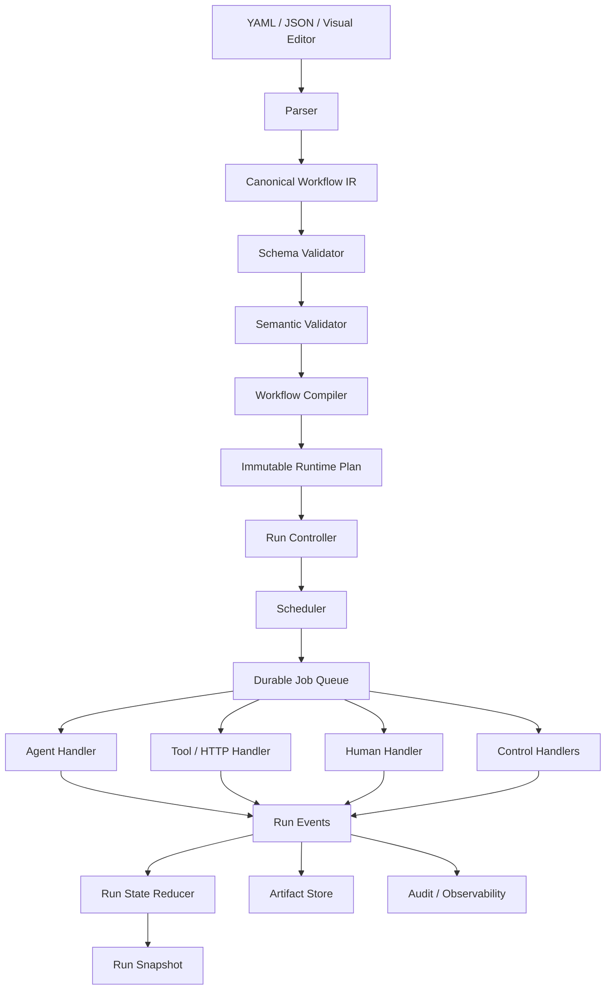

# 通用 Workflow DSL 与 Runtime 全新设计

## 1. 文档目标

本文描述一个不考虑历史兼容性的通用 Workflow 系统设计。系统不以软件开发流程为中心，而以持久化、事件驱动、强类型端口的通用图执行模型为核心，可用于：

- 多 Agent 协作
- 内容生产
- 数据分析与处理
- 企业审批
- 自动化运营
- Research Workflow
- API、脚本和人工任务编排

核心原则是：

> Workflow Definition 描述允许怎样运行，Workflow Run 保存实际怎样运行；节点只接收输入并产生输出，调度、状态、重试和路由统一由 Runtime 管理。

## 2. 设计原则

1. Workflow 定义与 Workflow 运行严格分离。
2. 每次运行绑定不可变的 Workflow Version。
3. 内部只使用一种 Canonical Workflow IR。
4. 节点通过强类型 Port 接收输入和产生不可变输出。
5. 小型数据直接使用结构化 Value，大型数据使用 Artifact Reference。
6. Retry、Rework、Iteration 和 Foreach 使用不同执行语义。
7. 条件、循环、并行、Join 和 Subflow 都是显式模型。
8. Handler 不推进流程，只执行节点并返回标准结果。
9. Runtime 使用持久化事件、快照、Job 和 Lease 支持恢复。
10. Timeline、Pipeline 和 Graph 是同一运行模型的不同 UI 投影。

## 3. 总体架构



系统分为两个平面：

- **Definition Plane**：编辑、解析、校验、编译和发布 Workflow。
- **Runtime Plane**：启动运行、调度节点、处理等待、恢复、取消和审计。

两个平面通过不可变的 `WorkflowVersion` 隔离。

## 4. 核心领域模型

### 4.1 WorkflowDefinition

代表一个 Workflow 的逻辑身份和当前草稿，不直接参与运行。

```json
{
  "id": "content-review",
  "name": "Content Review",
  "draft_version": 7,
  "created_at": "2026-07-16T08:00:00Z",
  "updated_at": "2026-07-16T09:00:00Z"
}
```

### 4.2 WorkflowVersion

Workflow 发布后生成不可修改的 Version。修改 Workflow 必须创建新版本，已有 Run 永远绑定原版本。

```json
{
  "workflow_id": "content-review",
  "version": 7,
  "schema_version": "1.0",
  "definition_hash": "sha256:...",
  "nodes": [],
  "edges": [],
  "input_schema": {},
  "output_schema": {},
  "policies": {}
}
```

### 4.3 WorkflowRun

WorkflowRun 表示某个 WorkflowVersion 的一次具体执行。

```json
{
  "id": "run-123",
  "workflow_id": "content-review",
  "workflow_version": 7,
  "status": "running",
  "input": {},
  "output": null,
  "state_version": 18,
  "started_at": "2026-07-16T10:00:00Z",
  "finished_at": null
}
```

### 4.4 NodeRun 与 Attempt

一个节点可能因为 Rework、Iteration 或 Foreach 在同一个 WorkflowRun 中生成多个 NodeRun。一个 NodeRun 又可能因为 Retry 产生多个 Attempt。

```text
WorkflowRun
  └── NodeRun
        ├── Attempt #1
        ├── Attempt #2
        └── Attempt #3
```

- `NodeRun`：节点的一次业务执行实例。
- `Attempt`：Executor 的一次真实调用。
- Retry 创建新 Attempt，不创建新 NodeRun。
- Rework 和 Iteration 创建新的 NodeRun。

### 4.5 Event 与 ArtifactInstance

- `RunEvent`：记录 Run、NodeRun、Attempt、路由和人工操作的状态变化。
- `ArtifactInstance`：记录一次运行实际生成或引用的持久化产物。

## 5. Canonical Workflow IR

系统内部只保留一种 Canonical IR，推荐采用 JSON 对象模型。YAML、JSON 文件和可视化编辑器都是输入输出适配器，不是不同的运行模型。

```text
YAML / JSON / UI
        |
        v
Parser + Schema Validation
        |
        v
Canonical Workflow IR
        |
        v
Semantic Validation + Compilation
        |
        v
Immutable Runtime Plan
```

示例：

```yaml
schema_version: "1.0"

workflow:
  id: content-review
  name: Content Review

inputs:
  document:
    type: artifact
    content_type: text/markdown

outputs:
  published_document:
    type: artifact

nodes:
  - id: analyze
    type: agent
    config:
      agent: researcher
      instruction: Analyze the document
    inputs:
      document:
        schema:
          type: artifact
    outputs:
      analysis:
        schema:
          type: object
          required: [score, findings]

  - id: decide
    type: decision
    inputs:
      score:
        schema:
          type: number
    config:
      cases:
        - name: approved
          when:
            ">=":
              - var: inputs.score
              - 0.8
        - name: revise
          default: true

  - id: revise
    type: agent
    config:
      agent: editor

  - id: publish
    type: tool
    config:
      tool: publishing.publish

edges:
  - from: workflow.input.document
    to: analyze.input.document

  - from: analyze.output.analysis.score
    to: decide.input.score

  - from: decide.route.approved
    to: publish.control

  - from: decide.route.revise
    to: revise.control

  - from: revise.control.done
    to: analyze.control
    kind: rework

  - from: publish.output.document
    to: workflow.output.published_document
```

Compiler 负责：

- 展开默认值。
- 固定 Node Handler 及其版本。
- 编译条件表达式。
- 校验节点、端口和数据引用。
- 建立输入输出映射。
- 计算 Join 依赖和分支关系。
- 检查不可达节点、无终点路径和非法循环。
- 生成不可变 Runtime Plan 和定义哈希。

## 6. 统一节点模型

所有节点遵循统一外壳：

```json
{
  "id": "analyze",
  "type": "agent",
  "config": {},
  "inputs": {},
  "outputs": {},
  "policy": {
    "timeout": "10m",
    "retry": {
      "max_attempts": 3,
      "backoff": "exponential"
    }
  }
}
```

第一版支持以下节点类型：

| 类型 | 用途 |
| --- | --- |
| `agent` | 调用 AI Agent |
| `tool` | 调用已注册工具 |
| `http` | 调用外部 API |
| `script` | 在受控环境执行命令 |
| `human` | 等待人工填写、确认或处理 |
| `decision` | 根据结构化数据选择分支 |
| `transform` | 执行确定性数据映射 |
| `join` | 汇合并行分支 |
| `foreach` | 对集合展开节点或子流程 |
| `subflow` | 调用另一个 WorkflowVersion |
| `start/end` | 可选的显式边界节点 |

业务能力不应通过大量布尔开关堆积在通用 Step 上。具有不同执行语义的能力应成为明确的 Node Type 或 Handler。

## 7. Handler 协议

Runtime 不理解 Agent、HTTP、Human 等业务细节，只依赖统一 Handler 协议。

```python
class NodeHandler:
    def validate(self, config, schemas): ...
    def prepare(self, context, inputs): ...
    async def execute(self, context, inputs): ...
    async def cancel(self, execution_id): ...
    async def recover(self, execution_id): ...
    def normalize_result(self, raw_result): ...
```

标准执行结果：

```json
{
  "status": "succeeded",
  "outputs": {
    "score": {
      "value": 0.92
    },
    "report": {
      "artifact_ref": "artifact://run-123/report-1"
    }
  },
  "metrics": {
    "tokens": 1200,
    "duration_ms": 8400
  }
}
```

Handler 只能返回结果或事件，不能自行修改 Run 状态或推进 Workflow。

## 8. 数据传递模型

节点不直接修改可变的全局 State，而是通过 Port 接收输入并产生不可变输出。

小型数据使用结构化 Value：

```json
{
  "schema": {
    "type": "object"
  },
  "value": {
    "score": 0.92
  },
  "metadata": {
    "producer_node_run_id": "nr-123",
    "created_at": "2026-07-16T10:05:00Z"
  }
}
```

大型或持久化对象使用 Artifact Reference：

```json
{
  "artifact_ref": "artifact://run-123/a-456",
  "content_type": "application/pdf",
  "size": 183920,
  "checksum": "sha256:..."
}
```

数据作用域包括：

- `Workflow Input`：启动后不可变。
- `Node Input`：由 Edge Mapping 生成。
- `Node Output`：节点执行后产生，不可变。
- `Run Variables`：只能通过受控 Reducer 更新。
- `Item Scope`：Foreach 单项局部数据。
- `Secret Scope`：只有授权 Handler 可以临时读取。

Artifact 至少保存：

- 稳定 ID
- URI 或存储位置
- Content Type
- Schema
- 大小及校验和
- Producer NodeRun
- WorkflowRun ID
- 版本和数据血缘
- 权限和生命周期策略

## 9. Edge 与路由

Edge 同时表达控制依赖和数据映射，但两者必须有明确字段。

```yaml
- id: analyze-to-publish
  from:
    node: analyze
    port: report
  to:
    node: publish
    port: document
  kind: forward
  when:
    "==":
      - var: nodes.analyze.outputs.approved
      - true
  mapping:
    source: "$"
    target: "$"
```

`kind` 支持：

- `forward`
- `rework`
- `error`
- `timeout`
- `cancel`

条件表达式使用 JSONLogic 一类受限、可验证的语言，不执行任意 Python、JavaScript 或 Shell。

路由规则：

- 条件求值异常默认使当前 NodeRun 失败。
- 多条普通 Edge 可以同时命中并形成并行分支。
- Decision 可以声明 `exclusive=true`，保证只选择一条分支。
- 未命中的分支记录为 `not_selected`，防止 Join 永久等待。
- 循环必须显式声明，不通过图算法猜测回边。

## 10. Retry、Rework、Iteration 与 Foreach

### 10.1 Retry

Retry 属于 NodeRun 的执行策略：

```yaml
retry:
  max_attempts: 3
  retry_on:
    - timeout
    - rate_limited
    - transient_error
  backoff:
    type: exponential
    initial: 2s
    max: 1m
```

Retry 只创建新 Attempt，不重新执行上游节点，也不改变业务路径。

### 10.2 Rework

Rework 属于显式图路由：

```yaml
- from: review.route.rework
  to: implement.control
  kind: rework
```

每次 Rework 创建新的目标 NodeRun，并保留前一轮结果和完整路由历史。

```yaml
rework_policy:
  max_rounds: 3
  on_exhausted: require_human
```

### 10.3 Iteration

复杂循环优先通过 Subflow 表达，并显式配置：

- 最大轮数
- 退出条件
- 每轮输入输出映射
- 每轮输出保留策略
- 超限行为

### 10.4 Foreach

Foreach 是一个容器节点，内部执行一个 Node 或 Subflow。

```yaml
- id: process-files
  type: foreach
  inputs:
    items:
      schema:
        type: array
  config:
    item_key: $.id
    concurrency: 5
    mode: parallel
    failure_policy: continue
    body:
      subflow:
        workflow_id: process-file
        version: 3
    aggregate:
      order_by: input
      output_schema:
        type: array
```

每个 Item 拥有独立的：

- Item Scope
- Correlation ID
- NodeRun 或 Subflow Run
- Retry 状态
- 输出结果

聚合结果默认按照原始输入顺序，而不是完成顺序，以保证结果确定性。

## 11. 并行与 Join

普通节点有多条命中的下游 Edge 时，Runtime 创建多个并行分支。Join 必须使用显式节点：

```yaml
- id: collect-reviews
  type: join
  config:
    strategy: all
    inputs:
      - legal-review
      - quality-review
      - brand-review
    failure_policy: fail
```

Join Strategy 支持：

- `all`
- `any`
- `n_of_m`
- `all_successful`
- `deadline`

Join 等待的是分支 Token，而不是简单查询前置节点是否成功。每个 Token 最终进入以下状态之一：

- `completed`
- `failed`
- `cancelled`
- `not_selected`

Join 还需要定义失败传播、部分结果、超时以及多分支输出的 Merge/Reducer 策略。

## 12. Subflow

Subflow 调用时必须固定目标 WorkflowVersion：

```yaml
- id: enrich
  type: subflow
  config:
    workflow_id: enrich-content
    version: 4
    input_mapping:
      document: $.inputs.document
    output_mapping:
      enriched: $.outputs.document
```

Subflow 需要定义：

- 父子输入输出映射
- 父子 Run 与 Correlation ID
- 状态和取消传播
- 失败处理
- Artifact 可见范围
- 最大嵌套深度
- 是否允许递归

## 13. Human 节点

Human 节点会让 Workflow 持久化暂停，需要独立协议：

```yaml
- id: approve
  type: human
  config:
    assignees:
      - role: content-owner
    actions:
      - approve
      - rework
      - reject
    form_schema:
      type: object
      properties:
        comment:
          type: string
    deadline: 48h
    escalation:
      after: 24h
      to: content-admin
```

执行过程：

1. Runtime 创建 Human Task。
2. NodeRun 进入 `waiting`。
3. WorkflowRun 可以进入 `waiting`，但不占用 Runner。
4. 用户提交动作时写入持久化事件。
5. Runtime 校验权限、一次性 Token 和 Expected Version。
6. NodeRun 完成，Runtime 根据动作选择后续路由。

Human Task 和自动节点后的 Approval Gate 是不同概念，DSL 和 UI 都应分别表达。

## 14. State 与并发合并

建议将状态划分为：

- Workflow Input
- Run Variables
- Node Input
- Node Output
- Item Scope
- Secret Scope

节点默认不能直接修改 Run Variables，只能产生输出事件。Runtime 使用确定性的 Mapping 或 Reducer 更新共享状态。

Reducer 必须声明：

- 输入 Schema
- 输出 Schema
- 冲突处理方式
- 是否满足交换律和结合律
- State Expected Version

所有共享状态更新使用乐观锁。版本冲突时重新读取事件并重新执行 Reducer，不允许静默覆盖。

## 15. 持久化与恢复

Runtime 使用事件日志加状态快照，不只保存当前状态。

建议的主要数据表：

```text
workflow_definitions
workflow_versions
workflow_runs
node_runs
node_attempts
run_events
run_snapshots
artifacts
artifact_links
jobs
job_leases
human_tasks
foreach_groups
foreach_items
```

核心事务原则：

> 写入节点结果、追加事件、更新 NodeRun、更新 Token，并创建下游 Job，必须在同一个数据库事务中完成。

Job 状态机：

```text
ready -> leased -> running -> completed
                     |
                     +-> retry_wait
                     +-> failed
                     +-> cancelled
```

Executor 调用携带幂等键：

```text
workflow_run_id + node_run_id + attempt
```

系统重启后：

1. 读取所有未终结 WorkflowRun。
2. 回收过期 Lease。
3. 根据 Snapshot 和后续 Event 重建运行状态。
4. 重新生成缺失但尚未调度的 Job。
5. 使用幂等键避免重复产生外部副作用。

## 16. 状态机

### 16.1 WorkflowRun

```text
created
  -> running
  -> waiting
  -> running
  -> succeeded | failed | cancelled
```

### 16.2 NodeRun

```text
pending
  -> ready
  -> running
  -> waiting
  -> succeeded | failed | cancelled | skipped
```

### 16.3 Attempt

```text
created
  -> leased
  -> running
  -> succeeded | failed | timed_out | cancelled | lost
```

所有状态转换由 Run Controller 集中执行。Handler、Runner 和 UI 都不能直接修改持久化状态。

## 17. 安全与资源治理

系统需要提供以下安全边界：

- Secret 只通过受控引用传递。
- Prompt、日志和 Event 自动脱敏。
- Script 和 Command 在沙箱中执行。
- 文件系统和网络权限显式声明。
- Tool 使用 Allowlist。
- Artifact 执行访问控制。
- Human Task 校验身份和权限。
- 限制运行时间、Token、费用、CPU、内存和并发数。
- 对 Definition 发布、Run 操作和人工动作记录审计日志。
- 对导入的 Workflow 执行 Schema、表达式和权限校验。

Workflow Definition 不能包含明文 Secret，条件和 Mapping 不能执行任意代码。

## 18. UI 设计

Timeline、Pipeline 和 Graph 共享同一个 Run View Model。

### 18.1 编辑态

- 简单流程使用 Pipeline 编辑器。
- 复杂流程使用 Graph 编辑器。
- 节点配置使用 Schema 驱动表单。
- 发布前展示编译错误和警告。
- 支持 WorkflowVersion Diff。

### 18.2 运行态

- `Overview`：状态、耗时、费用和等待原因。
- `Timeline`：事件和 Attempt 历史。
- `Graph`：节点、分支和 Token 的实时状态。
- `Data`：输入、输出、State 和 Artifact。
- `Human Tasks`：待处理任务和审批。
- `Errors`：失败链路、重试和恢复记录。

系统根据图复杂度选择默认视图：

- 线性流程默认 Timeline 或 Pipeline。
- 少量分支使用带分组的 Timeline。
- 出现 Join、Foreach、Subflow 或复杂循环时默认 Graph。

用户始终可以切换视图。

## 19. API 边界

建议提供以下 API：

```text
POST   /workflows
PUT    /workflows/{id}/draft
POST   /workflows/{id}/validate
POST   /workflows/{id}/publish
GET    /workflows/{id}/versions/{version}

POST   /runs
GET    /runs/{id}
POST   /runs/{id}/cancel
POST   /runs/{id}/resume
GET    /runs/{id}/events
GET    /runs/{id}/graph

GET    /human-tasks
POST   /human-tasks/{id}/complete

GET    /artifacts/{id}
```

所有修改运行状态的 API 都必须接受：

- Idempotency Key
- Expected Version
- Actor Identity

## 20. 可观测性

系统需要按 WorkflowRun、NodeRun、Attempt 和 Correlation ID 关联：

- 结构化日志
- Trace
- Metrics
- Token 和费用
- Queue Wait Time
- Handler Duration
- Retry 和 Rework 次数
- Human Wait Time
- Artifact 产生及消费关系

每个 Run 应能够回答：

- 当前为什么没有继续执行？
- 哪个条件选择了当前分支？
- 哪些输入产生了某个输出？
- 某个节点执行了几次，为什么重试？
- 哪个用户或系统动作改变了运行状态？
- 重启恢复后是否重复执行过外部副作用？

## 21. 实现顺序

### 第一阶段：可运行内核

1. Canonical IR 和 JSON Schema。
2. WorkflowDefinition、WorkflowVersion、WorkflowRun、NodeRun 和 Attempt。
3. Compiler 和语义校验。
4. Event Store、Snapshot 和状态机。
5. Durable Job Queue 与 Lease。
6. Agent、Tool 和 Transform Handler。
7. 线性执行、条件分支和 Retry。

### 第二阶段：通用控制流

1. 显式 Decision。
2. 并行分支。
3. Token 模型和 Join。
4. Rework 和循环上限。
5. Human 节点。
6. Cancel、Recover 和 Idempotency。

### 第三阶段：数据流能力

1. 强类型 Port。
2. Mapping。
3. Artifact Store。
4. Foreach 和 Item Scope。
5. Subflow。
6. State Reducer。

### 第四阶段：产品层

1. Pipeline 和 Graph 编辑器。
2. Timeline 和 Run Graph。
3. Schema 驱动配置表单。
4. Workflow 发布与 Version Diff。
5. 监控、费用、安全和权限。

## 22. 验收标准

设计完成后的 Runtime 至少应满足：

1. Run 始终绑定不可变 WorkflowVersion。
2. 服务在任意节点执行阶段退出后都能恢复。
3. 重复 Job 投递不会重复提交节点结果。
4. Retry 不改变业务路径，Rework 有独立可审计记录。
5. 条件未命中的分支不会让 Join 永久等待。
6. Foreach 在并发完成顺序不同时仍产生确定性聚合结果。
7. Human Task 可以跨服务重启长时间等待并安全恢复。
8. Node、Port、Edge、Mapping 和 Result 均经过 Schema 校验。
9. Artifact 可以追溯生产者、消费者和 WorkflowRun。
10. 所有失败、取消、重试、返工和人工动作都有 Event 记录。
11. UI 能从同一运行模型生成 Timeline、Pipeline 和 Graph。
12. Agent、Tool、HTTP、Script 和 Human 都通过统一 Handler 协议运行。

## 23. 最终设计决策

- 内部只使用 Canonical JSON IR。
- WorkflowRun 绑定不可变 WorkflowVersion。
- 节点输出不可变，数据通过 Port 和 Mapping 传递。
- 小型数据使用 Value，大型数据使用 Artifact Reference。
- Retry 属于 Attempt，Rework 属于 Graph。
- Join、Foreach 和 Subflow 使用显式运行对象。
- Runtime 使用 Event、Snapshot、Durable Job 和 Lease。
- Handler 只执行节点，不推进流程。
- UI 是运行模型的多种投影，不决定底层执行语义。

该架构以通用执行语义为基础，不依赖开发流程中的特殊步骤，可以扩展到 Agent 协作、内容生产、数据处理、审批、自动化运营和 Research Workflow。
